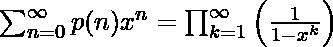
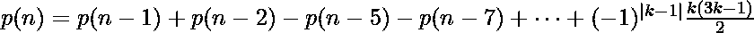

# 将 N 写成两个或多个正整数之和的方法| Set-2

> 原文:[https://www . geesforgeks . org/写 n 为两个或两个以上正整数之和的方法集-2/](https://www.geeksforgeeks.org/ways-to-write-n-as-sum-of-two-or-more-positive-integers-set-2/)

给定一个数 N，任务是找到 N 可以被划分的路数，即 N 可以表示为正整数之和的路数。
**注:** N 本身也应该认为是将其表示为正整数之和的一种方式。
**示例:**

> **输入:** N = 5
> **输出:** 7
> 5 可按以下方式分区:
> 5
> 4+1
> 3+2
> 3+1+1
> 2+2+1
> 2+1+1+1
> 1+1+1+1
> **输入:** N = 10
> **输出:** 42

这篇文章已经在[中讨论了将 n 写成两个或多个正整数之和](https://www.geeksforgeeks.org/ways-to-write-n-as-sum-of-two-or-more-positive-integers/)的方法。在这篇文章中，讨论了一种有效的方法。
**逼近(利用欧拉递推):**
如果 p(n)是 N 的分区数，那么它可以由下面的生成函数生成:

利用这个公式和欧拉的五边形数定理，我们可以推导出 p(n)的如下递推关系:(更多细节请查看[维基百科文章](https://en.wikipedia.org/wiki/Partition_(number_theory)#Generating_function))

其中 k = 1，-1，2，-2，3，-3，…N 为 0
**以下是上述方法的实施:**

## C++

```
// C++ implementation of above approach
#include <bits/stdc++.h>
using namespace std;

// Function to find the number
// of partitions of N
long long partitions(int n)
{
    vector<long long> p(n + 1, 0);

    // Base case
    p[0] = 1;

    for (int i = 1; i <= n; ++i) {
        int k = 1;
        while ((k * (3 * k - 1)) / 2 <= i) {
            p[i] += (k % 2 ? 1 : -1) * p[i - (k * (3 * k - 1)) / 2];

            if (k > 0)
                k *= -1;
            else
                k = 1 - k;
        }
    }

    return p[n];
}

// Driver code
int main()
{
    int N = 20;
    cout << partitions(N);
    return 0;
}
```

## Java 语言(一种计算机语言，尤用于创建网站)

```
// Java implementation of above approach
class GFG
{

    // Function to find the number
    // of partitions of N
    static long partitions(int n)
    {
        long p[] = new long[n + 1];

        // Base case
        p[0] = 1;

        for (int i = 1; i <= n; ++i)
        {
            int k = 1;
            while ((k * (3 * k - 1)) / 2 <= i)
            {
                p[i] += (k % 2 != 0 ? 1 : -1) *
                    p[i - (k * (3 * k - 1)) / 2];

                if (k > 0)
                {
                    k *= -1;
                }
                else
                {
                    k = 1 - k;
                }
            }
        }
        return p[n];
    }

    // Driver code
    public static void main(String[] args)
    {
        int N = 20;
        System.out.println(partitions(N));
    }
}

// This code is contributed by Rajput-JI
```

## 蟒蛇 3

```
# Python 3 implementation of
# above approach

# Function to find the number
# of partitions of N
def partitions(n):

    p = [0] * (n + 1)

    # Base case
    p[0] = 1

    for i in range(1, n + 1):
        k = 1
        while ((k * (3 * k - 1)) / 2 <= i) :
            p[i] += ((1 if k % 2 else -1) *
                    p[i - (k * (3 * k - 1)) // 2])

            if (k > 0):
                k *= -1
            else:
                k = 1 - k

    return p[n]

# Driver code
if __name__ == "__main__":
    N = 20
    print(partitions(N))

# This code is contributed
# by ChitraNayal
```

## C#

```
// C# implementation of above approach
using System;

class GFG
{

    // Function to find the number
    // of partitions of N
    static long partitions(int n)
    {
        long []p = new long[n + 1];

        // Base case
        p[0] = 1;

        for (int i = 1; i <= n; ++i)
        {
            int k = 1;
            while ((k * (3 * k - 1)) / 2 <= i)
            {
                p[i] += (k % 2 != 0 ? 1 : -1) *
                    p[i - (k * (3 * k - 1)) / 2];

                if (k > 0)
                {
                    k *= -1;
                }
                else
                {
                    k = 1 - k;
                }
            }
        }
        return p[n];
    }

    // Driver code
    public static void Main(String[] args)
    {
        int N = 20;
        Console.WriteLine(partitions(N));
    }
}

// This code has been contributed by 29AjayKumar
```

## 服务器端编程语言（Professional Hypertext Preprocessor 的缩写）

```
<?php
// PHP implementation of above approach

// Function to find the number
// of partitions of N
function partitions($n)
{
    $p = array_fill(0, $n + 1, 0);

    // Base case
    $p[0] = 1;

    for ($i = 1; $i < $n + 1; $i++)
    {
        $k = 1;
        while (($k * (3 * $k - 1)) / 2 <= $i)
        {
            $p[$i] += (($k % 2 ? 1 : -1) *
                        $p[$i - ($k * (3 * $k - 1)) / 2]);

            if ($k > 0)
                $k *= -1;
            else
                $k = 1 - $k;
        }
    }
    return $p[$n];
}

// Driver Code
$N = 20;
print(partitions($N));

// This code is contributed
// by mits
?>
```

## java 描述语言

```
<script>
// javascript implementation of above approach   
// Function to find the number
    // of partitions of N
    function partitions(n)
    {
        var p = Array(n + 1).fill(0);

        // Base case
        p[0] = 1;

        for (i = 1; i <= n; ++i)
        {
            var k = 1;
            while ((k * (3 * k - 1)) / 2 <= i)
            {
                p[i] += (k % 2 != 0 ? 1 : -1) * p[i - (k * (3 * k - 1)) / 2];

                if (k > 0) {
                    k *= -1;
                } else {
                    k = 1 - k;
                }
            }
        }
        return p[n];
    }

    // Driver code

        var N = 20;
        document.write(partitions(N));

// This code is contributed by todaysgaurav
</script>
```

**Output:** 

```
627
```

**时间复杂度**:O(N√N)
T3】空间复杂度 : O(N)