# 弱堆

> 原文:[https://www.geeksforgeeks.org/weak-heap/](https://www.geeksforgeeks.org/weak-heap/)

它是一棵二叉树，具有以下性质:-
(1)节点右子树中的每一个键都大于节点本身存储的键，
(2)根没有留下子节点，
(3)叶子只在树的最后两层找到。

它用于实现优先级队列。用户可能更喜欢弱堆而不是[二进制堆](https://www.geeksforgeeks.org/binary-heap/)的原因是，在最坏的情况下，弱堆能够执行较少的元素比较。

弱堆的基于数组的实现的插入和删除的最坏情况时间复杂度是:-
1 .插入:O(lg n)
2 .删除:O(lg n)

弱堆构造使用支持常数时间插入的缓冲区。只要缓冲区大小低于阈值，就会将新元素插入缓冲区。一旦缓冲区满了，缓冲区的所有元素都会被移动到弱堆中。

弱堆是通过放宽二进制堆的要求获得的。为了表示内存中的弱堆，使用了两个数组。第一个是元素数组 a，另一个是反向位数组 r。

我们使用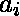来引用数组 a 的索引 I 处的元素或相应树结构中的节点。构建一个弱堆，使得对于，它的左子代的索引是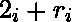，它的右子代的索引是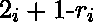，以及(我在哪里！= 0)其父代的索引为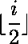。

**弱堆示例:**
如果给定 10 个整数作为输入，例如 8、7、4、5、2、6、9、3、11、1，那么由以下输入构造的弱堆将如下图所示。
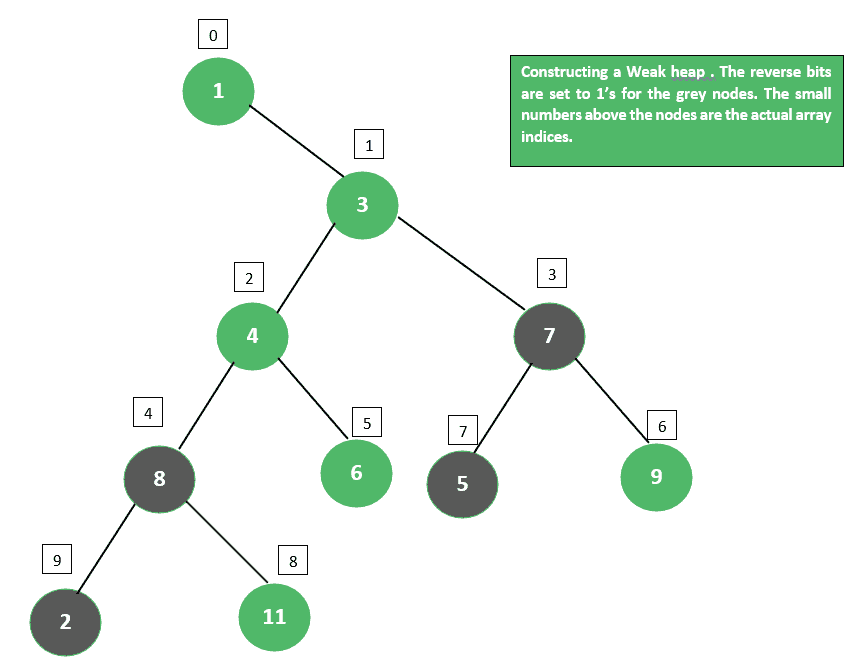

**对弱堆的操作以及如何使用这些操作实现期望的时间复杂度**
基本的弱堆操作以及伪代码如下:-

**1。尊贵的祖先:**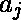尊贵的祖先，j！= 0，如果是右子，则是的父代，如果是左子，则是的父代的尊贵祖先。我们用 d-祖先(j)来表示这种祖先的索引。弱堆排序强制任何元素都不能小于其可分辨祖先的元素。

```
 // Finding the distinguished ancestor in a weak heap
procedure: d-ancestor
input: j: index
while (j & 1) = 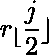
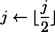
return 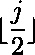 

```

**2。Join:** 子例程将两个弱堆组合成一个弱堆，条件是以下设置。连接需要 0(1)个时间，因为它涉及一个元素比较。

```
 // Joining two weak heaps
procedure: join
input: i, j: indices
if (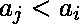){
swap()
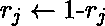
return false
}
return true 
```

3.**构造:**通过执行对连接子例程的调用，可以使用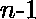元素比较来构造大小为 n 的弱堆。

```
 //Constructing a weak heap
procedure: construct
input: a: array of n elements; r: array of n bits
for i {0, 1, . . ., n  1}

for j  {n  1, n  2, . . ., 1}
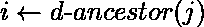
join(i, j) 
```

**4。筛选:**子例程筛选(j)用于重新建立元素 e(最初在位置 j)和那些位于祖先的元素之间的弱堆排序。从位置 j 开始，当 e 不在根处并且小于其可分辨祖先处的元素时，我们交换两个元素，翻转先前包含 e 的节点的位，并从 e 的新位置重复。

```
 // reestablishing the weak-heap ordering 
// on the path from  upwards
procedure: sift-up
input: j: index
while (j != 0){

if join(i, j){
break
}
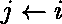
} 
```

**5。Insert:** 要插入元素 e，我们首先将 e 添加到下一个可用的数组条目中，使其成为堆中的一片叶子。如果这个叶子是它的父级的唯一的子级，我们通过更新父级的反向位使它成为左子级。为了重新建立弱堆排序，我们从 e 的位置开始调用筛选子例程。由此可见，插入需要 O(lg n)时间，最多涉及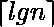元素比较。

```
 // Inserting an element into a weak heap.
procedure: insert
input: a: array of n elements; r: array of n bits; e: element
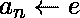
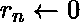
if( (n & 1) = 0){
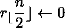
}
sift-up(n)
++n 
```

**6。向下筛选:**子例程向下筛选(j)用于在位置 j 的元素和的右子树中的元素之间重新建立弱堆排序。从的右子节点开始，识别的右子树的左脊柱上的最后一个节点；这是通过重复访问左子节点直到到达没有左子节点的节点来完成的。从该节点到的右子节点的路径向上遍历，并且在和沿着该路径的节点之间重复执行连接操作。每次连接后，位置 j 处的元素小于或等于下一次连接中考虑的节点的左子树中的每个元素。

**7。delete-min:** 要执行 delete-min，存储在弱堆根的元素将被存储在最后一个被占用的数组条目中的元素替换。为了恢复弱堆排序，需要对新根进行筛选。因此，delete-min 需要 O(lg n)个时间，最多涉及 lg n 个元素的比较。

**弱堆与二元堆的关系[二项式堆](https://www.geeksforgeeks.org/binomial-heap-2/)T3**

弱堆的结构与二叉树排列相同。精确存储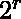元素的完美弱堆是秩为 r 的堆排序二叉树的二叉树表示。假设根在索引 0 处(在二进制堆中，左子节点为 2k + 1，右子节点为 2k+1)，则节点 k 的左子节点为 2k，右子节点为 2k+2。唯一不同的是弱堆的根没有左子，只有右子，存储在 2*0+1=1 的索引处。

弱堆的结构也非常类似于二项式堆，高度为 h 的树由一个根加上高度为 h–1，h–2，…，1 的树组成。像二项式堆一样，对弱堆的基本操作是合并两个高度相同的堆，形成一个高度为 h+1 的弱堆。这需要在根之间进行一次比较。哪个根更大(假设最大堆)就是最终根。最终根的第一个子级是丢失的根，它保留它的子级(右子树)。获胜根的子级作为失败根的同级插入。

弱堆的可区分属性是:
1)它可以是不完美的(与二叉树相反)；
2)是单棵树(与二项式队列形成对比，二项式队列是完美树的集合)；
3)相当均衡。

**弱堆的应用**T2【1】。它可以作为有效构建二进制堆的中间步骤。
2。一个弱堆变量，允许一些鼻子违反弱堆排序，用于图搜索和网络优化，已知比斐波那契堆更好。