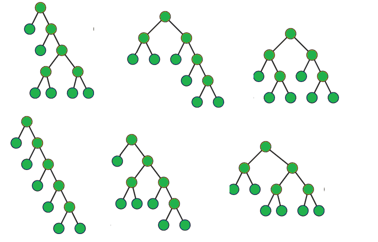

# 威德尔本-埃瑟林顿编号

> 原文:[https://www . geeksforgeeks . org/wedderburn-ether ington-number/](https://www.geeksforgeeks.org/wedderburn-etherington-number/)

[Wedderburn–Etherington number](https://en.wikipedia.org/wiki/Wedderburn%E2%80%93Etherington_number)序列中的第 n 个术语(从数字 0 开始，表示 n = 0)计算具有 n 个叶的无序根树的数量，其中包括根在内的所有节点都有零个或正好两个子节点。
给定的 **N** 。任务是先找到序列的 **N** 项。
**序列:**

> 0, 1, 1, 1, 2, 3, 6, 11, 23, 46, 98, 207, 451, 983, 2179, 4850, 10905, 24631, 56011, ….

**有 0 或 2 个孩子的树:**T2】



**例:**

> **输入:** N = 10
> **输出:** 0、1、1、1、2、3、6、11、23、46、
> T6】输入: N = 20
> **输出:** 0、1、1、1、2、3、6、11、23、46、98、207、451、983、2179、4850、10905、

**方法:**T2[递推关系](https://en.wikipedia.org/wiki/Wedderburn%E2%80%93Etherington_number#Formula)求第 n 个数为:

*   a(2x-1)= a(1)* a(2x-2)+a(2)* a(2x-3)+…+a(x-1)* a(x)
*   a(2x)= a(1)* a(2x-1)+a(2)* a(2x-2)+…+a(x-1)* a(x+1)+a(x)*(a(x)+1)/2

利用上面的关系，我们可以找到级数的项。我们将从第 0 项开始，然后将答案存储在地图中，然后使用地图中的值来找到该系列的第 i+1 项。我们还将为第 0、第 1 和第 2 个元素使用基本用例，它们分别是 0、1、1。
以下是上述方法的实现:

## C++

```
// CPP program to find N terms of the sequence
#include <bits/stdc++.h>
using namespace std;

// Stores the Wedderburn Etherington numbers
map<int, int> store;

// Function to return the nth
// Wedderburn Etherington numbers
int Wedderburn(int n)
{
    // Base case
    if (n <= 2)
        return store[n];

    // If n is even n = 2x
    else if (n % 2 == 0)
    {
        // get x
        int x = n / 2, ans = 0;

        // a(2x) = a(1)a(2x-1) + a(2)a(2x-2) + ... +
        // a(x-1)a(x+1)
        for (int i = 1; i < x; i++) {
            ans += store[i] * store[n - i];
        }

        // a(x)(a(x)+1)/2
        ans += (store[x] * (store[x] + 1)) / 2;

        // Store the ans
        store[n] = ans;

        // Return the required answer
        return ans;
    }

    else
    {
        // If n is odd
        int x = (n + 1) / 2, ans = 0;

        // a(2x-1) = a(1)a(2x-2) + a(2)a(2x-3) + ... +
        // a(x-1)a(x),
        for (int i = 1; i < x; i++) {
            ans += store[i] * store[n - i];
        }

        // Store the ans
        store[n] = ans;

        // Return the required answer
        return ans;
    }
}

// Function to print first N
// Wedderburn Etherington numbers
void Wedderburn_Etherington(int n)
{
    // Store first 3 numbers
    store[0] = 0;
    store[1] = 1;
    store[2] = 1;

    // Print N terms
    for (int i = 0; i < n; i++)
    {
        cout << Wedderburn(i);
        if(i!=n-1)
            cout << ", ";
    }
}

// Driver code
int main()
{
    int n = 10;

    // function call
    Wedderburn_Etherington(n);

    return 0;
}
```

## Java 语言(一种计算机语言，尤用于创建网站)

```
// Java program to find N terms of the sequence
import java.util.*;

class GFG
{

// Stores the Wedderburn Etherington numbers
static HashMap<Integer,
               Integer> store = new HashMap<Integer,
                                            Integer>();

// Function to return the nth
// Wedderburn Etherington numbers
static int Wedderburn(int n)
{
    // Base case
    if (n <= 2)
        return store.get(n);

    // If n is even n = 2x
    else if (n % 2 == 0)
    {
        // get x
        int x = n / 2, ans = 0;

        // a(2x) = a(1)a(2x-1) + a(2)a(2x-2) + ... +
        // a(x-1)a(x+1)
        for (int i = 1; i < x; i++)
        {
            ans += store.get(i) * store.get(n - i);
        }

        // a(x)(a(x)+1)/2
        ans += (store.get(x) * (store.get(x) + 1)) / 2;

        // Store the ans
        store. put(n, ans);

        // Return the required answer
        return ans;
    }
    else
    {
        // If n is odd
        int x = (n + 1) / 2, ans = 0;

        // a(2x-1) = a(1)a(2x-2) + a(2)a(2x-3) + ... +
        // a(x-1)a(x),
        for (int i = 1; i < x; i++)
        {
            ans += store.get(i) * store.get(n - i);
        }

        // Store the ans
        store. put(n, ans);

        // Return the required answer
        return ans;
    }
}

// Function to print first N
// Wedderburn Etherington numbers
static void Wedderburn_Etherington(int n)
{
    // Store first 3 numbers
    store. put(0, 0);
    store. put(1, 1);
    store. put(2, 1);

    // Print N terms
    for (int i = 0; i < n; i++)
    {
        System.out.print(Wedderburn(i));
        if(i != n - 1)
            System.out.print(" ");
    }
}

// Driver code
public static void main(String[] args)
{
    int n = 10;

    // function call
    Wedderburn_Etherington(n);   
}
}

// This code is contributed by Princi Singh
```

## 蟒蛇 3

```
# Python3 program to find N terms
# of the sequence

# Stores the Wedderburn Etherington numbers
store = dict()

# Function to return the nth
# Wedderburn Etherington numbers
def Wedderburn(n):

    # Base case
    if (n <= 2):
        return store[n]

    # If n is even n = 2x
    elif (n % 2 == 0):

        # get x
        x = n // 2
        ans = 0

        # a(2x) = a(1)a(2x-1) + a(2)a(2x-2) + ... +
        # a(x-1)a(x+1)
        for i in range(1, x):
            ans += store[i] * store[n - i]

        # a(x)(a(x)+1)/2
        ans += (store[x] * (store[x] + 1)) // 2

        # Store the ans
        store[n] = ans

        # Return the required answer
        return ans
    else:

        # If n is odd
        x = (n + 1) // 2
        ans = 0

        # a(2x-1) = a(1)a(2x-2) + a(2)a(2x-3) + ... +
        # a(x-1)a(x),
        for i in range(1, x):
            ans += store[i] * store[n - i]

        # Store the ans
        store[n] = ans

        # Return the required answer
        return ans

# Function to prfirst N
# Wedderburn Etherington numbers
def Wedderburn_Etherington(n):

    # Store first 3 numbers
    store[0] = 0
    store[1] = 1
    store[2] = 1

    # PrN terms
    for i in range(n):
        print(Wedderburn(i), end = "")
        if(i != n - 1):
            print(end = ", ")

# Driver code
n = 10

# function call
Wedderburn_Etherington(n)

# This code is contributed by Mohit Kumar
```

## C#

```
// C# program to find N terms of the sequence
using System;
using System.Collections.Generic;

class GFG
{

// Stores the Wedderburn Etherington numbers
static Dictionary<int,
                  int> store = new Dictionary<int,
                                              int>();

// Function to return the nth
// Wedderburn Etherington numbers
static int Wedderburn(int n)
{
    // Base case
    if (n <= 2)
        return store[n];

    // If n is even n = 2x
    else if (n % 2 == 0)
    {
        // get x
        int x = n / 2, ans = 0;

        // a(2x) = a(1)a(2x-1) + a(2)a(2x-2) + ... +
        // a(x-1)a(x+1)
        for (int i = 1; i < x; i++)
        {
            ans += store[i] * store[n - i];
        }

        // a(x)(a(x)+1)/2
        ans += (store[x] * (store[x] + 1)) / 2;

        // Store the ans
        if(store.ContainsKey(n))
        {
            store.Remove(n);
            store.Add(n, ans);
        }
        else
            store.Add(n, ans);

        // Return the required answer
        return ans;
    }
    else
    {
        // If n is odd
        int x = (n + 1) / 2, ans = 0;

        // a(2x-1) = a(1)a(2x-2) + a(2)a(2x-3) + ... +
        // a(x-1)a(x),
        for (int i = 1; i < x; i++)
        {
            ans += store[i] * store[n - i];
        }

        // Store the ans
        if(store.ContainsKey(n))
        {
            store.Remove(n);
            store.Add(n, ans);
        }
        else
            store.Add(n, ans);

        // Return the required answer
        return ans;
    }
}

// Function to print first N
// Wedderburn Etherington numbers
static void Wedderburn_Etherington(int n)
{
    // Store first 3 numbers
    store.Add(0, 0);
    store.Add(1, 1);
    store.Add(2, 1);

    // Print N terms
    for (int i = 0; i < n; i++)
    {
        Console.Write(Wedderburn(i));
        if(i != n - 1)
            Console.Write(" ");
    }
}

// Driver code
public static void Main(String[] args)
{
    int n = 10;

    // function call
    Wedderburn_Etherington(n);
}
}

// This code is contributed by PrinciRaj1992
```

## java 描述语言

```
<script>
// Javascript program to find N terms of the sequence

// Stores the Wedderburn Etherington numbers
var store = new Map();

// Function to return the nth
// Wedderburn Etherington numbers
function Wedderburn(n)
{
    // Base case
    if (n <= 2)
        return store[n];

    // If n is even n = 2x
    else if (n % 2 == 0)
    {

        // get x
        var x = parseInt(n / 2), ans = 0;

        // a(2x) = a(1)a(2x-1) + a(2)a(2x-2) + ... +
        // a(x-1)a(x+1)
        for (var i = 1; i < x; i++) {
            ans += store[i] * store[n - i];
        }

        // a(x)(a(x)+1)/2
        ans += (store[x] * (store[x] + 1)) / 2;

        // Store the ans
        store[n] = ans;

        // Return the required answer
        return ans;
    }

    else
    {

        // If n is odd
        var x = (n + 1) / 2, ans = 0;

        // a(2x-1) = a(1)a(2x-2) + a(2)a(2x-3) + ... +
        // a(x-1)a(x),
        for (var i = 1; i < x; i++) {
            ans += store[i] * store[n - i];
        }

        // Store the ans
        store[n] = ans;

        // Return the required answer
        return ans;
    }
}

// Function to print first N
// Wedderburn Etherington numbers
function Wedderburn_Etherington(n)
{
    // Store first 3 numbers
    store[0] = 0;
    store[1] = 1;
    store[2] = 1;

    // Print N terms
    for (var i = 0; i < n; i++)
    {
        document.write( Wedderburn(i));
        if(i != n - 1)
            document.write( ", ");
    }
}

// Driver code
var n = 10;

// function call
Wedderburn_Etherington(n);

// This code is contributed by rrrtnx.
</script>
```

**输出:**

```
0, 1, 1, 1, 2, 3, 6, 11, 23, 46
```