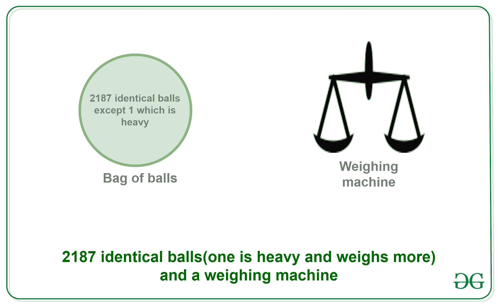
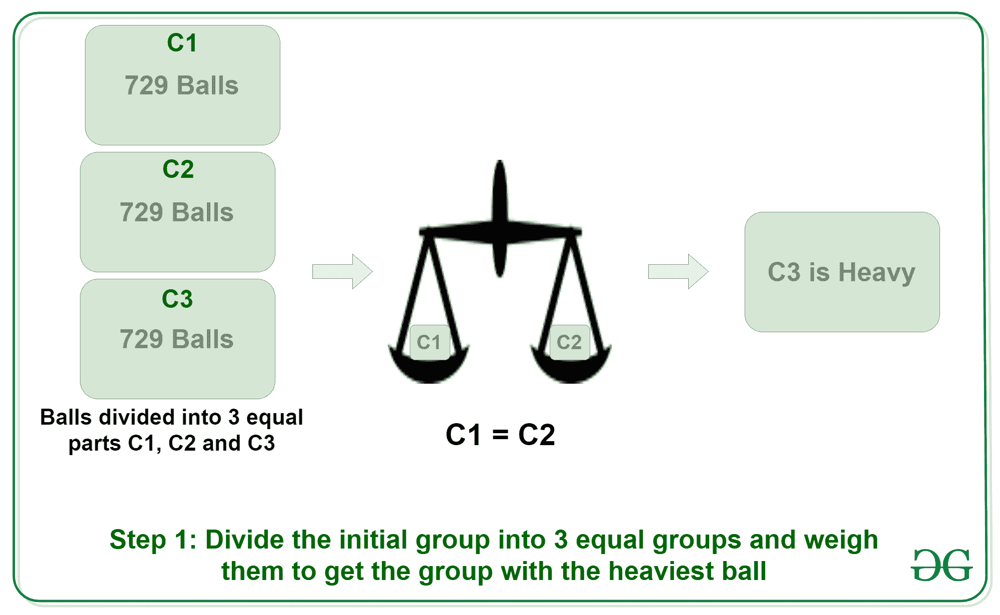
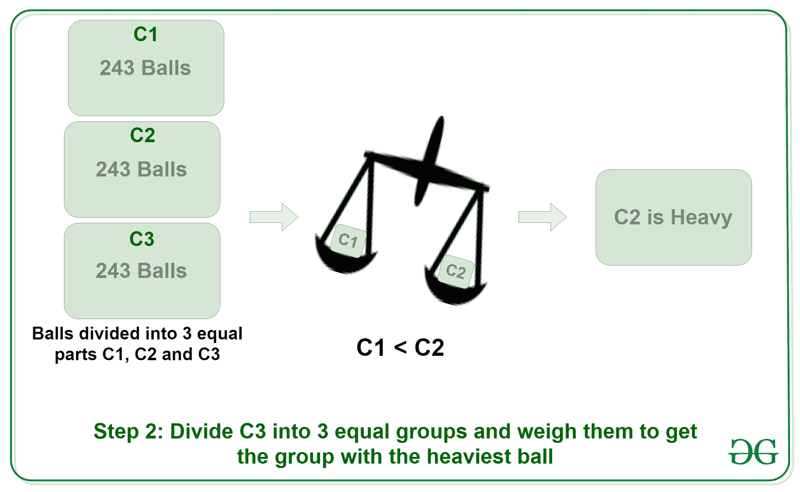
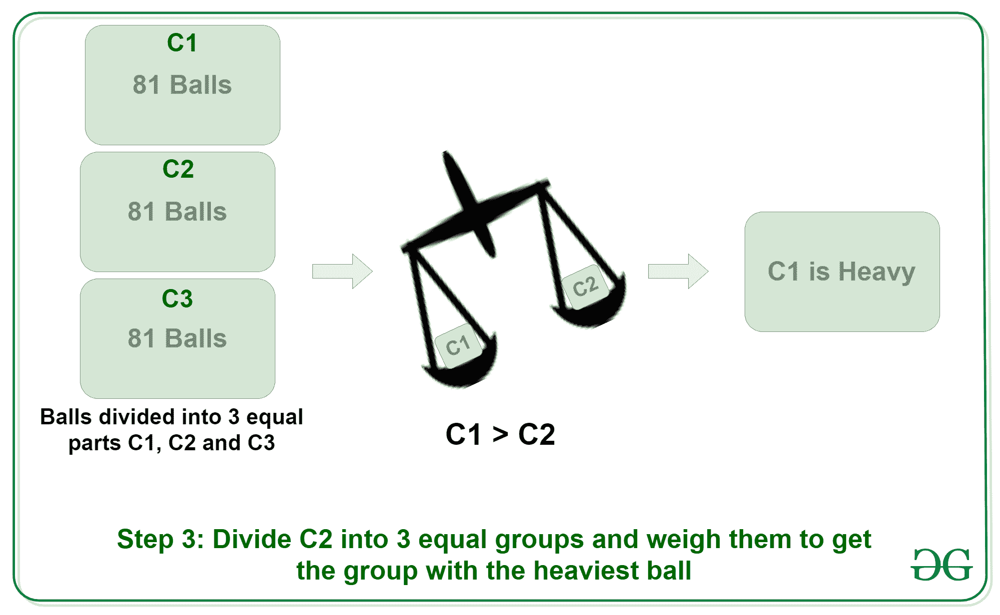
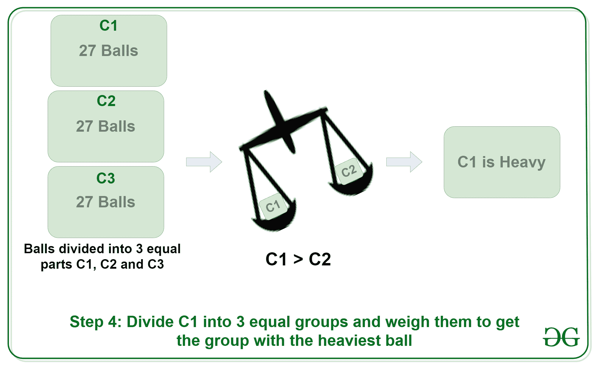
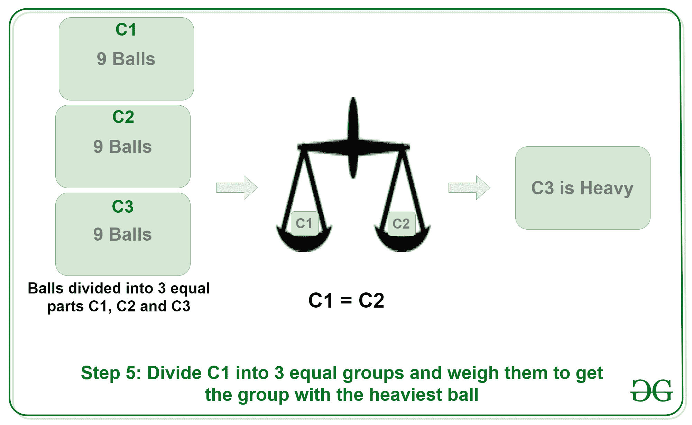
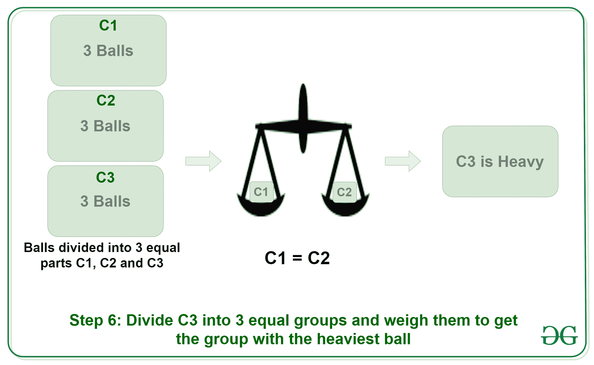
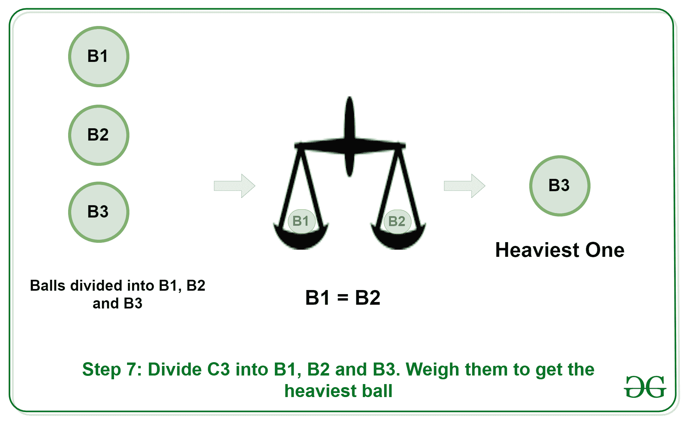

# 拼图|重球重量

> 原文:[https://www.geeksforgeeks.org/weight-heavy-ball/](https://www.geeksforgeeks.org/weight-heavy-ball/)

**<u>拼图</u> :** 共有 2187 个球，其中 1 个重。找出最小的尝试次数，为了找到重球，球必须被称重。

**<u>解</u> :** 需要做的最小测量量将等于 7 次。
2187 = 3^7

1.  **Step 1:** Divide the 2187 balls into 3 equal groups of 729 each, let’s say C1, C2 and C3\. Put C1 on one side of the weighing machine and C2 on the other. This can give rise to 3 conditions:
    *   条件 1: C1 等于 C2，这意味着 C3 有最重的球
    *   条件二:C1 < C2，意味着 C2 的球最重。
    *   条件三:C1 > C2，也就是说 C1 的球最重。

    让我们假设条件 1 跟进，C3 有最重的球。
    

2.  **Step 2:** Now divide C3 again into 3 equal groups of 243 each, naming them again C1, C2 and C3\. Put C1 on one side of the weighing machine and C2 on the other. This can give rise to 3 conditions:
    *   条件 1: C1 等于 C2，这意味着 C3 有最重的球
    *   条件二:C1 < C2，意味着 C2 的球最重。
    *   条件三:C1 > C2，也就是说 C1 的球最重。

    让我们假设条件 2 跟进，C2 有最重的球。
    

3.  **Step 3:** Now divide C2 again into 3 equal groups of 81 each, naming them again C1, C2 and C3\. Put C1 on one side of the weighing machine and C2 on the other. This can give rise to 3 conditions:
    *   条件 1: C1 等于 C2，这意味着 C3 有最重的球
    *   条件二:C1 < C2，意味着 C2 的球最重。
    *   条件三:C1 > C2，也就是说 C1 的球最重。

    让我们假设条件 3 跟进，C1 有最重的球。
    

4.  **Step 4:** Now divide C1 again into 3 equal groups of 27 each, naming them again C1, C2 and C3\. Put C1 on one side of the weighing machine and C2 on the other. This can give rise to 3 conditions:
    *   条件 1: C1 等于 C2，这意味着 C3 有最重的球
    *   条件二:C1 < C2，意味着 C2 的球最重。
    *   条件三:C1 > C2，也就是说 C1 的球最重。

    让我们假设条件 3 跟进，C1 有最重的球。
    

5.  **Step 5:** Now divide C1 again into 3 equal groups of 9 each, naming them again C1, C2 and C3\. Put C1 on one side of the weighing machine and C2 on the other. This can give rise to 3 conditions:
    *   条件 1: C1 等于 C2，这意味着 C3 有最重的球
    *   条件二:C1 < C2，意味着 C2 的球最重。
    *   条件三:C1 > C2，也就是说 C1 的球最重。

    让我们假设条件 1 跟进，C3 有最重的球。
    

6.  **Step 6:** Now divide C3 again into 3 equal groups of 3 each, naming them again C1, C2 and C3\. Put C1 on one side of the weighing machine and C2 on the other. This can give rise to 3 conditions:
    *   条件 1: C1 等于 C2，这意味着 C3 有最重的球
    *   条件二:C1 < C2，意味着 C2 的球最重。
    *   条件三:C1 > C2，也就是说 C1 的球最重。

    让我们假设条件 1 跟进，C3 有最重的球。
    

7.  **Step 7:** Now finally divide C3 which has 3 balls into group of 1, naming them again B1, B2 and B3\. Put B1 on one side of the weighing machine and B2 on the other. This can give rise to 3 conditions:
    *   条件 1: B1 等于 B2，这意味着 B3 的球最重
    *   条件二:B1 < B2，表示 B2 的球最重。
    *   条件三:B1 > B2，说明 B1 的球最重。

    假设条件 1 继续，那么 B3 就是我们要找的最重的球。
    

    所以，总的来说，到达最重的球需要 7 步。

    本文由**舒巴姆·辛格**供稿。如果你喜欢 GeeksforGeeks 并想投稿，你也可以使用[contribute.geeksforgeeks.org](http://www.contribute.geeksforgeeks.org)写一篇文章或者把你的文章邮寄到 contribute@geeksforgeeks.org。看到你的文章出现在极客博客主页上，帮助其他极客。

    如果你发现任何不正确的地方，或者你想分享更多关于上面讨论的话题的信息，请写评论。