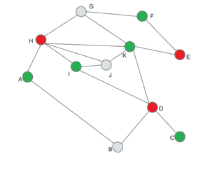
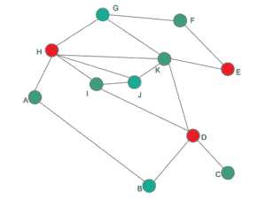

# 威尔士鲍威尔图着色算法

> 原文:[https://www . geesforgeks . org/Welsh-Powell-graph-coloring-algorithm/](https://www.geeksforgeeks.org/welsh-powell-graph-colouring-algorithm/)

在图论中，顶点着色是一种标记每个独立顶点的方法，这样就不会有两个相邻的顶点具有相同的颜色。但是我们需要找出满足给定条件所需的颜色数量。不希望有多种颜色或标签。所以，我们有一个算法叫做威尔士鲍威尔算法，它给出了我们需要的最小颜色。这个算法也被用来求图的色数。这是一种迭代的 ***贪婪的*** 方法。

**色数**:一个图 G 需要 K 种不同的颜色才能适当着色，并且不能少，叫做 K 色图，数字 K 叫做图 G 的色数

威尔士鲍威尔算法包括以下步骤:

1.  求每个顶点的度数
2.  按降序列出顶点。
3.  用颜色 1 给第一个顶点着色。
4.  向下移动列表，用相同的颜色给所有未连接到着色顶点的顶点着色。
5.  用新颜色对所有未着色的顶点重复步骤 4，按度数降序排列，直到所有顶点都着色。

通过从最高的度开始，我们确保具有最高数量冲突的顶点可以尽早得到处理。

| 顶点 | 程度 |
| --- | --- |
| A | Two |
| B | Two |
| C | one |
| D | four |
| E | Two |
| F | Two |
| G | three |
| H | five |
| 我 | three |
| J | three |
| K | five |

首先，按度数降序排列列表。万一出现平局，我们可以随机选择任何打破平局的方式。
那么，新的顺序将是:H、K、D、G、I、J、A、B、E、F、C

现在，遵循威尔士鲍威尔图着色算法，
H–着色红色
K–不着色红色，因为它连接到 H
D–着色红色
G–不着色红色，因为它连接到 H
I–不着色红色，因为它连接到 H
J–不着色红色，因为它连接到 H
A–不着色红色，因为它连接到 H
B–不着色红色， 当它连接到 D 时
E–不要涂红色
F–不要涂红色，因为它连接到 E
C–不要涂红色，因为它连接到 D

在此之后，图表将如下图所示。

忽略已经着色的顶点，我们只剩下:K，G，I，J，A，B，F，C

我们可以用第二种颜色绿色重复这个过程

K–颜色绿色
G–不要涂绿色，因为它与 K
I–颜色绿色
J–不要涂绿色，因为它与 I
A–颜色绿色
B–不要涂绿色，因为它与 A
F–颜色绿色
C–颜色绿色连接

再次，忽略着色的顶点，我们剩下 G，J，B。让我们用蓝色着色。
G 色蓝色
J 色蓝色
B 色蓝色

最终数字如下所示。现在，我们可以看到，使用威尔士鲍威尔算法，我们可以只用 3 种颜色给顶点着色(这个图的**色数是 3** )，这是最优解，因为这个图至少包含一个三角形。