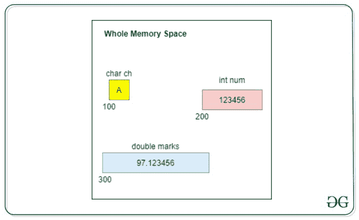
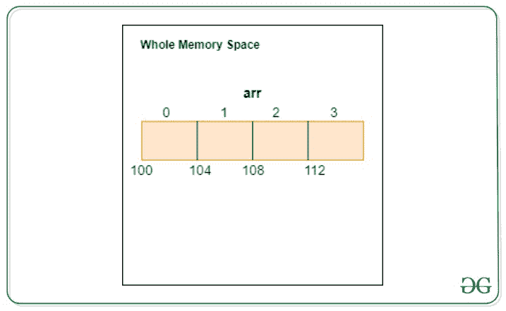
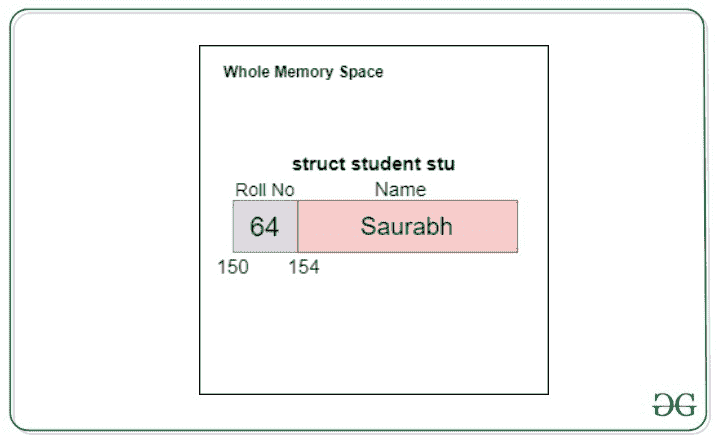
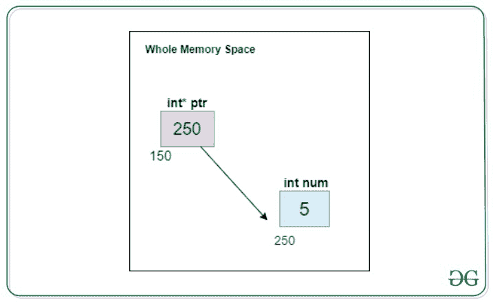
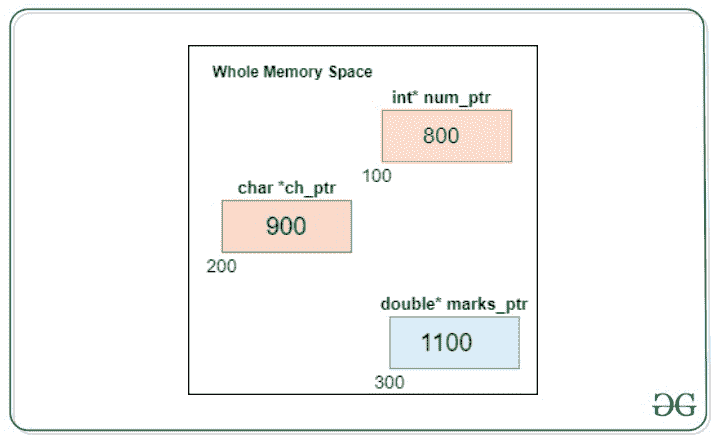
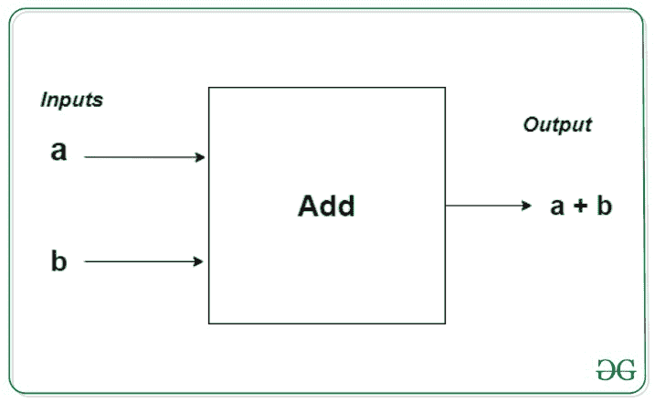
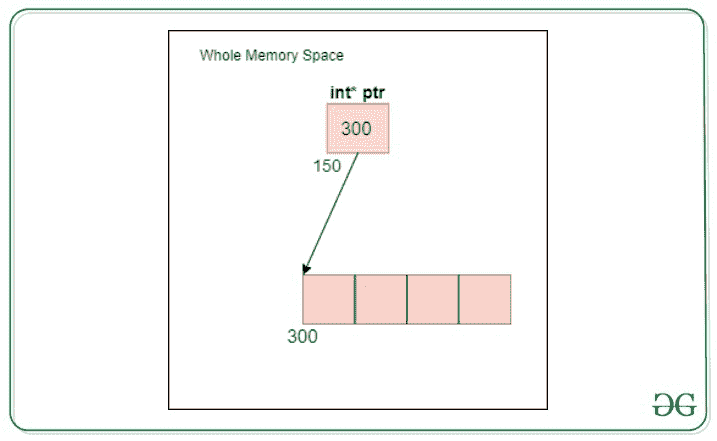

# 用作数据结构的 C 编程概念有哪些

> 原文:[https://www . geeksforgeeks . org/c-programming-as-data-structures/](https://www.geeksforgeeks.org/what-are-the-c-programming-concepts-used-as-data-structures/)

## 数据类型

简单来说，数据类型为我们提供了关于数据类型的信息。
举例、整数、字符等。
C 语言中的数据类型是*变量*的声明。数据类型分为:

#### **原始或内置数据类型**

原始数据类型的一些例子如下



名为 **ch** 的变量指的是内存地址 100，已经占用了 1 个字节的内存，其中保存了字符数据类型‘A’的值。

**num** 为整数型，指内存地址 200，已占用内存 4 字节，保存值 123456。

**标记**为双型，指内存位置 300，已占用 8 字节内存，保存值 97.123456。

**注意:**这些地址(100，200 & 300)只是为了理解的目的，实际地址是大的十六进制数。

## 数组

数组是可以存储同一数据类型的多个值的变量。数组是一个连续的内存段。

**<u>例:</u>**

如果要存储 100 个整数，可以使用一个数组，而不是使用 100 个不同的整数变量。

**<u>数组声明语法:</u>**

```
*data_type* array_name[array_size];
```

分配的空间量= sizeof(data_type) * array_size

**<u>示例:</u>**
声明一个可以保存 4 个整数的数组

```
int arr[4];
```



在这种情况下，sizeof(int) = 4。因此，为数组保留了 4*4 = **16** 字节的内存。

**<u>阵声明&初始化示例:</u>T3】**

```
int arr[5] = {10, 20, 30, 40, 50};
```

可以使用从 0 到(array_size-1)的索引来访问数组元素。

下面是在 C 语言中使用数组的示例代码:

## C

```
// C implementation to demonstrate
// the usage of arrays

#include <stdio.h>

int main()
{
    // Array Indexs-0   1   2   3   4
    int arr[5] = { 10, 20, 30, 40, 50 };

    int size = sizeof(arr);

    printf("Size of array is %d\n", size);

    printf("Data at index 2 is %d\n", arr[2]);
}
```

**Output**

```
Size of array is 20
Data at index 2 is 30
```

## 结构

我们使用原始数据类型来存储数据。但是如果我们要存储的数据更复杂呢？

让我们考虑一个例子，我们希望将一个班级中学生的信息存储在一个变量中。所以，一个学生有:

*   辊号
*   名字

这里，卷号是整数类型，名称是字符串(字符数组)类型。

这里，是解决方案:**结构**

*   结构是单一名称下的变量集合(可以是不同的数据类型)。
*   它也像数组一样是一个连续的内存段，但是它允许不同数据类型的数据成员。

**<u>定义结构的语法:</u>**

```
struct *structure_name*
{
   datatype *member1_name;*
   datatype *member2_name;*
 *..*
   datatype *membern_name;*
};
```

**<u>例:</u>**

```
struct student
{
   int roll_number;
   char name[20];
};
```

现在我们有了新定义的数据类型， *struct student。*我们可以创建它的变量。

**<u>变量声明语法:</u>**

```
struct *structure_name* *variable_name*;
```

**<u>例:</u>**

```
struct  student  ram;

// Members of structures can
// be accessed using "." operator
stu.roll_number = 64;
stu.name = “Saurabh”;
```



当我们定义一个结构时，没有分配内存。

结构的大小等于每个数据成员消耗的空间总量。

**<u>例:</u>**

如果是学生结构，则为 4 + 20 = 24 字节

下面是代码帮助下的结构图:

## C

```
// C implementation to demonstrate
// the usage of structures

#include <stdio.h>
#include <string.h>

// Structure Definition
struct student {
    // data members
    int roll_no; // 4 bytes
    char name[20]; // 20 bytes
};

int main()
{
    // Structure variable Declaration
    struct student stu;

    stu.roll_no = 64;
    strcpy(stu.name, "Saurabh");

    printf("Structure Data\n");
    printf("Roll No: %d\n", stu.roll_no);
    printf("Name: %s\n", stu.name);

    int size = sizeof(stu);

    printf("Size of Structure student");
    printf("is %d", size);
}
```

**Output**

```
Structure Data
Roll No: 64
Name: Saurabh
Size of Structure studentis 24
```

## 两颗北极指极星

*   指针是存储地址的特殊类型的变量，而不是变量的值。
*   它们用于变量的间接访问。
*   如果 var 是变量的名称，那么 ***<u>& var</u>*** 给出了 **var** 的地址。

还记得 scanf 函数中使用的&符号吗

```
scanf(“%d”, &var);
```

这是因为我们将扫描的值分配到 **var** 的存储位置。

我们对地址不感兴趣，但对存储在该地址的值感兴趣。

**<u>指针声明语法:</u>**

```
*data_type** pointer_name; // (* = asterisk)          
```

**<u>例:</u>**

```
int* ptr;
```

指针可以指向任何数据类型
它可以保存它所指向的数据类型的任何变量的地址。
未初始化的指针变量的值为空。

**<u>例:</u>**

```
int* ptr;
int num = 5;
ptr = &num;
```



要获取指针指向的地址值，我们使用星号(*)运算符。

因此，在上面的例子中，ptr 保存地址 250，地址处的值是 5。

因此，*ptr 等于 5。

下面是代码帮助下的指针图示:

## C

```
// C implementation to demonstrate
// pointers in C

#include <stdio.h>

int main()
{
    int* ptr;
    int num = 5;

    ptr = #

    // This gives address of num
    printf("Value at ptr is %p\n", ptr);

    // This gives value at num
    printf("Value at *ptr is %d\n", *ptr);
}
```

**Output**

```
Value at ptr is 0x7ffdff4dca9c
Value at *ptr is 5
```

指针变量的大小在系统中总是恒定的，与它所指向的数据类型无关，通常是 8 字节。



### 指向结构的指针

*   指向该结构的指针可以声明为普通变量。

**<u>例:</u>**

```
struct student *p;
```

这里 **p** 是指针， ***p** 是结构

因此，要访问数据成员，我们必须使用

```
(*p).roll_no
(*p).name
```

c 提供了一个特殊的操作符，用于通过指针访问数据成员，即->箭头操作符。

**注:** (*p)。x 相当于 p- > x

下面是指向该结构的指针的图示:

## C

```
// C implementation to illustrate
// the code of the structures

#include <stdio.h>
#include <stdlib.h>

// Structure Definition
struct student {
    int roll_no;
    char name[20];
};

int main()
{
    struct student* p;

    p = (struct student*)
        malloc(sizeof(struct student));

    // Arrow operator
    p->roll_no = 99;

    printf("The value at roll");
    printf("number is %d", p->roll_no);

    return 0;
}
```

**Output**

```
The value at rollnumber is 99
```

## 功能

*   函数是执行特定任务的代码块。
*   一个函数可能有一个输入，执行这样的任务，然后可能提供一些输出。



在上面的例子中，我们给一个函数输入 2 个数字。它正在执行加法功能。然后，返回两个输入数字的总和。

*   输入被称为函数的参数
*   输出被称为返回值

功能可以分为两类:

### 内置或预定义的功能

这些是在 C 语言的标准库中定义的。我们不需要定义这些函数，只需要调用这些函数。我们只需要知道正确的语法，就可以很容易地使用这些函数。

**<u>例:</u>**

printf()、scanf()、main()等是预定义的函数。

### 用户定义的函数

*   这些是由程序员定义的函数，用于执行程序中的某些任务。
*   将一个复杂的问题分成更小的块，使我们的程序更容易理解。

要使用用户定义的函数，我们必须执行两个步骤

1.  定义函数
2.  调用函数

**<u>函数定义语法:</u>**

```
*return_type* function_name(<parameters_list>)
{
   --tasks/operations--
   return *return_value*;
}
```

**<u>注:</u>**

1.  一个函数可以有 0 个或更多参数。
2.  一个函数可以有 0 或 1 个返回值。
3.  不返回任何内容的函数有返回类型 *void。*

下图是 C 语言中的函数:

## C

```
// C implementation to
// illustrate functions in C

#include <stdio.h>

// program to demonstrate functions
// function definition
// function to print something

void print()
{
    printf("GeeksforGeeks\n");
}

// Function to add two numbers
int add(int a, int b)
{
    int sum;
    sum = a + b;
    return sum;
}

// Main Function
int main()
{
    int res;

    // Function call
    print();

    res = add(5, 7);

    printf("Sum is %d", res);
}
```

**Output**

```
GeeksforGeeks
Sum is 12
```

**注意:**函数调用中传递的类型应该与函数体作为参数接收的类型兼容。否则会导致编译错误。

### **<u>基于呼叫类型的功能分类:</u>**

#### 通过传递值调用函数

*   当我们通过传递值来调用函数时(如上面的程序)，原始变量的值不受影响。
*   它不是发送原始变量，而是发送变量的副本。

下面是用 C 语言传递值的函数调用示例:

## C

```
// C implementation for the
// function call by passing value

#include <stdio.h>

// Function pass by value
void increase_by_one(int x)
{
    x++;
}

int main()
{
    int num = 5;

    printf("Value before function");
    printf(" call %d\n", num);

    increase_by_one(num);

    printf("Value after function");
    printf(" call %d\n", num);
}
```

**Output**

```
Value before function call 5
Value after function call 5
```

在这个程序中，我们将变量 a 传递给了函数，该函数的值为 5。然后，我们将函数接收的变量值，即 x，增加 1。x 的值现在是 6。但是，这种变化仅限于功能范围。main 中 a 的值仍然是 5。

#### 通过传递地址进行函数调用

*   如果我们想改变传递的变量的值，我们必须通过地址传递变量。
*   此方法使用相同的变量，而不是创建其新副本。

下面是通过传递地址进行函数调用的代码:

## C

```
// C implementation to demonstrate
// the usage of function call by
// passing reference

#include <stdio.h>

// function to demonstrate
// call by value
void increase_by_one(int* x)
{
    (*x)++;
}

int main()
{
    int num = 5;

    printf("Value before function");
    printf(" call %d\n", num);

    increase_by_one(&num);

    printf("Value after function");
    printf(" call %d\n", num);
}
```

**Output**

```
Value before function call 5
Value after function call 6
```

当我们传递变量的地址时，我们必须将它作为指针变量来接收。

#### 函数:将数组作为参数传递

## C

```
// C implementation to demonstrate
// the example of the passing as
// parameter in the function

#include <stdio.h>

// Function to print the array
void print_array(int arr[], int n)
{
    // N is size of array
    int i;

    for (i = 0; i < n; i++)
        printf("%d ", arr[i]);
}

int main()
{
    int arr[5] = { 10, 20, 30, 40, 50 };

    // Function Call
    print_array(arr, 5);
}
```

**Output**

```
10 20 30 40 50 
```

## 类型铸造

类型转换基本上是一种数据类型到另一种数据类型的转换。

**<u>类型转换语法:</u>**

```
var2 = (datatype2) var1
where,  
var1 is of datatype1 & var2 is of datatype2
```

**<u>例:</u>**

如果要将整数值变量转换为浮点变量

```
float x = (float)7/5;
```

要了解更多关于类型转换的信息，请参考 C 中的[类型转换](https://www.geeksforgeeks.org/type-conversion-c/)

## 动态存储分配

如您所知，数组是固定数量的值的集合。一旦声明了数组的大小，就不能更改它。

有时您声明的数组可能不够大。为了解决这个问题，您可以在运行时动态分配内存。这就是所谓的动态内存分配。

动态内存分配中使用的预定义函数:

### 1.malloc()

*   malloc 代表内存分配。
*   malloc()函数保留指定字节数和 void*的内存块，可以将其转换为任何形式的指针。

**<u>malloc()的语法:</u>**

```
pointer_name = (cast_datatype*)malloc(size);
```

### 2.免费()

*   使用 malloc()动态分配的内存不会自行释放。您必须显式使用 free()来释放此空间。

**<u>自由语法:</u>**

```
free(pointer_name);
```

**注意:**这些函数在头文件 stdlib.h 中声明，要使用这些函数，必须先包含这个头文件。



下图是 C 语言中的动态内存分配:

## C

```
// C implementation to demonstrate
// the code the Dynamic Memory
// Allocation

#include <stdio.h>
#include <stdlib.h>

int main()
{
    int* ptr;
    int n = 5, i;

    ptr = (int*)malloc(n * sizeof(int));

    for (i = 0; i < n; i++)
        ptr[i] = i;

    printf("\nArray Elements are\n");

    for (i = 0; i < n; i++)
        printf("%d ", ptr[i]);

    free(ptr);
}
```

**Output**

```
Array Elements are
0 1 2 3 4 
```

要了解更多关于动态内存分配的信息，请参考 C 中的[动态内存分配](https://www.geeksforgeeks.org/dynamic-memory-allocation-in-c-using-malloc-calloc-free-and-realloc/)