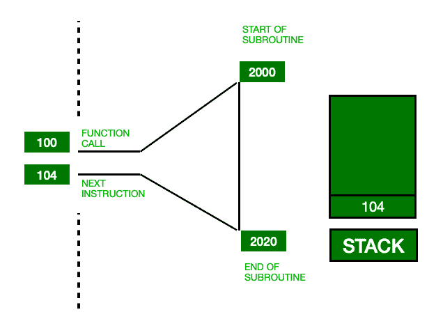

# 当我们调用一个函数时会发生什么

> 原文:[https://www . geeksforgeeks . org/当我们调用函数时会发生什么/](https://www.geeksforgeeks.org/what-happens-when-we-call-a-function/)

一个[函数](https://www.geeksforgeeks.org/functions-in-c/)是一组执行特定任务的代码，只需调用它就可以在任何需要的时候使用。

当使用多个函数调用或[递归](https://www.geeksforgeeks.org/recursion/)时，函数调用的概念非常有必要被知道，以便更好地理解代码。

### 现在，让我们了解函数调用的工作原理

在了解函数调用的工作之前，您需要一些关于[程序在中央处理器](https://www.geeksforgeeks.org/program-execution-in-the-cpu/)中执行、程序堆栈、堆栈帧(激活记录)的先决知识。

*   **Program Stack:** Program Stack is the stack which holds all the function calls, with bottom elements as the main function. 
*   **堆栈帧:**堆栈帧实际上是一个缓冲存储器，它是程序堆栈的一个元素，并且具有被调用函数 ie 的数据
    *   回信地址
    *   输入参数
    *   局部变量
    *   登记储蓄
*   **栈指针:**栈指针是指向程序栈顶的指针，即最近调用的函数。

现在，每当调用一个函数时，都会用该函数的所有数据创建一个新的堆栈帧，并将该堆栈帧推入程序堆栈中，并且总是指向程序堆栈顶部的堆栈指针指向推入的堆栈帧，因为它位于程序堆栈的顶部。

### 我们调用函数时的一系列操作:

1.  堆栈帧被推入堆栈。
2.  执行子程序指令。
3.  堆栈帧从堆栈中弹出。
4.  现在程序计数器正在保存返回地址。

**注意:**汇编语言的 POP 指令去掉栈顶，赋给程序计数器。

### 让我们借助一个例子来理解:

在上面调用函数的例子中。

1.  程序计数器指向下一个指令存储位置，即在执行一个函数之前的 104，而 100 是调用函数的存储位置。
2.  为了恢复返回地址，程序计数器的内容被推入堆栈。现在存储在栈顶的地址是 104。
3.  调用函数执行:现在程序计数器指向 2000，这是子程序的起始地址。在子程序中所有连续指令执行后，从堆栈中弹出地址。
4.  堆栈弹出是指移除堆栈顶部并分配给程序计数器。现在程序计数器持有返回地址，即 104。

本文背后的主要动机是理解在堆栈中推送返回地址背后的原因。然而，在函数的现代实现中，仅仅将返回地址推入堆栈是不够的。在推送返回地址之前，我们需要推送实际的和形式的参数。