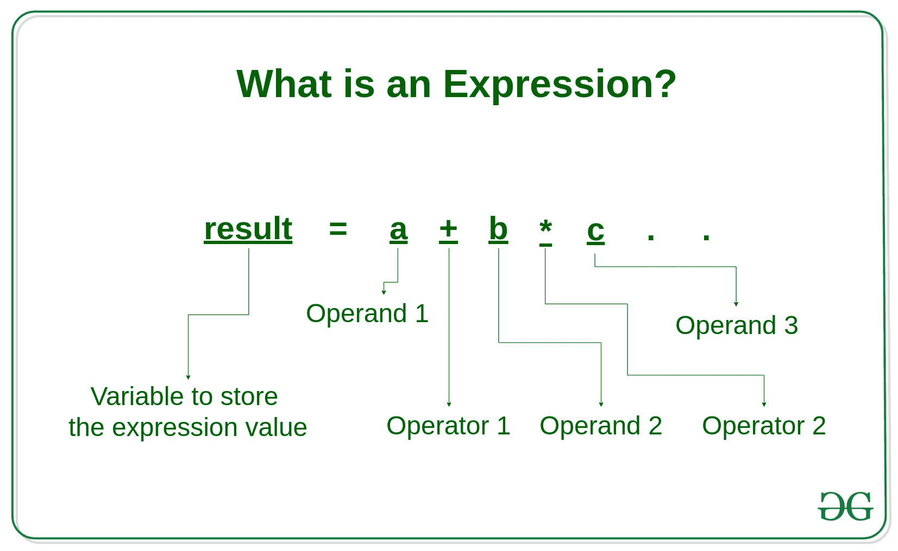
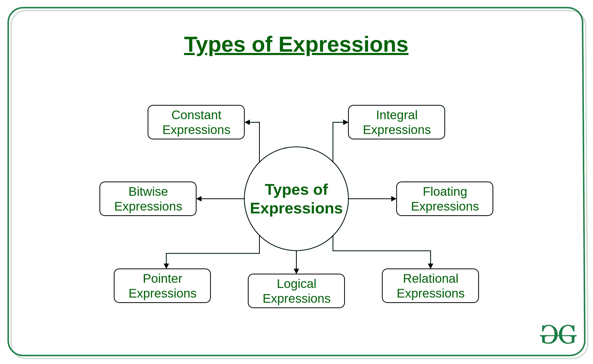

# 什么是表达式，表达式有哪些类型？

> 原文:[https://www . geesforgeks . org/什么是表达式以及表达式的类型/](https://www.geeksforgeeks.org/what-is-an-expression-and-what-are-the-types-of-expressions/)

**表达式**:表达式是运算符、常量和变量的组合。表达式可以由一个或多个操作数以及零个或多个运算符组成，以产生一个值。

[](https://media.geeksforgeeks.org/wp-content/uploads/20190801163131/What-is-an-Expression_-3.jpg)

**示例:**

```
a+b
c
s-1/7*f
.
.
etc

```

<u>**表达类型:**</u>

表达式可以是以下类型:

[](https://media.geeksforgeeks.org/wp-content/uploads/20190801154515/Types-of-Expressions.jpg)

*   **常量表达式**:常量表达式只由常量值组成。常数值是不变的。
    T4【示例】T5:

    ```
    5, 10 + 5 / 6.0, 'x’
    ```

*   **Integral expressions**: Integral Expressions are those which produce integer results after implementing all the automatic and explicit type conversions.
    **Examples**:

    ```
    x, x * y, x + int( 5.0)
    ```

    其中 x 和 y 是整数变量。

*   **Floating expressions**: Float Expressions are which produce floating point results after implementing all the automatic and explicit type conversions.
    **Examples**:

    ```
    x + y, 10.75
    ```

    其中 x 和 y 是浮点变量。

*   **关系表达式**:关系表达式产生布尔值为真或假的结果。当算术表达式用在关系运算符的两边时，将首先计算它们，然后比较结果。关系表达式也称为布尔表达式。
    T4【示例】T5:

    ```
    x <= y, x + y > 2
    ```

*   **逻辑表达式**:逻辑表达式结合两个或多个关系表达式，产生布尔类型的结果。
    T4【示例】T5:

    ```
     x > y && x == 10, x == 10 || y == 5 
    ```

*   **Pointer expressions**: Pointer Expressions produce address values.
    **Examples**:

    ```
    &x, ptr, ptr++
    ```

    其中 x 是变量，ptr 是指针。

*   **Bitwise expressions**: Bitwise Expressions are used to manipulate data at bit level. They are basically used for testing or shifting bits.
    **Examples:**

    ```
    x << 3
    ```

    向左移动三位

    ```
    y >> 1
    ```

    向右移动一位。

    移位运算符通常用于二的乘除。

**注意:**一个表达式也可以使用上述表达式的组合。这样的表达式被称为**复合表达式**。