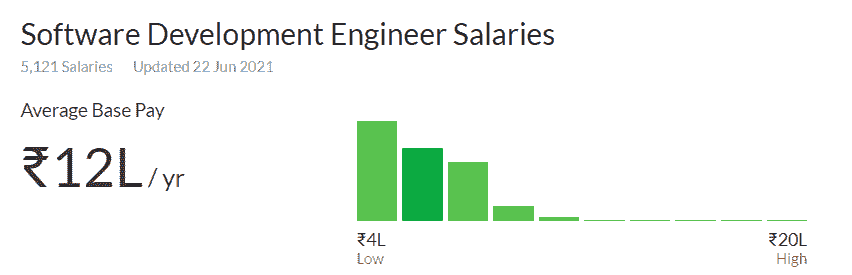

# 为什么像亚马逊、微软、谷歌这样的公司关注数据结构和算法:回答

> 原文:[https://www . geesforgeks . org/why-像亚马逊这样的公司-微软-谷歌-聚焦-数据-结构-算法-回答/](https://www.geeksforgeeks.org/why-companies-like-amazon-microsoft-google-focuses-on-data-structures-and-algorithms-answered/)

如果你正在准备一个像 Adobe、亚马逊、微软、谷歌等大型科技公司的技术面试。–很可能，您已经知道数据结构和算法对破解这些面试的重要性。是的，这些公司的技术职位面试大多集中在测量候选人的**数据结构和算法**知识。

> 于是问题来了:**为什么基于产品的公司如此重视数据结构和算法？**

基于软件产品的公司通常创建与软件相关的产品。因此，他们需要高质量的**软件开发人员**来处理软件的开发过程是理所当然的。最近一段时间，软件开发人员的工资水平在全球范围内大幅提高。根据 Glassdoor 的报告，印度软件开发人员的平均基本工资约为每年 1200 万印度卢比(T2)**。软件开发人员的平均基数从 **Rs 不等。每年 4，000，000** 至**卢比 20，000，000** (以产品为基础的公司占据更高端)。** 

**

图片提供:玻璃门** 

**然而，印度严重缺乏合格的软件开发人员。根据各种标准报告，实际上只有不到 10%的工程师可以从事软件相关的工作。**这就是数据结构和算法的由来。**它们在基于产品的公司的面试中非常重要，因为它们是任何优秀软件开发人员的标志。**

**除此之外，**基于产品的公司**如此重视数据结构和算法还有多个原因，如下所述:**

1.  **数据结构和算法展示了候选人的**问题解决能力**。没有空间精心制作故事，这意味着要么候选人能解决问题，要么他们不能。**
2.  **基于数据结构和算法的问题可以根据考生的知识水平**放大或缩小**。这意味着可以使用大致相同的问题来测试各种候选人。**
3.  **数据结构和算法用于测试候选人的**分析技能**，因为它们是一个有用的工具，可以挑选出现实问题中的底层算法并有效地解决它们。**
4.  **数据结构和算法是软件开发的**基础**。无论使用什么新技术，他们都是一样的，这就把焦点放在了问题上，而不是面试过程中的技术。**

### **学习数据结构和算法**

**既然我们已经确定数据结构和算法对于**基于产品的公司**的面试很重要，让我们专注于学习它们。**

> **糟糕的程序员担心代码。优秀的程序员担心数据结构及其关系。**

**在学习数据结构和算法时，最好从小的简单主题开始，然后继续学习越来越多的高级主题。一些基本的数据结构是**数组、链表、栈、队列、**等。而一些基本算法是**排序、搜索、**等。**

**学习数据结构和算法时可能出现的一些主要问题是:**

*   ****缺乏指导:**学习数据结构和算法时没有明确的指导。在这些总括术语中有许多主题，但没有关于哪些主题对不同的基于产品的公司更有用的具体指南。这种情况可能相当令人困惑，尤其是对初学者来说。**
*   ****不知道从哪里开始学习:**即使数据结构和算法中必要的主题是已知的，但它们的数量会导致很多混乱。大多数初学者不知道从哪里开始学习，甚至不知道学习时遵循什么时间顺序。**

**为了解决上述问题，我们 GeeksforGeeks 设计了许多在线课程，以负担得起的价格学习数据结构和算法。我们创建的最新课程之一是 [**【完整面试准备】**](https://practice.geeksforgeeks.org/courses/complete-interview-preparation) 课程。本课程涵盖**数据结构和算法**以及其他科目，以便为你在梦想公司的工作做好充分准备。

***要了解更多信息，请继续阅读。。。*****

### **完成面试准备课程**

**[**【完整面试准备】**](https://practice.geeksforgeeks.org/courses/complete-interview-preparation) 课程是专门为**学生和职场人士**设计的，通过为他们提供高级讲座、理论笔记、实践测试、评估测试等所有必需的东西，帮助他们找到梦想中的工作。在一个地方。在本课程中，除了**数据结构&算法**之外，你还将为其他必修科目做准备，如计算机科学核心科目、编程语言、推理&能力等。此外，我们知道安置准备需要一些广泛的研究过程和聪明的学习，因为不是每个科目在面试中都有相同的权重——因此，本完整的面试准备课程是在牢记这一因素的情况下广泛策划的。**

**完整面试准备课程的一些突出特点如下:**

*   **大约 200+算法编码问题将被提供**
*   **基于跟踪的学习和每周评估测试**
*   **高级 ***视频讲座由 Sandeep Jain (CEO &创始人、GeeksforGeeks)*** 等行业专家录制。**
*   **学科化理论内容&由学科专家编写的客观题**
*   **将提供终身课程**
*   **极客学院的课程结业证书和实习机会**
*   **大学生将获得课程的年度周计划**
*   **在 GeeksforGeeks 工作门户免费访问“获得聘用奖励”**
*   **疑问援助专用助教(可选)**

**本课程最初定价为 9，999 印度卢比，但其**报价为 6，999 印度卢比**。此外，如果您想在本课程中增加**疑问协助**设施，您将被要求支付额外金额**2，999 印度卢比**。疑问协助工具将在注册后的 1 年内有效。**

### **每日生活津贴自定进度课程**

**如果您希望专注于数据结构和算法，您可以选择我们最新的在线课程来学习名为–[**DSA 自定进度课程**](https://practice.geeksforgeeks.org/courses/dsa-self-paced) 的数据结构和算法，该课程涵盖了从基础到高级的所有数据结构和算法。它提供了丰富的编程挑战，你可能会在下一次工作面试中面临。本课程主要关注数据结构&算法，因为它是顶尖产品型公司选择的关键。**

**本课程的一些主要特点是:**

*   **由专家编写的关于数据结构和算法的组织良好的教程**
*   **GeeksforGeeks 创始人兼首席执行官 Sandeep Jain 先生的高级视频讲座。**
*   **视频解决方案每周评估测试。**
*   **极客学院的课程结业证书和实习机会**
*   **终身参加课程**

**自定进度的在线 DSA 课程价格为【2,799 印度卢比。此外，如果您想在本课程中增加疑问协助设施，您将被要求支付额外金额**1，499 印度卢比**。疑问协助工具将在注册后的 6 个月内有效。**

### **极客课程–现场会议**

**你想上数据结构与算法的在线直播课来学习和掌握它吗？？如果是，那么我们为您提供了 [**极客课程–现场课程**](https://practice.geeksforgeeks.org/courses/geeks-classes-live) 课程。这将是一个以面试为中心的广泛在线(直播)计划，以建立和提高你的每日生活津贴技能。本课程旨在通过增强您对数据结构&算法的理解来帮助您提高问题解决和编码技能。本课程的主要目标是帮助你准备亚马逊、微软、优步等公司的编码面试。因为这将是一堂在线直播课——你可以从任何地理位置参加这门课，也可以像线下课堂一样向讲师提出你的疑问或疑问。**

**本课程的一些突出特点如下:**

*   **疑问解决援助**
*   **有限批次强度**
*   **课程结业证书**
*   **6 个月内可观看本课程录制的现场讲座**
*   **除此之外，您还将免费获得每日生活津贴课程的课程内容。**

**本次 [**极客课程–现场课程**](https://practice.geeksforgeeks.org/courses/geeks-classes-live) 以**10，999 印度卢比/-。****