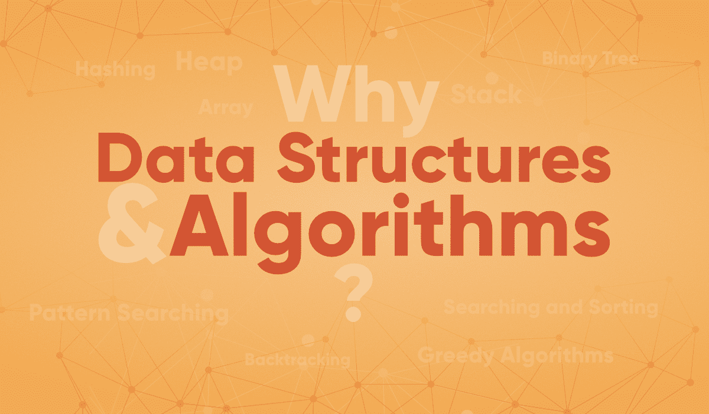

# 为什么数据结构和算法对学习很重要？

> 原文:[https://www . geeksforgeeks . org/why-数据结构和算法非常重要，值得学习/](https://www.geeksforgeeks.org/why-data-structures-and-algorithms-are-important-to-learn/)

**数组、链表、栈、队列、搜索、排序、树、图……**
你有问题吗，如果上面这些复杂的东西在现实生活中完全没有用，我为什么要研究它们？？如果数据结构和算法在日常工作中没有用，为什么公司会问这些问题？？

很多初学者和有经验的程序员都避免学习[数据结构](https://www.geeksforgeeks.org/data-structures/)和[算法](https://www.geeksforgeeks.org/fundamentals-of-algorithms/)，因为这很复杂，他们认为以上这些东西在现实生活中没有任何用处。所以在我们讨论这个话题之前，我们要向你提出一个简单的问题，你需要找到解决这个问题的方法。

如果你需要在 20000 页的 PDF 文档中搜索你的卷号(卷号按升序排列)，你会怎么做？

*   如果你试图随机或按顺序搜索它，会花费太多时间。过一段时间后，你可能会感到沮丧。
*   您可以尝试下面给出的另一种解决方案…
    1.  转到第 10000 页
    2.  如果您卷号不在，但页面中的所有其他卷号都小于您的
    3.  转到第 15000 页
    4.  如果你的号码不在那里。但这次所有其他的卷号都比你的大。
    5.  转到第 12500 页

继续同样的过程，在 30-40 秒内你会找到你的号码。 ***恭喜你……你刚刚无意中使用了***[***二分搜索法算法***](https://www.geeksforgeeks.org/binary-search/) ***..***

这只是一个简单的例子，你可能已经稍微理解了为什么学习数据结构和算法在现实生活中很重要。你可以在日常生活中找到很多例子。所以，如果你认为这个技能只对破解基于产品的公司的面试很重要，那你就大错特错了。

从上面的例子中，我们可以直接给出两个理由来[学习数据结构和算法](https://practice.geeksforgeeks.org/courses/dsa-self-paced?vb=154) …

*   如果你想通过面试进入基于产品的公司
*   如果你喜欢解决现实世界的复杂问题。

### 破解顶级产品公司的面试

***你知道你所有的 SQL 和 Linux 命令在兜帽下都是算法和数据结构吗？*** 你可能没有意识到这一点，但这就是软件的工作原理。

数据结构和算法在软件实现和招聘过程中起着重要作用。很多学生和专业人士都有这样的疑问，为什么这些公司的面试都集中在 DSA 而不是语言/框架/工具的具体问题上？让我们解释为什么会这样…

当你要求某人为某事做决定时，好人会告诉你“*我选择做 X，因为在这些方面它比 A、B 更好。本来可以用 C 去的，但是因为这个*，我觉得这个是更好的选择”。在日常生活中，我们总是和那个能在短时间内高效、少用资源完成任务的人走在一起。同样的事情也发生在这些公司身上。这些公司面临的问题要困难得多，规模也要大得多。在解决这些公司的问题时，软件开发人员也必须做出正确的决定。

哈希表、树、树、[图](https://www.geeksforgeeks.org/graph-data-structure-and-algorithms/)和各种[算法](https://www.geeksforgeeks.org/fundamentals-of-algorithms/)等数据结构的知识对有效解决这些问题大有帮助，面试官更感兴趣的是看求职者如何使用这些工具来解决问题。就像汽车修理工需要正确的工具来修理汽车并使其正常运行一样，程序员也需要正确的工具(算法和数据结构)来使软件正常运行。所以面试官想 ***找一个能运用合适的工具来解决给定问题的候选人。*** 。如果你知道一种数据结构与另一种数据结构的不同之处，你就能做出正确的决定，选择正确的数据结构来解决问题。

***在谷歌、微软、脸书、亚马逊这样的公司工作的工程师和别人不一样，工资也比其他公司高……但是为什么呢？*** 在这些公司中，编码只是实现，大约需要分配给一个项目 20-30%的时间。大部分时间都花在用最佳算法设计东西上，以节省公司的资源(服务器、计算能力等)。这就是为什么这些公司的面试都把重点放在算法上的主要原因，因为他们希望能跳出框框思考的人能设计出能为公司节省数千美元的算法。Youtube、脸书、推特、Instagram、谷歌地图所有这些网站都拥有世界上最多的用户。为了在这些网站上处理更多的用户，需要做更多的优化，这就是基于产品的公司只雇佣能够根据用户需求优化软件的候选人的原因。

**例:**假设你在脸书一家公司工作。你想出了一个时间复杂度为 O(nLogn)而不是 O(n^2 的问题的最优解决方案(比如对来自印度的用户列表进行排序)，并假设公司在现实生活场景中这个问题的 n 是 1 亿(考虑到 Facebook 上注册的用户数量超过 10 亿，这是一个非常公平的假设)。nLogn 是 8 亿，而 n^2 是 10^7 的 10 亿。在成本方面，您可以看到效率比《10^7 时报》提高了更多，这在服务器成本和时间方面可能是一个巨大的节约。
现在你可能已经明白了，公司想要雇佣一个聪明的开发人员，他能够做出正确的决定，节省公司的资源、时间和金钱。因此，在给出使用哈希表而不是列表来解决特定问题的解决方案之前，请仔细考虑大规模和所有案例场景。它可以为公司创造收入，也可以让公司损失一大笔钱。

### 解决一些现实世界的复杂问题

当你在乱七八糟的房间里找不到你的书或衣服时，你有没有被父母责骂过？当然是的……你的父母给你的建议是正确的，他们会把所有东西都放在正确的地方，这样下次你就可以很容易地拿到你的东西了。在这里，你需要将所有东西(数据)安排并保存在这样一个结构中，无论何时你需要搜索什么东西，你都可以很容易地尽快得到。这个例子清楚地表明了在现实生活中安排或组织数据是多么重要。

现在以图书馆为例。如果你需要从图书馆找一本集合论的书，你会先去数学部分，然后是集合论部分。如果这些书不是以这种方式组织的，只是随机分发，那么找到一本书将是令人沮丧的。所以数据结构指的是我们在电脑上组织信息的方式。计算机科学家处理并寻找我们能够组织我们所拥有的数据的最佳方式，因此可以根据所提供的输入更好地处理这些数据。

很多新手程序员都有这样一个问题:我们在日常生活中的什么地方使用了所有的数据结构和算法，以及它在解决现实世界的复杂问题中有什么用处。我们需要提到的是，无论你是否有兴趣进入顶级科技巨头公司，每日生活津贴在你的日常生活中仍然有很大帮助。你不相信我们吗…让我们考虑一些例子…

*   脸书(是的…我们正在谈论你最喜欢的应用程序)。你能想象你在脸书的朋友，朋友的朋友，共同的朋友，他们都可以很容易地用图形来表示吗？放松…坐一会儿，再想一想……你可以用一张图表来表示朋友在脸书的关系。
*   如果你需要保留一副牌并妥善安排，你会怎么做？你可以随机扔出，或者你可以从一副合适的牌中一张一张地排列。您可以在这里使用 Stack 将卡片一张一张地正确排列。
*   如果你需要在字典中搜索一个单词，你会怎么做？你是一页一页地走，还是打开某一页，如果找不到这个词，你会在打开的一页之前/之后打开一页，这取决于当前页的词的顺序(二分搜索法)。

前两个是为现实问题选择正确数据结构的好例子，第三个是选择正确算法在更短时间内解决特定问题的好例子。

以上所有的例子让你清楚地了解到数据的组织在我们的日常生活中是多么的重要。将数据排列在特定的结构中确实有助于节省大量时间，并且更容易操作或使用它们。算法也是如此……我们都想节省时间、精力和资源。我们都想选择最好的方法来解决日常生活中的问题。世界上存在很多问题，用原生解决方案可能需要几个小时或几天才能解决，也可能需要几年时间！你能想象吗！看这个:[数据结构和算法的重要性](https://youtu.be/Q4gTV4r0zRs)
我们周围有很多现实世界的复杂问题，没有人能解决。深入观察问题，你可以通过给出前所未有的解决方案来帮助这个世界。

> **数据结构和算法有助于在更深层次上理解问题的本质，从而更好地理解世界。**

如果你想知道更多关于为什么是数据结构和算法的信息，那么你必须看这个视频。