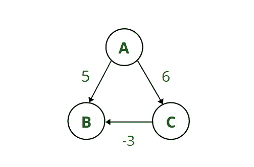
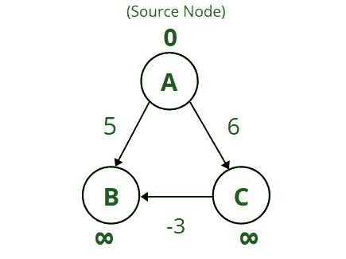
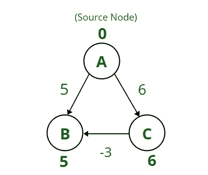

# 为什么 Dijkstra 算法在负权重上失败？

> 原文:[https://www . geesforgeks . org/why-dijkstras-algorithm-fail-on-negative-weights/](https://www.geeksforgeeks.org/why-does-dijkstras-algorithm-fail-on-negative-weights/)

[**迪克斯特拉算法**](https://www.geeksforgeeks.org/dijkstras-shortest-path-algorithm-greedy-algo-7/) **:** 它是一种图形搜索算法，使用[贪婪方法](https://www.geeksforgeeks.org/greedy-algorithms/)来寻找从源节点到所有其他剩余节点的[最短路径](https://www.geeksforgeeks.org/shortest-paths-from-all-vertices-to-a-destination/)。它解决了加权图的**单源最短路径问题**。该算法跟踪边缘的权重，以找到最小化总距离的路径。

**时间复杂度:** O(V + E*log(V))，使用[优先级队列](https://www.geeksforgeeks.org/priority-queue-set-1-introduction/)时(其中 V 为节点，E 为边)

**<u>迪克斯特拉算法的局限性</u> :** 要使该算法正常运行:

*   该图应该是加权和有向的。
*   权重应该是非负数。

**<u>迪杰斯特拉算法的优势</u> :**

*   它具有线性时间复杂度，因此可以很容易地用于大型问题。
*   它在寻找最短距离时很有用，因此它也用于谷歌地图和计算流量。

**<u>迪杰斯特拉算法的缺点</u> :**

*   它无法处理负重量。
*   它遵循一种盲目的方法，因此存在时间浪费。

**为什么 Dijkstra 算法在负权重上失败？**

让我们举一个简单的例子来更好地理解为什么**迪克斯特拉算法**对于负权重失败。

考虑[循环有向图](https://www.geeksforgeeks.org/detect-cycle-in-a-graph/)，其节点 **A、B、**和 **C** 通过具有代表使用该边的成本的权重的边连接。以下是上图中提到的重量:

**A–>B = 5，A–>C = 6，C–>B =-3**。这里一个重量 **C - > B** 为负。

*   将节点 **A** 视为源节点，任务是找到从源节点 **A** 到图中所有其他节点的最短距离，即节点 **B** 和 **C** 。

*   因此，首先在节点 **A** 处将距离标记为 **0** (因为从 **A** 到 **A** 的距离是 **0** )，然后将该节点标记为已访问，表示它已经包含在最短路径中。
*   因为在开始时，源节点到所有其他节点的距离是未知的，所以将其初始化为**无穷大**。如果发现任何短于无穷大的距离，更新这个距离(这基本上是贪婪的方法)

*   然后，用与 **A** 连接的边的权重更新源节点 **A** 到 **B** 的距离，即 **5** (因为 5 <无穷大)。
    同样，也更新从 **A** 到 **C** 的距离，该距离之前为无穷大到 **6** (作为 6 <无穷大)。
*   现在检查从源节点 **A** 到 as 5 的最短距离是从 **A** 到 **B** 的最短距离，因此将节点 **B** 标记为“**访问了**”。
    同样，下一个最短的是 **6** ，所以将节点 **C** 也标记为已访问。此时，图的所有三个节点都被访问。
*   现在最重要的一步出现在这里，因为可以看到，通过遵循这个算法，从**A–>B**的最短距离是 **5** 但是如果经过节点 **C** 的距离，即路径**A–>C–>B**的距离将是 **3** (作为 A–>C = 6 和 C–>B =-3)，所以 6 + (-3) = 3 由于 **3** 小于 **5** ，但 Dijkstra 的算法给出的错误答案为 **5** ，不是最短距离。因此**迪克斯特拉算法**对阴性情况无效。

**结论:**

*   由于 Dijkstra 遵循贪婪方法，一旦节点被标记为已访问，即使有另一条成本或距离更小的路径，也不能重新考虑它。只有当图中存在负权重或负边时，才会出现这个问题。
*   所以这个算法**在负权重**的情况下找不到最小距离，所以作为替代[贝尔曼-福特算法](https://www.geeksforgeeks.org/bellman-ford-algorithm-dp-23/)在负权重的情况下被用来寻找最短距离，因为它在遇到负循环时停止循环。