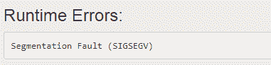

# 为什么全局数组比局部数组大？

> 原文:[https://www . geesforgeks . org/why-global-array-具有比本地阵列更大的尺寸/](https://www.geeksforgeeks.org/why-global-array-has-a-larger-size-than-the-local-array/)

任何[编程语言](https://www.geeksforgeeks.org/top-10-programming-languages-of-the-world-2019-to-begin-with/)中的[数组](https://www.geeksforgeeks.org/introduction-to-arrays/)是存储在[相邻存储位置](https://www.geeksforgeeks.org/difference-between-contiguous-and-noncontiguous-memory-allocation/)的相似数据项的集合，并且可以使用数组索引随机访问元素。它可以用来存储任何特定类型的[原始数据类型](https://www.geeksforgeeks.org/uninitialized-primitive-data-types-in-c-c/)的集合，如 **int** 、 **float** 、 **double** 、 **char** 等。例如 [C](https://www.geeksforgeeks.org/c-language-set-1-introduction/) /C++中的数组可以存储[派生的数据类型](https://www.geeksforgeeks.org/derived-data-types-in-c/)，如[结构](https://www.geeksforgeeks.org/structures-c/)、[指针](https://www.geeksforgeeks.org/pointers-in-c-and-c-set-1-introduction-arithmetic-and-array/)等。下面是一个数组的表示。


数组可以在程序中全局地和局部地(即，在程序的特定范围内)声明和初始化。以下是更好地理解这个概念的例子。

**程序 1:** 下面是 [C++程序](https://www.geeksforgeeks.org/c-plus-plus/)，其中在本地声明了一个大小为 **10 <sup>7</sup>** 的 1D 数组。

## C++

```
// C++ program to declare the array
// of size 10^7 locally
#include <bits/stdc++.h>
using namespace std;

// Driver Code
int main()
{
    const int N = 1e7;

    // Initialize the array a[]
    int a[N];
    a[0] = 1;

    cout << a[0];

    return 0;
}
```

**输出:**

[](https://media.geeksforgeeks.org/wp-content/uploads/20210616124849/segfault.PNG)

**说明:**在上面的程序中，当局部声明一个一维数组时会出现一个[分割错误](https://www.geeksforgeeks.org/core-dump-segmentation-fault-c-cpp/)，那么这个数组大小的限制就是 **10 <sup>5</sup>** 的顺序。数组的[大小不能声明为大于 **10 <sup>5</sup>** 。在本例中，声明了大小为 **10 <sup>7</sup>** 的数组，因此出现了错误。](https://www.geeksforgeeks.org/how-to-find-size-of-array-in-cc-without-using-sizeof-operator/)

**程序 2:** 下面是一个一维数组大小**10<sup>5</sup>T5 被初始化的程序:**

## C++

```
// C++ program to declare the array
// of size 10^5 locally
#include <bits/stdc++.h>
using namespace std;

// Driver code
int main()
{
    const int N = 1e5;

    // Declare array a[]
    int a[N];
    a[0] = 1;

    cout << a[0];

    return 0;
}
```

## Java 语言(一种计算机语言，尤用于创建网站)

```
// Java program to declare the array
// of size 10^5 locally
import java.io.*;

class GFG{

// Driver code
public static void main(String[] arg)
{
    int N = 1;

    // Declare array a[]
    int a[] = {N};
    a[0] = 1;

    System.out.print(a[0]);
}
}

// This code is contributed by shivani
```

## 蟒蛇 3

```
# Python program to declare the array
# of size 10^5 locally
# Driver code
N = 1e5

# Declare array a[]
a = [N]
a[0] = 1
print(a[0])

# This code is contributed by shivanisinghss2110
```

## C#

```
// C# program to declare the array
// of size 10^5 locally
using System;
class GFG
{

// Driver code
public static void Main(String[] arg)
{
    int N = 1;

    // Declare array a[]
    int []a = {N};
    a[0] = 1;

    Console.Write(a[0]);
}
}

// This code is contributed by shivanisinghss2110
```

## java 描述语言

```
<script>

// Javascript program to declare the array
// of size 10^5 locally
var N = 1;

// Declare array a[]
var a = [N];
a[0] = 1;

document.write(a[0]);

// This code is contributed by shivani

</script>
```

**Output:** 

```
1
```

**说明:**上述程序中，代码编译成功，输出为 **1** 。这是因为大小为 **10 <sup>5</sup>** 的 1D 数组是本地初始化的，这是有效的。

**程序 3:** 下面是一个一维数组大小的程序**10<sup>7</sup>T5 在全球范围内声明。**

## C++

```
// C++ program to declare the array
// of size 10^7 globally
#include <bits/stdc++.h>
using namespace std;

// Variable N is initialized
const int N = 1e7;

// Global array is declared
int a[N];

// Driver Code
int main()
{
    a[0] = 1;
    cout << a[0];

    return 0;
}
```

## Java 语言(一种计算机语言，尤用于创建网站)

```
// Java program to declare the array
// of size 10^7 globally
import java.io.*;

class GFG
{

// Driver Code
public static void main(String[] arg)
{
    // Variable N is initialized
    int N = 1;

    // Global array is declared
    int a[] = {N};   
    a[0] = 1;

    System.out.print(a[0]);

}
}
// this code is contributed by shivani
```

## 蟒蛇 3

```
# Python3 program to declare the array
# of size 10^7 globally

# Variable N is initialized
N = 1e7

# Global array is declared
a = [N]

# Driver Code
a[0] = 1
print(a[0])

# This code is contributed by shivanisinghss2110
```

## C#

```
// C# program to declare the array
// of size 10^7 globally
using System;

class GFG
{

// Driver Code
public static void Main(String[] arg)
{
    // Variable N is initialized
    int N = 1;

    // Global array is declared
    int []a = {N};   
    a[0] = 1;

    Console.Write(a[0]);

}
}
// this code is contributed by shivanisinghss2110
```

## java 描述语言

```
<script>

// Javascript program to declare the array
// of size 10^7 globally

// Variable N is initialized
const N = 1e7;

// Global array is declared
let a = new Array(N);

// Driver Code
a[0] = 1;
document.write(a[0]);

// This code is contributed by gfgking.
</script>
```

**Output:** 

```
1
```

**说明:**以上代码中编译成功，输出为 1。这是因为大小为 107 的一维数组是全局声明的，这是有效的。

**注意:**如果全局声明大小为**10<sup>8</sup>T5】的一维数组，那么将再次遇到*分段错误*错误，因为一维数组的全局声明也有限制，也就是说，只能全局声明大小为 **10 <sup>7</sup>** 的一维数组。**

**为什么全局数组比局部数组大？**

*   当一个数组在本地声明时，它总是在[堆栈内存](https://www.geeksforgeeks.org/stack-vs-heap-memory-allocation/)中初始化，通常堆栈内存的大小限制在 **8 MB** 左右。这个尺寸可以根据不同的[电脑架构](https://www.geeksforgeeks.org/computer-organization-and-architecture-tutorials/)而变化。
*   当数组被全局声明时，它存储在[数据段](https://www.geeksforgeeks.org/memory-layout-of-c-program/)中，并且该数据段没有大小限制。因此，当数组被声明为大尺寸(即大于**10<sup>7</sup>T5)时，堆栈内存变满并导致[堆栈溢出错误](https://www.geeksforgeeks.org/heap-overflow-stack-overflow/)，因此遇到分段错误。因此，对于声明更大大小的数组，最好是全局声明。**