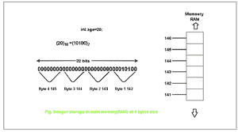

# 为什么整数大小因电脑而异？

> 原文:[https://www . geesforgeks . org/why-integer-size-因计算机而异/](https://www.geeksforgeeks.org/why-integer-size-varies-from-computer-to-computer/)

在计算机中，存储器由存储信息的数字存储器[二进制格式](https://www.geeksforgeeks.org/binary-representation-of-a-given-number/)组成，最低的单位叫做位(二进制数字)。单个位表示由两个状态组成的逻辑值，即 0 或 1。一[位](https://www.geeksforgeeks.org/bits-manipulation-important-tactics/)是二进制数字系统的一部分。使用这些位的组合，任何整数都可以用十进制数表示。

由于数字信息以二进制位存储，计算机使用二进制数字系统来表示所有数字，如整数。一个字节是一组 8 位。在像 [C](https://www.geeksforgeeks.org/c-programming-language/) 这样的编程语言中，可以使用变量的类型来声明变量，所以为了在计算机内存中存储数值，我们在内部使用位数来表示整数(int)。

**整数是如何存储在内存中的？**



在上图中，可以看出整数是如何存储在主存储器中的。上图给出了十进制数(即基数为 10 的数)如何转换为二进制数(即基数为 2 的数系统)，以及它在内存中的确切存储方式。

**为什么整数大小因电脑而异？**

本节重点讨论不同计算机之间整数大小不同的一些原因。以下是原因-

1.  [C 和 C++](https://www.geeksforgeeks.org/difference-between-c-and-c/) 的目的是在所有机器上提供无时间代码。如果编译器必须确保一个 int 对于该机器来说可能是一个不常见的大小，它可能需要额外的指令。几乎在所有情况下，这都不是必需的，只需要它足够大，足以满足用户的使用需求。
2.  C 和 C++的好处之一是，有一些编译器专注于大量的机器，从小的 8 位和 16 位微控制器到大的 64 位多核处理器。事实上，一些 18、24 或 36 位的机器也是如此。如果有些机器采用 36 位本机大小，用户会不太高兴，因为有些标准是这样说的，由于额外的指令，您在整数数学中获得了一半的性能，并且不能使用 int 的最高 4 位。
3.  带有 8 位寄存器的小型微处理器通常支持尝试 16 位加法和减法(或许还包括乘法和除法)，但 32 位数学将涉及与这些指令并行的双倍运算，以及乘法和除法的更多工作。因此，16 位整数(2 字节)在如此小的处理器上更有意义——特别是因为内存可能也不是很大，所以为每个整数存储 4 字节可能有点浪费。
4.  对于 32 位或 64 位机器来说，内存范围大概要大几吨，所以拥有更大的整数并不是什么大缺点，32 位整数运算的速度与较小的整数运算相当，在某些情况下“更好”——例如在 x86 中，16 位基本数学运算(如加法或减法)需要一个额外的前缀字节来提及“使其成为 16 位”，因此 16 位整数上的数学运算将占用更多的代码空间。

这不是普遍正确的，但往往是正确的。将一个 int 扩展到 64 位并不是很有用。它浪费空间。如果需要，一个可以是 64 位长，但仍有 32 位。否则，对于需要 64 位整数的情况，只留下 long long。大多数当前的实现都使用以前的 64 位长度。因此有 16 位整数(短)、32 位整数(int)和 64 位整数(长和长)，所有这些都是硬件支持的(在 x86 的情况下)，允许用户为每个变量选择合适的类型。一般来说，除非硬件有充分的理由，否则形成大于其最小尺寸的种类是没有用的，因为符合标准的程序无论如何都不能期望它们更大，并且需要在最小尺寸下正确工作。

**为什么 Int 不是 16 位？**

它们是 32 位平台上的 32 位；16 位操作数(32 位和 64 位)的指令编码比 32 位操作数长一个字节。如果在寄存器操作过程中存储了 16 位值，则寄存器的其余部分不能使用，无论是 32 位还是 64 位，因为“高半 32 位寄存器”没有指令编码。所以 32 位是一个操作数的自然大小。

下面是一个 C++程序，演示了 64 位系统中整数的大小:

## C++14

```
// C++ program for the above approach
#include <bits/stdc++.h>
using namespace std;

// Driver Code
int main()
{
    // sizeof() operator is used to
    // give the size in bytes
    cout << sizeof(int);

    return 0;
}
```

**Output:**

```
4

```

**Output**

```
4
```

下面是一个 C++程序，演示了 32 位(x86)系统中整数的大小:

## C++14

```
// C++ program to implement
// above approach
#include <iostream>
using namespace std;

// Driver code
int main()
{
    // sizeof() operator is used
    // to give the size in bytes
    cout << sizeof(int);
    return 0;
}
```

**Output:**

```
4

```

**输出**

```
2
```

**可变整数大小的优势:**

1.  改变大小的好处之一是读取或写入所需的 CPU 周期更少。
2.  给定架构的有效使用取决于 32 位或 64 位系统。

**可变整数大小的缺点:**

1.  不同体系结构中的变化并不能让程序员清楚地看到整数的大小，从而为进一步的计算做出类型决定。
2.  如果被滥用于不良目的，它会在内存中引起各种问题，导致支持缓冲区溢出等攻击。
3.  如果某个程序试图将某个值存储在一个大于该变量所能存储的最大值的整数变量中，则可能会出现整数****溢出。****
4.  ****不同的大小可以使用多个 CPU 寄存器。例如，如果需要在 32 位机器中存储一个大于 2^32 的数字，那么需要两个寄存器，对于 64 位机器也是如此。****