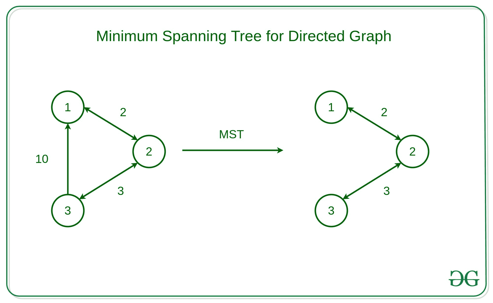

# 有向图为什么 Prim 和 Kruskal 的 MST 算法失败？

> 原文:[https://www . geesforgeks . org/why-prims-and-kruskals-MST-algorithm-fails-for-directed-graph/](https://www.geeksforgeeks.org/why-prims-and-kruskals-mst-algorithm-fails-for-directed-graph/)

**先决条件:**

*   [图形及其表示](https://www.geeksforgeeks.org/graph-and-its-representations/)
*   [贪婪算法|集合 5 (Prim 的最小生成树(MST))](https://www.geeksforgeeks.org/prims-minimum-spanning-tree-mst-greedy-algo-5/)
*   [克鲁斯卡尔最小生成树算法|贪婪算法-2](https://www.geeksforgeeks.org/kruskals-minimum-spanning-tree-algorithm-greedy-algo-2/)

给定一个有向图 **D = < V，E >** ，任务是找到给定有向图的最小生成树

**例:**

但是 [Prim 的最小生成树](https://www.geeksforgeeks.org/prims-minimum-spanning-tree-mst-greedy-algo-5/)和 [Kruskal 的算法](https://www.geeksforgeeks.org/kruskals-minimum-spanning-tree-using-stl-in-c/)对于有向图是失败的。让我们看看为什么

**有向图为什么 Prim 算法失败？**

Prim 的算法假设所有顶点都是连通的。但是在有向图中，不是每个节点都可以从其他节点到达。所以，Prim 的算法就是因为这个原因失败的。
**例如:**

如图所示，从节点 4 无法到达任何节点。有向图不满足所有顶点都连通的要求。

**为什么 Kruskal 算法对有向图失效？**
在克鲁斯卡尔的算法中，在每一步中，检查边是否与到目前为止形成的生成树形成一个循环。但是 Kruskal 算法无法检测有向图中的循环，因为存在顶点之间没有循环的情况，但是 Kruskal 算法假设它是循环的，并且不考虑一些边，因此 Kruskal 算法对于有向图是失败的。
**例如:**
 
这个图会用 Union-Find 方法报告包含一个循环，但是这个图没有循环。

有向图中最小生成树的等价形式是“最小生成树”(也称为最优分支)可以通过运行时间为 0(EV)的[埃德蒙兹算法](https://en.wikipedia.org/wiki/Edmonds%27_algorithm)求解。该算法是最小生成树问题的直接模拟。