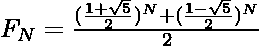

# 黄金分割比为什么取值为 1.618，与比奈公式有什么关系？

> 原文:[https://www . geeksforgeeks . org/为什么黄金价值比是-1-618 以及它与比奈兹公式的关系/](https://www.geeksforgeeks.org/why-the-value-of-golden-ratio-is-1-618-and-how-is-it-related-to-binets-formula/)

**黄金分割比例:**两个数字，比如说 **A** 和 **B** 如果它们的比例等于两个数字之和与较大数字的比例，那么这两个数字就是黄金分割比例，也就是说，

> 假设 A > B，那么
> 如果 A/B = (A + B)/A = ∅ = 1.618(黄金比例)，
> 那么这两个数字就说是黄金比例。

用∅表示，其值等于**1.6180339……**，是一个[无理数](https://www.geeksforgeeks.org/irrational-numbers/)。

[**比奈公式**](https://www.geeksforgeeks.org/finding-number-of-digits-in-nth-fibonacci-number/) **:** 该公式用于在[斐波那契数列](https://www.geeksforgeeks.org/program-for-nth-fibonacci-number/)中寻找 **N 第项**，该项由下式给出:

> 
> 
> 其中，F N 是斐波那契数列中的第 N 个项。

对于等式:**(x2–x–1 = 0)**以下是可以推导出的关系:

> = > x2–x–1 = 0
> =
> =
> x = 2= x+1
> =>【3】= x * t8】2【2】 +x = 3x+2
> =>x【5】= x x【4】= x *(3x+2)= 3x +2x = 3(x+1)+2x = 5x+3

**x** 的下一次幂的下一个项，看上面的图案就能猜到。观察**xNT5T7】的系数等于**x(N–1)**和**x(N–2)**的系数之和。在剩余的学期中也可以观察到同样的模式。所以 **x** 的下一次幂可以直接表示为:**

> = > x = x
> =>x2= x+1
> =>x3= 2x+1
> =>x4= 3x+2
> =>x5= 5x+3
> =>x6= 8x+5
> =>x

斐波那契数列由{0，1，1，2，3，5，8，13，21，…，}给出，观察以上两个数列，两者之间存在关系。可以说:

> xN= fNx+f(N–1)
> 其中，f N 是斐波那契数列中的第 N 项(n > 0)。

现在，让方程的根:**(x2–x–1 = 0)**是∝和β，然后

> ∝ = （1 + √5）/2
> β = （1 – √5）/2

可以说:

> = > T2-√1 = 0 和β–β–1 = 0
> =>n= f+*

在上式中代入∝和β的值后:

> 

以上方程称为**比奈公式**。而数值 **(1+√5)/2** 被称为**黄金比例**，等于 **1.618** 。因此， **N 第个斐波那契数**由下式给出:

> **fn≈∅n**
> where，where，∅是黄金分割比例，F n 是第 n 个斐波那契项。

**应用:**

*   **黄金比例:**用于建筑、绘画、摄影，也以多种形式存在于自然界本身，如鹦鹉螺壳、向日葵等。
*   **比奈公式:**用于寻找斐波那契数列中的**NthT5【项，这使得它在数学和计算机科学的许多领域都非常有用。**
*   **黄金分割比**和**比奈公式:**它们也用于计算像[欧几里德算法](https://www.geeksforgeeks.org/euclidean-algorithms-basic-and-extended/)等算法的时间复杂度。