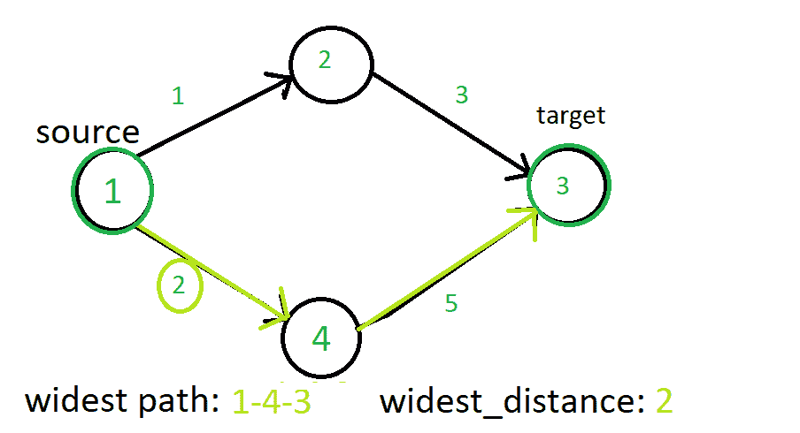
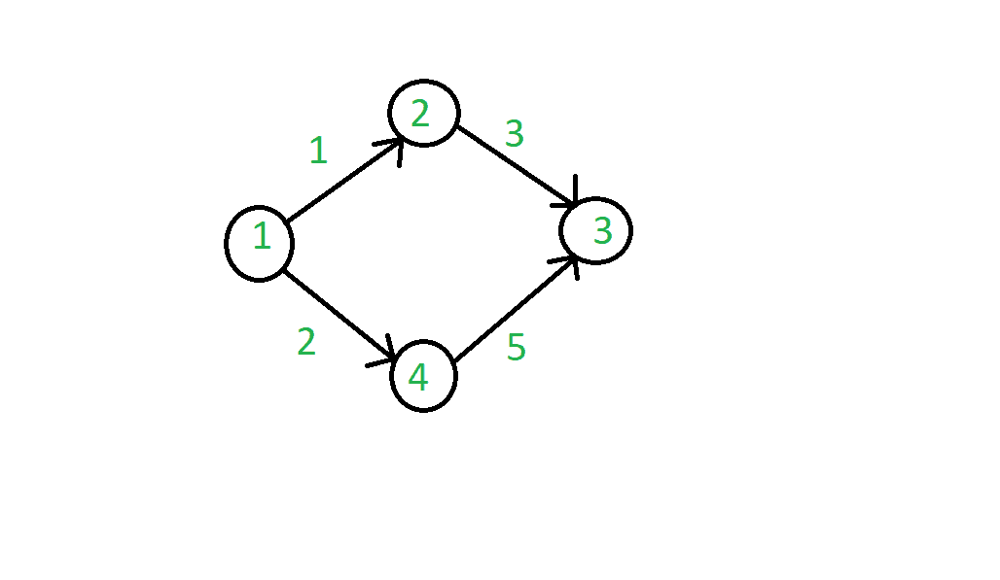
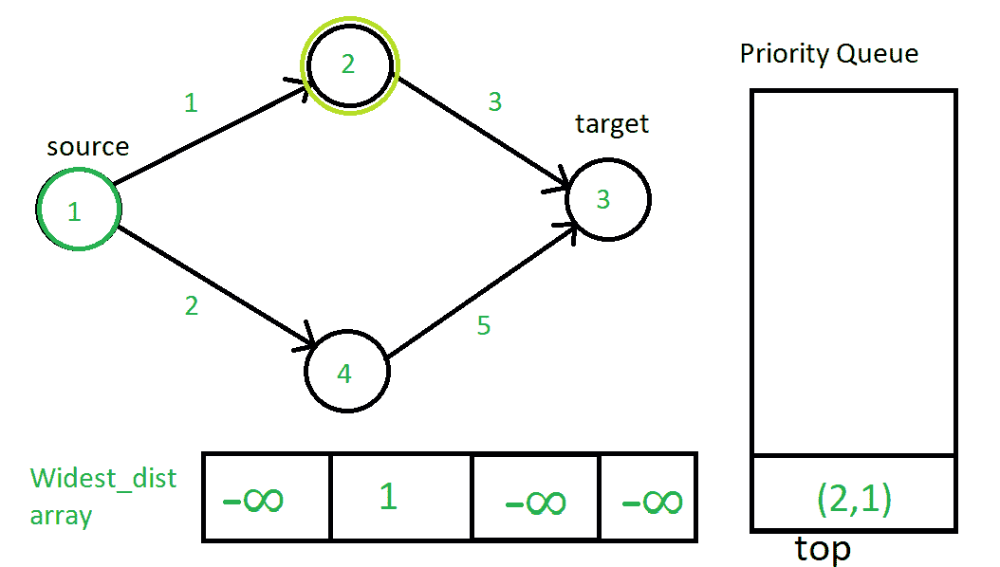
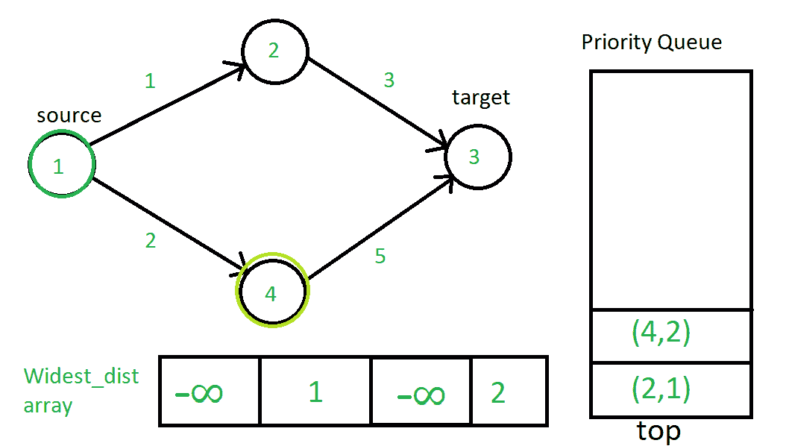
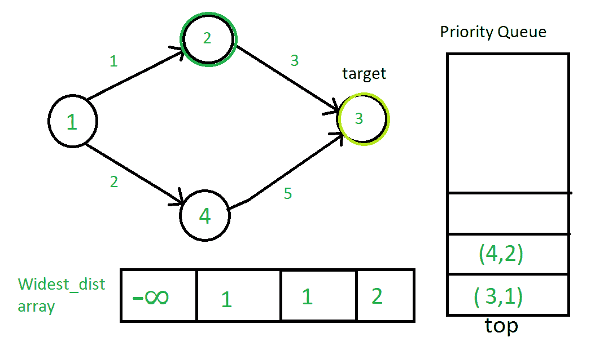
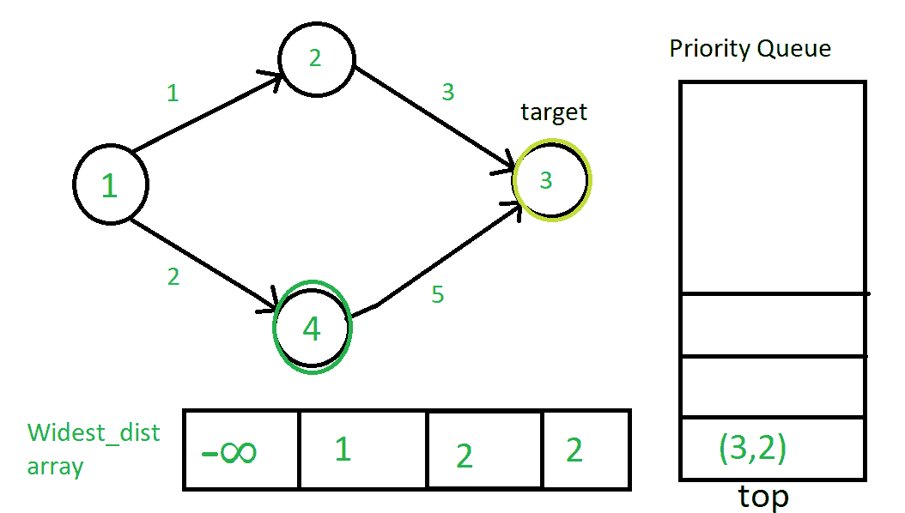
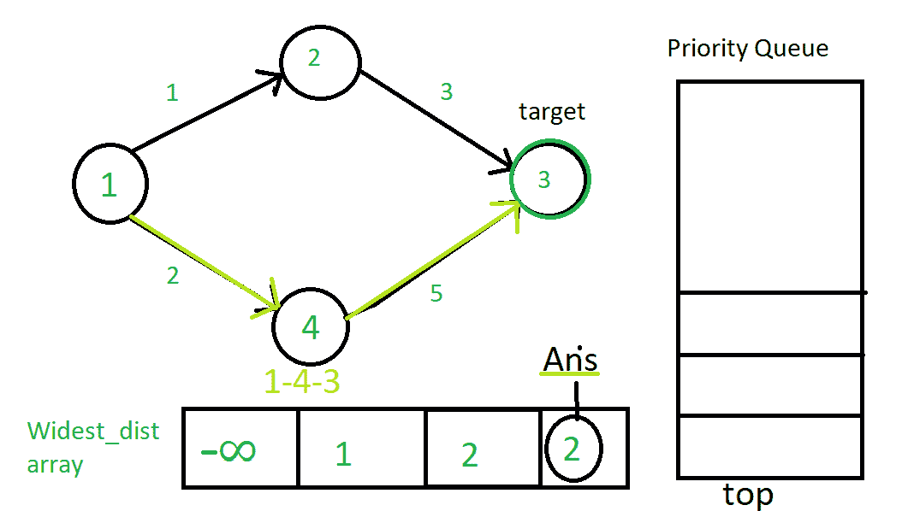

# 最宽路径问题|迪克斯特拉算法的实际应用

> 原文:[https://www . geesforgeks . org/最宽路径-问题-实际应用-dijkstras-算法/](https://www.geeksforgeeks.org/widest-path-problem-practical-application-of-dijkstras-algorithm/)

强烈建议首先使用优先级队列阅读[迪克斯特拉算法。
最宽路径问题是在图的两个顶点之间寻找路径的问题**最大化路径中最小权重边的权重**。请看下图，了解问题的思路:](https://www.geeksforgeeks.org/dijkstras-shortest-path-algorithm-using-priority_queue-stl/) 



**实际应用示例:**
这个问题是 Dijkstra 算法的一个著名变种。在实际应用中，这个问题可以看作是一个以路由器为顶点的图，边代表两个顶点之间的带宽。现在如果我们想在互联网连接中找到两个地方之间的最大带宽路径，那么这个问题可以通过这个算法来解决。
**如何解决这个问题？**
我们将使用 Dijkstra 算法的优先级队列((|E|+|V|)log|V|)实现来解决这个问题，只需稍加改动。
我们通过将 Dijkstra 算法中的松弛条件替换为:
来解决这个问题

> 最大(最小(最宽 _ 距离[u]，重量(u，v))，最宽 _ 距离[v])

其中 u 是 v 的源顶点，v 是我们正在检查条件的当前顶点。
该算法同时适用于有向图和无向图。
查看下面的一系列图像，了解问题和算法:
边上的值代表有向边的权重。



我们将从源顶点开始，然后遍历所有与其相连的顶点，并根据松弛条件加入优先级队列。





现在(2，1)将弹出，2 将是当前的源顶点。



现在(3，1)将从队列中弹出。但是由于 3 没有任何通过有向边的连通顶点，所以什么也不会发生。所以接下来会弹出(4，2)。



最后，算法停止，因为优先级队列中没有更多元素。



最宽距离最大值的路径为 1-4-3，最大瓶颈值为 2。所以我们最终得到最宽的距离 2，到达目标顶点 3。
以下是上述方法的实现:

## 卡片打印处理机（Card Print Processor 的缩写）

```
// C++ implementation of the approach
#include <bits/stdc++.h>
using namespace std;

// Function to print the required path
void printpath(vector<int>& parent, int vertex, int target)
{
    if (vertex == 0) {
        return;
    }

    printpath(parent, parent[vertex], target);

    cout << vertex << (vertex == target ? "\n" : "--");
}

// Function to return the maximum weight
// in the widest path of the given graph
int widest_path_problem(vector<vector<pair<int, int> > >& Graph,
                        int src, int target)
{
    // To keep track of widest distance
    vector<int> widest(Graph.size(), INT_MIN);

    // To get the path at the end of the algorithm
    vector<int> parent(Graph.size(), 0);

    // Use of Minimum Priority Queue to keep track minimum
    // widest distance vertex so far in the algorithm
    priority_queue<pair<int, int>, vector<pair<int, int> >,
                   greater<pair<int, int> > >
        container;

    container.push(make_pair(0, src));

    widest[src] = INT_MAX;

    while (container.empty() == false) {
        pair<int, int> temp = container.top();

        int current_src = temp.second;

        container.pop();

        for (auto vertex : Graph[current_src]) {

            // Finding the widest distance to the vertex
            // using current_source vertex's widest distance
            // and its widest distance so far
            int distance = max(widest[vertex.second],
                               min(widest[current_src], vertex.first));

            // Relaxation of edge and adding into Priority Queue
            if (distance > widest[vertex.second]) {

                // Updating bottle-neck distance
                widest[vertex.second] = distance;

                // To keep track of parent
                parent[vertex.second] = current_src;

                // Adding the relaxed edge in the priority queue
                container.push(make_pair(distance, vertex.second));
            }
        }
    }

    printpath(parent, target, target);

    return widest[target];
}

// Driver code
int main()
{

    // Graph representation
    vector<vector<pair<int, int> > > graph;

    int no_vertices = 4;

    graph.assign(no_vertices + 1, vector<pair<int, int> >());

    // Adding edges to graph

    // Resulting graph
    // 1--2
    // |  |
    // 4--3

    // Note that order in pair is (distance, vertex)
    graph[1].push_back(make_pair(1, 2));
    graph[1].push_back(make_pair(2, 4));
    graph[2].push_back(make_pair(3, 3));
    graph[4].push_back(make_pair(5, 3));

    cout << widest_path_problem(graph, 1, 3);

    return 0;
}
```

## 蟒蛇 3

```
# Python3 implementation of the approach

# Function to print required path
def printpath(parent, vertex, target):

    # global parent
    if (vertex == 0):
        return
    printpath(parent, parent[vertex], target)
    print(vertex ,end="\n" if (vertex == target) else "--")

# Function to return the maximum weight
# in the widest path of the given graph
def widest_path_problem(Graph, src, target):

    # To keep track of widest distance
    widest = [-10**9]*(len(Graph))

    # To get the path at the end of the algorithm
    parent = [0]*len(Graph)

    # Use of Minimum Priority Queue to keep track minimum
    # widest distance vertex so far in the algorithm
    container = []
    container.append((0, src))
    widest[src] = 10**9
    container = sorted(container)
    while (len(container)>0):
        temp = container[-1]
        current_src = temp[1]
        del container[-1]
        for vertex in Graph[current_src]:

            # Finding the widest distance to the vertex
            # using current_source vertex's widest distance
            # and its widest distance so far
            distance = max(widest[vertex[1]],
                           min(widest[current_src], vertex[0]))

            # Relaxation of edge and adding into Priority Queue
            if (distance > widest[vertex[1]]):

                # Updating bottle-neck distance
                widest[vertex[1]] = distance

                # To keep track of parent
                parent[vertex[1]] = current_src

                # Adding the relaxed edge in the priority queue
                container.append((distance, vertex[1]))
                container = sorted(container)
    printpath(parent, target, target)
    return widest[target]

# Driver code
if __name__ == '__main__':

    # Graph representation
    graph = [[] for i in range(5)]
    no_vertices = 4
    # Adding edges to graph

    # Resulting graph
    #1--2
    #|  |
    #4--3

    # Note that order in pair is (distance, vertex)
    graph[1].append((1, 2))
    graph[1].append((2, 4))
    graph[2].append((3, 3))
    graph[4].append((5, 3))

    print(widest_path_problem(graph, 1, 3))

# This code is contributed by mohit kumar 29
```

**Output:** 

```
1--4--3
2
```

**时间复杂度** : O(E * logV)，其中 E 为图中边的总数，V 为图中顶点的总数。
**辅助空间** : O(V)。