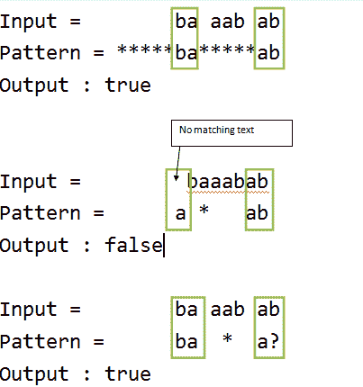

# 通配符模式匹配

> 原文:[https://www.geeksforgeeks.org/wildcard-pattern-matching/](https://www.geeksforgeeks.org/wildcard-pattern-matching/)

给定文本和通配符模式，实现通配符模式匹配算法，以发现通配符模式是否与文本匹配。匹配应该覆盖整个文本(而不是部分文本)。
通配符模式可以包括字符“？”和“*
”？”–匹配任何单个字符
' *–匹配任何字符序列(包括空序列)

**例如**

```
Text = "baaabab",
Pattern = “*****ba*****ab", output : true
Pattern = "baaa?ab", output : true
Pattern = "ba*a?", output : true
Pattern = "a*ab", output : false 
```



每次出现“？”通配符模式中的字符可以替换为任何其他字符，并且每次出现“*”时都可以替换为一系列字符，以便替换后通配符模式与输入字符串相同。

让我们考虑模式中的任何字符。

**情况 1:人物是“***”T2【这里出现两种情况

1.  我们可以忽略“*”字符，转到模式中的下一个字符。
2.  *”字符与文本中的一个或多个字符匹配。这里我们将移动到字符串中的下一个字符。

**案例二:人物是“？”**
我们可以忽略文本中的当前字符，转到模式和文本中的下一个字符。

**情况 3:字符不是通配符**
如果文本中的当前字符与模式中的当前字符匹配，我们将移动到模式和文本中的下一个字符。如果它们不匹配，则通配符模式和文本不匹配。
我们可以使用动态规划来解决这个问题–
如果给定字符串中的第一个 I 字符与模式的第一个 j 字符匹配，则让 **T[i][j]** 为真。

**差压初始化:**

```
// both text and pattern are null
T[0][0] = true; 

// pattern is null
T[i][0] = false; 

// text is null
T[0][j] = T[0][j - 1] if pattern[j – 1] is '*'  
```

**DP 关系:**

```
// If current characters match, result is same as 
// result for lengths minus one. Characters match
// in two cases:
// a) If pattern character is '?' then it matches  
//    with any character of text. 
// b) If current characters in both match
if ( pattern[j – 1] == ‘?’) || 
     (pattern[j – 1] == text[i - 1])
    T[i][j] = T[i-1][j-1]   

// If we encounter ‘*’, two choices are possible-
// a) We ignore ‘*’ character and move to next 
//    character in the pattern, i.e., ‘*’ 
//    indicates an empty sequence.
// b) '*' character matches with ith character in
//     input 
else if (pattern[j – 1] == ‘*’)
    T[i][j] = T[i][j-1] || T[i-1][j]  

else // if (pattern[j – 1] != text[i - 1])
    T[i][j]  = false 
```

下面是上述动态编程方法的实现。

## C++

```
// C++ program to implement wildcard
// pattern matching algorithm
#include <bits/stdc++.h>
using namespace std;

// Function that matches input str with
// given wildcard pattern
bool strmatch(char str[], char pattern[], int n, int m)
{
    // empty pattern can only match with
    // empty string
    if (m == 0)
        return (n == 0);

    // lookup table for storing results of
    // subproblems
    bool lookup[n + 1][m + 1];

    // initialize lookup table to false
    memset(lookup, false, sizeof(lookup));

    // empty pattern can match with empty string
    lookup[0][0] = true;

    // Only '*' can match with empty string
    for (int j = 1; j <= m; j++)
        if (pattern[j - 1] == '*')
            lookup[0][j] = lookup[0][j - 1];

    // fill the table in bottom-up fashion
    for (int i = 1; i <= n; i++) {
        for (int j = 1; j <= m; j++) {
            // Two cases if we see a '*'
            // a) We ignore ‘*’ character and move
            //    to next  character in the pattern,
            //     i.e., ‘*’ indicates an empty sequence.
            // b) '*' character matches with ith
            //     character in input
            if (pattern[j - 1] == '*')
                lookup[i][j]
                    = lookup[i][j - 1] || lookup[i - 1][j];

            // Current characters are considered as
            // matching in two cases
            // (a) current character of pattern is '?'
            // (b) characters actually match
            else if (pattern[j - 1] == '?'
                     || str[i - 1] == pattern[j - 1])
                lookup[i][j] = lookup[i - 1][j - 1];

            // If characters don't match
            else
                lookup[i][j] = false;
        }
    }

    return lookup[n][m];
}

int main()
{
    char str[] = "baaabab";
    char pattern[] = "*****ba*****ab";
    // char pattern[] = "ba*****ab";
    // char pattern[] = "ba*ab";
    // char pattern[] = "a*ab";
    // char pattern[] = "a*****ab";
    // char pattern[] = "*a*****ab";
    // char pattern[] = "ba*ab****";
    // char pattern[] = "****";
    // char pattern[] = "*";
    // char pattern[] = "aa?ab";
    // char pattern[] = "b*b";
    // char pattern[] = "a*a";
    // char pattern[] = "baaabab";
    // char pattern[] = "?baaabab";
    // char pattern[] = "*baaaba*";

    if (strmatch(str, pattern, strlen(str),
                 strlen(pattern)))
        cout << "Yes" << endl;
    else
        cout << "No" << endl;

    return 0;
}
```

## Java 语言(一种计算机语言，尤用于创建网站)

```
// Java program to implement wildcard
// pattern matching algorithm
import java.util.Arrays;
public class GFG {

    // Function that matches input str with
    // given wildcard pattern
    static boolean strmatch(String str, String pattern,
                            int n, int m)
    {
        // empty pattern can only match with
        // empty string
        if (m == 0)
            return (n == 0);

        // lookup table for storing results of
        // subproblems
        boolean[][] lookup = new boolean[n + 1][m + 1];

        // initialize lookup table to false
        for (int i = 0; i < n + 1; i++)
            Arrays.fill(lookup[i], false);

        // empty pattern can match with empty string
        lookup[0][0] = true;

        // Only '*' can match with empty string
        for (int j = 1; j <= m; j++)
            if (pattern.charAt(j - 1) == '*')
                lookup[0][j] = lookup[0][j - 1];

        // fill the table in bottom-up fashion
        for (int i = 1; i <= n; i++)
        {
            for (int j = 1; j <= m; j++)
            {
                // Two cases if we see a '*'
                // a) We ignore '*'' character and move
                //    to next  character in the pattern,
                //     i.e., '*' indicates an empty
                //     sequence.
                // b) '*' character matches with ith
                //     character in input
                if (pattern.charAt(j - 1) == '*')
                    lookup[i][j] = lookup[i][j - 1]
                                   || lookup[i - 1][j];

                // Current characters are considered as
                // matching in two cases
                // (a) current character of pattern is '?'
                // (b) characters actually match
                else if (pattern.charAt(j - 1) == '?'
                         || str.charAt(i - 1)
                                == pattern.charAt(j - 1))
                    lookup[i][j] = lookup[i - 1][j - 1];

                // If characters don't match
                else
                    lookup[i][j] = false;
            }
        }

        return lookup[n][m];
    }

    // Driver code
    public static void main(String args[])
    {
        String str = "baaabab";
        String pattern = "*****ba*****ab";
        // String pattern = "ba*****ab";
        // String pattern = "ba*ab";
        // String pattern = "a*ab";
        // String pattern = "a*****ab";
        // String pattern = "*a*****ab";
        // String pattern = "ba*ab****";
        // String pattern = "****";
        // String pattern = "*";
        // String pattern = "aa?ab";
        // String pattern = "b*b";
        // String pattern = "a*a";
        // String pattern = "baaabab";
        // String pattern = "?baaabab";
        // String pattern = "*baaaba*";

        if (strmatch(str, pattern, str.length(),
                     pattern.length()))
            System.out.println("Yes");
        else
            System.out.println("No");
    }
}
// This code is contributed by Sumit Ghosh
```

## 蟒蛇 3

```
# Python program to implement wildcard
# pattern matching algorithm

# Function that matches input strr with
# given wildcard pattern

def strrmatch(strr, pattern, n, m):

    # empty pattern can only match with
    # empty string
    if (m == 0):
        return (n == 0)

    # lookup table for storing results of
    # subproblems
    lookup = [[False for i in range(m + 1)] for j in range(n + 1)]

    # empty pattern can match with empty string
    lookup[0][0] = True

    # Only '*' can match with empty string
    for j in range(1, m + 1):
        if (pattern[j - 1] == '*'):
            lookup[0][j] = lookup[0][j - 1]

    # fill the table in bottom-up fashion
    for i in range(1, n + 1):
        for j in range(1, m + 1):

            # Two cases if we see a '*'
            # a) We ignore ‘*’ character and move
            # to next character in the pattern,
            # i.e., ‘*’ indicates an empty sequence.
            # b) '*' character matches with ith
            # character in input
            if (pattern[j - 1] == '*'):
                lookup[i][j] = lookup[i][j - 1] or lookup[i - 1][j]

            # Current characters are considered as
            # matching in two cases
            # (a) current character of pattern is '?'
            # (b) characters actually match
            elif (pattern[j - 1] == '?' or strr[i - 1] == pattern[j - 1]):
                lookup[i][j] = lookup[i - 1][j - 1]

            # If characters don't match
            else:
                lookup[i][j] = False

    return lookup[n][m]

# Driver code

strr = "baaabab"
pattern = "*****ba*****ab"
# char pattern[] = "ba*****ab"
# char pattern[] = "ba*ab"
# char pattern[] = "a*ab"
# char pattern[] = "a*****ab"
# char pattern[] = "*a*****ab"
# char pattern[] = "ba*ab****"
# char pattern[] = "****"
# char pattern[] = "*"
# char pattern[] = "aa?ab"
# char pattern[] = "b*b"
# char pattern[] = "a*a"
# char pattern[] = "baaabab"
# char pattern[] = "?baaabab"
# char pattern[] = "*baaaba*"

if (strrmatch(strr, pattern, len(strr), len(pattern))):
    print("Yes")
else:
    print("No")

# This code is contributed by shubhamsingh10
```

## C#

```
// C# program to implement wildcard
// pattern matching algorithm
using System;

class GFG {

    // Function that matches input str with
    // given wildcard pattern
    static Boolean strmatch(String str,
                            String pattern,
                            int n, int m)
    {
        // empty pattern can only match with
        // empty string
        if (m == 0)
            return (n == 0);

        // lookup table for storing results of
        // subproblems
        Boolean[, ] lookup = new Boolean[n + 1, m + 1];

        // initialize lookup table to false
        for (int i = 0; i < n + 1; i++)
            for (int j = 0; j < m + 1; j++)
                lookup[i, j] = false;

        // empty pattern can match with
        // empty string
        lookup[0, 0] = true;

        // Only '*' can match with empty string
        for (int j = 1; j <= m; j++)
            if (pattern[j - 1] == '*')
                lookup[0, j] = lookup[0, j - 1];

        // fill the table in bottom-up fashion
        for (int i = 1; i <= n; i++) {
            for (int j = 1; j <= m; j++) {
                // Two cases if we see a '*'
                // a) We ignore '*'' character and move
                // to next character in the pattern,
                //     i.e., '*' indicates an empty
                //     sequence.
                // b) '*' character matches with ith
                //     character in input
                if (pattern[j - 1] == '*')
                    lookup[i, j] = lookup[i, j - 1]
                                   || lookup[i - 1, j];

                // Current characters are considered as
                // matching in two cases
                // (a) current character of pattern is '?'
                // (b) characters actually match
                else if (pattern[j - 1] == '?'
                         || str[i - 1] == pattern[j - 1])
                    lookup[i, j] = lookup[i - 1, j - 1];

                // If characters don't match
                else
                    lookup[i, j] = false;
            }
        }
        return lookup[n, m];
    }

    // Driver Code
    public static void Main(String[] args)
    {
        String str = "baaabab";
        String pattern = "*****ba*****ab";
        // String pattern = "ba*****ab";
        // String pattern = "ba*ab";
        // String pattern = "a*ab";
        // String pattern = "a*****ab";
        // String pattern = "*a*****ab";
        // String pattern = "ba*ab****";
        // String pattern = "****";
        // String pattern = "*";
        // String pattern = "aa?ab";
        // String pattern = "b*b";
        // String pattern = "a*a";
        // String pattern = "baaabab";
        // String pattern = "?baaabab";
        // String pattern = "*baaaba*";

        if (strmatch(str, pattern, str.Length,
                     pattern.Length))
            Console.WriteLine("Yes");
        else
            Console.WriteLine("No");
    }
}

// This code is contributed by Rajput-Ji
```

**Output**

```
Yes
```

**时间复杂度:**O(m x n)
T3】辅助空间: O(m x n)

**差压记忆溶液:-**

## C++

```
// C++ program to implement wildcard
// pattern matching algorithm
#include <bits/stdc++.h>
using namespace std;

// Function that matches input str with
// given wildcard pattern
vector<vector<int> > dp;
int finding(string& s, string& p, int n, int m)
{
    // return 1 if n and m are negative
    if (n < 0 && m < 0)
        return 1;

    // return 0 if m is negative
    if (m < 0)
        return 0;

    // return n if n is negative
    if (n < 0)
    {
        // while m is positive
        while (m >= 0)
        {
            if (p[m] != '*')
                return 0;
            m--;
        }
        return 1;
    }

    // if dp state is not visited
    if (dp[n][m] == -1)
    {
        if (p[m] == '*')
        {
            return dp[n][m] = finding(s, p, n - 1, m)
                              || finding(s, p, n, m - 1);
        }
        else
        {
            if (p[m] != s[n] && p[m] != '?')
                return dp[n][m] = 0;
            else
                return dp[n][m]
                       = finding(s, p, n - 1, m - 1);
        }
    }

    // return dp[n][m] if dp state is previsited
    return dp[n][m];
}

bool isMatch(string s, string p)
{
    dp.clear();

    // resize the dp array
    dp.resize(s.size() + 1, vector<int>(p.size() + 1, -1));
    return dp[s.size()][p.size()]
           = finding(s, p, s.size() - 1, p.size() - 1);
}

// Driver code
int main()
{
    string str = "baaabab";
    string pattern = "*****ba*****ab";
    // char pattern[] = "ba*****ab";
    // char pattern[] = "ba*ab";
    // char pattern[] = "a*ab";
    // char pattern[] = "a*****ab";
    // char pattern[] = "*a*****ab";
    // char pattern[] = "ba*ab****";
    // char pattern[] = "****";
    // char pattern[] = "*";
    // char pattern[] = "aa?ab";
    // char pattern[] = "b*b";
    // char pattern[] = "a*a";
    // char pattern[] = "baaabab";
    // char pattern[] = "?baaabab";
    // char pattern[] = "*baaaba*";

    if (isMatch(str, pattern))
        cout << "Yes" << endl;
    else
        cout << "No" << endl;

    return 0;
}
```

**Output**

```
Yes
```

**时间复杂度** : O(m x n)。
**辅助空间:** O(m x n)。

**进一步的改进:**
我们可以利用我们只使用最后一行的结果这一事实来提高空间复杂度。
还有一个改进就是可以将模式中连续的‘*’合并成单个‘*’，因为它们的意思是一样的。例如，对于模式“*****ba*****ab”，如果我们合并连续的星星，结果字符串将是“*ba*ab”。所以，m 的值从 14 减少到 6。
本文由**阿迪蒂亚·戈尔**供稿。如果你喜欢极客博客并想投稿，你也可以写一篇文章并把你的文章邮寄到 review-team@geeksforgeeks.org。看到你的文章出现在极客博客主页上，帮助其他极客。
发现有不正确的地方请写评论，或者想分享更多以上讨论话题的信息