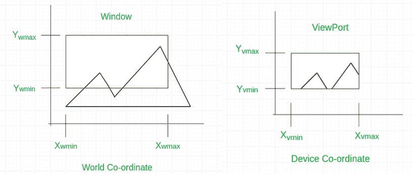
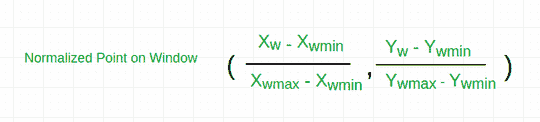
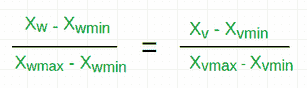
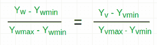
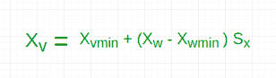
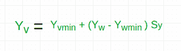
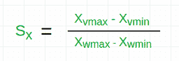
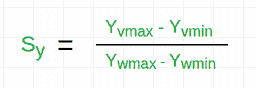

# 计算机图形学中窗口到视口的转换及其实现

> 原文:[https://www . geeksforgeeks . org/windows-to-viewport-transformation-in-computer-graphics-with-implementation/](https://www.geeksforgeeks.org/window-to-viewport-transformation-in-computer-graphics-with-implementation/)

**窗口到视口转换**是将 2D 世界坐标对象转换为设备坐标的过程。世界或剪辑窗口内的对象被映射到视口，视口是屏幕上世界坐标被映射显示的区域。



***<u>通用术语</u> :***

*   **世界坐标–**是我们定义图表的笛卡尔坐标 w.r.t，如 X <sub>wmin</sub> 、X <sub>wmax</sub> 、Y <sub>wmin</sub> 、Y <sub>wmax</sub>
*   **设备坐标–**是要显示对象的屏幕坐标，如 X <sub>vmin</sub> 、X <sub>vmax</sub> 、Y <sub>vmin</sub> 、Y <sub>vmax</sub>
*   **窗口–**是世界坐标上选择显示的区域。
*   **视口–**这是设备坐标上要显示图形的区域。

**<u>窗口到视口的数学计算:</u>**
可能视口的大小比窗口小很多或者大很多。在这些情况下，我们必须根据视口增加或减少窗口的大小，为此，我们需要一些数学计算。

```
(xw, yw): A point on Window
(xv, yv): Corresponding  point on Viewport
```

*   我们要计算点 **(x <sub>v</sub> ，y<sub>v</sub>)**T6】




*   现在，对象在窗口和视口中的相对位置是相同的。

```
For x coordinate,                        
```



```
 For y coordinate,
```



*   所以，在计算 x 和 y 坐标后，我们得到

 

*   其中 s <sub>x</sub> 是 x 坐标的比例因子，s <sub>y</sub> 是 y 坐标的比例因子

 

**例:**
假设，

*   对于窗口，**x<sub>【wmin】</sub>= 20，x<sub>【wmax】</sub>= 80，y<sub>【wmin】</sub>= 40，y<sub>【wmax】</sub>= 80**。
*   对于视口， **X <sub>vmin</sub> = 30，X <sub>vmax</sub> = 60，Y <sub>vmin</sub> = 40，Y <sub>vmax</sub> = 60** 。
*   现在一个点(X <sub>w</sub> ，Y <sub>w</sub> )在窗户上(30，80)。我们要在视口
    上计算那个点，即 **( X <sub>v</sub> ，Y <sub>v</sub> )** 。
*   首先利用上述公式计算出 x 坐标 S <sub>x</sub> 的比例因子和 y 坐标 S <sub>y</sub> 的比例因子。

```
Sx = ( 60 - 30 ) / ( 80 - 20 ) = 30 / 60
Sy = ( 60 - 40 ) / ( 80 - 40 ) = 20 / 40
```

*   所以，现在计算视口上的点(X <sub>v</sub> ，Y <sub>v</sub> )。

```
Xv = 30 + ( 30 - 20 ) * ( 30 / 60 ) = 35
Yv = 40 + ( 80 - 40 ) * ( 20 / 40 ) = 60
```

*   所以，窗口上的点(X <sub>w</sub> ，Y <sub>w</sub> ) = ( 30，80)将是视口上的 **( X <sub>v</sub> ，Y <sub>v</sub> ) = ( 35，60 )** 。

下面是上述方法的实现:

## C++

```
// C++ program to implement
// Window to ViewPort Transformation

#include <iostream>
using namespace std;

// Function for window to viewport transformation
void WindowtoViewport(int x_w, int y_w, int x_wmax,
                      int y_wmax, int x_wmin, int y_wmin,
                      int x_vmax, int y_vmax, int x_vmin,
                      int y_vmin)
{
    // point on viewport
    int x_v, y_v;

    // scaling factors for x coordinate and y coordinate
    float sx, sy;

    // calculating Sx and Sy
    sx = (float)(x_vmax - x_vmin) / (x_wmax - x_wmin);
    sy = (float)(y_vmax - y_vmin) / (y_wmax - y_wmin);

    // calculating the point on viewport
    x_v = x_vmin + (float)((x_w - x_wmin) * sx);
    y_v = y_vmin + (float)((y_w - y_wmin) * sy);

    cout<< "The point on viewport: ("<<x_v  <<","<< y_v<<")" ;
}

// Driver Code
int main()
{
    // boundary values for window
    int x_wmax = 80, y_wmax = 80, x_wmin = 20, y_wmin = 40;

    // boundary values for viewport
    int x_vmax = 60, y_vmax = 60, x_vmin = 30, y_vmin = 40;

    // point on window
    int x_w = 30, y_w = 80;

    WindowtoViewport(30, 80, 80, 80, 20, 40, 60, 60, 30, 40);
}

// This code is contributed by khusboogoyal499.
```

## C

```
// C program to implement
// Window to ViewPort Transformation

#include <stdio.h>

// Function for window to viewport transformation
void WindowtoViewport(int x_w, int y_w, int x_wmax,
                      int y_wmax, int x_wmin, int y_wmin,
                      int x_vmax, int y_vmax, int x_vmin,
                      int y_vmin)
{
    // point on viewport
    int x_v, y_v;

    // scaling factors for x coordinate and y coordinate
    float sx, sy;

    // calculating Sx and Sy
    sx = (float)(x_vmax - x_vmin) / (x_wmax - x_wmin);
    sy = (float)(y_vmax - y_vmin) / (y_wmax - y_wmin);

    // calculating the point on viewport
    x_v = x_vmin + (float)((x_w - x_wmin) * sx);
    y_v = y_vmin + (float)((y_w - y_wmin) * sy);

    printf("The point on viewport: (%d, %d )\n ", x_v, y_v);
}

// Driver Code
void main()
{
    // boundary values for window
    int x_wmax = 80, y_wmax = 80, x_wmin = 20, y_wmin = 40;

    // boundary values for viewport
    int x_vmax = 60, y_vmax = 60, x_vmin = 30, y_vmin = 40;

    // point on window
    int x_w = 30, y_w = 80;

    WindowtoViewport(30, 80, 80, 80, 20, 40, 60, 60, 30, 40);
}

//this code is added by khushboogoyal499
```

## Java 语言(一种计算机语言，尤用于创建网站)

```
// Java program to implement
// Window to ViewPort Transformation
class GFG
{

// Function for window to viewport transformation
static void WindowtoViewport(int x_w, int y_w, int x_wmax,
                    int y_wmax, int x_wmin, int y_wmin,
                    int x_vmax, int y_vmax, int x_vmin,
                    int y_vmin)
{
    // point on viewport
    int x_v, y_v;

    // scaling factors for x coordinate and y coordinate
    float sx, sy;

    // calculating Sx and Sy
    sx = (float)(x_vmax - x_vmin) / (x_wmax - x_wmin);
    sy = (float)(y_vmax - y_vmin) / (y_wmax - y_wmin);

    // calculating the point on viewport
    x_v = (int) (x_vmin + (float)((x_w - x_wmin) * sx));
    y_v = (int) (y_vmin + (float)((y_w - y_wmin) * sy));

    System.out.printf("The point on viewport: (%d, %d )\n ", x_v, y_v);
}

// Driver Code
public static void main(String[] args)
{

    // boundary values for window
    int x_wmax = 80, y_wmax = 80, x_wmin = 20, y_wmin = 40;

    // boundary values for viewport
    int x_vmax = 60, y_vmax = 60, x_vmin = 30, y_vmin = 40;

    // point on window
    int x_w = 30, y_w = 80;

    WindowtoViewport(30, 80, 80, 80, 20, 40, 60, 60, 30, 40);
}
}

// This code is contributed by Rajput-Ji
```

## 蟒蛇 3

```
# Python3 program to implement
# Window to ViewPort Transformation

# Function for window to viewport transformation
def WindowtoViewport(x_w, y_w, x_wmax, y_wmax,
                       x_wmin, y_wmin, x_vmax,
                       y_vmax, x_vmin, y_vmin):

    # point on viewport
    # calculating Sx and Sy
    sx = (x_vmax - x_vmin) / (x_wmax - x_wmin)
    sy = (y_vmax - y_vmin) / (y_wmax - y_wmin)

    # calculating the point on viewport
    x_v = x_vmin + ((x_w - x_wmin) * sx)
    y_v = y_vmin + ((y_w - y_wmin) * sy)

    print("The point on viewport:(", int(x_v),
                                ",", int(y_v), ")")

# Driver Code
if __name__ == '__main__':

    # boundary values for window
    x_wmax = 80
    y_wmax = 80
    x_wmin = 20
    y_wmin = 40

    # boundary values for viewport
    x_vmax = 60
    y_vmax = 60
    x_vmin = 30
    y_vmin = 40

    # point on window
    x_w = 30
    y_w = 80

    WindowtoViewport(30, 80, 80, 80, 20,
                     40, 60, 60, 30, 40)

# This code is contributed by Surendra_Gangwar
```

## C#

```
// C# program to implement
// Window to ViewPort Transformation
using System;

class GFG
{

// Function for window to viewport transformation
static void WindowtoViewport(int x_w, int y_w,
                             int x_wmax, int y_wmax,
                             int x_wmin, int y_wmin,
                             int x_vmax, int y_vmax,
                             int x_vmin, int y_vmin)
{
    // point on viewport
    int x_v, y_v;

    // scaling factors for x coordinate
    // and y coordinate
    float sx, sy;

    // calculating Sx and Sy
    sx = (float)(x_vmax - x_vmin) /
                (x_wmax - x_wmin);
    sy = (float)(y_vmax - y_vmin) /
                (y_wmax - y_wmin);

    // calculating the point on viewport
    x_v = (int) (x_vmin +
        (float)((x_w - x_wmin) * sx));
    y_v = (int) (y_vmin +
        (float)((y_w - y_wmin) * sy));

    Console.Write("The point on viewport: " +
                 "({0}, {1} )\n ", x_v, y_v);
}

// Driver Code
public static void Main(String[] args)
{

    // boundary values for window
    int x_wmax = 80, y_wmax = 80,
        x_wmin = 20, y_wmin = 40;

    // boundary values for viewport
    int x_vmax = 60, y_vmax = 60,
        x_vmin = 30, y_vmin = 40;

    // point on window
    int x_w = 30, y_w = 80;

    WindowtoViewport(30, 80, 80, 80, 20,
                     40, 60, 60, 30, 40);
}
}

// This code is contributed by PrinciRaj1992
```

## java 描述语言

```
<script>
// Javascript program to implement
// Window to ViewPort Transformation

// Function for window to viewport transformation
function WindowtoViewport(x_w, y_w, x_wmax,y_wmax, x_wmin,
                    y_wmin,x_vmax, y_vmax, x_vmin,y_vmin)
{
    // point on viewport
    let x_v, y_v;

    // scaling factors for x coordinate and y coordinate
    let sx, sy;

    // calculating Sx and Sy
    sx = (x_vmax - x_vmin) / (x_wmax - x_wmin);
    sy = (y_vmax - y_vmin) / (y_wmax - y_wmin);

    // calculating the point on viewport
    x_v = x_vmin + ((x_w - x_wmin) * sx);
    y_v = y_vmin + ((y_w - y_wmin) * sy);

    document.write("The point on viewport: (" + x_v + ", "
                                + y_v + " )<br>");
}

// Driver Code
    // boundary values for window
    let x_wmax = 80, y_wmax = 80, x_wmin = 20, y_wmin = 40;

    // boundary values for viewport
    let x_vmax = 60, y_vmax = 60, x_vmin = 30, y_vmin = 40;

    // point on window
    let x_w = 30, y_w = 80;

    WindowtoViewport(30, 80, 80, 80, 20, 40, 60, 60, 30, 40);

</script>
```

**Output:** 

```
The point on viewport: (35, 60 )
```