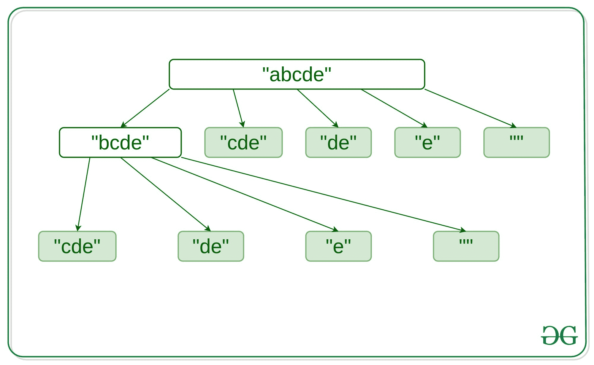

# 断字问题| DP-32 | Set–2

> 原文:[https://www . geesforgeks . org/word-break-problem-DP-32-set-2/](https://www.geeksforgeeks.org/word-break-problem-dp-32-set-2/)

给定一个非空序列 **S** 和一个包含非空单词列表的字典**dict【】**，打印所有可能的方法来打断单个字典单词中的句子。
**例:**

> **输入:** S =【猫沙狗】
> dict[] = {“猫”“猫”“和”“沙”“狗”}
> **输出:**
> 【猫狗】
> 【猫沙狗】
> **输入:**S =“pineappleppenapple”
> dict[]= {“苹果”“笔”“苹果笔”“松树”“菠萝”}
> **输出:**
> “松树苹果笔苹果”

在[这篇](https://www.google.com/url?client=internal-element-cse&cx=009682134359037907028:tj6eafkv_be&q=https://www.geeksforgeeks.org/word-break-problem-dp-32/&sa=U&ved=2ahUKEwi5p6rt4PfoAhXS6nMBHdExC8AQFjAAegQIAhAB&usg=AOvVaw0y2qpfXcC5JjCedKX6ub5n)文章中讨论了一个类似的问题，任务是检查是否有任何解决方案，以便序列可以分解成字典单词。
**方法:**想法是检查从任何位置开始的每个子串 **I** ，这样它在字典中存在的字符串长度处结束，然后简单地递归子串【0，I】。同时，为每个子串存储重叠的子问题，避免子问题的再次计算。重叠子问题可以显示如下–



以下是上述方法的实现:

## C++

```
// C++ implementation to break
// a sequence into the words of
// the dictionary

#include <bits/stdc++.h>

using namespace std;

// Unordered_map used for storing
// the sentences the key string
// can be broken into
unordered_map<string,
            vector<string> > mp;

// Unordered_set used
// to store the dictionary.
unordered_set<string> dict;

// Utility function used for
// printing the obtained result
void printResult(vector<string> A)
{
    for (int i = 0; i < A.size(); i++)
        cout << A[i] << '\n';
}

// Utility function for
// appending new words
// to already existing strings
vector<string> combine(
     vector<string> prev, string word){

    // Loop to find the append string
    // which can be broken into
    for (int i = 0; i < prev.size(); i++) {
        prev[i] += " " + word;
    }
    return prev;
}

// Utility function for word Break
vector<string> wordBreakUtil(string s)
{  
    // Condition to check if the
    // subproblem is already computed
    if (mp.find(s) != mp.end())
        return mp[s];
    vector<string> res;

    // If the whole word is a dictionary
    // word then directly append into
    // the result array for the string
    if (dict.find(s) != dict.end())
        res.push_back(s);

    // Loop to iterate over the substring
    for (int i = 1; i < s.length(); i++) {
        string word = s.substr(i);

        // If the substring is present into
        // the dictionary then recurse for
        // other substring of the string
        if (dict.find(word) != dict.end()) {
            string rem = s.substr(0, i);
            vector<string> prev =
             combine(wordBreakUtil(rem), word);
            res.insert(res.end(),
                 prev.begin(), prev.end());
        }
    }

    // Store the subproblem
    // into the map
    mp[s] = res;
    return res;
}

// Master wordBreak function converts
// the string vector to unordered_set
vector<string> wordBreak(string s,
             vector<string>& wordDict)
{
    // Clear the previous stored data
    mp.clear();
    dict.clear();
    dict.insert(wordDict.begin(), wordDict.end());
    return wordBreakUtil(s);
}

// Driver Code
int main()
{
    vector<string> wordDict1 = {
        "cat", "cats", "and", "sand", "dog" };
    printResult(wordBreak("catsanddog", wordDict1));
    return 0;
}
```

## 蟒蛇 3

```
# Python3 implementation to break
# a sequence into the words of
# the dictionary

# Unordered_map used for storing
# the sentences the key string
# can be broken into
mp = dict()

# Unordered_set used
# to store the dictionary.
dict_t = set()

# Utility function used for
# printing the obtained result
def printResult(A):

    for i in range(len(A)):
        print(A[i])

# Utility function for
# appending new words
# to already existing strings
def combine( prev, word):

    # Loop to find the append string
    # which can be broken into
    for i in range(len(prev)):

        prev[i] += " " + word;

    return prev;

# Utility function for word Break
def wordBreakUtil(s):

    # Condition to check if the
    # subproblem is already computed
    if (s in mp):
        return mp[s];

    res = []

    # If the whole word is a dictionary
    # word then directly append into
    # the result array for the string
    if (s in dict_t):
        res.append(s);

    # Loop to iterate over the substring
    for i in range(1, len(s)):

        word = s[i:];

        # If the substring is present into
        # the dictionary then recurse for
        # other substring of the string
        if (word in dict_t):

            rem = s[:i]
            prev = combine(wordBreakUtil(rem), word);
            for i in prev:
                res.append(i)

    # Store the subproblem
    # into the map
    #res is an reference so we need to assign an reference to something if its keep on changing
    #res values changes after it start going through combine method
    #you can check if you had a doubt so here we just clone res
    x=[]
    for i in res:
      x.append(i)
    mp[s] = x;
    return res;

# Master wordBreak function converts
# the string vector to unordered_set
def wordBreak(s,  wordDict):

    # Clear the previous stored data
    mp.clear();
    dict_t.clear();
    for i in wordDict:
        dict_t.add(i)
    return wordBreakUtil(s);

# Driver Code
if __name__=='__main__':

    wordDict1 = ["cat", "cats", "and", "sand", "dog" ]
    printResult(wordBreak("catsanddog", wordDict1));

# This code is contributed by rutvik_56
```

**Output:** 

```
cat sand dog
cats and dog
```

**时间复杂度:** O(2^N)，其中 n 是给定字符串的长度。
**辅助空间:** O(S + N)。其中 S 是单词字典 1 中所有字符的总和。