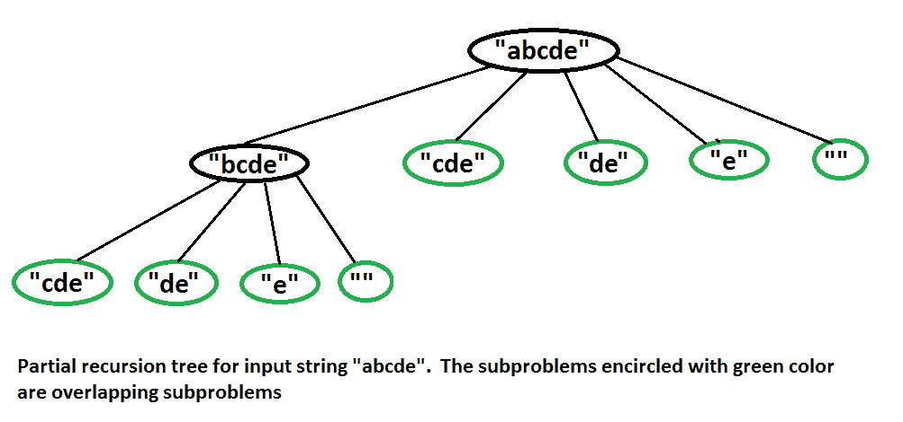

# 断字问题| DP-32

> 原文:[https://www.geeksforgeeks.org/word-break-problem-dp-32/](https://www.geeksforgeeks.org/word-break-problem-dp-32/)

给定一个输入字符串和一个单词字典，找出输入字符串是否可以被分割成一个用空格分隔的字典单词序列。有关更多详细信息，请参见以下示例。
这是一个著名的谷歌面试问题，现在一天之内也被很多其他公司问到。

```
Consider the following dictionary 
{ i, like, sam, sung, samsung, mobile, ice, 
  cream, icecream, man, go, mango}

Input:  ilike
Output: Yes 
The string can be segmented as "i like".

Input:  ilikesamsung
Output: Yes
The string can be segmented as "i like samsung" 
or "i like sam sung".
```

**递归实现:**
思路很简单，我们考虑每个前缀，在字典中搜索。如果前缀出现在字典中，我们会对字符串的其余部分(或后缀)重复使用。

## 蟒蛇 3

```
def wordBreak(wordList, word):
    if word == '':
        return True
    else:
        wordLen = len(word)
        return any([(word[:i] in wordList) and wordBreak(wordList, word[i:]) for i in range(1, wordLen+1)])
```

**Output**

如果后缀的递归调用返回真，我们返回真，否则我们尝试下一个前缀。如果我们尝试了所有前缀，但没有一个找到解决方案，我们返回 false。
我们强烈建议查看 [**substr**](http://www.cplusplus.com/reference/string/string/substr/) 函数，该函数在以下实现中被广泛使用。

## C++

```
// A recursive program to test whether a given
// string can be segmented into space separated
// words in dictionary
#include <iostream>
using namespace std;

/* A utility function to check whether a word is
  present in dictionary or not. An array of strings
  is used for dictionary.  Using array of strings for
  dictionary is definitely not a good idea. We have
  used for simplicity of the program*/
int dictionaryContains(string word)
{
    string dictionary[] = {"mobile","samsung","sam","sung",
                            "man","mango","icecream","and",
                             "go","i","like","ice","cream"};
    int size = sizeof(dictionary)/sizeof(dictionary[0]);
    for (int i = 0; i < size; i++)
        if (dictionary[i].compare(word) == 0)
           return true;
    return false;
}

// returns true if string can be segmented into space
// separated words, otherwise returns false
bool wordBreak(string str)
{
    int size = str.size();

    // Base case
    if (size == 0)  return true;

    // Try all prefixes of lengths from 1 to size
    for (int i=1; i<=size; i++)
    {
        // The parameter for dictionaryContains is
        // str.substr(0, i) which is prefix (of input
        // string) of length 'i'. We first check whether
        // current prefix is in  dictionary. Then we
        // recursively check for remaining string
        // str.substr(i, size-i) which is suffix of 
        // length size-i
        if (dictionaryContains( str.substr(0, i) ) &&
            wordBreak( str.substr(i, size-i) ))
            return true;
    }

    // If we have tried all prefixes and
    // none of them worked
    return false;
}

// Driver program to test above functions
int main()
{
    wordBreak("ilikesamsung")? cout <<"Yes\n": cout << "No\n";
    wordBreak("iiiiiiii")? cout <<"Yes\n": cout << "No\n";
    wordBreak("")? cout <<"Yes\n": cout << "No\n";
    wordBreak("ilikelikeimangoiii")? cout <<"Yes\n": cout << "No\n";
    wordBreak("samsungandmango")? cout <<"Yes\n": cout << "No\n";
    wordBreak("samsungandmangok")? cout <<"Yes\n": cout << "No\n";
    return 0;
}
```

## Java 语言(一种计算机语言，尤用于创建网站)

```
import java.util.*;

// Recursive implementation of
// word break problem in java
public class WordBreakProblem
{

    // set to hold dictionary values
    private static Set<String> dictionary = new HashSet<>();

    public static void main(String []args)
    {

        // array of strings to be added in dictionary set.
        String temp_dictionary[] = {"mobile","samsung","sam","sung",
                            "man","mango","icecream","and",
                            "go","i","like","ice","cream"};

        // loop to add all strings in dictionary set
        for (String temp :temp_dictionary)
        {
            dictionary.add(temp);
        }

        // sample input cases
        System.out.println(wordBreak("ilikesamsung"));
        System.out.println(wordBreak("iiiiiiii"));
        System.out.println(wordBreak(""));
        System.out.println(wordBreak("ilikelikeimangoiii"));
        System.out.println(wordBreak("samsungandmango"));
        System.out.println(wordBreak("samsungandmangok"));

    }

    // returns true if the word can be segmented into parts such
    // that each part is contained in dictionary
    public static boolean wordBreak(String word)
    {
        int size = word.length();

        // base case
        if (size == 0)
        return true;

        //else check for all words
        for (int i = 1; i <= size; i++)
        {
            // Now we will first divide the word into two parts ,
            // the prefix will have a length of i and check if it is
            // present in dictionary ,if yes then we will check for
            // suffix of length size-i recursively. if both prefix and
            // suffix are present the word is found in dictionary.

            if (dictionary.contains(word.substring(0,i)) &&
                    wordBreak(word.substring(i,size)))
            return true;
        }

        // if all cases failed then return false
        return false;
    }
}

// This code is contributed by Sparsh Singhal
```

**Output**

```
Yes
Yes
Yes
Yes
Yes
No
```

**动态规划**
为什么要动态规划？上述问题呈现出重叠的子问题。例如，在最坏的情况下，请参见下面字符串“abcde”的部分递归树。



## 卡片打印处理机（Card Print Processor 的缩写）

```
// A Dynamic Programming based program to test whether a given string can
// be segmented into space separated words in dictionary
#include <iostream>
#include <string.h>
using namespace std;

/* A utility function to check whether a word is present in dictionary or not.
  An array of strings is used for dictionary.  Using array of strings for
  dictionary is definitely not a good idea. We have used for simplicity of
  the program*/
int dictionaryContains(string word)
{
    string dictionary[] = {"mobile","samsung","sam","sung","man","mango",
                           "icecream","and","go","i","like","ice","cream"};
    int size = sizeof(dictionary)/sizeof(dictionary[0]);
    for (int i = 0; i < size; i++)
        if (dictionary[i].compare(word) == 0)
           return true;
    return false;
}

// Returns true if string can be segmented into space separated
// words, otherwise returns false
bool wordBreak(string str)
{
    int size = str.size();
    if (size == 0)   return true;

    // Create the DP table to store results of subroblems. The value wb[i]
    // will be true if str[0..i-1] can be segmented into dictionary words,
    // otherwise false.
    bool wb[size+1];
    memset(wb, 0, sizeof(wb)); // Initialize all values as false.

    for (int i=1; i<=size; i++)
    {
        // if wb[i] is false, then check if current prefix can make it true.
        // Current prefix is "str.substr(0, i)"
        if (wb[i] == false && dictionaryContains( str.substr(0, i) ))
            wb[i] = true;

        // wb[i] is true, then check for all substrings starting from
        // (i+1)th character and store their results.
        if (wb[i] == true)
        {
            // If we reached the last prefix
            if (i == size)
                return true;

            for (int j = i+1; j <= size; j++)
            {
                // Update wb[j] if it is false and can be updated
                // Note the parameter passed to dictionaryContains() is
                // substring starting from index 'i' and length 'j-i'
                if (wb[j] == false && dictionaryContains( str.substr(i, j-i) ))
                    wb[j] = true;

                // If we reached the last character
                if (j == size && wb[j] == true)
                    return true;
            }
        }
    }

    /* Uncomment these lines to print DP table "wb[]"
     for (int i = 1; i <= size; i++)
        cout << " " << wb[i]; */

    // If we have tried all prefixes and none of them worked
    return false;
}

// Driver program to test above functions
int main()
{
    wordBreak("ilikesamsung")? cout <<"Yes\n": cout << "No\n";
    wordBreak("iiiiiiii")? cout <<"Yes\n": cout << "No\n";
    wordBreak("")? cout <<"Yes\n": cout << "No\n";
    wordBreak("ilikelikeimangoiii")? cout <<"Yes\n": cout << "No\n";
    wordBreak("samsungandmango")? cout <<"Yes\n": cout << "No\n";
    wordBreak("samsungandmangok")? cout <<"Yes\n": cout << "No\n";
    return 0;
}
```

**Output**

```
Yes
Yes
Yes
Yes
Yes
No
```

**优化动态规划** :
在这种方法中，除了 dp 表之外，我们还维护了之前匹配的所有索引。然后我们将检查从这些索引到当前索引的子字符串。如果其中任何一个匹配，那么我们可以将字符串划分到该索引。
在这个程序中，我们使用了一些额外的空间。然而，它的时间复杂度是 O(n*s)，其中 s 是字典中最大字符串的长度，n 是给定字符串的长度。

## 卡片打印处理机（Card Print Processor 的缩写）

```
// A Dynamic Programming based program to test
// whether a given string can  be segmented into
// space separated words in dictionary
#include <bits/stdc++.h>
using namespace std;

/* A utility function to check whether a word
   is present in dictionary or not. An array of
   strings is used for dictionary.  Using array
   of strings for dictionary is definitely not
   a good idea. We have used for simplicity of
   the program*/
int dictionaryContains(string word)
{
    string dictionary[]
        = { "mobile", "samsung",  "sam",  "sung", "man",
            "mango",  "icecream", "and",  "go",   "i",
            "like",   "ice",      "cream" };
    int size = sizeof(dictionary) / sizeof(dictionary[0]);
    for (int i = 0; i < size; i++)
        if (dictionary[i].compare(word) == 0)
            return true;
    return false;
}

// Returns true if string can be segmented into space
// separated words, otherwise returns false
bool wordBreak(string s)
{
    int n = s.size();
    if (n == 0)
        return true;

    // Create the DP table to store results of subroblems.
    // The value dp[i] will be true if str[0..i] can be
    // segmented into dictionary words, otherwise false.
    vector<bool> dp(n + 1, 0); // Initialize all values
    // as false.

    // matched_index array represents the indexes for which
    // dp[i] is true. Initially only -1 element is present
    // in this array.
    vector<int> matched_index;
    matched_index.push_back(-1);

    for (int i = 0; i < n; i++) {
        int msize = matched_index.size();

        // Flag value which tells that a substring matches
        // with given words or not.
        int f = 0;

        // Check all the substring from the indexes matched
        // earlier. If any of that substring matches than
        // make flag value = 1;
        for (int j = msize - 1; j >= 0; j--) {

            // sb is substring starting from
            // matched_index[j]
            // + 1  and of length i - matched_index[j]
            string sb = s.substr(matched_index[j] + 1,
                                 i - matched_index[j]);

            if (dictionaryContains(sb)) {
                f = 1;
                break;
            }
        }

        // If substring matches than do dp[i] = 1 and
        // push that index in matched_index array.
        if (f == 1) {
            dp[i] = 1;
            matched_index.push_back(i);
        }
    }
    return dp[n - 1];
}

// Driver code
int main()
{
    wordBreak("ilikesamsung") ? cout << "Yes\n"
                              : cout << "No\n";
    wordBreak("iiiiiiii") ? cout << "Yes\n"
                          : cout << "No\n";
    wordBreak("") ? cout << "Yes\n" : cout << "No\n";
    wordBreak("ilikelikeimangoiii") ? cout << "Yes\n"
                                    : cout << "No\n";
    wordBreak("samsungandmango") ? cout << "Yes\n"
                                 : cout << "No\n";
    wordBreak("samsungandmangok") ? cout << "Yes\n"
                                  : cout << "No\n";
    return 0;
}
```

## Java 语言(一种计算机语言，尤用于创建网站)

```
import java.io.*;
import java.util.*;

class GFG {

  public static boolean wordBreak(String s, List<String> dictionary) {
        // create a dp table to store results of subproblems
        // value of dp[i] will be true if string s can be segemented
        // into dictionary words from 0 to i.
        boolean[] dp = new boolean[s.length() + 1];

        // dp[0] is true because an empty string can always be segmented.
        dp[0] = true;

        for(int i = 0; i <= s.length(); i++){
            for(int j = 0; j < i; j++){
                if(dp[j] && dictionary.contains(s.substring(j, i))){
                    dp[i] = true;
                    break;
                }
            }
        }
        return dp[s.length()];
    }

    public static void main (String[] args) {
      String[] dictionary = { "mobile", "samsung",  "sam",  "sung", "man",
                "mango",  "icecream", "and",  "go",   "i",
                "like",   "ice",      "cream" };

        List<String> dict = new ArrayList<>();
        for(String s : dictionary){
            dict.add(s);
        }

        if (wordBreak("ilikesamsung", dict)) {
            System.out.println("Yes");
        } else {
            System.out.println("No");
        }
        if (wordBreak("iiiiiiii", dict)) {
            System.out.println("Yes");
        } else {
            System.out.println("No");
        }
        if (wordBreak("", dict)) {
            System.out.println("Yes");
        } else {
            System.out.println("No");
        }
        if (wordBreak("samsungandmango", dict)) {
            System.out.println("Yes");
        } else {
            System.out.println("No");
        }
        if (wordBreak("ilikesamsung", dict)) {
            System.out.println("Yes");
        } else {
            System.out.println("No");
        }
        if (wordBreak("samsungandmangok", dict)) {
            System.out.println("Yes");
        } else {
            System.out.println("No");
        }

    }
}
```

**Output**

```
Yes
Yes
Yes
Yes
Yes
No
```

[**断字问题| (Trie 解法)**](https://www.geeksforgeeks.org/word-break-problem-trie-solution/)
**练习:**
以上解法只找出给定字符串是否可以分段。扩展上述动态编程解决方案，以打印输入字符串的所有可能的分区。
示例:

```
Input: ilikeicecreamandmango
Output: 
i like ice cream and man go
i like ice cream and mango
i like icecream and man go
i like icecream and mango

Input: ilikesamsungmobile
Output:
i like sam sung mobile
i like samsung mobile
```

关于练习的解决方案，请参考下面的帖子。
[使用回溯法的断字问题](https://www.geeksforgeeks.org/word-break-problem-using-backtracking/)
如果发现有不正确的地方，请写评论，或者想分享更多关于上面讨论的话题的信息