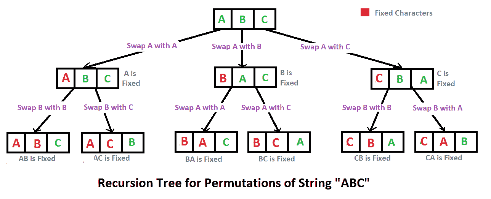

# 编写程序打印给定字符串的所有排列

> 原文:[https://www . geeksforgeeks . org/write-a-c-program-to-print-给定字符串的所有排列/](https://www.geeksforgeeks.org/write-a-c-program-to-print-all-permutations-of-a-given-string/)

排列也称为“排列数”或“顺序”，是将有序列表 S 的元素重新排列成与 S 本身一一对应的关系。长度为 n 的字符串有 n！排列。

资料来源:mathword([http://mathworld . wolfram . com/switching . html](http://mathworld.wolfram.com/Permutation.html)

以下是字符串 ABC 的排列。
中航 ACB 北汽 BCA CBA CAB

这里有一个解决方案，作为回溯的基础。



## C++

```
// C++ program to print all
// permutations with duplicates allowed
#include <bits/stdc++.h>
using namespace std;

// Function to print permutations of string
// This function takes three parameters:
// 1\. String
// 2\. Starting index of the string
// 3\. Ending index of the string.
void permute(string a, int l, int r)
{
    // Base case
    if (l == r)
        cout<<a<<endl;
    else
    {
        // Permutations made
        for (int i = l; i <= r; i++)
        {

            // Swapping done
            swap(a[l], a[i]);

            // Recursion called
            permute(a, l+1, r);

            //backtrack
            swap(a[l], a[i]);
        }
    }
}

// Driver Code
int main()
{
    string str = "ABC";
    int n = str.size();
    permute(str, 0, n-1);
    return 0;
}

// This is code is contributed by rathbhupendra
```

## C

```
// C program to print all permutations with duplicates allowed
#include <stdio.h>
#include <string.h>

/* Function to swap values at two pointers */
void swap(char *x, char *y)
{
    char temp;
    temp = *x;
    *x = *y;
    *y = temp;
}

/* Function to print permutations of string
This function takes three parameters:
1\. String
2\. Starting index of the string
3\. Ending index of the string. */
void permute(char *a, int l, int r)
{
int i;
if (l == r)
    printf("%s\n", a);
else
{
    for (i = l; i <= r; i++)
    {
        swap((a+l), (a+i));
        permute(a, l+1, r);
        swap((a+l), (a+i)); //backtrack
    }
}
}

/* Driver program to test above functions */
int main()
{
    char str[] = "ABC";
    int n = strlen(str);
    permute(str, 0, n-1);
    return 0;
}
```

## Java 语言(一种计算机语言，尤用于创建网站)

```
// Java program to print all permutations of a
// given string.
public class Permutation
{
    public static void main(String[] args)
    {
        String str = "ABC";
        int n = str.length();
        Permutation permutation = new Permutation();
        permutation.permute(str, 0, n-1);
    }

    /**
    * permutation function
    * @param str string to calculate permutation for
    * @param l starting index
    * @param r end index
    */
    private void permute(String str, int l, int r)
    {
        if (l == r)
            System.out.println(str);
        else
        {
            for (int i = l; i <= r; i++)
            {
                str = swap(str,l,i);
                permute(str, l+1, r);
                str = swap(str,l,i);
            }
        }
    }

    /**
    * Swap Characters at position
    * @param a string value
    * @param i position 1
    * @param j position 2
    * @return swapped string
    */
    public String swap(String a, int i, int j)
    {
        char temp;
        char[] charArray = a.toCharArray();
        temp = charArray[i] ;
        charArray[i] = charArray[j];
        charArray[j] = temp;
        return String.valueOf(charArray);
    }

}

// This code is contributed by Mihir Joshi
```

## 计算机编程语言

```
# Python program to print all permutations with
# duplicates allowed

def toString(List):
    return ''.join(List)

# Function to print permutations of string
# This function takes three parameters:
# 1\. String
# 2\. Starting index of the string
# 3\. Ending index of the string.
def permute(a, l, r):
    if l==r:
        print toString(a)
    else:
        for i in xrange(l,r+1):
            a[l], a[i] = a[i], a[l]
            permute(a, l+1, r)
            a[l], a[i] = a[i], a[l] # backtrack

# Driver program to test the above function
string = "ABC"
n = len(string)
a = list(string)
permute(a, 0, n-1)

# This code is contributed by Bhavya Jain
```

## C#

```
// C# program to print all
// permutations of a given string.
using System;

class GFG
{
    /**
    * permutation function
    * @param str string to
    calculate permutation for
    * @param l starting index
    * @param r end index
    */
    private static void permute(String str,
                                int l, int r)
    {
        if (l == r)
            Console.WriteLine(str);
        else
        {
            for (int i = l; i <= r; i++)
            {
                str = swap(str, l, i);
                permute(str, l + 1, r);
                str = swap(str, l, i);
            }
        }
    }

    /**
    * Swap Characters at position
    * @param a string value
    * @param i position 1
    * @param j position 2
    * @return swapped string
    */
    public static String swap(String a,
                            int i, int j)
    {
        char temp;
        char[] charArray = a.ToCharArray();
        temp = charArray[i] ;
        charArray[i] = charArray[j];
        charArray[j] = temp;
        string s = new string(charArray);
        return s;
    }

// Driver Code
public static void Main()
{
    String str = "ABC";
    int n = str.Length;
    permute(str, 0, n-1);
}
}

// This code is contributed by mits
```

## 服务器端编程语言（Professional Hypertext Preprocessor 的缩写）

```
<?php
// PHP program to print all
// permutations of a given string.

/**
* permutation function
* @param str string to
* calculate permutation for
* @param l starting index
* @param r end index
*/
function permute($str, $l, $r)
{
    if ($l == $r)
        echo $str. "\n";
    else
    {
        for ($i = $l; $i <= $r; $i++)
        {
            $str = swap($str, $l, $i);
            permute($str, $l + 1, $r);
            $str = swap($str, $l, $i);
        }
    }
}

/**
* Swap Characters at position
* @param a string value
* @param i position 1
* @param j position 2
* @return swapped string
*/
function swap($a, $i, $j)
{
    $temp;
    $charArray = str_split($a);
    $temp = $charArray[$i] ;
    $charArray[$i] = $charArray[$j];
    $charArray[$j] = $temp;
    return implode($charArray);
}

// Driver Code
$str = "ABC";
$n = strlen($str);
permute($str, 0, $n - 1);

// This code is contributed by mits.
?>
```

## java 描述语言

```
<script>
// Javascript program to print all permutations of a
// given string.

function permute(str, l, r)
{
    if (l == r)
            document.write(str+"<br>");
        else
        {
            for (let i = l; i <= r; i++)
            {
                str = swap(str, l, i);
                permute(str, l + 1, r);
                str = swap(str, l, i);
            }
        }
}

function swap(a, i, j)
{
    let temp;
let charArray = a.split("");
temp = charArray[i] ;
charArray[i] = charArray[j];
charArray[j] = temp;
return (charArray).join("");
}

let str = "ABC";
let n = str.length;
permute(str, 0, n-1);

// This code is contributed by avanitrachhadiya2155
</script>
```

**输出:**

```
ABC
ACB
BAC
BCA
CBA
CAB
```

**算法范式:**回溯

**时间复杂度:** O(n*n！)注意有 n 个！排列，打印排列需要 O(n)个时间。

**辅助空间:**O(r–l)

**注意:**如果输入字符串中有重复字符，上述解决方案将打印重复排列。请查看下面的链接，了解即使输入中有重复，也只打印不同排列的解决方案。
[打印给定字符串的所有不同的重复排列。](https://www.geeksforgeeks.org/print-all-permutations-of-a-string-with-duplicates-allowed-in-input-string/)
[使用 STL](https://www.geeksforgeeks.org/permutations-of-a-given-string-using-stl/) 给定字符串的排列

**另一种方法:**

## C++

```
#include <bits/stdc++.h>
#include <string>
using namespace std;

void permute(string s , string answer)
{
    if(s.length() == 0)
    {
        cout<<answer<<"  ";
        return;
    }
    for(int i=0 ; i<s.length() ; i++)
    {
        char ch = s[i];
        string left_substr = s.substr(0,i);
        string right_substr = s.substr(i+1);
        string rest = left_substr + right_substr;
        permute(rest , answer+ch);
    }

}

int main()
{
    string s;
    string answer="";

    cout<<"Enter the string : ";
    cin>>s;

    cout<<"\nAll possible strings are : ";
    permute(s , answer);
    return 0;
}
```

## Java 语言(一种计算机语言，尤用于创建网站)

```
import java.util.*;

class GFG{

static void permute(String s , String answer)
{  
    if (s.length() == 0)
    {
        System.out.print(answer + "  ");
        return;
    }

    for(int i = 0 ;i < s.length(); i++)
    {
        char ch = s.charAt(i);
        String left_substr = s.substring(0, i);
        String right_substr = s.substring(i + 1);
        String rest = left_substr + right_substr;
        permute(rest, answer + ch);
    }
}

// Driver code
public static void main(String args[])
{
    Scanner scan = new Scanner(System.in);

    String s;
    String answer="";

    System.out.print("Enter the string : ");
    s = scan.next();

    System.out.print("\nAll possible strings are : ");
    permute(s, answer);
}
}

// This code is contributed by adityapande88
```

## 蟒蛇 3

```
def permute(s, answer):
    if (len(s) == 0):
        print(answer, end = "  ")
        return

    for i in range(len(s)):
        ch = s[i]
        left_substr = s[0:i]
        right_substr = s[i + 1:]
        rest = left_substr + right_substr
        permute(rest, answer + ch)

# Driver Code
answer = ""

s = input("Enter the string : ")

print("All possible strings are : ")
permute(s, answer)

# This code is contributed by Harshit Srivastava
```

## C#

```
using System;

public class GFG{

static void permute(String s , String answer)
{  
    if (s.Length == 0)
    {
        Console.Write(answer + "  ");
        return;
    }

    for(int i = 0 ;i < s.Length; i++)
    {
        char ch = s[i];
        String left_substr = s.Substring(0, i);
        String right_substr = s.Substring(i + 1);
        String rest = left_substr + right_substr;
        permute(rest, answer + ch);
    }
}

// Driver code
public static void Main(String []args)
{

    String s;
    String answer="";

    Console.Write("Enter the string : ");
    s = Console.ReadLine();

    Console.Write("\nAll possible strings are : ");
    permute(s, answer);
}
}

// This code is contributed by gauravrajput1
```

```
Output:
Enter the string : abc
All possible strings are : abc  acb  bac  bca  cab  cba
```

**时间复杂度:** O(n*n！)时间复杂度与上述方法相同，即有 n！排列，打印排列需要 O(n)个时间。

**辅助空间:** O(|s|)

如果您发现上述代码/算法不正确，请写评论，或者找到其他方法解决相同的问题。