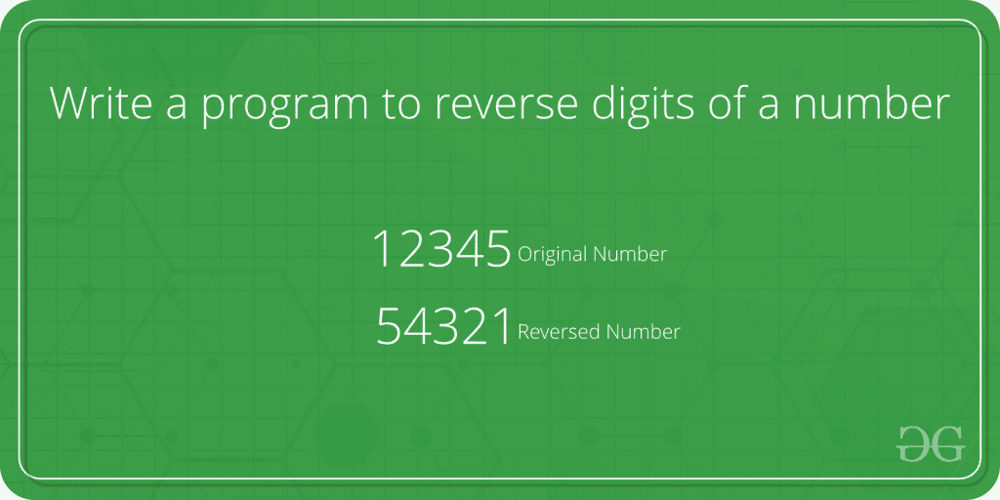
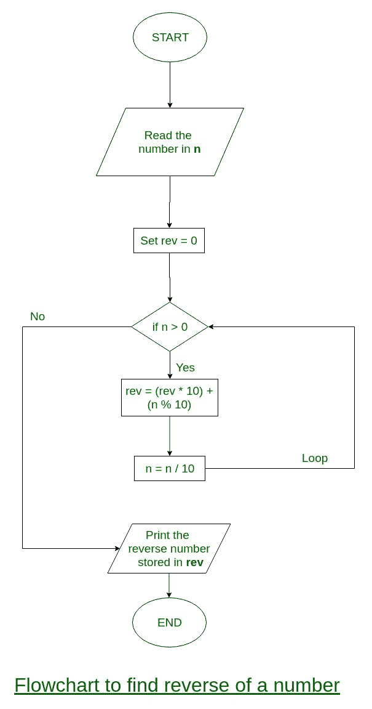

# 编写一个程序来反转一个数字的数字

> 原文:[https://www . geesforgeks . org/write-a-program-to-reverse-digits-of-a-number/](https://www.geeksforgeeks.org/write-a-program-to-reverse-digits-of-a-number/)

写一个程序来反转整数的数字。



**示例:**

```
Input : num = 12345
Output: 54321

Input : num = 876
Output: 678
```

**流程图:**



**迭代方式**

算法:

```
Input:  num
(1) Initialize rev_num = 0
(2) Loop while num > 0
     (a) Multiply rev_num by 10 and add remainder of num  
          divide by 10 to rev_num
               rev_num = rev_num*10 + num%10;
     (b) Divide num by 10
(3) Return rev_num
```

**示例:**

num = 4562
rev _ num = 0
rev _ num = rev _ num * 10+num % 10 = 2
num = num/10 = 456
rev _ num = rev _ num * 10+num % 10 = 20+6 = 26
num = num/10 = 45
rev _ num = rev _ num * 10+num % 10 = num %

**程序:**

## C++

```
#include <bits/stdc++.h>

using namespace std;
/* Iterative function to reverse digits of num*/
int reversDigits(int num)
{
    int rev_num = 0;
    while (num > 0) {
        rev_num = rev_num * 10 + num % 10;
        num = num / 10;
    }
    return rev_num;
}

/*Driver program to test reversDigits*/
int main()
{
    int num = 4562;
    cout << "Reverse of no. is " << reversDigits(num);
    getchar();
    return 0;
}

// This code is contributed
// by Akanksha Rai(Abby_akku)
```

## C

```
#include <stdio.h>

/* Iterative function to reverse digits of num*/
int reversDigits(int num)
{
    int rev_num = 0;
    while (num > 0) {
        rev_num = rev_num * 10 + num % 10;
        num = num / 10;
    }
    return rev_num;
}

/*Driver program to test reversDigits*/
int main()
{
    int num = 4562;
    printf("Reverse of no. is %d", reversDigits(num));

    getchar();
    return 0;
}
```

## Java 语言(一种计算机语言，尤用于创建网站)

```
// Java program to reverse a number

class GFG {
    /* Iterative function to reverse
    digits of num*/
    static int reversDigits(int num)
    {
        int rev_num = 0;
        while (num > 0) {
            rev_num = rev_num * 10 + num % 10;
            num = num / 10;
        }
        return rev_num;
    }

    // Driver code
    public static void main(String[] args)
    {
        int num = 4562;
        System.out.println("Reverse of no. is "
                           + reversDigits(num));
    }
}

// This code is contributed by Anant Agarwal.
```

## 计算机编程语言

```
# Python program to reverse a number

n = 4562
rev = 0

while(n > 0):
    a = n % 10
    rev = rev * 10 + a
    n = n // 10

print(rev)

# This code is contributed by Shariq Raza
```

## C#

```
// C# program to reverse a number
using System;

class GFG {
    // Iterative function to
    // reverse digits of num
    static int reversDigits(int num)
    {
        int rev_num = 0;
        while (num > 0) {
            rev_num = rev_num * 10 + num % 10;
            num = num / 10;
        }
        return rev_num;
    }

    // Driver code
    public static void Main()
    {
        int num = 4562;
        Console.Write("Reverse of no. is "
                      + reversDigits(num));
    }
}

// This code is contributed by Sam007
```

## 服务器端编程语言（Professional Hypertext Preprocessor 的缩写）

```
<?php
// Iterative function to
// reverse digits of num
function reversDigits($num)
{
    $rev_num = 0;
    while($num > 1)
    {
        $rev_num = $rev_num * 10 +
                        $num % 10;
        $num = (int)$num / 10;
    }
    return $rev_num;
}

// Driver Code
$num = 4562;
echo "Reverse of no. is ",
       reversDigits($num);

// This code is contributed by aj_36
?>
```

## java 描述语言

```
<script>
    let num = 4562;
    // Function to reverse digits of num
    function reversDigits(num) {
        let rev_num = 0;
        while(num > 0)
        {
            rev_num = rev_num * 10 + num % 10;
            num = Math.floor(num / 10);
        }
        return rev_num;
    }
 // function call  
    document.write(reversDigits(num));

// This code is contributed by Surbhi tyagi

</script>
```

**Output**

```
Reverse of no. is 2654
```

**时间复杂度:** O(log(n))，其中 n 为输入数。

***辅助空间:** O(1)*

**递归方式**

## C++

```
// C++ program to reverse digits of a number
#include <bits/stdc++.h>
using namespace std;
/* Recursive function to reverse digits of num*/
int reversDigits(int num)
{
    static int rev_num = 0;
    static int base_pos = 1;
    if (num > 0) {
        reversDigits(num / 10);
        rev_num += (num % 10) * base_pos;
        base_pos *= 10;
    }
    return rev_num;
}

// Driver Code
int main()
{
    int num = 4562;
    cout << "Reverse of no. is " << reversDigits(num);

    return 0;
}

// This code is contributed
// by Akanksha Rai(Abby_akku)
```

## C

```
// C program to reverse digits of a number
#include <stdio.h>;

/* Recursive function to reverse digits of num*/
int reversDigits(int num)
{
    static int rev_num = 0;
    static int base_pos = 1;
    if (num > 0) {
        reversDigits(num / 10);
        rev_num += (num % 10) * base_pos;
        base_pos *= 10;
    }
    return rev_num;
}

/*Driver program to test reversDigits*/
int main()
{
    int num = 4562;
    printf("Reverse of no. is %d", reversDigits(num));

    getchar();
    return 0;
}
```

## Java 语言(一种计算机语言，尤用于创建网站)

```
// Java program to reverse digits of a number

// Recursive function to
// reverse digits of num
class GFG {
    static int rev_num = 0;
    static int base_pos = 1;
    static int reversDigits(int num)
    {
        if (num > 0) {
            reversDigits(num / 10);
            rev_num += (num % 10) * base_pos;
            base_pos *= 10;
        }
        return rev_num;
    }

    // Driver Code
    public static void main(String[] args)
    {
        int num = 4562;
        System.out.println(reversDigits(num));
    }
}

// This code is contributed by mits
```

## 蟒蛇 3

```
# Python 3 program to reverse digits
# of a number
rev_num = 0
base_pos = 1

# Recursive function to reverse
# digits of num

def reversDigits(num):
    global rev_num
    global base_pos
    if(num > 0):
        reversDigits((int)(num / 10))
        rev_num += (num % 10) * base_pos
        base_pos *= 10
    return rev_num

# Driver Code
num = 4562
print("Reverse of no. is ",
      reversDigits(num))

# This code is contributed by Rajput-Ji
```

## C#

```
// C# program to reverse digits of a number

// Recursive function to
// reverse digits of num
using System;
class GFG {
    static int rev_num = 0;
    static int base_pos = 1;
    static int reversDigits(int num)
    {
        if (num > 0) {
            reversDigits(num / 10);
            rev_num += (num % 10) * base_pos;
            base_pos *= 10;
        }
        return rev_num;
    }

    // Driver Code
    public static void Main()
    {
        int num = 4562;
        Console.WriteLine(reversDigits(num));
    }
}

// This code is contributed
// by inder_verma
```

## 服务器端编程语言（Professional Hypertext Preprocessor 的缩写）

```
<?php
// PHP program to reverse digits of a number
$rev_num = 0;
$base_pos = 1;

/* Recursive function to
reverse digits of num*/
function reversDigits($num)
{
    global $rev_num;
    global $base_pos;
    if($num > 0)
    {
        reversDigits((int)($num / 10));
        $rev_num += ($num % 10) *
                     $base_pos;
        $base_pos *= 10;
    }
    return $rev_num;
}

// Driver Code
$num = 4562;
echo "Reverse of no. is ",
       reversDigits($num);

// This code is contributed by ajit
?>
```

## java 描述语言

```
<script>

// Javascript program to reverse digits of a number

/* Recursive function to reverse digits of num*/
var rev_num = 0;
var base_pos = 1;
function reversDigits(num)
{

    if(num > 0)
    {
        reversDigits(Math.floor(num/10));
        rev_num += (num%10)*base_pos;
        base_pos *= 10;
    }
    return rev_num;
}

// Driver Code
    let num = 4562;
    document.write("Reverse of no. is "
        + reversDigits(num));

// This code is contributed
// by Mayank Tyagi

</script>
```

**Output**

```
Reverse of no. is 2654
```

**时间复杂度:** O(log(n))，其中 n 为输入数。

**在 java 中使用字符串**

我们将使用 StringBuffer 将数字转换为字符串，之后，我们将使用 reverse()方法反转该字符串

**角箱**

> 输入:32100
> 
> 所以对于上面的输入，如果我们试图通过反转字符串来解决这个问题，那么输出将是 **00123。**
> 
> 因此为了处理这种情况，我们再次需要将字符串转换为整数，这样我们的输出将是 **123**

## C++

```
// C++ program to reverse a number
#include <bits/stdc++.h>
using namespace std;

int reversDigits(int num)
{
    // converting number to string
    string strin = to_string(num);

    // reversing the string
    reverse(strin.begin(), strin.end());

    // converting string to integer
    num = stoi(strin);

    // returning integer
    return num;
}
int main()
{
    int num = 4562;
    cout << "Reverse of no. is " << reversDigits(num);
    return 0;
}

// This Code is contributed by ShubhamSingh10
```

## Java 语言(一种计算机语言，尤用于创建网站)

```
// Java program to reverse a number

public class GFG {
    static int reversDigits(int num)
    {
        // converting number to string
        StringBuffer string
            = new StringBuffer(String.valueOf(num));

        // reversing the string
        string.reverse();

        // converting string to integer
        num = Integer.parseInt(String.valueOf(string));

        // returning integer
        return num;
    }
    public static void main(String[] args)
    {
        int num = 4562;
        System.out.println("Reverse of no. is "
                           + reversDigits(num));
    }
}
```

## 蟒蛇 3

```
# Python 3 program to reverse a number

def reversDigits(num):

    # converting number to string
    string = str(num)

    # reversing the string
    string = list(string)
    string.reverse()
    string = ''.join(string)

    # converting string to integer
    num = int(string)

    # returning integer
    return num

# Driver code
if __name__ == "__main__":

    num = 4562
    print("Reverse of no. is ", reversDigits(num))

    # This code is contributed by ukasp.
```

## C#

```
// C# program to reverse a number
using System;

public class GFG{

    public static string ReverseString(string s)
    {
        char[] array = s.ToCharArray();
        Array.Reverse(array);
        return new string(array);
    }

    static int reversDigits(int num)
    {
        // converting number to string
        string strin = num.ToString();

        // reversing the string
        strin = ReverseString(strin);

        // converting string to integer
        num = int.Parse(strin);

        // returning integer
        return num;
    }

  // Driver code
    static public void Main ()
    {
        int num = 4562;
        Console.Write("Reverse of no. is "
                           + reversDigits(num));
    }
}

// This Code is contributed by ShubhamSingh10
```

## java 描述语言

```
<script>

// Javascript program to reverse a number

    function reversDigits(num)
    {
        // converting number to string
        let str
            = num.toString().split("").reverse().join("");

        // converting string to integer
        num = parseInt(str);

        // returning integer
        return str;
    }

// Driver Code

    let num = 4562;
    document.write("Reverse of no. is "
                           + reversDigits(num));

</script>
```

**Output**

```
Reverse of no. is 2654
```

***时间复杂度:** O(log <sub>10</sub> n)*

***辅助空间:** O(1)*

[处理溢出的整数的倒位数](https://www.geeksforgeeks.org/reverse-digits-integer-overflow-handled/)

请注意，上面的程序不考虑前导零。例如，对于 100 个程序将打印 1 个。如果你想打印 001，那么看看这个来自马赫什瓦尔的评论。

尝试上述函数的扩展，这些扩展也应该适用于浮点数。