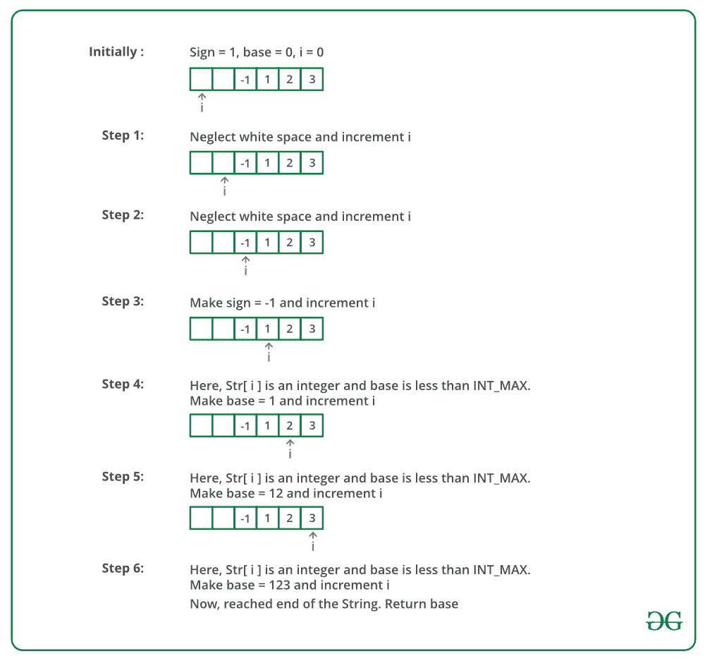

# 自己写 atoi()

> 原文:[https://www.geeksforgeeks.org/write-your-own-atoi/](https://www.geeksforgeeks.org/write-your-own-atoi/)

C 语言中的 **atoi()函数**以一个字符串(代表一个整数)为参数，返回其 int 类型的值。所以基本上这个函数是用来把字符串参数转换成整数的。

**语法:**

```
int atoi(const char strn)
```

**参数:**该函数接受一个参数 **strn** ，该参数是指需要转换为其整数等价物的字符串参数。

**返回值:**如果 strn 是有效的输入，则函数返回传递的字符串数字的等效整数。如果没有发生有效的转换，则函数返回零。

**示例:**

## C++

```
#include <bits/stdc++.h>
using namespace std;

int main()
{
    int val;
    char strn1[] = "12546";

    val = atoi(strn1);
    cout <<"String value = " << strn1 << endl;
    cout <<"Integer value = " << val << endl;

    char strn2[] = "GeeksforGeeks";
    val = atoi(strn2);
    cout <<"String value = " << strn2 << endl;
    cout <<"Integer value = " << val <<endl;

    return (0);
}

// This code is contributed by shivanisinghss2110
```

## C

```
#include <stdio.h>
#include <stdlib.h>
#include <string.h>

int main()
{
    int val;
    char strn1[] = "12546";

    val = atoi(strn1);
    printf("String value = %s\n", strn1);
    printf("Integer value = %d\n", val);

    char strn2[] = "GeeksforGeeks";
    val = atoi(strn2);
    printf("String value = %s\n", strn2);
    printf("Integer value = %d\n", val);

    return (0);
}
```

**Output**

```
String value = 12546
Integer value = 12546
String value = GeeksforGeeks
Integer value = 0
```

**现在让我们来理解一个人可以在各种条件支持下创建自己的 atoi()函数的各种方式:**

**<u>方法 1:</u>** 以下是一个简单的转换实现，不考虑任何特例。

*   将结果初始化为 0。
*   从第一个字符开始，更新每个字符的结果。
*   对于每个字符，将答案更新为*结果=结果* 10+(s[I]–‘0’)*

## C++

```
// A simple C++ program for
// implementation of atoi
#include <bits/stdc++.h>
using namespace std;

// A simple atoi() function
int myAtoi(char* str)
{
    // Initialize result
    int res = 0;

    // Iterate through all characters
    // of input string and update result
    // take ASCII character of corresponding digit and
    // subtract the code from '0' to get numerical
    // value and multiply res by 10 to shuffle
    // digits left to update running total
    for (int i = 0; str[i] != '\0'; ++i)
        res = res * 10 + str[i] - '0';

    // return result.
    return res;
}

// Driver code
int main()
{
    char str[] = "89789";

    // Function call
    int val = myAtoi(str);
    cout << val;
    return 0;
}

// This is code is contributed by rathbhupendra
```

## C

```
// Program to implement atoi() in C
#include <stdio.h>

// A simple atoi() function
int myAtoi(char* str)
{
    // Initialize result
    int res = 0;

    // Iterate through all characters
    // of input string and update result
    // take ASCII character of corresponding digit and
    // subtract the code from '0' to get numerical
    // value and multiply res by 10 to shuffle
    // digits left to update running total
    for (int i = 0; str[i] != '\0'; ++i)
        res = res * 10 + str[i] - '0';

    // return result.
    return res;
}

// Driver Code
int main()
{
    char str[] = "89789";

    // Function call
    int val = myAtoi(str);
    printf("%d ", val);
    return 0;
}
```

## Java 语言(一种计算机语言，尤用于创建网站)

```
// A simple Java program for
// implementation of atoi
class GFG {

    // A simple atoi() function
    static int myAtoi(String str)
    {
        // Initialize result
        int res = 0;

        // Iterate through all characters
        // of input string and update result
        // take ASCII character of corresponding digit and
        // subtract the code from '0' to get numerical
        // value and multiply res by 10 to shuffle
        // digits left to update running total
        for (int i = 0; i < str.length(); ++i)
            res = res * 10 + str.charAt(i) - '0';

        // return result.
        return res;
    }

    // Driver code
    public static void main(String[] args)
    {
        String str = "89789";

        // Function call
        int val = myAtoi(str);
        System.out.println(val);
    }
}

// This code is contributed by PrinciRaj1992
```

## 计算机编程语言

```
# Python program for implementation of atoi

# A simple atoi() function

def myAtoi(string):
    res = 0

    # Iterate through all characters of
    #  input string and update result
    for i in xrange(len(string)):
        res = res * 10 + (ord(string[i]) - ord('0'))

    return res

# Driver program
string = "89789"

# Function call
print myAtoi(string)

# This code is contributed by BHAVYA JAIN
```

## C#

```
// A simple C# program for implementation
// of atoi
using System;

class GFG {

    // A simple atoi() function
    static int myAtoi(string str)
    {
        int res = 0; // Initialize result

        // Iterate through all characters
        // of input string and update result
        // take ASCII character of corresponding digit and
        // subtract the code from '0' to get numerical
        // value and multiply res by 10 to shuffle
        // digits left to update running total
        for (int i = 0; i < str.Length; ++i)
            res = res * 10 + str[i] - '0';

        // return result.
        return res;
    }

    // Driver code
    public static void Main()
    {
        string str = "89789";

        // Function call
        int val = myAtoi(str);
        Console.Write(val);
    }
}

// This code is contributed by Sam007.
```

## java 描述语言

```
<script>
// A simple Javascript program for
// implementation of atoi

// A simple atoi() function
function myAtoi(str)
{
    // Initialize result
        let res = 0;

        // Iterate through all characters
        // of input string and update result
        // take ASCII character of corresponding digit and
        // subtract the code from '0' to get numerical
        // value and multiply res by 10 to shuffle
        // digits left to update running total
        for (let i = 0; i < str.length; ++i)
            res = res * 10 + str[i].charCodeAt(0) - '0'.charCodeAt(0);

        // return result.
        return res;
}

// Driver code
let str = "89789";

// Function call
let val = myAtoi(str);
document.write(val);

// This code is contributed by rag2127
</script>
```

**Output**

```
89789
```

**<u>方法 2:</u>** 这个实现处理负数。如果第一个字符是“-”，则将符号存储为负数，然后使用前面的方法将字符串的其余部分转换为数字，同时将符号与数字相乘。

## C++

```
// A C++ program for
// implementation of atoi
#include <bits/stdc++.h>
using namespace std;

// A simple atoi() function
int myAtoi(char* str)
{
    // Initialize result
    int res = 0;

    // Initialize sign as positive
    int sign = 1;

    // Initialize index of first digit
    int i = 0;

    // If number is negative,
    // then update sign
    if (str[0] == '-') {
        sign = -1;

        // Also update index of first digit
        i++;
    }

    // Iterate through all digits
    // and update the result
    for (; str[i] != '\0'; i++)
        res = res * 10 + str[i] - '0';

    // Return result with sign
    return sign * res;
}

// Driver code
int main()
{
    char str[] = "-123";

    // Function call
    int val = myAtoi(str);
    cout << val;
    return 0;
}

// This is code is contributed by rathbhupendra
```

## C

```
// A C program for
// implementation of atoi
#include <stdio.h>

// A simple atoi() function
int myAtoi(char* str)
{
    // Initialize result
    int res = 0;

    // Initialize sign as positive
    int sign = 1;

    // Initialize index of first digit
    int i = 0;

    // If number is negative,
    // then update sign
    if (str[0] == '-') {
        sign = -1;

        // Also update index of first digit
        i++;
    }

    // Iterate through all digits
    // and update the result
    for (; str[i] != '\0'; ++i)
        res = res * 10 + str[i] - '0';

    // Return result with sign
    return sign * res;
}

// Driver code
int main()
{
    char str[] = "-123";

    // Function call
    int val = myAtoi(str);
    printf("%d ", val);
    return 0;
}
```

## Java 语言(一种计算机语言，尤用于创建网站)

```
// Java program for
// implementation of atoi
class GFG {

    // A simple atoi() function
    static int myAtoi(char[] str)
    {

        // Initialize result
        int res = 0;

        // Initialize sign as positive
        int sign = 1;

        // Initialize index of first digit
        int i = 0;

        // If number is negative, then
        // update sign
        if (str[0] == '-') {
            sign = -1;

            // Also update index of first
            // digit
            i++;
        }

        // Iterate through all digits
        // and update the result
        for (; i < str.length; ++i)
            res = res * 10 + str[i] - '0';

        // Return result with sign
        return sign * res;
    }

    // Driver code
    public static void main(String[] args)
    {
        char[] str = "-123".toCharArray();

        // Function call
        int val = myAtoi(str);
        System.out.println(val);
    }
}

// This code is contributed by 29AjayKumar
```

## 计算机编程语言

```
# Python program for implementation of atoi

# A simple atoi() function

def myAtoi(string):
    res = 0
    # initialize sign as positive
    sign = 1
    i = 0

    # if number is negative then update sign
    if string[0] == '-':
        sign = -1
        i += 1

    # Iterate through all characters
    # of input string and update result
    for j in xrange(i, len(string)):
        res = res*10+(ord(string[j])-ord('0'))

    return sign * res

# Driver code
string = "-123"

# Function call
print myAtoi(string)

# This code is contributed by BHAVYA JAIN
```

## C#

```
// C# program for implementation of atoi
using System;

class GFG {

    // A simple atoi() function
    static int myAtoi(string str)
    {

        // Initialize result
        int res = 0;

        // Initialize sign as positive
        int sign = 1;

        // Initialize index of first digit
        int i = 0;

        // If number is negative, then
        // update sign
        if (str[0] == '-') {
            sign = -1;

            // Also update index of first
            // digit
            i++;
        }

        // Iterate through all digits
        // and update the result
        for (; i < str.Length; ++i)
            res = res * 10 + str[i] - '0';

        // Return result with sign
        return sign * res;
    }

    // Driver code
    public static void Main()
    {
        string str = "-123";

        // Function call
        int val = myAtoi(str);
        Console.Write(val);
    }
}

// This code is contributed by Sam007.
```

## java 描述语言

```
<script>

    // JavaScript program for implementation of atoi

    // A simple atoi() function
    function myAtoi(str)
    {

        // Initialize result
        var res = 0;

        // Initialize sign as positive
        var sign = 1;

        // Initialize index of first digit
        var i = 0;

        // If number is negative, then
        // update sign
        if (str[0] == '-') {
            sign = -1;

            // Also update index of first
            // digit
            i++;
        }

        // Iterate through all digits
        // and update the result
        for (; i < str.length; ++i)
            res = res * 10 + str[i].charCodeAt(0) - '0'.charCodeAt(0);

        // Return result with sign
        return sign * res;
    }

      // Driver code
          var str = "-129";
          var val=myAtoi(str);
        document.write(val);

</script>
 <! --This code is contributed by nirajgusain5 -->
```

**Output**

```
-123
```

**<u>方法 3:</u>** 这个实现*处理各种类型的错误*。如果*字符串*为空或*字符串*包含非数字字符，则返回 0，因为该数字无效。

**Output**

```
 -134
```

**<u>进场 4:</u>** 需要处理的四角案件:

*   丢弃所有前导空格
*   数字的符号
*   泛滥
*   无效输入

要删除前导空格，请运行一个循环，直到到达数字的某个字符。如果该数字大于或等于 INT_MAX/10。然后如果符号为正，返回 INT_MAX，如果符号为负，返回 INT_MIN。其他情况在以前的方法中处理。

**试运行:**



下面是上述方法的实现:

## C++

```
// A simple C++ program for
// implementation of atoi
#include <bits/stdc++.h>
using namespace std;

int myAtoi(const char* str)
{
    int sign = 1, base = 0, i = 0;

    // if whitespaces then ignore.
    while (str[i] == ' ')
    {
        i++;
    }

    // sign of number
    if (str[i] == '-' || str[i] == '+')
    {
        sign = 1 - 2 * (str[i++] == '-');
    }

    // checking for valid input
    while (str[i] >= '0' && str[i] <= '9')
    {
        // handling overflow test case
        if (base > INT_MAX / 10
            || (base == INT_MAX / 10
            && str[i] - '0' > 7))
        {
            if (sign == 1)
                return INT_MAX;
            else
                return INT_MIN;
        }
        base = 10 * base + (str[i++] - '0');
    }
    return base * sign;
}

// Driver Code
int main()
{
    char str[] = "  -123";

    // Functional Code
    int val = myAtoi(str);
    cout <<" "<< val;
    return 0;
}

// This code is contributed by shivanisinghss2110
```

## C

```
// A simple C++ program for
// implementation of atoi
#include <stdio.h>
#include <limits.h>

int myAtoi(const char* str)
{
    int sign = 1, base = 0, i = 0;

    // if whitespaces then ignore.
    while (str[i] == ' ')
    {
        i++;
    }

    // sign of number
    if (str[i] == '-' || str[i] == '+')
    {
        sign = 1 - 2 * (str[i++] == '-');
    }

    // checking for valid input
    while (str[i] >= '0' && str[i] <= '9')
    {
        // handling overflow test case
        if (base > INT_MAX / 10
            || (base == INT_MAX / 10
            && str[i] - '0' > 7))
        {
            if (sign == 1)
                return INT_MAX;
            else
                return INT_MIN;
        }
        base = 10 * base + (str[i++] - '0');
    }
    return base * sign;
}

// Driver Code
int main()
{
    char str[] = "  -123";

    // Functional Code
    int val = myAtoi(str);
    printf("%d ", val);
    return 0;
}
// This code is contributed by Yogesh shukla.
```

## Java 语言(一种计算机语言，尤用于创建网站)

```
// A simple Java program for
// implementation of atoi
class GFG {
    static int myAtoi(char[] str)
    {
        int sign = 1, base = 0, i = 0;

        // if whitespaces then ignore.
        while (str[i] == ' ')
        {
            i++;
        }

        // sign of number
        if (str[i] == '-' || str[i] == '+')
        {
            sign = 1 - 2 * (str[i++] == '-' ? 1 : 0);
        }

        // checking for valid input
        while (i < str.length
               && str[i] >= '0'
               && str[i] <= '9') {

            // handling overflow test case
            if (base > Integer.MAX_VALUE / 10
                || (base == Integer.MAX_VALUE / 10
                    && str[i] - '0' > 7))
            {
                if (sign == 1)
                    return Integer.MAX_VALUE;
                else
                    return Integer.MIN_VALUE;
            }
            base = 10 * base + (str[i++] - '0');
        }
        return base * sign;
    }

    // Driver code
    public static void main(String[] args)
    {
        char str[] = " -123".toCharArray();

        // Function call
        int val = myAtoi(str);
        System.out.printf("%d ", val);
    }
}

// This code is contributed by 29AjayKumar
```

## 蟒蛇 3

```
# A simple Python3 program for
# implementation of atoi
import sys

def myAtoi(Str):

    sign, base, i = 1, 0, 0

    # If whitespaces then ignore.
    while (Str[i] == ' '):
        i += 1

    # Sign of number
    if (Str[i] == '-' or Str[i] == '+'):
        sign = 1 - 2 * (Str[i] == '-')
        i += 1

    # Checking for valid input
    while (i < len(Str) and
          Str[i] >= '0' and Str[i] <= '9'):

        # Handling overflow test case
        if (base > (sys.maxsize // 10) or
           (base == (sys.maxsize // 10) and
           (Str[i] - '0') > 7)):
            if (sign == 1):
                return sys.maxsize
            else:
                return -(sys.maxsize)

        base = 10 * base + (ord(Str[i]) - ord('0'))
        i += 1

    return base * sign

# Driver Code
Str = list(" -123")

# Functional Code
val = myAtoi(Str)

print(val)

# This code is contributed by divyeshrabadiya07
```

## C#

```
// A simple C# program for implementation of atoi
using System;

class GFG {
    static int myAtoi(char[] str)
    {
        int sign = 1, Base = 0, i = 0;

        // if whitespaces then ignore.
        while (str[i] == ' ') {
            i++;
        }

        // sign of number
        if (str[i] == '-' || str[i] == '+') {
            sign = 1 - 2 * (str[i++] == '-' ? 1 : 0);
        }

        // checking for valid input
        while (
            i < str.Length
            && str[i] >= '0'
            && str[i] <= '9') {

            // handling overflow test case
            if (Base > int.MaxValue / 10 || (Base == int.MaxValue / 10 && str[i] - '0' > 7)) {
                if (sign == 1)
                    return int.MaxValue;
                else
                    return int.MinValue;
            }
            Base = 10 * Base + (str[i++] - '0');
        }
        return Base * sign;
    }

    // Driver code
    public static void Main(String[] args)
    {
        char[] str = " -123".ToCharArray();
        int val = myAtoi(str);
        Console.Write("{0} ", val);
    }
}

// This code is contributed by 29AjayKumar
```

## java 描述语言

```
<script>
// A simple JavaScript program for
// implementation of atoi
    function myAtoi(str)
   {
    var sign = 1, base = 0, i = 0;

    // if whitespaces then ignore.
    while (str[i] == ' ')
    {
        i++;
    }

    // sign of number
    if (str[i] == '-' || str[i] == '+')
    {
        sign = 1 - 2 * (str[i++] == '-');
    }

    // checking for valid input
    while (str[i] >= '0' && str[i] <= '9')
    {
        // handling overflow test case
        if (base > Number.MAX_VALUE/ 10
            || (base == Number.MAX_VALUE / 10
            && str[i] - '0' > 7))
        {
            if (sign == 1)
                return Number.MAX_VALUE;
            else
                return Number.MAX_VALUE;
        }
        base = 10 * base + (str[i++] - '0');
    }
    return base * sign;
}

    // Driver code
        var str = " -123";

        // Function call
        var val = myAtoi(str);
        document.write(" ", val);

// This code is contributed by shivanisinghss2110
</script>
```

**Output**

```
 -123
```

**上述所有方法的复杂性分析:**

*   **时间复杂度:** O(n)。
    只需要遍历一次字符串。
*   **空间复杂度:** O(1)。
    因为不需要额外的空间。

[atoi()](http://geeksquiz.com/recursive-implementation-of-atoi/)的递归程序。

**练习:**
写你的韩元 [atof()](http://www.cplusplus.com/reference/cstdlib/atof/) 该函数将一个字符串(代表一个浮点值)作为参数，并将其值作为 double 返回。

本文由**阿沛·拉提**整理。如果你发现任何不正确的地方，或者你想分享更多关于上面讨论的话题的信息，请写评论。
如果你喜欢 GeeksforGeeks 并想投稿，你也可以写一篇文章并把你的文章邮寄到 review-team@geeksforgeeks.org。看到你的文章出现在极客博客主页上，帮助其他极客。