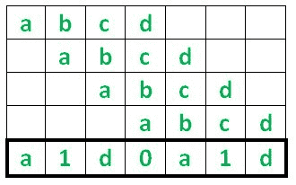
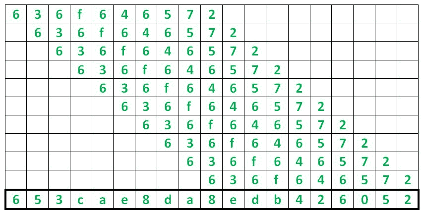
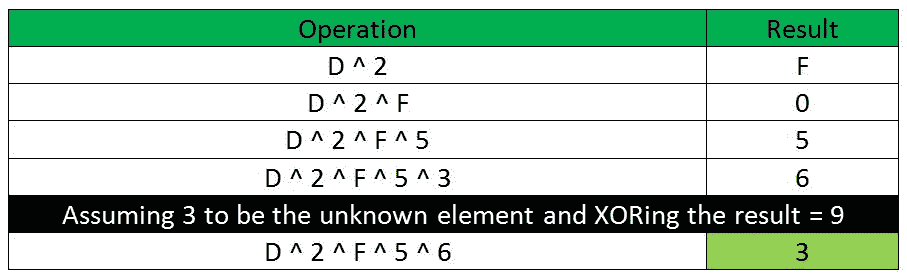
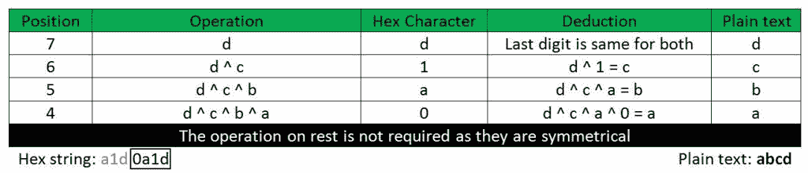

# 通过移位明文进行异或加密

> 原文:[https://www . geesforgeks . org/xor-加密-移位-明文/](https://www.geeksforgeeks.org/xor-encryption-shifting-plaintext/)

这是一个密码算法，基于十六进制字符串，通过给定明文 **N** 次 **N** 的长度来实现。但是，问题是每次异或运算都是在将连续的纯文本**条目向右移动**之后进行的。示例操作如下所示:



假设密码是**‘ABCD’**，那么十六进制文本通过将密码与自身进行 N 次异或运算计算为 **a1d0a1d** ，即在这种情况下为 4 次。

同样如果密码是 **'636f646572'** ，那么



**653cae8da8edb426052** 为十六进制文本。

因此，问题陈述是创建一个解密算法(在任何编程语言中)并从给定的十六进制字符串推导出纯文本。

**示例:**

```
Input : a1d0a1d
Output : abcd
abcd once coded will return a1d0a1d

Input : 653cae8da8edb426052
Output : 636f646572

```

**方法:**加密和解密的关键成分在于**异或**的属性。异或是一种逐位运算，如果两个可能的输入相同**，但输入不同**时，结果为 **0** 。异或表如下，供参考:****

| 输入 | 输出 |
| --- | --- |
| X | Y | Z |
| Zero | Zero | Zero |
| Zero | one | one |
| one | Zero | one |
| one | one | Zero |

****在密码学中广泛流行的异或的一个重要且有用的性质是，在多个数的异或(比如说 **M** 数)的情况下，如果我们只知道**M–1**数(一个是未知的)以及**异或结果**，那么我们可以通过异或已知数和异或结果来容易地计算缺失数。此属性用以下十六进制数字讨论:****

********

****在解决这个问题的过程中，我们将最大限度地使用上面列出的属性。现在，如果我们看一下底部**‘ABCD’**的加密图，它只是数字的重复 XORing。最右边的数字是 **d** ，**的最右边的数字“ABCD”**也是 **d** ，所以明文和十六进制字符串的最后一个数字是相同的**。下一个数字是 **1** ，它是通过将 **abcd** 的第二个右数字与前一个数字即 **1 = d ^ c** 进行异或运算计算出来的，利用我们知道的性质，纯文本数字可以推导为 **d ^ 1 = c** 。同样，下一个数字是 **a** ，由 **d ^ c ^ b = a** 找到。我们只需要这样做，直到六角弦的一半，因为其余部分是**对称的，所以不需要**。******

********

******以下是上述方法的实施:******

```
**# Implementation in Python 3

# Hex String variable
hex_s = '653cae8da8edb426052'

# Plain text variable
plain = ''

# variable to store the XOR
# of previous digits
x = 0

l = len(hex_s)

# Loop for loop from the end to
# the mid section of the string
for i in range(l - 1, int(l / 2) - 1, -1):

    # calculation of the plaintext digit
    y = x^int(hex_s[i], 16)

    # calculation of XOR chain
    x = x^y
    plain = hex(y)[-1] + plain

print(plain)**
```

******Output:**

```
636f646572

```****