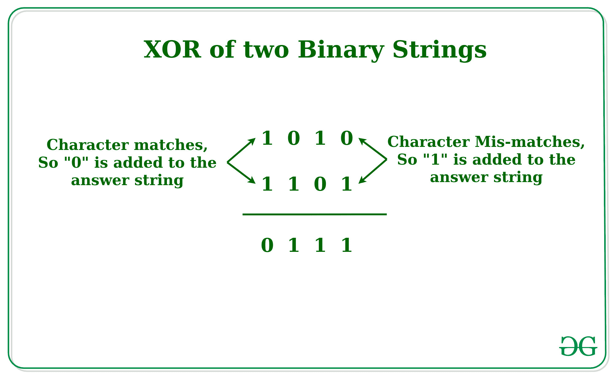

# 两个二进制字符串的异或运算

> 原文:[https://www.geeksforgeeks.org/xor-of-two-binary-strings/](https://www.geeksforgeeks.org/xor-of-two-binary-strings/)

给定两个长度相等的二进制字符串 **A** 和 **B** ，任务是打印一个二进制字符串 **A** 和 **B** 的异或。
**举例:**

> **输入:**A =“0001”，B =“0010”
> **输出:** 0011
> **输入:**A =“1010”，B =“0101”
> **输出:** 1111

**方法:**想法是逐个字符地迭代字符串，如果字符不匹配，则在答案字符串中添加“1”作为字符，否则在答案字符串中添加“0”以生成异或字符串。



以下是上述方法的实现:

## C++

```
// C++ Implementation to find the
// XOR of the two Binary Strings
#include<bits/stdc++.h>
using namespace std;

// Function to find the
// XOR of the two Binary Strings
string xoring(string a, string b, int n){
string ans = "";

    // Loop to iterate over the
    // Binary Strings
    for (int i = 0; i < n; i++)
    {
        // If the Character matches
        if (a[i] == b[i])
            ans += "0";
        else
            ans += "1";
    }
    return ans;
}

// Driver Code
int main()
{
    string a = "1010";
    string b = "1101";
    int n = a.length();
    string c = xoring(a, b, n);
    cout << c << endl;
}

// This code is contributed by Surendra_Gangwar
```

## Java 语言(一种计算机语言，尤用于创建网站)

```
// Java Implementation to find the
// XOR of the two Binary Strings
import java.io.*;

class GFG {
    // Function to find the
    // XOR of the two Binary Strings
    static String  xoring(String a, String b, int n){
    String ans = "";

        // Loop to iterate over the
        // Binary Strings
        for (int i = 0; i < n; i++)
        {
            // If the Character matches
            if (a.charAt(i) == b.charAt(i))
                ans += "0";
            else
                ans += "1";
        }
        return ans;
    }

    // Driver Code
    public static void main (String[] args)
    {
        String a = "1010";
        String b = "1101";
        int n = a.length();
        String c = xoring(a, b, n);
        System.out.println(c);
    }
}

// This code is contributed by shubhamsingh10
```

## 蟒蛇 3

```
# Python Implementation to find the
# XOR of the two Binary Strings

# Function to find the
# XOR of the two Binary Strings
def xor(a, b, n):
    ans = ""

    # Loop to iterate over the
    # Binary Strings
    for i in range(n):

        # If the Character matches
        if (a[i] == b[i]):
            ans += "0"
        else:
            ans += "1"
    return ans

# Driver Code
if __name__ == "__main__":
    a = "1010"
    b = "1101"
    n = len(a)
    c = xor(a, b, n)
    print(c)
```

## C#

```
// C# Implementation to find the
// XOR of the two Binary Strings
using System;

class GFG{
    // Function to find the
    // XOR of the two Binary Strings
    static string xoring(string a, string b, int n){
    string ans = "";

        // Loop to iterate over the
        // Binary Strings
        for (int i = 0; i < n; i++)
        {
            // If the Character matches
            if (a[i] == b[i])
                ans += "0";
            else
                ans += "1";
        }
        return ans;
    }

    // Driver Code
    static public void Main ()
    {
        string a = "1010";
        string b = "1101";
        int n = a.Length;
        string c = xoring(a, b, n);
        Console.WriteLine(c);
    }
}

// This code is contributed by shubhamsingh10
```

## java 描述语言

```
<script>

// Javascript Implementation to find the
// XOR of the two Binary Strings

// Function to find the
// XOR of the two Binary Strings
function xoring(a, b, n){
let ans = "";

    // Loop to iterate over the
    // Binary Strings
    for (let i = 0; i < n; i++)
    {
        // If the Character matches
        if (a[i] == b[i])
            ans += "0";
        else
            ans += "1";
    }
    return ans;
}

// Driver Code
    let a = "1010";
    let b = "1101";
    let n = a.length;
    let c = xoring(a, b, n);
    document.write(c);

</script>
```

**输出:**

```
0111
```