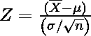
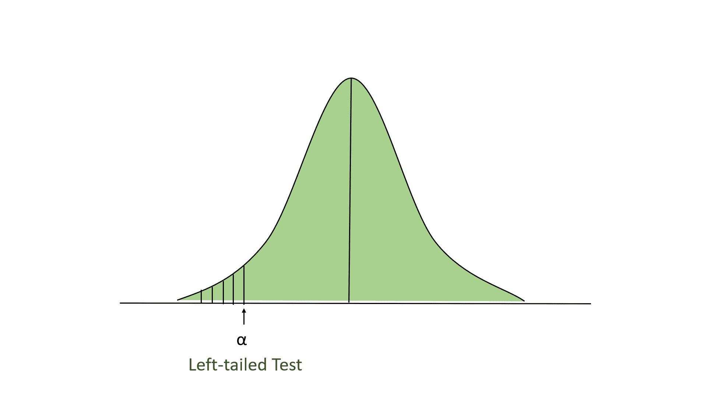
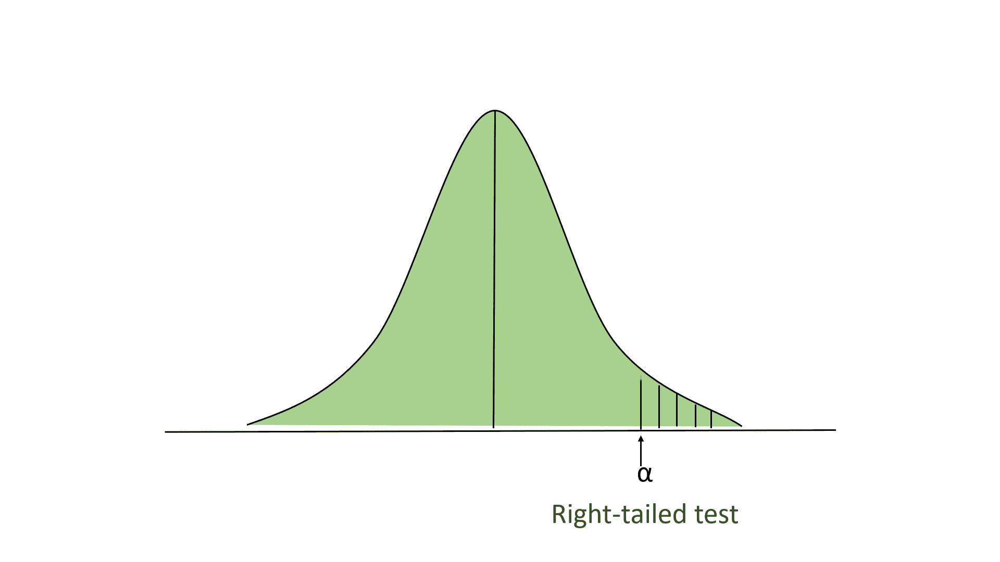
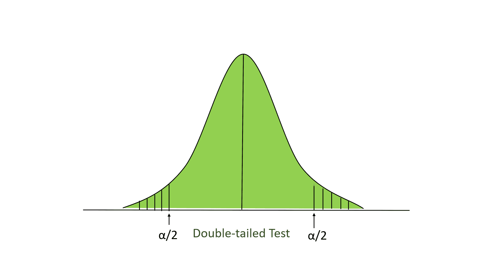
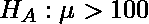
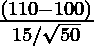
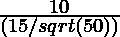
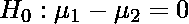

# Z 测试

> 原文:[https://www.geeksforgeeks.org/z-test/](https://www.geeksforgeeks.org/z-test/)

z 检验是一种统计方法，用于确定检验统计量的分布是否可以用正态分布来近似。当方差已知且样本量较大(应> = 30)时，确定两个样本均值近似相同还是不同的方法。

**何时使用 Z 测试:**

*   样本大小应大于 30。否则，我们应该使用 t 检验。
*   应从人群中随机抽取样本。
*   总体的标准差应该是已知的。
*   从人群中抽取的样本应该相互独立。
*   数据应该是正态分布的，但是对于大样本量，假设是正态分布。

**假设检验**

假设是对物体特定属性的有根据的猜测/断言。假设检验是验证实验主张的一种方法。

*   **零假设:**零假设是一个群体参数(如比例、均值或标准差)的值等于某个声称值的陈述。我们要么拒绝要么拒绝无效假设。零假设由 H <sub>0</sub> 表示。
*   **替代假设:**替代假设是参数的值不同于声明值的说法。用 H <sub>A</sub> 表示。

**显著性水平:**表示我们接受或拒绝零假设的显著性程度。由于在大多数实验中，100%的准确性不可能接受或拒绝一个假设，所以我们，因此，选择一个显著性水平。用字母(∧)表示。

**进行 Z 测试的步骤:**

*   首先，确定无效假设和替代假设。
*   确定显著性水平(∧)。
*   在 z 测试中，使用以下公式找出 z 的临界值
*   计算 z 检验统计数据。下面是计算 z 检验统计量的公式。

<center></center>

*   哪里，
    *   x:样本的平均值。
    *   穆:人口的平均数。
    *   标准差:总体的标准差。
    *   n:样本量。
*   现在与假设进行比较，决定是否拒绝零假设

**Z 型试验**

*   **左尾测试:**在这个测试中，我们的排斥区域位于分布的最左侧。这里我们的零假设是，声称的值小于或等于平均人口值。

<center>
</center>

*   **右尾测试:**在这个测试中，我们的拒绝区域位于分布的最右侧。这里我们的零假设是，声称的值小于或等于平均人口值。

<center>
</center>

*   **双尾测试:**在这个测试中，我们的拒绝区域位于分布的两个极端。这里我们的零假设是，声称的值等于平均人口值。

<center>
</center>

以下是执行 z 测试的示例:

**问题**:某学校声称学生的学习比一般学校要聪明。在计算 50 名学生的智商分数时，平均结果是 11。人口智商的平均值是 100，标准差是 15。在 5%的显著性水平上陈述委托人的主张是否正确。

*   首先，我们定义了零假设和替代假设。我们的无效假设是:

<center></center>

我们的另一个假设。

<center></center>

*   陈述重要程度。这里，我们在这个问题中给出的显著性水平(∧= 0.05)，如果没有给出，那么我们取∧= 0.05。
*   现在，我们抬头看 z 桌。对于∧= 0.05 的值，右尾测试的 z 分数为 1.645。
*   现在，我们对这个问题进行 Z 测试:

<center></center>

*   其中:
    *   X = 110
    *   平均值(μ)= 100
    *   标准偏差(σ)= 15
    *   显著性水平(α)= 0.05
    *   n = 50

<center></center>

<center></center>

<center></center>

<center></center>

*   这里 4.71 >1.645，所以我们拒绝零假设。如果 z 检验统计量小于 z 分数，那么我们不会拒绝零假设。

## 蟒蛇 3

```
# imports
import math
import numpy as np
from numpy.random import randn
from statsmodels.stats.weightstats import ztest

# Generate a random array of 50 numbers having mean 110 and sd 15
# similar to the IQ scores data we assume above
mean_iq = 110
sd_iq = 15/math.sqrt(50)
alpha =0.05
null_mean =100
data = sd_iq*randn(50)+mean_iq
# print mean and sd
print('mean=%.2f stdv=%.2f' % (np.mean(data), np.std(data)))

# now we perform the test. In this function, we passed data, in the value parameter
# we passed mean value in the null hypothesis, in alternative hypothesis we check whether the
# mean is larger

ztest_Score, p_value= ztest(data,value = null_mean, alternative='larger')
# the function outputs a p_value and z-score corresponding to that value, we compare the 
# p-value with alpha, if it is greater than alpha then we do not null hypothesis 
# else we reject it.

if(p_value <  alpha):
  print("Reject Null Hypothesis")
else:
  print("Fail to Reject NUll Hypothesis")
```

```
Reject Null Hypothesis

```

**两次取样 z 检验:**

在这个测试中，我们提供了 2 个正态分布和独立的群体，我们从两个群体中随机抽取样本。这里，我们认为 u <sub>1</sub> 和 u <sub>2</sub> 为总体均值 X <sub>1</sub> 和 X <sub>2</sub> 为观测样本均值。这里，我们的零假设可能是这样的:

<center></center>

和替代假设

<center></center>

以及计算 z 测试分数的公式:

<center></center>

其中*σ<sub>1</sub>和*T4】σ<sub>2</sub>T7】为标准差， *n <sub>1</sub> 和 n<sub>2</sub>T13】为 *u <sub>1</sub> 和 u <sub>2</sub> 对应的人群样本量。**

**第一类错误和第二类错误:**

*   **I 型错误:**当我们拒绝零假设时，即使假设为真，1 型错误也已经发生。这个误差用α表示。
*   **第二类错误:**第二类错误发生在我们没有拒绝零假设的时候，即使假设是假的。这个错误用β表示。

<center>

<figure class="table">

|   | 零假设为真 | 零假设为假 |
| --- | --- | --- |
| 拒绝零假设 | 第一类错误(假阳性) | 正确的决定 |
| 拒绝无效假设失败 | 正确的决定 | 第二类错误(假阴性) |

</figure>

</center>