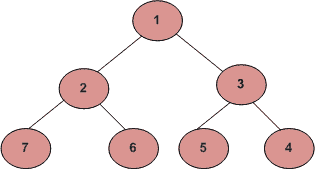

# 使用单个数组对树进行之字形水平顺序遍历

> 原文:[https://www . geesforgeks . org/zig-zag-level-order-遍历树-使用单个数组/](https://www.geeksforgeeks.org/zig-zag-level-order-traversal-of-a-tree-using-single-array/)

写一个函数打印一棵树的螺旋顺序遍历。对于下面的树，函数应该打印 1、2、3、4、5、6、7。



我们已经讨论了朴素方法和两个基于栈的方法，在[具有递归的水平顺序和多个栈](https://www.geeksforgeeks.org/level-order-traversal-in-spiral-form/)
中，该方法背后的思想是首先我们必须取一个队列、一个方向标志和一个空的分离标志

1.  将根元素插入队列，并再次将空值插入队列。
2.  对于队列中的每个元素，插入其子节点。
3.  如果遇到空值，则检查穿过特定标高的方向是从左到右还是从右到左。如果是偶数层，则从左向右遍历，否则按从右到上的顺序遍历树，即从前面到前一个前面，即从当前空值到已访问的最后一个空值。这种情况一直持续到最后一级，然后循环中断，我们通过检查打印方向来打印剩余部分(未打印的部分)。

以下是解释的实现

## C++

```
// C++ program to print level order traversal
// in spiral form using a single dequeue
#include <bits/stdc++.h>

struct Node {
    int data;
    struct Node *left, *right;
};

// A utility function to create a new node
struct Node* newNode(int data)
{
    struct Node* node = new struct Node;
    node->data = data;
    node->left = node->right = NULL;
    return (node);
}

// function to print the level order traversal
void levelOrder(struct Node* root, int n)
{
    // We can just take the size as H+N which
    // implies the height of the tree with the
    // size of the tree
    struct Node* queue[2 * n];
    int top = -1;
    int front = 1;
    queue[++top] = NULL;
    queue[++top] = root;
    queue[++top] = NULL;

    // struct Node* t=root;
    int prevFront = 0, count = 1;
    while (1) {

        struct Node* curr = queue[front];

        // A level separator found
        if (curr == NULL) {

            // If this is the only item in dequeue
            if (front == top)
                break;

            // Else print contents of previous level
            // according to count
            else {
                if (count % 2 == 0) {
                    for (int i = prevFront + 1; i < front; i++)
                        printf("%d ", queue[i]->data);
                }
                else {
                    for (int i = front - 1; i > prevFront; i--)
                        printf("%d ", queue[i]->data);
                }

                prevFront = front;
                count++;
                front++;

                // Insert a new level separator
                queue[++top] = NULL;

                continue;
            }
        }

        if (curr->left != NULL)
            queue[++top] = curr->left;
        if (curr->right != NULL)
            queue[++top] = curr->right;
        front++;
    }

    if (count % 2 == 0) {
        for (int i = prevFront + 1; i < top; i++)
            printf("%d ", queue[i]->data);
    }
    else {
        for (int i = top - 1; i > prevFront; i--)
            printf("%d ", queue[i]->data);
    }
}

// Driver code
int main()
{
    struct Node* root = newNode(1);
    root->left = newNode(2);
    root->right = newNode(3);
    root->left->left = newNode(7);
    root->left->right = newNode(6);
    root->right->left = newNode(5);
    root->right->right = newNode(4);
    levelOrder(root, 7);

    return 0;
}
```

## Java 语言(一种计算机语言，尤用于创建网站)

```
// Java program to print level order traversal
// in spiral form using a single dequeue
class Solution
{

static class Node
{
    int data;
    Node left, right;
};

// A utility function to create a new node
static Node newNode(int data)
{
    Node node = new Node();
    node.data = data;
    node.left = node.right = null;
    return (node);
}

// function to print the level order traversal
static void levelOrder( Node root, int n)
{
    // We can just take the size as H+N which
    // implies the height of the tree with the
    // size of the tree
    Node queue[] = new Node[2 * n];

    for(int i = 0; i < 2 * n; i++)
        queue[i] = new Node();

    int top = -1;
    int front = 1;
    queue[++top] = null;
    queue[++top] = root;
    queue[++top] = null;

    // Node t=root;
    int prevFront = 0, count = 1;
    while (true)
    {

        Node curr = queue[front];

        // A level separator found
        if (curr == null)
        {

            // If this is the only item in dequeue
            if (front == top)
                break;

            // Else print contents of previous level
            // according to count
            else
            {
                if (count % 2 == 0)
                {
                    for (int i = prevFront + 1; i < front; i++)
                        System.out.printf("%d ", queue[i].data);
                }
                else
                {
                    for (int i = front - 1; i > prevFront; i--)
                        System.out.printf("%d ", queue[i].data);
                }

                prevFront = front;
                count++;
                front++;

                // Insert a new level separator
                queue[++top] = null;

                continue;
            }
        }

        if (curr.left != null)
            queue[++top] = curr.left;
        if (curr.right != null)
            queue[++top] = curr.right;
        front++;
    }

    if (count % 2 == 0)
    {
        for (int i = prevFront + 1; i < top; i++)
            System.out.printf("%d ", queue[i].data);
    }
    else
    {
        for (int i = top - 1; i > prevFront; i--)
            System.out.printf("%d ", queue[i].data);
    }
}

// Driver code
public static void main(String args[])
{
    Node root = newNode(1);
    root.left = newNode(2);
    root.right = newNode(3);
    root.left.left = newNode(7);
    root.left.right = newNode(6);
    root.right.left = newNode(5);
    root.right.right = newNode(4);
    levelOrder(root, 7);
}
}

// This code is contributed by Arnab Kundu
```

## C#

```
// C# program to print level order traversal
// in spiral form using a single dequeue
using System;
class GFG
{  
public class Node
{
    public int data;
    public Node left, right;
};

// A utility function to create a new node
static Node newNode(int data)
{
    Node node = new Node();
    node.data = data;
    node.left = node.right = null;
    return (node);
}

// function to print the level order traversal
static void levelOrder( Node root, int n)
{
    // We can just take the size as H+N which
    // implies the height of the tree with the
    // size of the tree
    Node []queue = new Node[2 * n];

    for(int i = 0; i < 2 * n; i++)
        queue[i] = new Node();

    int top = -1;
    int front = 1;
    queue[++top] = null;
    queue[++top] = root;
    queue[++top] = null;

    // Node t=root;
    int prevFront = 0, count = 1;
    while (true)
    {

        Node curr = queue[front];

        // A level separator found
        if (curr == null)
        {

            // If this is the only item in dequeue
            if (front == top)
                break;

            // Else print contents of previous level
            // according to count
            else
            {
                if (count % 2 == 0)
                {
                    for (int i = prevFront + 1;
                             i < front; i++)
                        Console.Write(" " + queue[i].data);
                }
                else
                {
                    for (int i = front - 1;
                             i > prevFront; i--)
                        Console.Write(" " + queue[i].data);
                }

                prevFront = front;
                count++;
                front++;

                // Insert a new level separator
                queue[++top] = null;

                continue;
            }
        }

        if (curr.left != null)
            queue[++top] = curr.left;
        if (curr.right != null)
            queue[++top] = curr.right;
        front++;
    }

    if (count % 2 == 0)
    {
        for (int i = prevFront + 1; i < top; i++)
            Console.Write(" " + queue[i].data);
    }
    else
    {
        for (int i = top - 1; i > prevFront; i--)
            Console.Write(" " + queue[i].data);
    }
}

// Driver code
public static void Main(String []args)
{
    Node root = newNode(1);
    root.left = newNode(2);
    root.right = newNode(3);
    root.left.left = newNode(7);
    root.left.right = newNode(6);
    root.right.left = newNode(5);
    root.right.right = newNode(4);
    levelOrder(root, 7);
}
}

// This code is contributed by gauravrajput1
```

## java 描述语言

```
<script>

// Javascript program to print level order
// traversal in spiral form using a single dequeue
class Node
{
    constructor()
    {
        this.data = 0;
        this.left = null;
        this.right = null;
    }
};

// A utility function to create a new node
function newNode(data)
{
    var node = new Node();
    node.data = data;
    node.left = node.right = null;
    return (node);
}

// Function to print the level order traversal
function levelOrder(root, n)
{

    // We can just take the size as H+N which
    // implies the height of the tree with the
    // size of the tree
    var queue = Array(2 * n);

    for(var i = 0; i < 2 * n; i++)
        queue[i] = new Node();

    var top = -1;
    var front = 1;
    queue[++top] = null;
    queue[++top] = root;
    queue[++top] = null;

    // Node t=root;
    var prevFront = 0, count = 1;
    while (true)
    {
        var curr = queue[front];

        // A level separator found
        if (curr == null)
        {

            // If this is the only item in dequeue
            if (front == top)
                break;

            // Else print contents of previous level
            // according to count
            else
            {
                if (count % 2 == 0)
                {
                    for(var i = prevFront + 1;
                            i < front; i++)
                        document.write(" " + queue[i].data);
                }
                else
                {
                    for(var i = front - 1;
                            i > prevFront; i--)
                        document.write(" " + queue[i].data);
                }

                prevFront = front;
                count++;
                front++;

                // Insert a new level separator
                queue[++top] = null;

                continue;
            }
        }

        if (curr.left != null)
            queue[++top] = curr.left;
        if (curr.right != null)
            queue[++top] = curr.right;

        front++;
    }
    if (count % 2 == 0)
    {
        for(var i = prevFront + 1; i < top; i++)
            document.write(" " + queue[i].data);
    }
    else
    {
        for(var i = top - 1; i > prevFront; i--)
            document.write(" " + queue[i].data);
    }
}

// Driver code
var root = newNode(1);
root.left = newNode(2);
root.right = newNode(3);
root.left.left = newNode(7);
root.left.right = newNode(6);
root.right.left = newNode(5);
root.right.right = newNode(4);

levelOrder(root, 7);

// This code is contributed by rutvik_56

</script>
```

**Output:** 

```
1 2 3 4 5 6 7
```

**时间复杂度:**O(n)
T3】辅助空间: O(2*n) = O(n)