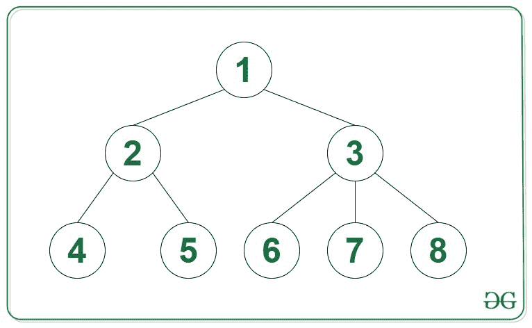

# N 元树的之字形级顺序遍历

> 原文:[https://www . geesforgeks . org/zigzag-level-order-遍历 n 元树/](https://www.geeksforgeeks.org/zigzag-level-order-traversal-of-an-n-ary-tree/)

给定一个由 **N** 节点组成的[类属树](https://www.geeksforgeeks.org/generic-treesn-array-trees/)，任务是找到给定树的[之字形层次顺序遍历](https://www.geeksforgeeks.org/zigzag-tree-traversal/)。

**示例:**

> **输入:**
> 
> 
> 
> **输出:**T2 1
> 3 2
> 4 5 6 7 8

**方法:**给定的问题可以通过使用 [BFS 遍历](https://www.geeksforgeeks.org/breadth-first-search-or-bfs-for-a-graph/)来解决。该方法非常类似于 N 元树的[级顺序遍历](https://www.geeksforgeeks.org/generic-tree-level-order-traversal/)。可以观察到，在水平顺序遍历期间反转偶数水平的顺序时，获得的序列是锯齿形遍历。基于这些观察，以下是要遵循的步骤:

*   在 BFS 遍历期间，将每一级的节点存储到一个[向量](https://www.geeksforgeeks.org/vector-in-cpp-stl/)中，比如说**柯勒维尔[]** 。
*   对于每个相应的级别，将**等级**存储到矢量的[矢量中，例如**结果[]** 。](https://www.geeksforgeeks.org/vector-of-vectors-in-c-stl-with-examples/)
*   反转**结果[]** 中偶数位置的向量。
*   完成上述步骤后，所有向量存储在**结果[]** 所需的结果中。

下面是上述方法的实现:

## C++

```
// C++ program for the above approach

#include <bits/stdc++.h>
using namespace std;

// Structure of a tree node
struct Node {
    int val;
    vector<Node*> child;
};

// Function to create a new node
Node* newNode(int key)
{
    Node* temp = new Node;
    temp->val = key;
    return temp;
}

// Function to perform zig zag traversal
// of the given tree
void zigzagLevelOrder(Node* root)
{
    if (root == NULL)
        return;

    // Stores the vectors containing nodes
    // in each level of tree respectively
    vector<vector<int> > result;

    // Create a queue for BFS
    queue<Node*> q;

    // Enqueue Root of the tree
    q.push(root);

    // Standard Level Order Traversal
    // code using queue
    while (!q.empty()) {
        int size = q.size();

        // Stores the element in the
        // current level
        vector<int> curLevel;

        // Iterate over all nodes of
        // the current level
        for (int i = 0; i < size; i++) {
            Node* node = q.front();
            q.pop();

            curLevel.push_back(node->val);

            // Insert all children of the
            // current node into the queue
            for (int j = 0;
                 j < node->child.size(); j++) {
                q.push(node->child[j]);
            }
        }

        // Insert curLevel into result
        result.push_back(curLevel);
    }

    // Loop to Print the ZigZag Level order
    // Traversal of the given tree
    for (int i = 0; i < result.size(); i++) {

        // If i+1 is even reverse the order
        // of nodes in the current level
        if ((i + 1) % 2 == 0) {
            reverse(result[i].begin(),
                    result[i].end());
        }

        // Print the node of ith level
        for (int j = 0;
             j < result[i].size(); j++) {
            cout << result[i][j] << " ";
        }
        cout << endl;
    }
}

// Driver Code
int main()
{
    Node* root = newNode(1);
    (root->child).push_back(newNode(2));
    (root->child).push_back(newNode(3));
    (root->child[0]->child).push_back(newNode(4));
    (root->child[0]->child).push_back(newNode(5));
    (root->child[1]->child).push_back(newNode(6));
    (root->child[1])->child.push_back(newNode(7));
    (root->child[1]->child).push_back(newNode(8));

    // Function Call
    zigzagLevelOrder(root);

    return 0;
}
```

## Java 语言(一种计算机语言，尤用于创建网站)

```
// Java program for the above approach
import java.util.*;
public class Main
{

    // Class containing left and
    // right child of current
    // node and key value
    static class Node {

        public int val;
        public Vector<Node> child;

        public Node(int key)
        {
            val = key;
            child = new Vector<Node>();
        }
    }

    // Function to create a new node
    static Node newNode(int key)
    {
        Node temp = new Node(key);
        return temp;
    }

    // Function to perform zig zag traversal
    // of the given tree
    static void zigzagLevelOrder(Node root)
    {
        if (root == null)
            return;

        // Stores the vectors containing nodes
        // in each level of tree respectively
        Vector<Vector<Integer>> result = new Vector<Vector<Integer>>();

        // Create a queue for BFS
        Vector<Node> q = new Vector<Node>();

        // Enqueue Root of the tree
        q.add(root);

        // Standard Level Order Traversal
        // code using queue
        while(q.size() > 0)
        {
            int size = q.size();

            // Stores the element in the
            // current level
            Vector<Integer> curLevel = new Vector<Integer>();

            // Iterate over all nodes of
            // the current level
            for(int i = 0; i < size; i++)
            {
                Node node = q.get(0);
                q.remove(0);

                curLevel.add(node.val);

                // Insert all children of the
                // current node into the queue
                for(int j = 0; j < (node.child).size(); j++)
                    q.add(node.child.get(j));
            }

            // Insert curLevel into result
            result.add(curLevel);
        }

        // Loop to Print the ZigZag Level order
        // Traversal of the given tree
        for(int i = 0; i < result.size(); i++)
        {
            // If i+1 is even reverse the order
            // of nodes in the current level
            if ((i + 1) % 2 == 0)
            {
                Collections.reverse(result.get(i));
            }

            // Print the node of ith level
            for(int j = 0; j < result.get(i).size(); j++)
                System.out.print(result.get(i).get(j) + " ");
            System.out.println();
        }
    }

    public static void main(String[] args) {
        Node root = newNode(1);
        (root.child).add(newNode(2));
        (root.child).add(newNode(3));
        (root.child.get(0).child).add(newNode(4));
        (root.child.get(0).child).add(newNode(5));
        (root.child.get(1).child).add(newNode(6));
        (root.child.get(1)).child.add(newNode(7));
        (root.child.get(1).child).add(newNode(8));

        // Function Call
        zigzagLevelOrder(root);
    }
}

// This code is contributed by divyesh072019.
```

## 蟒蛇 3

```
# Python3 program for the above approach

# Structure of a tree node
class Node:
    def __init__(self, key):
        self.val = key
        self.child = []

# Function to create a new node
def newNode(key):
    temp = Node(key)
    return temp

# Function to perform zig zag traversal
# of the given tree
def zigzagLevelOrder(root):
    if (root == None):
        return

    # Stores the vectors containing nodes
    # in each level of tree respectively
    result = []

    # Create a queue for BFS
    q = []

    # Enqueue Root of the tree
    q.append(root)

    # Standard Level Order Traversal
    # code using queue
    while len(q) > 0:
        size = len(q)

        # Stores the element in the
        # current level
        curLevel = []

        # Iterate over all nodes of
        # the current level
        for i in range(size):
            node = q[0]
            q.pop(0)

            curLevel.append(node.val)

            # Insert all children of the
            # current node into the queue
            for j in range(len(node.child)):
                q.append(node.child[j])

        # Insert curLevel into result
        result.append(curLevel)

    # Loop to Print the ZigZag Level order
    # Traversal of the given tree
    for i in range(len(result)):

        # If i+1 is even reverse the order
        # of nodes in the current level
        if ((i + 1) % 2 == 0):
            result[i].reverse()

        # Print the node of ith level
        for j in range(len(result[i])):
            print(result[i][j], end = " ")
        print()

root = newNode(1)
(root.child).append(newNode(2))
(root.child).append(newNode(3))
(root.child[0].child).append(newNode(4))
(root.child[0].child).append(newNode(5))
(root.child[1].child).append(newNode(6))
(root.child[1]).child.append(newNode(7))
(root.child[1].child).append(newNode(8))

# Function Call
zigzagLevelOrder(root)

# This code is contributed by decode2207.
```

## C#

```
// C# program for the above approach
using System;
using System.Collections.Generic;
class GFG {

    // Structure of a tree node
    class Node {

        public int val;
        public List<Node> child;

        public Node(int key)
        {
            val = key;
            child = new List<Node>();
        }
    }

    // Function to create a new node
    static Node newNode(int key)
    {
        Node temp = new Node(key);
        return temp;
    }

    // Function to perform zig zag traversal
    // of the given tree
    static void zigzagLevelOrder(Node root)
    {
        if (root == null)
            return;

        // Stores the vectors containing nodes
        // in each level of tree respectively
        List<List<int>> result = new List<List<int>>();

        // Create a queue for BFS
        List<Node> q = new List<Node>();

        // Enqueue Root of the tree
        q.Add(root);

        // Standard Level Order Traversal
        // code using queue
        while(q.Count > 0)
        {
            int size = q.Count;

            // Stores the element in the
            // current level
            List<int> curLevel = new List<int>();

            // Iterate over all nodes of
            // the current level
            for(int i = 0; i < size; i++)
            {
                Node node = q[0];
                q.RemoveAt(0);

                curLevel.Add(node.val);

                // Insert all children of the
                // current node into the queue
                for(int j = 0; j < (node.child).Count; j++)
                    q.Add(node.child[j]);
            }

            // Insert curLevel into result
            result.Add(curLevel);
        }

        // Loop to Print the ZigZag Level order
        // Traversal of the given tree
        for(int i = 0; i < result.Count; i++)
        {
            // If i+1 is even reverse the order
            // of nodes in the current level
            if ((i + 1) % 2 == 0)
            {
                result[i].Reverse();
            }

            // Print the node of ith level
            for(int j = 0; j < result[i].Count; j++)
                Console.Write(result[i][j] + " ");
            Console.WriteLine();
        }
    }

  static void Main() {
    Node root = newNode(1);
    (root.child).Add(newNode(2));
    (root.child).Add(newNode(3));
    (root.child[0].child).Add(newNode(4));
    (root.child[0].child).Add(newNode(5));
    (root.child[1].child).Add(newNode(6));
    (root.child[1]).child.Add(newNode(7));
    (root.child[1].child).Add(newNode(8));

    // Function Call
    zigzagLevelOrder(root);
  }
}

// This code is contributed by suresh07.
```

## java 描述语言

```
<script>
    // Javascript program for the above approach

    // Structure of a tree node
    class Node
    {
        constructor(key) {
           this.child = [];
           this.val = key;
        }
    }

    // Function to create a new node
    function newNode(key)
    {
        let temp = new Node(key);
        return temp;
    }

    // Function to perform zig zag traversal
    // of the given tree
    function zigzagLevelOrder(root)
    {
        if (root == null)
            return;

        // Stores the vectors containing nodes
        // in each level of tree respectively
        let result = [];

        // Create a queue for BFS
        let q = [];

        // Enqueue Root of the tree
        q.push(root);

        // Standard Level Order Traversal
        // code using queue
        while(q.length > 0)
        {
            let size = q.length;

            // Stores the element in the
            // current level
            let curLevel = [];

            // Iterate over all nodes of
            // the current level
            for(let i = 0; i < size; i++)
            {
                let node = q[0];
                q.shift();

                curLevel.push(node.val);

                // Insert all children of the
                // current node into the queue
                for(let j = 0; j < (node.child).length; j++)
                    q.push(node.child[j]);
            }

            // Insert curLevel into result
            result.push(curLevel);
        }

        // Loop to Print the ZigZag Level order
        // Traversal of the given tree
        for(let i = 0; i < result.length; i++)
        {
            // If i+1 is even reverse the order
            // of nodes in the current level
            if ((i + 1) % 2 == 0)
            {
                result[i].reverse();
            }

            // Print the node of ith level
            for(let j = 0; j < result[i].length; j++)
                document.write(result[i][j] + " ");
            document.write("</br>");
        }
    }

    let root = newNode(1);
    (root.child).push(newNode(2));
    (root.child).push(newNode(3));
    (root.child[0].child).push(newNode(4));
    (root.child[0].child).push(newNode(5));
    (root.child[1].child).push(newNode(6));
    (root.child[1]).child.push(newNode(7));
    (root.child[1].child).push(newNode(8));

    // Function Call
    zigzagLevelOrder(root);

   // This code is contributed by divyeshrabadiya07.
</script>
```

**Output:** 

```
1 
3 2 
4 5 6 7 8
```

***时间复杂度:**O(N)*
T5**辅助空间:** O(N)