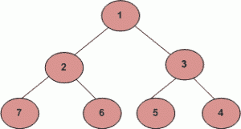

# 之字形树遍历

> 原文:[https://www.geeksforgeeks.org/zigzag-tree-traversal/](https://www.geeksforgeeks.org/zigzag-tree-traversal/)

写一个函数打印二叉树的 ZigZag 顺序遍历。对于下面的二叉树，之字形顺序遍历将是 **1 3 2 7 6 5 4。**



这个问题可以用两个栈来解决。假设两个栈是当前的: **currentlevel 和 nextlevel。**我们还需要一个变量来跟踪当前的级别顺序(无论是从左到右还是从右到左)。我们从 currentlevel 堆栈中弹出并打印节点值。只要当前级别顺序是从左到右，就将节点从左到右推，然后将它的右子节点推到堆栈的下一级。由于堆栈是后进先出(LIFO)结构，下一次当节点从下一级弹出时，它将处于相反的顺序。另一方面，当当前的级别顺序是从右向左时，我们会先将节点推右子节点，然后推其左子节点。最后，不要忘记在每个关卡结束时(即当前关卡为空时)交换那两个堆栈
*下面是上面方法的实现:*

## C++

```
// C++ implementation of a O(n) time method for
// Zigzag order traversal
#include <iostream>
#include <stack>
using namespace std;

// Binary Tree node
struct Node {
    int data;
    struct Node *left, *right;
};

// function to print the zigzag traversal
void zizagtraversal(struct Node* root)
{
    // if null then return
    if (!root)
        return;

    // declare two stacks
    stack<struct Node*> currentlevel;
    stack<struct Node*> nextlevel;

    // push the root
    currentlevel.push(root);

    // check if stack is empty  
    bool lefttoright = true;
    while (!currentlevel.empty()) {

        // pop out of stack
        struct Node* temp = currentlevel.top();
        currentlevel.pop();

        // if not null
        if (temp) {

            // print the data in it
            cout << temp->data << " ";

            // store data according to current
            // order.
            if (lefttoright) {
                if (temp->left)
                    nextlevel.push(temp->left);
                if (temp->right)
                    nextlevel.push(temp->right);
            }
            else {
                if (temp->right)
                    nextlevel.push(temp->right);
                if (temp->left)
                    nextlevel.push(temp->left);
            }
        }

        if (currentlevel.empty()) {
            lefttoright = !lefttoright;
            swap(currentlevel, nextlevel);
        }
    }
}

// A utility function to create a new node
struct Node* newNode(int data)
{
    struct Node* node = new struct Node;
    node->data = data;
    node->left = node->right = NULL;
    return (node);
}

// driver program to test the above function
int main()
{
    // create tree
    struct Node* root = newNode(1);
    root->left = newNode(2);
    root->right = newNode(3);
    root->left->left = newNode(7);
    root->left->right = newNode(6);
    root->right->left = newNode(5);
    root->right->right = newNode(4);
    cout << "ZigZag Order traversal of binary tree is \n";

    zizagtraversal(root);

    return 0;
}
```

## Java 语言(一种计算机语言，尤用于创建网站)

```
// Java implementation of a O(n) time
// method for Zigzag order traversal
import java.util.*;

// Binary Tree node
class Node
{
int data;
Node leftChild;
Node rightChild;
Node(int data)
{
    this.data = data;
}
}

class BinaryTree {
Node rootNode;

// function to print the
// zigzag traversal
void printZigZagTraversal() {

    // if null then return
    if (rootNode == null) {
    return;
    }

    // declare two stacks
    Stack<Node> currentLevel = new Stack<>();
    Stack<Node> nextLevel = new Stack<>();

    // push the root
    currentLevel.push(rootNode);
    boolean leftToRight = true;

    // check if stack is empty
    while (!currentLevel.isEmpty()) {

    // pop out of stack
    Node node = currentLevel.pop();

    // print the data in it
    System.out.print(node.data + " ");

    // store data according to current
    // order.
    if (leftToRight) {
        if (node.leftChild != null) {
        nextLevel.push(node.leftChild);
        }

        if (node.rightChild != null) {
        nextLevel.push(node.rightChild);
        }
    }
    else {
        if (node.rightChild != null) {
        nextLevel.push(node.rightChild);
        }

        if (node.leftChild != null) {
        nextLevel.push(node.leftChild);
        }
    }

    if (currentLevel.isEmpty()) {
        leftToRight = !leftToRight;
        Stack<Node> temp = currentLevel;
        currentLevel = nextLevel;
        nextLevel = temp;
    }
    }
}
}

public class zigZagTreeTraversal {

// driver program to test the above function
public static void main(String[] args)
{
    BinaryTree tree = new BinaryTree();
    tree.rootNode = new Node(1);
    tree.rootNode.leftChild = new Node(2);
    tree.rootNode.rightChild = new Node(3);
    tree.rootNode.leftChild.leftChild = new Node(7);
    tree.rootNode.leftChild.rightChild = new Node(6);
    tree.rootNode.rightChild.leftChild = new Node(5);
    tree.rootNode.rightChild.rightChild = new Node(4);

    System.out.println("ZigZag Order traversal of binary tree is");
    tree.printZigZagTraversal();
}
}

// This Code is contributed by Harikrishnan Rajan.
```

## 蟒蛇 3

```
# Python Program to print zigzag traversal
# of binary tree

# Binary tree node
class Node:
    # Constructor to create a new node
    def __init__(self, data):
        self.data = data
        self.left = self.right = None

# function to print zigzag traversal of
# binary tree
def zizagtraversal(root):

    # Base Case
    if root is None:
        return

    # Create two stacks to store current
    # and next level
    currentLevel = []
    nextLevel = []

    # if ltr is true push nodes from
    # left to right otherwise from
    # right to left
    ltr = True

    # append root to currentlevel stack
    currentLevel.append(root)

    # Check if stack is empty
    while len(currentLevel) > 0:
        # pop from stack
        temp = currentLevel.pop(-1)
        # print the data
        print(temp.data, " ", end="")

        if ltr:
            # if ltr is true push left
            # before right
            if temp.left:
                nextLevel.append(temp.left)
            if temp.right:
                nextLevel.append(temp.right)
        else:
            # else push right before left
            if temp.right:
                nextLevel.append(temp.right)
            if temp.left:
                nextLevel.append(temp.left)

        if len(currentLevel) == 0:
            # reverse ltr to push node in
            # opposite order
            ltr = not ltr
            # swapping of stacks
            currentLevel, nextLevel = nextLevel, currentLevel

# Driver program to check above function
root = Node(1)
root.left = Node(2)
root.right = Node(3)
root.left.left = Node(7)
root.left.right = Node(6)
root.right.left = Node(5)
root.right.right = Node(4)
print("Zigzag Order traversal of binary tree is")
zizagtraversal(root)

# This code is contributed by Shweta Singh
```

## C#

```
// C# implementation of a O(n) time
// method for Zigzag order traversal
using System;
using System.Collections.Generic;

// Binary Tree node
public class Node
{
    public int data;
    public Node leftChild;
    public Node rightChild;
    public Node(int data)
    {
        this.data = data;
    }
}

class GFG
{
    public Node rootNode;

    // function to print the
    // zigzag traversal
    public virtual void printZigZagTraversal()
    {

        // if null then return
        if (rootNode == null)
        {
            return;
        }

        // declare two stacks
        Stack<Node> currentLevel = new Stack<Node>();
        Stack<Node> nextLevel = new Stack<Node>();

        // push the root
        currentLevel.Push(rootNode);
        bool leftToRight = true;

        // check if stack is empty
        while (currentLevel.Count > 0)
        {

        // pop out of stack
        Node node = currentLevel.Pop();

        // print the data in it
        Console.Write(node.data + " ");

        // store data according to current
        // order.
        if (leftToRight)
        {
            if (node.leftChild != null)
            {
                nextLevel.Push(node.leftChild);
            }

            if (node.rightChild != null)
            {
                nextLevel.Push(node.rightChild);
            }
        }
        else
        {
            if (node.rightChild != null)
            {
                nextLevel.Push(node.rightChild);
            }

            if (node.leftChild != null)
            {
                nextLevel.Push(node.leftChild);
            }
        }

        if (currentLevel.Count == 0)
        {
            leftToRight = !leftToRight;
            Stack<Node> temp = currentLevel;
            currentLevel = nextLevel;
            nextLevel = temp;
        }
        }
    }
}

public class zigZagTreeTraversal
{

// Driver Code
public static void Main(string[] args)
{
    GFG tree = new GFG();
    tree.rootNode = new Node(1);
    tree.rootNode.leftChild = new Node(2);
    tree.rootNode.rightChild = new Node(3);
    tree.rootNode.leftChild.leftChild = new Node(7);
    tree.rootNode.leftChild.rightChild = new Node(6);
    tree.rootNode.rightChild.leftChild = new Node(5);
    tree.rootNode.rightChild.rightChild = new Node(4);

    Console.WriteLine("ZigZag Order traversal " +
                            "of binary tree is");
    tree.printZigZagTraversal();
}
}

// This code is contributed by Shrikant13
```

## java 描述语言

```
<script>

    // JavaScript implementation of a O(n) time
    // method for Zigzag order traversal

    class Node
    {
        constructor(data) {
           this.leftChild = null;
           this.rightChild = null;
           this.data = data;
        }
    }

    let rootNode;

    // function to print the
    // zigzag traversal
    function printZigZagTraversal()
    {

        // if null then return
        if (rootNode == null)
        {
            return;
        }

        // declare two stacks
        let currentLevel = [];
        let nextLevel = [];

        // push the root
        currentLevel.push(rootNode);
        let leftToRight = true;

        // check if stack is empty
        while (currentLevel.length > 0)
        {

            // pop out of stack
            let node = currentLevel.pop();

            // print the data in it
            document.write(node.data + " ");

            // store data according to current
            // order.
            if (leftToRight)
            {
                if (node.leftChild != null)
                {
                    nextLevel.push(node.leftChild);
                }

                if (node.rightChild != null)
                {
                    nextLevel.push(node.rightChild);
                }
            }
            else
            {
                if (node.rightChild != null)
                {
                    nextLevel.push(node.rightChild);
                }

                if (node.leftChild != null)
                {
                    nextLevel.push(node.leftChild);
                }
            }

            if (currentLevel.length == 0) {
                leftToRight = !leftToRight;
                let temp = currentLevel;
                currentLevel = nextLevel;
                nextLevel = temp;
            }
        }
    }

    rootNode = new Node(1);
    rootNode.leftChild = new Node(2);
    rootNode.rightChild = new Node(3);
    rootNode.leftChild.leftChild = new Node(7);
    rootNode.leftChild.rightChild = new Node(6);
    rootNode.rightChild.leftChild = new Node(5);
    rootNode.rightChild.rightChild = new Node(4);

    document.write("ZigZag Order traversal of binary tree is" +
    "</br>");
    printZigZagTraversal();

</script>
```

**Output**

```
ZigZag Order traversal of binary tree is 
1 3 2 7 6 5 4 
```

**时间复杂度:**O(n)
T3】空间复杂度: O(n)+(n)=O(n)

**递归方法**:

这里使用的方法是层次顺序遍历的可观察的相似性。这里，我们需要包含一个额外的参数来跟踪以左右或左右方式打印每个级别。

## C++

```
//Initial Template for C++
#include <bits/stdc++.h>
using namespace std;

struct Node {
    int data;
    Node *left;
    Node *right;

    Node(int val) {
        data = val;
        left = right = NULL;
    }
};

// Function to Build Tree
Node* buildTree(string str)
{  
    // Corner Case
    if(str.length() == 0 || str[0] == 'N')
            return NULL;

    // Creating vector of strings from input
    // string after splitting by space
    vector<string> ip;

    istringstream iss(str);
    for(string str; iss >> str; )
        ip.push_back(str);

    // Create the root of the tree
    Node* root = new Node(stoi(ip[0]));

    // Push the root to the queue
    queue<Node*> queue;
    queue.push(root);

    // Starting from the second element
    int i = 1;
    while(!queue.empty() && i < ip.size()) {

        // Get and remove the front of the queue
        Node* currNode = queue.front();
        queue.pop();

        // Get the current node's value from the string
        string currVal = ip[i];

        // If the left child is not null
        if(currVal != "N") {

            // Create the left child for the current node
            currNode->left = new Node(stoi(currVal));

            // Push it to the queue
            queue.push(currNode->left);
        }

        // For the right child
        i++;
        if(i >= ip.size())
            break;
        currVal = ip[i];

        // If the right child is not null
        if(currVal != "N") {

            // Create the right child for the current node
            currNode->right = new Node(stoi(currVal));

            // Push it to the queue
            queue.push(currNode->right);
        }
        i++;
    }

    return root;
}

// Function to calculate height of tree
int treeHeight(Node *root){
    if(!root) return 0;
    int lHeight = treeHeight(root->left);
    int rHeight = treeHeight(root->right);
    return max(lHeight, rHeight) + 1;
}

// Helper Function to store the zig zag order traversal
// of tree in a list recursively
void zigZagTraversalRecursion(Node* root, int height, bool lor, vector<int> &ans){
    // Height = 1 means the tree now has only one node
    if(height <= 1){
        if(root) ans.push_back(root->data);
    }
    // When Height > 1
    else{
        if(lor){
            if(root->left) zigZagTraversalRecursion(root->left, height - 1, lor, ans);
            if(root->right) zigZagTraversalRecursion(root->right, height - 1, lor, ans);
        }
        else{
            if(root->right) zigZagTraversalRecursion(root->right, height - 1, lor, ans);
            if(root->left) zigZagTraversalRecursion(root->left, height - 1, lor, ans);
        }
    }
}

// Function to traverse tree in zig zag order
vector <int> zigZagTraversal(Node* root)
{
    vector<int> ans;
    bool leftOrRight = true;
    int height = treeHeight(root);
    for(int i = 1; i <= height; i++){
        zigZagTraversalRecursion(root, i, leftOrRight, ans);
        leftOrRight = !leftOrRight;
    }
    return ans;
}

int main()
{   
      // Tree:
    //          1
    //        /   \
    //       /     \
    //      /       \
    //     2          3
    //   /   \       /  \
    //  4     5     6     7
    // / \   /  \  / \   /  \
    //8  9  10 11 12 13 14  15

    string s = "1 2 3 4 5 6 7 8 9 10 11 12 13 14 15";
    Node* root = buildTree(s);
    vector <int> res = zigZagTraversal(root);
      cout<<"ZigZag traversal of binary tree is:"<<endl;
    for (int i = 0; i < res.size (); i++) cout << res[i] << " ";
    cout<<endl;
  return 0;
}
// Code By Angshuman Sengupta
```

**Output**

```
ZigZag traversal of binary tree is:
1 3 2 4 5 6 7 15 14 13 12 11 10 9 8 

```

输出:

> 二叉树的曲折遍历是:
> 
> 1 3 2 4 5 6 7 15 14 13 12 11 10 9 8

**另一种方法:**
在这种方法中，用一个德克尔来解决问题。根据级别是奇数还是偶数，以不同的方式推送和弹出。

下面是上述方法的实现:

## C++

```
// C++ implementation of a O(n) time method for
// Zigzag order traversal
#include <bits/stdc++.h>
#include <iostream>
using namespace std;

// Binary Tree node
class Node {
public:
    int data;
    Node *left, *right;
};

// Function to print the zigzag traversal
vector<int> zigZagTraversal(Node* root)
{
    deque<Node*> q;
    vector<int> v;
    q.push_back(root);
    v.push_back(root->data);
    Node* temp;

    // set initial level as 1, because root is
    // already been taken care of.
    int l = 1;

    while (!q.empty()) {
        int n = q.size();

        for (int i = 0; i < n; i++) {

            // popping mechanism
            if (l % 2 == 0) {
                temp = q.back();
                q.pop_back();
            }
            else {
                temp = q.front();
                q.pop_front();
            }

            // pushing mechanism
            if (l % 2 != 0) {

                if (temp->right) {
                    q.push_back(temp->right);
                    v.push_back(temp->right->data);
                }
                if (temp->left) {
                    q.push_back(temp->left);
                    v.push_back(temp->left->data);
                }
            }
            else if (l % 2 == 0) {

                if (temp->left) {
                    q.push_front(temp->left);
                    v.push_back(temp->left->data);
                }
                if (temp->right) {
                    q.push_front(temp->right);
                    v.push_back(temp->right->data);
                }
            }
        }
        l++; // level plus one
    }
    return v;
}

// A utility function to create a new node
struct Node* newNode(int data)
{
    struct Node* node = new struct Node;
    node->data = data;
    node->left = node->right = NULL;
    return (node);
}

// Driver program to test
// the above function
int main()
{

    // vector to store the traversal order.
    vector<int> v;

    // create tree
    struct Node* root = newNode(1);
    root->left = newNode(2);
    root->right = newNode(3);
    root->left->left = newNode(7);
    root->left->right = newNode(6);
    root->right->left = newNode(5);
    root->right->right = newNode(4);
    cout << "ZigZag Order traversal of binary tree is \n";

    v = zigZagTraversal(root);

    for (int i = 0; i < v.size();
         i++) { // to print the order
        cout << v[i] << " ";
    }

    return 0;
}
// This code is contributed by Ritvik Mahajan
```

## Java 语言(一种计算机语言，尤用于创建网站)

```
// Java implementation of a O(n) time method for
// Zigzag order traversal
import java.util.*;
public class Main
{
    // Class containing left and
    // right child of current
    // node and key value
    static class Node {

        public int data;
        public Node left, right;

        public Node(int data)
        {
            this.data = data;
            left = right = null;
        }
    }

    // A utility function to create a new node
    static Node newNode(int data)
    {
        Node node = new Node(data);
        return node;
    }

    // Function to print the zigzag traversal
    static Vector<Integer> zigZagTraversal(Node root)
    {
        Deque<Node> q = new LinkedList<Node>();
        Vector<Integer> v = new Vector<Integer>();
        q.add(root);
        v.add(root.data);
        Node temp;

        // set initial level as 1, because root is
        // already been taken care of.
        int l = 1;

        while (q.size() > 0) {
            int n = q.size();

            for (int i = 0; i < n; i++) {

                // popping mechanism
                if (l % 2 == 0) {
                    temp = q.peekLast();
                    q.pollLast();
                }
                else {
                    temp = q.peekFirst();
                    q.pollFirst();
                }

                // pushing mechanism
                if (l % 2 != 0) {

                    if (temp.right != null) {
                        q.add(temp.right);
                        v.add(temp.right.data);
                    }
                    if (temp.left != null) {
                        q.add(temp.left);
                        v.add(temp.left.data);
                    }
                }
                else if (l % 2 == 0) {

                    if (temp.left != null) {
                        q.offerFirst(temp.left);
                        v.add(temp.left.data);
                    }
                    if (temp.right != null) {
                        q.offerFirst(temp.right);
                        v.add(temp.right.data);
                    }
                }
            }
            l++; // level plus one
        }
        return v;
    }

    public static void main(String[] args)
    {

        // vector to store the traversal order.
        Vector<Integer> v;

        // create tree
        Node root = newNode(1);
        root.left = newNode(2);
        root.right = newNode(3);
        root.left.left = newNode(7);
        root.left.right = newNode(6);
        root.right.left = newNode(5);
        root.right.right = newNode(4);
        System.out.println("ZigZag Order traversal of binary tree is");

        v = zigZagTraversal(root);

        for (int i = 0; i < v.size();
             i++) { // to print the order
            System.out.print(v.get(i) + " ");
        }
    }
}

// This code is contributed by divyesh072019.
```

## 蟒蛇 3

```
# Python3 implementation of a O(n) time method for
# Zigzag order traversal
from collections import deque

# Binary Tree node
class Node:
    def __init__(self, data):
        self.data = data
        self.left = None
        self.right = None

# Function to print the zigzag traversal
def zigZagTraversal(root):
    q = deque([])
    v = []
    q.append(root)
    v.append(root.data)

    # set initial level as 1, because root is
    # already been taken care of.
    l = 1

    while len(q) > 0:
        n = len(q)
        for i in range(n):
            # popping mechanism
            if (l % 2 == 0):
                temp = q[-1]
                q.pop()
            else:
                temp = q[0]
                q.popleft()

            # pushing mechanism
            if (l % 2 != 0):
                if (temp.right):
                    q.append(temp.right)
                    v.append(temp.right.data)
                if (temp.left):
                    q.append(temp.left)
                    v.append(temp.left.data)
            elif (l % 2 == 0):
                if (temp.left):
                    q.appendleft(temp.left)
                    v.append(temp.left.data)
                if (temp.right):
                    q.appendleft(temp.right)
                    v.append(temp.right.data)
        l+=1 # level plus one
    return v

# vector to store the traversal order.
v = []

# create tree
root = Node(1)
root.left = Node(2)
root.right = Node(3)
root.left.left = Node(7)
root.left.right = Node(6)
root.right.left = Node(5)
root.right.right = Node(4)
print("ZigZag Order traversal of binary tree is")

v = zigZagTraversal(root)

for i in range(len(v)):
    print(v[i], end = " ")

    # This code is contributed by suresh07.
```

**Output**

```
ZigZag Order traversal of binary tree is 
1 3 2 7 6 5 4 
```

**时间复杂度:** O(N)

**辅助空间:** O(N)为 deque 数据结构

**另一种方法:**

我们可以像在级别顺序遍历中一样使用队列。但是在这种情况下，我们还可以维护一个标志变量，它跟踪交替级别，以颠倒相应级别遍历的顺序

## C++

```
// C++ implementation of a O(n) time method for
// Zigzag order traversal
#include <bits/stdc++.h>
#include <iostream>
using namespace std;

// Binary Tree node
class Node {
public:
    int data;
    Node *left, *right;
};

// Function to print the zigzag traversal
vector<int> zigZagTraversal(Node* root) {
    if(root == NULL){return {  } ; }

    vector<int > ans ;
    queue<Node*> q ;
    q.push(root) ;
    bool flag = false ;

    while(!q.empty()){
        int size = q.size() ;
        vector<int> level ;
        for(int i=0 ; i < size ; i++){
            Node* node = q.front() ;
            q.pop() ;
            level.push_back(node->data) ;

            if(node->left != NULL) {q.push(node->left) ;}
            if(node->right != NULL) {q.push(node->right) ;}   

        }
        flag = !flag ;  
        if(flag == false){
            reverse(level.begin() , level.end()) ;           
        }
        for(int i = 0 ; i < level.size() ; i++){
          ans.push_back(level[i]) ;
        }

    }
    return ans ;
}

// A utility function to create a new node
struct Node* newNode(int data)
{
    struct Node* node = new struct Node;
    node->data = data;
    node->left = node->right = NULL;
    return (node);
}

// Driver program to test
// the above function
int main()
{

    // vector to store the traversal order.
    vector<int> v;

    // create tree
    struct Node* root = newNode(1);
    root->left = newNode(2);
    root->right = newNode(3);
    root->left->left = newNode(7);
    root->left->right = newNode(6);
    root->right->left = newNode(5);
    root->right->right = newNode(4);
    cout << "ZigZag Order traversal of binary tree is \n";

    v = zigZagTraversal(root);

    for (int i = 0; i < v.size();
         i++) { // to print the order
        cout << v[i] << " ";
    }

    return 0;
}
```

**Output**

```
ZigZag Order traversal of binary tree is 
1 3 2 7 6 5 4 
```

**时间复杂度:** O(N)

**辅助空间**:队列数据结构的 O(N)

下面是这个问题的一个简单实现。(视频)
[**等级顺序以螺旋形式遍历**](https://www.geeksforgeeks.org/level-order-traversal-in-spiral-form/)