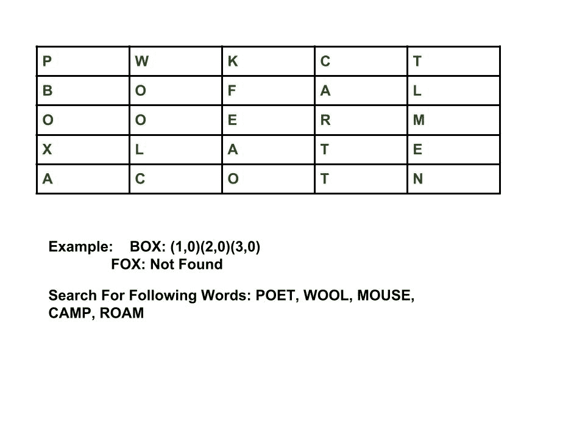

# Zoho 面试体验|第 21 集(校内)

> 原文:[https://www . geesforgeks . org/zoho-面试-体验-设置-21-校园/](https://www.geeksforgeeks.org/zoho-interview-experience-set-21-campus/)

**问题 1 :** 写一个程序，判断给定的数是否可以表示为两个素数之和。

例如，34 可以表示为两个素数之和，但 23 不能。

**问题 2 :** 取一个 2 或 3 位数的输入数，反过来加到原数上，直到得到的数是回文或 5 次迭代完成。

输入:n = 32
输出:55
23 + 32 = 55 是回文。

输入:39
输出:363

**问题 3 :** [给定一个字符串，只反转其中的元音；](https://practice.geeksforgeeks.org/problems/reverse-vowels-in-a-given-string/0)保持字符串的其余部分不变。

输入:abcdef
输出:ebcdaf

**问题 4 :** [编写一个程序，检查给定的单词是否出现在下面给出的矩阵](https://practice.geeksforgeeks.org/problems/find-the-string-in-grid/0)中。单词可以是从左到右、从上到下和对角线(从上到下)



**问题 5 :** 写一个程序，用给定的一组单词组成线条。队形应该遵循以下规则。

I)单行中的字符总数(不包括单词和喜爱的字符之间的空格)不应超过给定的数量。

ii)收藏夹字符不区分大小写。

iii)文字不应该被打散。完整的单词应该单独用在一行。一个词只能用在一行。

```
Input : Max char per line = 10
        Favorite character = 'o'
        Words : Zoho, Eating, Watching, Pogo
                Loving, Mango
Output : Watching Zoho
         Eating Mango
         Loving Pogo.
```

如果你喜欢极客博客并想投稿，你也可以写一篇文章并把你的文章邮寄到 contribute@geeksforgeeks.org。看到你的文章出现在极客博客主页上，帮助其他极客。

如果您发现任何不正确的地方，或者您想分享更多关于上面讨论的主题的信息，请写评论

## 相关实践问题

[Find the string in grid](https://practice.geeksforgeeks.org/problems/find-the-string-in-grid/0)[Sum Palindrome](https://practice.geeksforgeeks.org/problems/sum-palindrome/0)[Reversing the vowels](https://practice.geeksforgeeks.org/problems/reversing-the-vowels/0)[Return two prime numbers](https://practice.geeksforgeeks.org/problems/return-two-prime-numbers/0)[Primes sum](https://practice.geeksforgeeks.org/problems/primes-sum/0)[All Practice Problems for Zoho](https://practice.geeksforgeeks.org/company/Zoho/) !