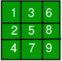

# Zycus 面试体验

> 原文:[https://www.geeksforgeeks.org/zycus-interview-experience/](https://www.geeksforgeeks.org/zycus-interview-experience/)

**第 1 轮:**第一轮为资质轮，30 分钟 10 题。难度等级:容易。对于每一个正确的答案，将给予 2 分，对于每一个错误的答案，将给予 1 分。
他们已经宣布了下一轮的截止日期，是 14 日。
我在正确的地方解决了 9 个。
满分 150 分+约。70-80 击败了第一轮。

**第 2 轮:**书面编码轮:这一轮我们要在纸上写代码。
有两个部分(A 和 B)，我们必须在 45 分钟内解决其中任何一个部分。
A 区:[https://www . geeksforgeeks . org/backtttrack-set-2-迷宫中的老鼠/](https://www.geeksforgeeks.org/backttracking-set-2-rat-in-a-maze/)
B 区:包含两个问题:
1。[https://www . geesforgeks . org/two-elements-其和最接近于零/](https://www.geeksforgeeks.org/two-elements-whose-sum-is-closest-to-zero/)
2。[https://www.geeksforgeeks.org/sort-elements-by-frequency/](https://www.geeksforgeeks.org/sort-elements-by-frequency/)

**第 3 轮:** 44 人被排序列入面试名单。
在等了整整一夜之后，我的名字被叫了出来
只有一个面试官他很友好他要求解释我的解决方案我解释了一下，他看起来很满意。然后他问了我两个谜题。
谜题 1:你有两根蜡烛。每次燃烧 60 分钟。你怎么能用这个测量 45 分钟？
谜题 2:[https://en.wikipedia.org/wiki/Bridge_and_torch_problem](https://en.wikipedia.org/wiki/Bridge_and_torch_problem)(数据不同)
然后他一个一个的问了我三个编码问题，我也要在纸上编码。

Q1:大小为 n 和 n+m 的两个数组。第一个数组是完全填充和排序的，第二个数组是按排序顺序包含 m 个元素。现在的问题是对第二个数组进行排序，使其包含具有以下条件的第一个数组的元素。
条件:
1。第二个数组应始终保持排序。
2。不能使用任何辅助数组。
3。不能使用任何短路算法(比如复制第二个数组中的元素，然后排序)。
我第二次尝试就解决了。

Q2:有一个 2m 大小的数组(一维)包含一些随机数，还有一个 m*m 大小的二维数组，你必须用下面的方式填充这个二维数组。
 
1 st 代表一维数组的第一个元素。

Q3:有两个字符串，第一个字符串包含字符和两个特殊(*和 _)例如:qw*ty_bc
第二个字符串只包含字符例如:qwertyabc
现在你要检查字符串是否有效其中' _ '只能替换一个字符而*可以替换多个字符。在上例中，字符串是有效的。
最后一个问题很简单，尽管我错过了一些面试官提到的边缘案例。

**人力资源回合:**
正常人力资源会谈

谢谢你，G4G。

如果你喜欢极客博客并想投稿，你也可以写一篇文章并把你的文章邮寄到 contribute@geeksforgeeks.org。看到你的文章出现在极客博客主页上，帮助其他极客。

## 相关实践问题

[Sorting Elements of an Array by Frequency](https://practice.geeksforgeeks.org/problems/sorting-elements-of-an-array-by-frequency/0)[All Practice Problems for Zycus](https://practice.geeksforgeeks.org/company/Zycus/) !