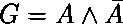
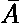
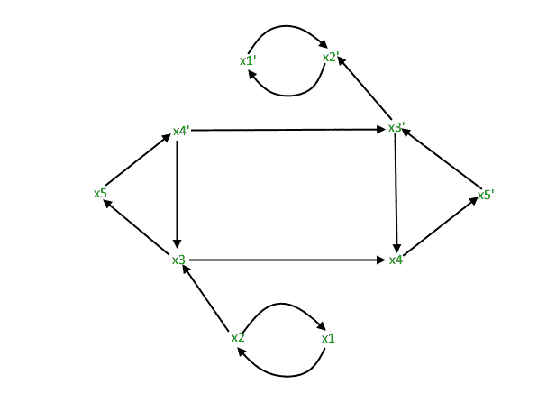
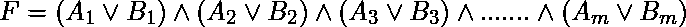
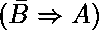
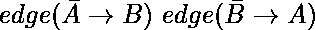
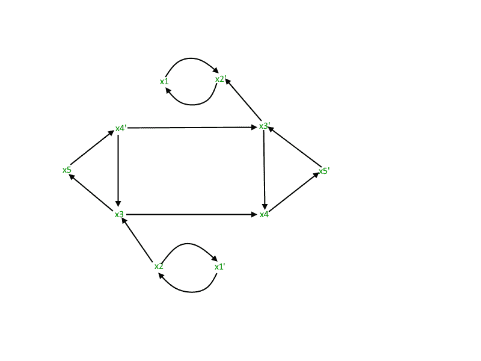
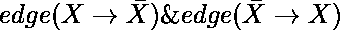
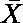
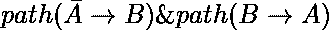

# 2 满意度（2-SAT）问题

> 原文： [https://www.geeksforgeeks.org/2-satisfiability-2-sat-problem/](https://www.geeksforgeeks.org/2-satisfiability-2-sat-problem/)

## 布尔可满足性问题

布尔可满足性或简单地 **SAT** 是确定布尔公式是否可满足或无法满足的问题。

*   **可满足：**如果可以为布尔变量分配值，从而使公式变为 TRUE，则可以说该公式是可满足的。
*   **无法满足：**如果无法分配此类值，那么我们说该公式无法满足。

**示例：**

*   是可满足的，因为 A = TRUE 而 B = FALSE 使 F = TRUE。
*    , is unsatisfiable, because:

    |  |  |  |
    | 真正 | 假 | 假 |
    | 假 | 真正 | 假 |

**注意：**布尔可满足性问题是 [NP 完整](https://en.wikipedia.org/wiki/NP-completeness)（有关证明，请参考< a href =“ https://en.wikipedia.org/wiki/Cook%E2%80 ％93Levin_theorem“ target =” _ b  lank“ > Cook's Theorem）。

## 什么是 2-SAT 问题

> 2-SAT 是布尔可满足性问题的特例，可以在[多项式时间](https://en.wikipedia.org/wiki/Time_complexity#Polynomial_time)中解决
> 。

为了更好地理解这一点，首先让我们看看什么是合取范式（CNF）或也称为和积（POS）。
**CNF：** CNF 是子句的连接（AND），其中每个子句都是析取（OR）。

现在，2-SAT 将 SAT 问题限制为仅表示为 CNF 且每个子句仅具有 **2 项**（也称为 **2-CNF** ）的布尔公式。

**示例：** 

因此，2 满足性问题可以表述为：

**给定 CNF，每个子句只有 2 个项，是否可以将此类值分配给变量，以使 CNF 为 TRUE？**

例子：

```
Input : 
Output : The given expression is satisfiable. 
         (for x1 = FALSE, x2 = TRUE)

Input : 
Output : The given expression is unsatisfiable. 
         (for all possible combinations of x1 and x2)

```

## 2-SAT 问题的方法

为了使 CNF 值变为 TRUE，每个子句的值都应为 TRUE。 让子句之一为。

** = TRUE**

*   如果 A = 0，则 B 必须为 1，即
*   如果 B = 0，则 A 必须为 1，即

从而，

```
 = TRUE is equivalent to 
```

现在，我们可以将 CNF 表示为蕴涵。 因此，我们为 CNF 的每个子句创建一个具有 2 条边的隐含图。
在隐含图中表示为
。因此，对于带有'm'子句的布尔公式，我们制作具有以下含义的隐含图：

*   每个子句 2 条边，即“ 2m”条边。
*   布尔公式中涉及的每个布尔变量 1 个节点。

让我们看一个蕴涵图的例子。
****



**注意：**的含义（如果是 A 则为 B）等同于它的对立含义（如果是则为）。

现在，考虑以下情况：

```
CASE 1: If  exists in the graph
This means 
If X = TRUE,  = TRUE, which is a contradiction.
But if X = FALSE, there are no implication constraints.
Thus, X = FALSE
```

```
CASE 2: If  exists in the graph
This means 
If  = TRUE, X = TRUE, which is a contradiction.
But if  = FALSE, there are no implication constraints.
Thus,  = FALSE i.e. X = TRUE
```

```
CASE 3: If  both exist in the graph
One edge requires X to be TRUE and the other one requires X to be FALSE.
Thus, there is no possible assignment in such a case.
```

**结论：**如果任意两个变量和处于循环中，即都存在，则 CNF 不能满足要求。 否则，可能存在分配并且 CNF 是可满足的。
请注意，由于以下隐含属性，我们使用路径：
如果我们具有
因此，如果我们在隐含图中有路径，则与具有 直接边缘。

**实施观点的结论：**
如果 X 和都位于同一 SCC（牢固连接的组件）中，则 CNF 不能满足要求。
有向图的强连接组件具有节点，因此可以从该 SCC 中的每个其他节点到达每个节点。
现在，如果 X 和位于同一 SCC 上，则我们肯定会出现，因此得出结论。

可以使用 [Kosaraju 的算法](https://www.geeksforgeeks.org/strongly-connected-components/)在 O（E + V）中完成 SCC 的检查

```

// C++ implementation to find if the given 
// expression is satisfiable using the 
// Kosaraju's Algorithm 
#include <bits/stdc++.h> 
using namespace std; 

const int MAX = 100000; 

// data structures used to implement Kosaraju's 
// Algorithm. Please refer 
// http://www.geeksforgeeks.org/strongly-connected-components/ 
vector<int> adj[MAX]; 
vector<int> adjInv[MAX]; 
bool visited[MAX]; 
bool visitedInv[MAX]; 
stack<int> s; 

// this array will store the SCC that the 
// particular node belongs to 
int scc[MAX]; 

// counter maintains the number of the SCC 
int counter = 1; 

// adds edges to form the original graph 
void addEdges(int a, int b) 
{ 
    adj[a].push_back(b); 
} 

// add edges to form the inverse graph 
void addEdgesInverse(int a, int b) 
{ 
    adjInv[b].push_back(a); 
} 

// for STEP 1 of Kosaraju's Algorithm 
void dfsFirst(int u) 
{ 
    if(visited[u]) 
        return; 

    visited[u] = 1; 

    for (int i=0;i<adj[u].size();i++) 
        dfsFirst(adj[u][i]); 

    s.push(u); 
} 

// for STEP 2 of Kosaraju's Algorithm 
void dfsSecond(int u) 
{ 
    if(visitedInv[u]) 
        return; 

    visitedInv[u] = 1; 

    for (int i=0;i<adjInv[u].size();i++) 
        dfsSecond(adjInv[u][i]); 

    scc[u] = counter; 
} 

// function to check 2-Satisfiability 
void is2Satisfiable(int n, int m, int a[], int b[]) 
{ 
    // adding edges to the graph 
    for(int i=0;i<m;i++) 
    { 
        // variable x is mapped to x 
        // variable -x is mapped to n+x = n-(-x) 

        // for a[i] or b[i], addEdges -a[i] -> b[i] 
        // AND -b[i] -> a[i] 
        if (a[i]>0 && b[i]>0) 
        { 
            addEdges(a[i]+n, b[i]); 
            addEdgesInverse(a[i]+n, b[i]); 
            addEdges(b[i]+n, a[i]); 
            addEdgesInverse(b[i]+n, a[i]); 
        } 

        else if (a[i]>0 && b[i]<0) 
        { 
            addEdges(a[i]+n, n-b[i]); 
            addEdgesInverse(a[i]+n, n-b[i]); 
            addEdges(-b[i], a[i]); 
            addEdgesInverse(-b[i], a[i]); 
        } 

        else if (a[i]<0 && b[i]>0) 
        { 
            addEdges(-a[i], b[i]); 
            addEdgesInverse(-a[i], b[i]); 
            addEdges(b[i]+n, n-a[i]); 
            addEdgesInverse(b[i]+n, n-a[i]); 
        } 

        else
        { 
            addEdges(-a[i], n-b[i]); 
            addEdgesInverse(-a[i], n-b[i]); 
            addEdges(-b[i], n-a[i]); 
            addEdgesInverse(-b[i], n-a[i]); 
        } 
    } 

    // STEP 1 of Kosaraju's Algorithm which 
    // traverses the original graph 
    for (int i=1;i<=2*n;i++) 
        if (!visited[i]) 
            dfsFirst(i); 

    // STEP 2 pf Kosaraju's Algorithm which 
    // traverses the inverse graph. After this, 
    // array scc[] stores the corresponding value 
    while (!s.empty()) 
    { 
        int n = s.top(); 
        s.pop(); 

        if (!visitedInv[n]) 
        { 
            dfsSecond(n); 
            counter++; 
        } 
    } 

    for (int i=1;i<=n;i++) 
    { 
        // for any 2 vairable x and -x lie in 
        // same SCC 
        if(scc[i]==scc[i+n]) 
        { 
            cout << "The given expression "
                 "is unsatisfiable." << endl; 
            return; 
        } 
    } 

    // no such variables x and -x exist which lie 
    // in same SCC 
    cout << "The given expression is satisfiable."
         << endl; 
    return; 
} 

//  Driver function to test above functions 
int main() 
{ 
    // n is the number of variables 
    // 2n is the total number of nodes 
    // m is the number of clauses 
    int n = 5, m = 7; 

    // each clause is of the form a or b 
    // for m clauses, we have a[m], b[m] 
    // representing a[i] or b[i] 

    // Note: 
    // 1 <= x <= N for an uncomplemented variable x 
    // -N <= x <= -1 for a complemented variable x 
    // -x is the complement of a variable x 

    // The CNF being handled is: 
    // '+' implies 'OR' and '*' implies 'AND' 
    // (x1+x2)*(x2’+x3)*(x1’+x2’)*(x3+x4)*(x3’+x5)* 
    // (x4’+x5’)*(x3’+x4) 
    int a[] = {1, -2, -1, 3, -3, -4, -3}; 
    int b[] = {2, 3, -2, 4, 5, -5, 4}; 

    // We have considered the same example for which 
    // Implication Graph was made 
    is2Satisfiable(n, m, a, b); 

    return 0; 
} 

```

输出：

```
The given expression is satisfiable.

```

 **更多测试用例：**

```
Input : n = 2, m = 3
        a[] = {1, 2, -1}
        b[] = {2, -1, -2}
Output : The given expression is satisfiable.

Input : n = 2, m = 4
        a[] = {1, -1, 1, -1}
        b[] = {2, 2, -2, -2}
Output : The given expression is unsatisfiable.

```

本文由 **Aanya Jindal** 提供。 如果您喜欢 GeeksforGeeks 并希望做出贡献，则还可以使用 [tribution.geeksforgeeks.org](http://www.contribute.geeksforgeeks.org) 撰写文章，或将您的文章邮寄至 tribution@geeksforgeeks.org。 查看您的文章出现在 GeeksforGeeks 主页上，并帮助其他 Geeks。

如果发现任何不正确的地方，或者想分享有关上述主题的更多信息，请写评论。

