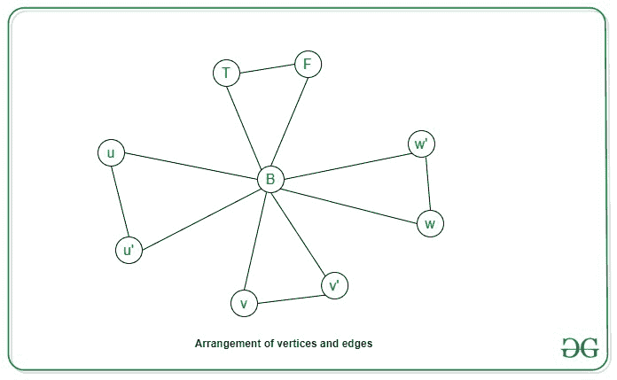

# 3 色是 NP 完整版

> 原文： [https://www.geeksforgeeks.org/3-coloring-is-np-complete/](https://www.geeksforgeeks.org/3-coloring-is-np-complete/)

**先决条件**：[NP 完整性](https://www.geeksforgeeks.org/np-completeness-set-1/)和[图形着色](https://www.geeksforgeeks.org/graph-coloring-applications/)

**<u>图 K 着色问题</u>**：无向图的 K 着色问题是将颜色分配给图的节点，使得没有两个相邻的顶点具有相同的颜色，并且[ **最多使用 K 种**颜色来完成图形的着色。

**<u>问题陈述</u>**：给定一个图 **G（V，E）**和整数 K = 3，任务是确定该图是否可以使用[ **最多 3 种**颜色，因此不会给两个相邻的顶点提供相同的颜色。

**<u>说明</u>** ：

问题的一个实例是为问题指定的输入。 **3 色问题**的一个实例是无向图 **G（V，E）**，任务是检查每个顶点是否有可能的颜色分配`V`仅使用 3 种不同的颜色，每个邻居的颜色也不同。 由于 NP-Complete 问题是 **NP** 和 **NP-hard** 都存在的问题，因此证明问题为 NP-Complete 的陈述的证据包括两部分：

> 1.  问题本身在 **NP 类** 中。
> 2.  NP 类中的所有其他问题都可以通过多项式时间归约。

如果仅满足**第二条件**，则该问题称为 **NP-Hard** 。

但是不可能将每个 NP 问题都简化为另一个 NP 问题以始终显示其 NP 完整性。 因此，要表明问题是 NP-Complete，则证明问题出在 **NP** 中，并且可以将任何 **NP-Complete 问题**还原为该问题，即，如果 B 是 NP-Complete 且 B≤P C ，然后对于 NP 中的 C，则 C 为 NP-完全。 因此，可以得出以下结论，**图 K 着色问题**是 NP-完全的：

**NP 中有 3 种颜色的问题**：

如果 NP 中有任何问题，则给定证书，该证书可以解决问题和问题的实例（图表 **G （V，E）**和颜色 **{c 1 ，c 2 ，c 3 }** 的分配 顶点从这三种颜色中分配了一种颜色 **{c 1 ，c 2 ，c 3 }** ），则可以对其进行验证 （检查给出的解是否正确）证明证书在多项式时间内。 这可以通过以下方式完成：

> 对于图 G 中的每个边{u，v}，验证颜色 c（u）！= c（v）

因此，可以检查赋值相对于其边 O（V + E）的图形多项式时间的正确性。

**3 色问题是 NP-Hard**：

为了证明 3 色问题是 NP-Hard，请将已知的 NP-Hard 问题简化为该问题。 进行还原，从而可以将 3-SAT 问题简化为三色问题。 让我们假设 3-SAT 问题的 3-SAT 公式具有 n 个变量的 m 个子句，这些变量由 **x 1 ，x 2 ，…，x 表示 n** 。 然后可以通过以下方式从公式构造图形：

1.  对于每个变量 **x i** ，在图中构造一个顶点 **v i** ，并构造一个顶点 **v i'[** 表示变量 **x i** 的取反。

2.  对于 m 中的每个子句 c，添加 5 个对应于值 c1，c1，...，c5 的顶点。

3.  另外添加了三个不同颜色的顶点，分别表示值 True，False 和 Base（T，F，B）。

4.  在这三个附加顶点 **T，F，B** 之间添加边以形成三角形。

5.  在顶点 **v i** 和 **v i’** 和底边（B）之间添加边以形成三角形。

**以下限制适用于图 G**：

1.  对于每个顶点对 **v i** v **v i'** ，每个顶点都被分配为 TRUE 值，而另一个为 FALSE 。

2.  对于 m 个子句中的每个子句 c，至少一个文字必须具有 TRUE 值，该值才为 true。

因此，可以通过输入节点 u，v，w 为公式中的每个子句 **c =（u V v V w）**构造一个小的 OR-gadget 图，并将 gadget 的输出节点连接到两个 False 和 Base 特殊节点。

让我们考虑公式 **f =（u’V v V w’）**和**（u V v V w’）**

**现在可以通过以下两个命题证明这种减少**：

让我们假设 3-SAT 公式具有令人满意的赋值，然后在每个子句中，至少一个文字 **x i** 必须为真，因此，可以将相应的 **v i** 分配为真彩色，而 **v i'** 为 FALSE。 现在，将其扩展，对于每个子句，对应的 OR 小工具图可以是 3 色的。 因此，该图可以是 3 色的。

让我们考虑图 G 是 3 色的，因此，如果将顶点 vi 分配为真色，则将变量 x i 对应为真。 这将构成合法的事实分配。 同样，对于任何子句 **C j =（x V y V z）**，不可能所有三个文字 x，y，z 都是 False。 因为在这种情况下， **C j** 的 OR 小工具图的输出必须着色为 False。 这是一个矛盾，因为输出连接到 Base 和 False。 因此，存在对 3-SAT 子句的满意分配。

**<u>结论</u>**：因此，3 色是 **NP 完全**问题。

* * *

* * *

如果您喜欢 GeeksforGeeks 并希望做出贡献，则还可以使用 [tribution.geeksforgeeks.org](https://contribute.geeksforgeeks.org/) 撰写文章，或将您的文章邮寄至 tribution@geeksforgeeks.org。 查看您的文章出现在 GeeksforGeeks 主页上，并帮助其他 Geeks。

如果您发现任何不正确的地方，请单击下面的“改进文章”按钮，以改进本文。