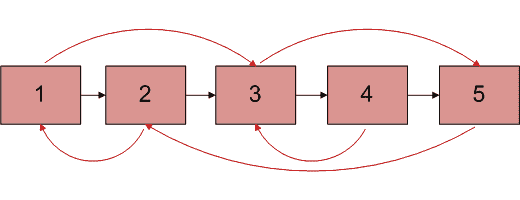
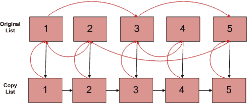

# 使用下一个随机指针克隆链接列表| 设置1

您会得到一个双链接列表，每个节点的一个指针指向下一个节点，就像在单个链接列表中一样。 但是，第二个指针可以指向列表中的任何节点，而不仅仅是前一个节点。 现在以 **O（n）时间**编写一个程序来复制此列表。 也就是说，编写一个程序来创建此列表的副本。

让我们将第二个指针称为仲裁指针，因为它可以指向链表中的任意节点。



图1

任意指针显示为红色，下一个指针显示为黑色

**方法1（使用O（n）多余的空间）**
此方法首先将（原始列表的）下一个和任意映射存储在数组中，然后修改原始的“链表”（以创建副本）， 创建一个副本。 最后恢复原始列表。

1）使用下一个指针在复制链接列表中创建所有节点。
2）存储节点及其原​​始链表的下一个指针映射。
3）更改原始链表中所有节点的下一个指针，使其指向复制链表中的相应节点。
下图显示了经过上述3个步骤的两个链接列表的状态。 红色箭头显示仲裁指针，黑色箭头显示下一个指针。



图2

4）更改副本链表中所有节点的仲裁指针，使其指向原始链表中的相应节点。
5）现在，如下所示在复制链表中构造仲裁指针，并恢复原始链表中节点的下一个指针。

```
       copy_list_node->arbit =
                      copy_list_node->arbit->arbit->next;
       copy_list_node = copy_list_node->next; 

```

6）从存储的映射中还原原始链表中的下一个指针（在步骤2中）。

时间复杂度：O（n）
辅助空间：O（n）

**方法2（使用常量额外空间）**
感谢Saravanan Mani提供此解决方案。 该解决方案使用恒定的空间。
1）创建节点1的副本，并将其插入到原始链表中的节点1 &节点2之间，创建2的副本，并将其插入2 & 3之间。.以这种方式继续，添加 复制第N个节点后的N
2）现在，以这种方式复制任意链接

```
     original->next->arbitrary = original->arbitrary->next;  /*TRAVERSE 
TWO NODES*/

```

这是有效的，因为original-> next只是原始副本，而Original-> arbitrary-> next只是任意副本。
3）现在，以这种方式在单个循环中还原原始列表并复制链接列表。

```
     original->next = original->next->next;
     copy->next = copy->next->next;

```

4）确保original-> next的最后一个元素为NULL。

请参阅以下帖子以了解此方法的实现。
**[在O（1）空间中克隆带有下一个指针和随机指针的链表](https://www.geeksforgeeks.org/clone-linked-list-next-random-pointer-o1-space/)**

时间复杂度：O（n）
辅助空间：O（1）

有关基于哈希的实现，请参见后续文章。
[克隆带有下一个随机指针的链表| 设置2](https://www.geeksforgeeks.org/clone-linked-list-next-arbit-pointer-set-2/)

由Varun Bhatia询问。 如果发现任何不正确的地方，或者您想分享有关上述主题的更多信息，请发表评论。

注意读者！ 现在不要停止学习。 通过 [**DSA自学课程**](https://practice.geeksforgeeks.org/courses/dsa-self-paced?utm_source=geeksforgeeks&utm_medium=article&utm_campaign=gfg_article_dsa_content_bottom) 以对学生方便的价格掌握所有重要的DSA概念，并为行业做好准备。