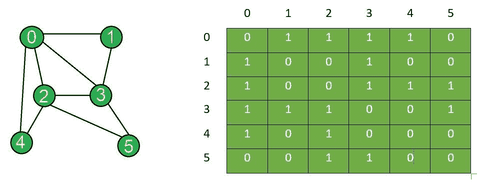

# 在图的相邻矩阵表示中添加和删除边

> 原文： [https://www.geeksforgeeks.org/add-and-remove-edge-in-adjacency-matrix-representation-of-a-graph/](https://www.geeksforgeeks.org/add-and-remove-edge-in-adjacency-matrix-representation-of-a-graph/)

**先决条件**：[图及其表示](https://www.geeksforgeeks.org/graph-and-its-representations/)

给定一个由`N`个顶点组成的图的邻接矩阵`g[][]`，任务是修改 插入所有`edge[]`并移除顶点之间的边`(X, Y)`之后的矩阵。 在邻接矩阵中，如果图形的顶点`i`和`j`之间存在边，则`g[i][j] = 1`和`g[j][i] = 1`。 如果在这两个顶点之间不存在边，则`g[i][j] = 0`和`g[j][i] = 0`。

**范例**：

> **输入**：N = 6，Edges [] = {{0，1}，{0，2}，{0，3}，{0，4}，{1，3}，{2， 3}，{2、4}，{2、5}，{3、5}}，X = 2，Y = 3
> **输出**：
> 边插入后的邻接矩阵：
> 0 1 1 1 1 0 0
> 1 0 0 1 0 0
> 1 0 0 1 1 1
> 1 1 1 0 0 1 1
> 1 0 1 0 0 0
> 0 0 1 1 0 0
> 去除边后的邻接矩阵：
> 0 1 1 1 1 0
> 1 0 0 1 0 0
> 1 0 0 0 1 1
> 1 1 0 0 0 1 ] 1 0 1 0 0 0
> 0 0 1 1 0 0
> **说明**：
> 插入边后的图形和相应的邻接矩阵：
> 
> 
> 
> 移除后的图形和移除顶点`X`和`Y`之间的边后的邻接矩阵：
> 
> 
> 
> **输入**：N = 6，Edges [] = {{0，1}，{0，2}，{0，3}，{0，4}，{1，3}，{2， 3}，{2、4}，{2、5}，{3、5}}，X = 3，Y = 5
> **输出**：
> 边插入后的邻接矩阵：
> 0 1 1 1 1 0 0
> 1 0 0 1 0 0
> 1 0 0 1 1 1
> 1 1 1 0 0 1 1
> 1 0 1 0 0 0
> 0 0 1 1 0 0
> 边去除后的邻接矩阵：
> 0 1 1 1 1 0
> 1 0 0 1 0 0
> 1 0 0 1 1 1
> 1 1 1 0 0 0 0 ] 1 0 1 0 0 0
> 0 0 1 0 0 0

**方法**：〔
]初始化尺寸为 **N x N** 的矩阵，并执行以下步骤：

*   **插入一条边**：要在两个顶点之间插入一条边，假设`i`和`j`，请将邻接矩阵中的相应值设置为 1，即 ***g [i] [j] = 1*** 和 ***g [j] [i] = 1*** ，如果两个顶点`i`和`j`存在。
*   **删除边**：要删除两个顶点之间的边，假设`i`和`j`，请将邻接矩阵中的相应值设置为 0。 ***g [i] [j] = 0*** 和 ***g [j] [i] = 0*** ，如果两个顶点`i`和`j`存在。

下面是上述方法的实现：

## C++

```cpp

// C++ program to add and remove edge 
// in the adjacency matrix of a graph 

#include <iostream> 
using namespace std; 

class Graph { 
private: 
    // Number of vertices 
    int n; 

    // Adjacency matrix 
    int g[10][10]; 

public: 
    // Constructor 
    Graph(int x) 
    { 
        n = x; 

        // Initializing each element of the 
        // adjacency matrix to zero 
        for (int i = 0; i < n; i++) { 
            for (int j = 0; j < n; j++) { 
                g[i][j] = 0; 
            } 
        } 
    } 

    // Function to display adjacency matrix 
    void displayAdjacencyMatrix() 
    { 
        // Displaying the 2D matrix 
        for (int i = 0; i < n; i++) { 
            cout << "\n"; 
            for (int j = 0; j < n; j++) { 
                cout << " " << g[i][j]; 
            } 
        } 
    } 

    // Function to update adjacency 
    // matrix for edge insertion 
    void addEdge(int x, int y) 
    { 
        // Checks if the vertices 
        // exist in the graph 
        if ((x < 0) || (x >= n)) { 
            cout << "Vertex" << x 
                 << " does not exist!"; 
        } 
        if ((y < 0) || (y >= n)) { 
            cout << "Vertex" << y 
                 << " does not exist!"; 
        } 

        // Checks if it is a self edge 
        if (x == y) { 
            cout << "Same Vertex!"; 
        } 

        else { 
            // Insert edge 
            g[y][x] = 1; 
            g[x][y] = 1; 
        } 
    } 

    // Function to update adjacency 
    // matrix for edge removal 
    void removeEdge(int x, int y) 
    { 
        // Checks if the vertices 
        // exist in the graph 
        if ((x < 0) || (x >= n)) { 
            cout << "Vertex" << x 
                 << " does not exist!"; 
        } 
        if ((y < 0) || (y >= n)) { 
            cout << "Vertex" << y 
                 << " does not exist!"; 
        } 

        // Checks if it is a self edge 
        if (x == y) { 
            cout << "Same Vertex!"; 
        } 

        else { 
            // Remove edge 
            g[y][x] = 0; 
            g[x][y] = 0; 
        } 
    } 
}; 

// Driver Code 
int main() 
{ 
    int N = 6, X = 2, Y = 3; 

    Graph obj(N); 

    // Adding edges to the graph 
    obj.addEdge(0, 1); 
    obj.addEdge(0, 2); 
    obj.addEdge(0, 3); 
    obj.addEdge(0, 4); 
    obj.addEdge(1, 3); 
    obj.addEdge(2, 3); 
    obj.addEdge(2, 4); 
    obj.addEdge(2, 5); 
    obj.addEdge(3, 5); 

    cout << "Adjacency matrix after"
         << " edge insertions:\n"; 
    obj.displayAdjacencyMatrix(); 

    obj.removeEdge(X, Y); 

    cout << "\nAdjacency matrix after"
         << " edge removal:\n"; 
    obj.displayAdjacencyMatrix(); 

    return 0; 
} 

```

## Java

```java

// Java program to add and remove edge 
// in the adjacency matrix of a graph 

class Graph { 

    // Number of vertices 
    private int n; 

    // Adjacency matrix 
    private int[][] g = new int[10][10]; 

    // Constructor 
    Graph(int x) 
    { 
        this.n = x; 

        // Initializing each element of the 
        // adjacency matrix to zero 
        for (int i = 0; i < n; ++i) { 
            for (int j = 0; j < n; ++j) { 
                g[i][j] = 0; 
            } 
        } 
    } 

    // Function to display adjacency matrix 
    public void displayAdjacencyMatrix() 
    { 
        // Displaying the 2D matrix 
        for (int i = 0; i < n; ++i) { 
            System.out.println(); 
            for (int j = 0; j < n; ++j) { 
                System.out.print(" " + g[i][j]); 
            } 
        } 

        System.out.println(); 
    } 

    // Function to update adjacency 
    // matrix for edge insertion 
    public void addEdge(int x, int y) 
    { 
        // Checks if the vertices exists 
        if ((x < 0) || (x >= n)) { 
            System.out.printf("Vertex " + x 
                              + " does not exist!"); 
        } 
        if ((y < 0) || (y >= n)) { 
            System.out.printf("Vertex " + y 
                              + " does not exist!"); 
        } 

        // Checks if it is a self edge 
        if (x == y) { 
            System.out.println("Same Vertex!"); 
        } 

        else { 
            // Insert edge 
            g[y][x] = 1; 
            g[x][y] = 1; 
        } 
    } 

    // Function to update adjacency 
    // matrix for edge removal 
    public void removeEdge(int x, int y) 
    { 
        // Checks if the vertices exists 
        if ((x < 0) || (x >= n)) { 
            System.out.printf("Vertex " + x 
                              + " does not exist!"); 
        } 
        if ((y < 0) || (y >= n)) { 
            System.out.printf("Vertex " + y 
                              + " does not exist!"); 
        } 

        // Checks if it is a self edge 
        if (x == y) { 
            System.out.println("Same Vertex!"); 
        } 

        else { 
            // Remove edge 
            g[y][x] = 0; 
            g[x][y] = 0; 
        } 
    } 
} 

// Driver Code 
class Main { 
    public static void main(String[] args) 
    { 

        int N = 6, X = 2, Y = 3; 
        Graph obj = new Graph(N); 

        // Inserting edges 
        obj.addEdge(0, 1); 
        obj.addEdge(0, 2); 
        obj.addEdge(0, 3); 
        obj.addEdge(0, 4); 
        obj.addEdge(1, 3); 
        obj.addEdge(2, 3); 
        obj.addEdge(2, 4); 
        obj.addEdge(2, 5); 
        obj.addEdge(3, 5); 

        System.out.println("Adjacency matrix after"
                           + " edge insertions:"); 
        obj.displayAdjacencyMatrix(); 

        obj.removeEdge(2, 3); 

        System.out.println("\nAdjacency matrix after"
                           + " edge removal:"); 
        obj.displayAdjacencyMatrix(); 
    } 
} 

```

## Python3

```

# Python3 program to add and remove edge 
# in adjacency matrix representation of a graph  

class Graph:  

    # Number of vertices  
    __n = 0

    # Adjacency matrix  
    __g = [[0 for x in range(10)]  
              for y in range(10)]  

    # Constructor  
    def __init__(self, x):  
        self.__n = x  

        # Initializing each element of  
        # the adjacency matrix to zero  
        for i in range(0, self.__n):  
            for j in range(0, self.__n):  
                self.__g[i][j] = 0

    # Function to display adjacency matrix              
    def displayAdjacencyMatrix(self): 

        # Displaying the 2D matrix  
        for i in range(0, self.__n):  
            print()  
            for j in range(0, self.__n):  
                print("", self.__g[i][j], end = "")  

    # Function to update adjacency  
    # matrix for edge insertion              
    def addEdge(self, x, y):  

        # Checks if the vertices 
        # exist in the graph  
        if (x < 0) or (x >= self.__n):  
            print("Vertex {} does not exist!".format(x)) 
        if (y < 0) or (y >= self.__n):  
            print("Vertex {} does not exist!".format(y)) 

        # Checks if it is a self edge  
        if(x == y):  
            print("Same Vertex!") 

        else: 

            # Adding edge between the vertices  
            self.__g[y][x] = 1
            self.__g[x][y] = 1

    # Function to update adjacency  
    # matrix for edge removal          
    def removeEdge(self, x, y): 

        # Checks if the vertices 
        # exist in the graph  
        if (x < 0) or (x >= self.__n):  
            print("Vertex {} does not exist!".format(x)) 
        if (y < 0) or (y >= self.__n):  
            print("Vertex {} does not exist!".format(y)) 

        # Checks if it is a self edge  
        if(x == y):  
            print("Same Vertex!") 

        else: 

            # Remove edge from between 
            # the vertices  
            self.__g[y][x] = 0
            self.__g[x][y] = 0

# Driver code     

# Creating an object of class Graph  
obj = Graph(6);  

# Adding edges to the graph  
obj.addEdge(0, 1) 
obj.addEdge(0, 2)  
obj.addEdge(0, 3)  
obj.addEdge(0, 4) 
obj.addEdge(1, 3) 
obj.addEdge(2, 3) 
obj.addEdge(2, 4) 
obj.addEdge(2, 5) 
obj.addEdge(3, 5) 

# Edges added to the adjacency matrix 
print("Adjacency matrix after "
      "edge insertions:\n") 
obj.displayAdjacencyMatrix(); 

# Removing the edge between vertices 
# "2" and "3" from the graph  
obj.removeEdge(2, 3);  

# The adjacency matrix after  
# removing the edge 
print("\nAdjacency matrix after " 
      "edge removal:\n") 
obj.displayAdjacencyMatrix(); 

# This code is contributed by amarjeet_singh 

```

## C#

```cs

// C# program to add and remove edge  
// in adjacency matrix representation  
// of a graph 
using System;  

class Graph{ 

// Number of vertices  
private int n;  

// Adjacency matrix  
private int[,] g = new int[10, 10];  

// Constructor  
public Graph(int x) 
{  
    this.n = x;  

    // Initializing each element of  
    // the adjacency matrix to zero  
    for(int i = 0; i < n; ++i) 
    {  
        for(int j = 0; j < n; ++j) 
        {  
            g[i, j] = 0;  
        }  
    }  
}  

// Function to display adjacency matrix  
public void displayAdjacencyMatrix()  
{ 

    // Displaying the 2D matrix  
    for(int i = 0; i < n; ++i) 
    {  
        Console.WriteLine();  
        for(int j = 0; j < n; ++j)  
        {  
            Console.Write(" " + g[i, j]);  
        }  
    }  
}  

// Function to update adjacency  
// matrix for edge insertion  
public void addEdge(int x, int y) 
{ 

    // Checks if the vertices exist 
    // in the graph  
    if ((x < 0) || (x >= n)) 
    {  
        Console.WriteLine("Vertex {0} does " + 
                          "not exist!", x); 
    } 
    if ((y < 0) || (y >= n)) 
    { 
        Console.WriteLine("Vertex {0} does " +  
                          "not exist!", y); 
    }  

    // Checks if it is a self edge 
    if (x == y) 
    {  
        Console.WriteLine("Same Vertex!");  
    } 

    else 
    {  

        // Adding edge between the vertices  
        g[y, x] = 1;  
        g[x, y] = 1;  
    } 
}  

// Function to update adjacency  
// matrix for edge removal  
public void removeEdge(int x, int y) 
{  

    // Checks if the vertices exist  
    // in the graph  
    if ((x < 0) || (x >= n)) 
    {  
        Console.WriteLine("Vertex {0} does" + 
                          "not exist!", x); 
    } 
    if ((y < 0) || (y >= n)) 
    { 
        Console.WriteLine("Vertex {0} does" + 
                          "not exist!", y); 
    }  

    // Checks if it is a self edge 
    if (x == y) 
    {  
        Console.WriteLine("Same Vertex!");  
    } 

    else 
    {  

        // Remove edge from between  
        // the vertices  
        g[y, x] = 0;  
        g[x, y] = 0;  
    } 
}  
}  

class GFG{  

// Driver code  
public static void Main(String[] args) 
{  

    // Creating an object of class Graph  
    Graph obj = new Graph(6);  

    // Adding edges to the graph  
    obj.addEdge(0, 1);  
    obj.addEdge(0, 2);  
    obj.addEdge(0, 3);  
    obj.addEdge(0, 4); 
    obj.addEdge(1, 3); 
    obj.addEdge(2, 3); 
    obj.addEdge(2, 4); 
    obj.addEdge(2, 5); 
    obj.addEdge(3, 5); 

    // Edges added to the adjacency matrix 
    Console.WriteLine("Adjacency matrix after " + 
                      "edge insertions:\n"); 
    obj.displayAdjacencyMatrix();  

    // Removing the edge between vertices 
    // "2" and "3" from the graph  
    obj.removeEdge(2, 3);  

    // The adjacency matrix after 
    // removing the edge 
    Console.WriteLine("\nAdjacency matrix after " + 
                      "edge removal:"); 
    obj.displayAdjacencyMatrix(); 
}  
} 

// This code is contributed by amarjeet_singh 

```

**Output:** 

```
Adjacency matrix after edge insertions:

 0 1 1 1 1 0
 1 0 0 1 0 0
 1 0 0 1 1 1
 1 1 1 0 0 1
 1 0 1 0 0 0
 0 0 1 1 0 0
Adjacency matrix after edge removal:

 0 1 1 1 1 0
 1 0 0 1 0 0
 1 0 0 0 1 1
 1 1 0 0 0 1
 1 0 1 0 0 0
 0 0 1 1 0 0

```

***时间复杂度**：边的插入和删除需要 O（1）复杂度，而需要 O（N <sup>2</sup> ）显示邻接矩阵。*
***辅助空间**：O（N <sup>2</sup> ）*


* * *

* * *

如果您喜欢 GeeksforGeeks 并希望做出贡献，则还可以使用 [tribution.geeksforgeeks.org](https://contribute.geeksforgeeks.org/) 撰写文章，或将您的文章邮寄至 tribution@geeksforgeeks.org。 查看您的文章出现在 GeeksforGeeks 主页上，并帮助其他 Geeks。

如果您发现任何不正确的地方，请单击下面的“改进文章”按钮，以改进本文。