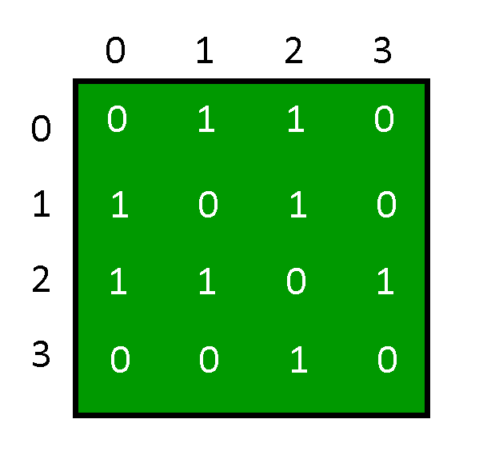

# 在图

的邻接矩阵表示中添加和删除顶点

> 原文： [https://www.geeksforgeeks.org/add-and-remove-vertex-in-adjacency-matrix-representation-of-graph/](https://www.geeksforgeeks.org/add-and-remove-vertex-in-adjacency-matrix-representation-of-graph/)

**图**是一组实体的表示，其中一些实体对通过连接链接。 互连的实体由称为顶点的点表示，并且顶点之间的连接称为边。 形式上，图是一对集合（V，E），其中 V 是顶点的集合，而 E 是连接一对顶点的边的集合。


可以使用**邻接矩阵来表示图。**



**图形的初始化**：将使用 2D 数组描述邻接矩阵，将使用构造函数来分配数组的大小，并将该数组的每个元素初始化为 0。 图中的每个顶点均为零。

## C++

```cpp

class Graph { 
private: 
    // number of vertices 
    int n; 

    // adjacency matrix 
    int g[10][10]; 

public: 
    // constructor 
    Graph(int x) 
    { 
        n = x; 

        // initializing each element of the adjacency matrix to zero 
        for (int i = 0; i < n; ++i) { 
            for (int j = 0; j < n; ++j) { 
                g[i][j] = 0; 
            } 
        } 
    } 
}; 

```