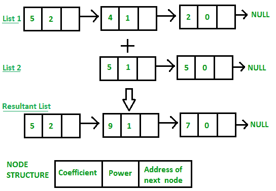

# 使用链接列表

添加两个多项式

给定两个由链表表示的多项式。 编写一个添加这些列表的函数，意味着添加具有相同可变幂的系数。

例：

```
Input:
     1st number = 5x^2 + 4x^1 + 2x^0
     2nd number = 5x^1 + 5x^0
Output:
        5x^2 + 9x^1 + 7x^0
Input:
     1st number = 5x^3 + 4x^2 + 2x^0
     2nd number = 5x^1 + 5x^0
Output:
        5x^3 + 4x^2 + 5x^1 + 7x^0

```

[](https://media.geeksforgeeks.org/wp-content/uploads/Addition-of-two-polynomial.png) 

```

// C++ program for addition of two polynomials 
// using Linked Lists 
#include<bits/stdc++.h> 
using namespace std; 

// Node structure containing power and coefficient of variable 
struct Node 
{ 
    int coeff; 
    int pow; 
    struct Node *next; 
}; 

// Function to create new node 
void create_node(int x, int y, struct Node **temp) 
{ 
    struct Node *r, *z; 
    z = *temp; 
    if(z == NULL) 
    { 
        r =(struct Node*)malloc(sizeof(struct Node)); 
        r->coeff = x; 
        r->pow = y; 
        *temp = r; 
        r->next = (struct Node*)malloc(sizeof(struct Node)); 
        r = r->next; 
        r->next = NULL; 
    } 
    else
    { 
        r->coeff = x; 
        r->pow = y; 
        r->next = (struct Node*)malloc(sizeof(struct Node)); 
        r = r->next; 
        r->next = NULL; 
    } 
} 

// Function Adding two polynomial numbers 
void polyadd(struct Node *poly1, struct Node *poly2, struct Node *poly) 
{ 
while(poly1->next && poly2->next) 
    { 
        // If power of 1st polynomial is greater then 2nd, then store 1st as it is 
        // and move its pointer 
        if(poly1->pow > poly2->pow) 
        { 
            poly->pow = poly1->pow; 
            poly->coeff = poly1->coeff; 
            poly1 = poly1->next; 
        } 

        // If power of 2nd polynomial is greater then 1st, then store 2nd as it is 
        // and move its pointer 
        else if(poly1->pow < poly2->pow) 
        { 
            poly->pow = poly2->pow; 
            poly->coeff = poly2->coeff; 
            poly2 = poly2->next; 
        } 

        // If power of both polynomial numbers is same then add their coefficients 
        else
        { 
            poly->pow = poly1->pow; 
            poly->coeff = poly1->coeff+poly2->coeff; 
            poly1 = poly1->next; 
            poly2 = poly2->next; 
        } 

        // Dynamically create new node 
        poly->next = (struct Node *)malloc(sizeof(struct Node)); 
        poly = poly->next; 
        poly->next = NULL; 
    } 
while(poly1->next || poly2->next) 
    { 
        if(poly1->next) 
        { 
            poly->pow = poly1->pow; 
            poly->coeff = poly1->coeff; 
            poly1 = poly1->next; 
        } 
        if(poly2->next) 
        { 
            poly->pow = poly2->pow; 
            poly->coeff = poly2->coeff; 
            poly2 = poly2->next; 
        } 
        poly->next = (struct Node *)malloc(sizeof(struct Node)); 
        poly = poly->next; 
        poly->next = NULL; 
    } 
} 

// Display Linked list 
void show(struct Node *node) 
{ 
while(node->next != NULL) 
    { 
    printf("%dx^%d", node->coeff, node->pow); 
    node = node->next; 
    if(node->next != NULL) 
        printf(" + "); 
    } 
} 

// Driver  program 
int main() 
{ 
    struct Node *poly1 = NULL, *poly2 = NULL, *poly = NULL; 

    // Create first list of 5x^2 + 4x^1 + 2x^0 
    create_node(5,2,&poly1); 
    create_node(4,1,&poly1); 
    create_node(2,0,&poly1); 

    // Create second list of 5x^1 + 5x^0 
    create_node(5,1,&poly2); 
    create_node(5,0,&poly2); 

    printf("1st Number: ");  
    show(poly1); 

    printf("\n2nd Number: "); 
    show(poly2); 

    poly = (struct Node *)malloc(sizeof(struct Node)); 

    // Function add two polynomial numbers 
    polyadd(poly1, poly2, poly); 

    // Display resultant List 
    printf("\nAdded polynomial: "); 
    show(poly); 

return 0; 
} 

```

输出：

```
1st Number: 5x^2 + 4x^1 + 2x^0
2nd Number: 5x^1 + 5x^0
Added polynomial: 5x^2 + 9x^1 + 7x^0

```

时间复杂度：O（m + n），其中m和n分别是第一列表和第二列表中的节点数。

**相关文章：** [使用数组将两个多项式数相加](http://quiz.geeksforgeeks.org/program-add-two-polynomials/)
本文由 **Akash Gupta** 提供。 如果您喜欢GeeksforGeeks并希望做出贡献，则也可以使用 [tribution.geeksforgeeks.org](http://www.contribute.geeksforgeeks.org) 撰写文章，或将您的文章邮寄至tribution@geeksforgeeks.org。 查看您的文章出现在GeeksforGeeks主页上，并帮助其他Geeks。

如果发现任何不正确的地方，或者您想分享有关上述主题的更多信息，请发表评论。

