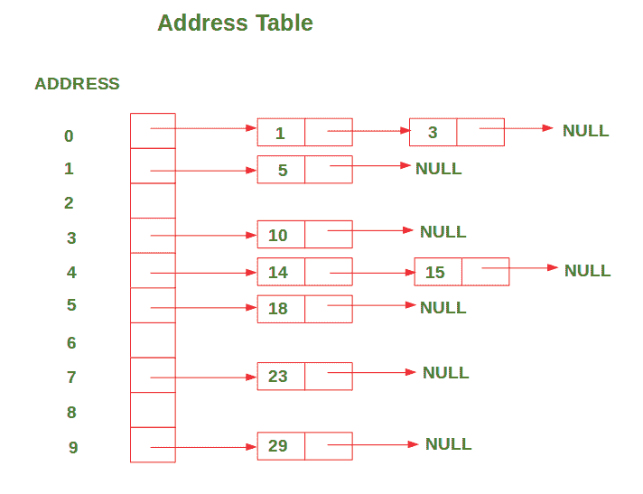

# 使用哈希

> 原文：[https://www.geeksforgeeks.org/address-calculation-sort-using-hashing/](https://www.geeksforgeeks.org/address-calculation-sort-using-hashing/)

进行地址计算排序

在此排序算法中，哈希函数 **f** 与**顺序保留函数**的属性一起使用，该函数声明是否为。

**哈希函数**：

```
f(x) = floor( (x/maximum) * SIZE )
where maximum => maximum value in the array,
      SIZE => size of the address table (10 in our case),
      floor => floor function

```

该算法使用**地址表**存储值，该值只是链接列表的列表（或数组）。 哈希函数应用于数组中的每个值，以在地址表中找到其对应的地址。 然后，通过将这些值与该地址中已经存在的值进行比较，以有序的方式将其插入到其对应的地址中。

**示例**：

```
Input : arr = [29, 23, 14, 5, 15, 10, 3, 18, 1] 
Output:
After inserting all the values in the address table, the address table looks like this:

ADDRESS 0: 1 --> 3 
ADDRESS 1: 5 
ADDRESS 2: 
ADDRESS 3: 10 
ADDRESS 4: 14 --> 15 
ADDRESS 5: 18 
ADDRESS 6: 
ADDRESS 7: 23 
ADDRESS 8: 
ADDRESS 9: 29

```

下图显示了上面讨论的示例的地址表的表示形式：



插入后，将对地址表中每个地址的值进行排序。 因此，我们一个接一个地遍历每个地址，并将值插入该地址到输入数组中。

下面是上述方法的实现

```
# Python3 code for implementation of

> 原文：[https://www.geeksforgeeks.org/address-calculation-sort-using-hashing/](https://www.geeksforgeeks.org/address-calculation-sort-using-hashing/)
# Address Calculation Sorting using Hashing

> 原文：[https://www.geeksforgeeks.org/address-calculation-sort-using-hashing/](https://www.geeksforgeeks.org/address-calculation-sort-using-hashing/)
# Size of the address table (In this case 0-9)

> 原文：[https://www.geeksforgeeks.org/address-calculation-sort-using-hashing/](https://www.geeksforgeeks.org/address-calculation-sort-using-hashing/)
SIZE = 10
class Node( object ):
def __init__( self , data = None ):
self .data = data
self .nextNode = None
class LinkedList( object ):
def __init__( self ):
self .head = None
的
# Insert values in such a way that the list remains sorted

> 原文：[https://www.geeksforgeeks.org/address-calculation-sort-using-hashing/](https://www.geeksforgeeks.org/address-calculation-sort-using-hashing/)
def insert( self , data):
newNode = Node(data)
# If there is no node or new Node's value

> 原文：[https://www.geeksforgeeks.org/address-calculation-sort-using-hashing/](https://www.geeksforgeeks.org/address-calculation-sort-using-hashing/)
# is smaller than the first value in the list,

> 原文：[https://www.geeksforgeeks.org/address-calculation-sort-using-hashing/](https://www.geeksforgeeks.org/address-calculation-sort-using-hashing/)
# Insert new Node in the first place

> 原文：[https://www.geeksforgeeks.org/address-calculation-sort-using-hashing/](https://www.geeksforgeeks.org/address-calculation-sort-using-hashing/)
] if self .head = = None or data < self .head.data:
newNode.nextNode = self .head
self .head = newNode
else :
current = self .head
# If the next node is null or its value

> 原文：[https://www.geeksforgeeks.org/address-calculation-sort-using-hashing/](https://www.geeksforgeeks.org/address-calculation-sort-using-hashing/)
# is greater than the new Node's value, ]

> 原文：[https://www.geeksforgeeks.org/address-calculation-sort-using-hashing/](https://www.geeksforgeeks.org/address-calculation-sort-using-hashing/)
# Insert new Node in that place

> 原文：[https://www.geeksforgeeks.org/address-calculation-sort-using-hashing/](https://www.geeksforgeeks.org/address-calculation-sort-using-hashing/)
while current.nextNode ! = None \
and \
current.nextNode.data < data:
current = current.nextNode
newNode.nextNode = current.nextNode
current.nextNode = newNode
# This function sorts the given list

> 原文：[https://www.geeksforgeeks.org/address-calculation-sort-using-hashing/](https://www.geeksforgeeks.org/address-calculation-sort-using-hashing/)
# using Address Calculation Sorting using Hashing

> 原文：[https://www.geeksforgeeks.org/address-calculation-sort-using-hashing/](https://www.geeksforgeeks.org/address-calculation-sort-using-hashing/)
def addressCalculationSort(arr):
# Declare a list of Linked Lists of given SIZE

> 原文：[https://www.geeksforgeeks.org/address-calculation-sort-using-hashing/](https://www.geeksforgeeks.org/address-calculation-sort-using-hashing/)
listOfLinkedLists = []
for i in range (SIZE):
listOfLinkedLists.append(LinkedList())
# Calculate maximum value in the array

> 原文：[https://www.geeksforgeeks.org/address-calculation-sort-using-hashing/](https://www.geeksforgeeks.org/address-calculation-sort-using-hashing/)
maximum = max (arr)
# Find the address of each value

> 原文：[https://www.geeksforgeeks.org/address-calculation-sort-using-hashing/](https://www.geeksforgeeks.org/address-calculation-sort-using-hashing/)
# in the address table

> 原文：[https://www.geeksforgeeks.org/address-calculation-sort-using-hashing/](https://www.geeksforgeeks.org/address-calculation-sort-using-hashing/)
# and insert it in that list

> 原文：[https://www.geeksforgeeks.org/address-calculation-sort-using-hashing/](https://www.geeksforgeeks.org/address-calculation-sort-using-hashing/)
for val in arr:
address = hashFunction(val, maximum)
listOfLinkedLists[address].insert(val)
# Print the address table

> 原文：[https://www.geeksforgeeks.org/address-calculation-sort-using-hashing/](https://www.geeksforgeeks.org/address-calculation-sort-using-hashing/)
# after all the values have been inserted

> 原文：[https://www.geeksforgeeks.org/address-calculation-sort-using-hashing/](https://www.geeksforgeeks.org/address-calculation-sort-using-hashing/)
for i in range (SIZE):
current = listOfLinkedLists[i].head
print ( "ADDRESS " + str (i), end = ": " )
while current ! = None :
print (current.data, end = " " )
current = current.nextNode
print ()
# Assign the sorted values to the input array

> 原文：[https://www.geeksforgeeks.org/address-calculation-sort-using-hashing/](https://www.geeksforgeeks.org/address-calculation-sort-using-hashing/)
index = 0
for i in range (SIZE):
current = listOfLinkedLists[i].head
while current ! = None :
arr[index] = current.data
index + = 1
current = current.nextNode
]
# This function returns the corresponding address

> 原文：[https://www.geeksforgeeks.org/address-calculation-sort-using-hashing/](https://www.geeksforgeeks.org/address-calculation-sort-using-hashing/)
# of given value in the address table

> 原文：[https://www.geeksforgeeks.org/address-calculation-sort-using-hashing/](https://www.geeksforgeeks.org/address-calculation-sort-using-hashing/)
def hashFunction(num, maximum):
# Scale the value such that address is between 0 to 9

> 原文：[https://www.geeksforgeeks.org/address-calculation-sort-using-hashing/](https://www.geeksforgeeks.org/address-calculation-sort-using-hashing/)
address = int ((num * 1.0 / maximum) * (SIZE - 1 ))
return address
# -------------------------------------------------------

> 原文：[https://www.geeksforgeeks.org/address-calculation-sort-using-hashing/](https://www.geeksforgeeks.org/address-calculation-sort-using-hashing/)
# Driver code

> 原文：[https://www.geeksforgeeks.org/address-calculation-sort-using-hashing/](https://www.geeksforgeeks.org/address-calculation-sort-using-hashing/)
]
# giving the input address as follows

> 原文：[https://www.geeksforgeeks.org/address-calculation-sort-using-hashing/](https://www.geeksforgeeks.org/address-calculation-sort-using-hashing/)
arr = [ 29 , [HTG2 94] , 14 , 5 , 15 , 10 , 3 , 18 , 1 ]
# Printing the Input array

> 原文：[https://www.geeksforgeeks.org/address-calculation-sort-using-hashing/](https://www.geeksforgeeks.org/address-calculation-sort-using-hashing/)
print ( "\nInput array: " + " " .join([ str (x) for x in arr]))
# Performing address calculation sort

> 原文：[https://www.geeksforgeeks.org/address-calculation-sort-using-hashing/](https://www.geeksforgeeks.org/address-calculation-sort-using-hashing/)
addressCalculationSort(arr)
# printing the result sorted array

> 原文：[https://www.geeksforgeeks.org/address-calculation-sort-using-hashing/](https://www.geeksforgeeks.org/address-calculation-sort-using-hashing/)
print ( "\nSorted array: " + " " .join([ str (x) for x in arr]))
```

**Output:**

```
Input array: 29 23 14 5 15 10 3 18 1

ADDRESS 0: 1 3 
ADDRESS 1: 5 
ADDRESS 2: 
ADDRESS 3: 10 
ADDRESS 4: 14 15 
ADDRESS 5: 18 
ADDRESS 6: 
ADDRESS 7: 23 
ADDRESS 8: 
ADDRESS 9: 29 

Sorted array: 1 3 5 10 14 15 18 23 29

```

**时间复杂度**：

在最佳情况下，该算法的时间复杂度为`O(n)`。 当数组中的值均匀分布在特定范围内时，会发生这种情况。

而最坏情况下的时间复杂度是`O(n^2)`。 当大多数值占用 1 或 2 个地址时会发生这种情况，因为需要大量工作才能将每个值插入其适当位置。


* * *

* * *


