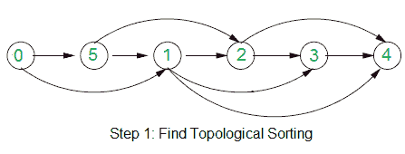

# 为边缘分配方向，以便有向图保持非循环状态

> 原文： [https://www.geeksforgeeks.org/assign-directions-to-edges-so-that-the-directed-graph-remains-acyclic/](https://www.geeksforgeeks.org/assign-directions-to-edges-so-that-the-directed-graph-remains-acyclic/)

给定一个有向和无向边的图。 考虑到有向边不会形成循环。 如何将方向分配给无方向的边，以便图形（所有有向边）即使分配后也保持非循环状态？

例如，在下图中，蓝色边缘没有方向。

**我们强烈建议您最小化您的浏览器，然后自己尝试。**

这个想法是使用[拓扑排序](https://www.geeksforgeeks.org/topological-sorting/)。 以下是算法中使用的两个步骤。

**1）**考虑仅包含有向边的子图，并找到子图的拓扑排序。 在上面的示例中，拓扑排序为{0，5，1，2，3，4}。 下图显示了以上示例图的拓扑排序。

**2）**使用上述拓扑排序可将方向分配给无向边。 对于每个无向边（u，v），如果 u 在拓扑排序中位于 v 之前，则将其方向从 u 分配给 v，否则将其方向从 v 分配给 u。
下图显示了示例图中分配的方向。

来源： [http://courses.csail.mit.edu/6.006/oldquizzes/solutions/q2-f2009-sol.pdf](http://courses.csail.mit.edu/6.006/oldquizzes/solutions/q2-f2009-sol.pdf)

本文由 **Aditya Agrawal** 提供。 如果发现任何不正确的地方，或者想分享有关上述主题的更多信息，请写评论。

