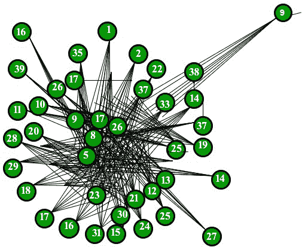

# Barabasi Albert 图（适用于无标度模型）

> 原文： [https://www.geeksforgeeks.org/barabasi-albert-graph-scale-free-models/](https://www.geeksforgeeks.org/barabasi-albert-graph-scale-free-models/)

本文将使用 Python 库 NetworkX 处理围绕复杂网络的概念。 它是一个 Python 语言软件包，用于创建，操作和研究复杂网络的结构，动力学和功能。 使用 NetworkX，您可以以标准和非标准数据格式加载和存储网络，生成多种类型的随机和经典网络，分析网络结构，构建网络模型，设计新的网络算法，绘制网络，等等。

本文将讨论使用优先附着模型生成随机无标度网络的算法。 该模型背后令人感兴趣的原因可以追溯到 1990 年代，当时 Albert Lazlo Barabasi 和 Reka Albert 提出了开创性的研究方法，描述了该模型，随后是世界范围内的无标度网络。 他们认为，包括互联网，万维网，引文网络和某些社交网络在内的几种自然的和人为的系统被认为是近似无尺度的网络。

无标度网络是其度分布至少幂次遵循幂定律的网络。 也就是说，网络中与其他节点有 k 个连接的节点的分数`P(k)`会随着`k`的较大值而变化，


其中`gamma`是一个参数，其值通常在`2 < gamma < 3`范围内，尽管有时它可能位于这些界限之外，并且`c`是比例常数。

Barabási–Albert 模型是生成无标度网络的几种建议模型之一。 它包含两个重要的一般概念：增长和优先依恋。 增长和优惠依恋在现实网络中广泛存在。 增长意味着网络中的节点数量会随着时间增加。

优先连接是指节点连接得越多，则接收新链接的可能性就越大。 较高级别的节点具有更强的能力来捕获添加到网络的链接。 直觉上，如果我们从连接人的社交网络的角度来看，可以理解优先依恋。 在这里，从 A 到 B 的链接意味着人 A“知道”或“认识”人 B。重链接的节点表示具有很多关系的知名人士。 当新来者进入社区时，他/她更有可能结识较易见的人之一，而不是相对陌生的人。 提出 BA 模型是通过假设在万维网中，新页面优先链接到集线器（即 Google 等知名网站），而不是鲜为人知的页面。 如果有人通过随机选择现有链接来选择要链接的新页面，则选择特定页面的可能性将与其程度成正比。

下图将描述具有 50 个节点的 BA 模型图，该模型遵循优先附件模型。 


*上面的图表完全满足了富人越来越富和穷人越来越穷的逻辑。*

**代码**：

以下代码是我们最终将使用 NetworkX 库实现的功能的一部分。

```

def barabasi_albert_graph(n, m, seed=None): 
    """Returns a random graph according to the Barabási–Albert preferential 
    Attachment model. 

    A graph of ``n`` nodes is grown by attaching new nodes each with ``m`` 
    Edges that are preferentially attached to existing nodes with high degree. 

    Parameters 
    ----------
    n : int
        Number of nodes 
    m : int
        Number of edges to attach from a new node to existing nodes 
    seed : int, optional 
        Seed for random number generator (default=None). 

    Returns 
    -------
    G : Graph 

    Raises 
    ------
    NetworkXError 
        If ``m`` does not satisfy ``1 <= m < n``. 

    if m < 1 or  m >=n: 
        raise nx.NetworkXError("Barabási–Albert network must have m >= 1"
                               " and m < n, m = %d, n = %d" % (m, n)) 
    if seed is not None: 
        random.seed(seed) 

    # Add m initial nodes (m0 in barabasi-speak) 
    G=empty_graph(m) 
    G.name="barabasi_albert_graph(%s,%s)"%(n,m) 
    # Target nodes for new edges 
    targets=list(range(m)) 
    # List of existing nodes, with nodes repeated once for each adjacent edge 
    repeated_nodes=[] 
    # Start adding the other n-m nodes. The first node is m. 
    source=m 
    while source<n: 
        # Add edges to m nodes from the source. 
        G.add_edges_from(zip(*m,targets)) 
        # Add one node to the list for each new edge just created. 
        repeated_nodes.extend(targets) 
        # And the new node "source" has m edges to add to the list. 
        repeated_nodes.extend(*m) 
        # Now choose m unique nodes from the existing nodes 
        # Pick uniformly from repeated_nodes (preferential attachement) 
        targets = _random_subset(repeated_nodes,m) 
        source += 1
    return G 

```

上面的代码是 NetworkX 库的一部分，该库用于在 python 中有效地处理随机图。 在运行以下代码之前，必须先安装它。

```

>>> import networkx as nx 
>>> G= nx.barabasi_albert_graph(50,40) 
>>> nx.draw(G, with_labels=True) 

```

为了显示上面的图，我使用了 matplotlib 库。 我们需要在执行以下代码之前安装它。

```

>>> import matplotlib.pyplot as plt 
>>> plt.show() 

```

**所以最终代码看起来像**：

```

>>> import networkx as nx 
>>> import matplotlib.pyplot as plt 

>>> G= nx.barabasi_albert_graph(40,15) 
>>> nx.draw(G, with_labels=True) 
>>> plt.show() 

```

输出：



40 个节点的 BA 模型

因此，我想进一步描述有关 NetworkX 库及其模块的更多信息，这些模块主要侧重于网络的中心性度量（尤其是无标度模型）。

***参考文献***

*   [https://zh.wikipedia.org/wiki/Barab%C3%A1si%E2%80%93Albert_model](https://en.wikipedia.org/wiki/Barab%C3%A1si%E2%80%93Albert_model)*   [http://networkx.readthedocs.io/en/networkx-1.10/index.html](http://networkx.readthedocs.io/en/networkx-1.10/index.html)

.


* * *

* * *

如果您喜欢 GeeksforGeeks 并希望做出贡献，则还可以使用 [tribution.geeksforgeeks.org](https://contribute.geeksforgeeks.org/) 撰写文章，或将您的文章邮寄至 tribution@geeksforgeeks.org。 查看您的文章出现在 GeeksforGeeks 主页上，并帮助其他 Geeks。

如果您发现任何不正确的地方，请单击下面的“改进文章”按钮，以改进本文。