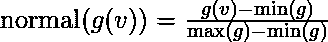
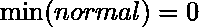
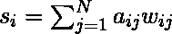
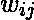
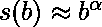

# 中间性中心度（中心度）

> 原文： [https://www.geeksforgeeks.org/betweenness-centrality-centrality-measure/](https://www.geeksforgeeks.org/betweenness-centrality-centrality-measure/)

在图论中，中介中心性是基于最短路径的图中中心性的度量。 对于连接图中的每一对顶点，顶点之间至少存在一条最短路径，这样路径通过的边数（对于未加权的图）或边的权重之和（对于加权的图） ）最小化。 每个顶点的居中性是通过这些顶点的这些最短路径的数量。

中间性中心性在网络理论中得到广泛应用：它代表节点之间相互站立的程度。 例如，在电信网络中，具有较高中间度中心度的节点将对网络具有更多控制权，因为更多信息将通过该节点。 中间性中心性被设计为中心性的一般度量：它适用于网络理论中的各种问题，包括与社会网络，生物学，运输和科学合作有关的问题。

**定义**

节点`v`的中间性由以下表达式给出：


其中是从节点`s`到节点`t`的最短路径总数，是通过`v`的那些路径的数量。

注意，节点的中间性中心与总索引所暗示的节点对数成比例。 因此，可以通过除以不包括的节点对的数量来重新缩放计算，以使![g\in [0,1]](img/3b5cb87b61e4d3d0e18e8dfd60f385c0.png "Rendered by QuickLaTeX.com")成为可能。 对于有向图，通过进行划分；对于无向图，由进行划分，其中是巨型组件中节点的数量。 请注意，这会缩放为可能的最高值，其中每个最短路径都跨越一个节点。 通常不是这种情况，可以执行标准化而不会损失精度



会导致：




注意，这始终是从较小范围到较大范围的缩放比例，因此不会损失精度。

**加权网络**

在加权网络中，连接节点的链接不再视为二进制交互，而是按其容量，影响，频率等按比例进行加权， 这不仅增加了拓扑效应，还增加了网络内部异构的另一个维度。 节点在加权网络中的强度由其相邻边的权重之和得出。



其中和分别是节点和之间的邻接关系和权重矩阵。 类似于在无标度网络中发现的度数的幂律分布，给定节点的强度也遵循幂律分布。


对介于中间的顶点的强度平均值的研究表明，可以通过缩放形式来近似功能行为



以下是用于计算图及其各个节点之间的中心性的代码。

```

def betweenness_centrality(G, k=None, normalized=True, weight=None, 
                           endpoints=False, seed=None): 
    r"""Compute the shortest-path betweenness centrality for nodes. 

    Betweenness centrality of a node $v$ is the sum of the 
    fraction of all-pairs shortest paths that pass through $v$ 

    .. math:: 

       c_B(v) =\sum_{s,t \in V} \frac{\sigma(s, t|v)}{\sigma(s, t)} 

    where $V$ is the set of nodes, $\sigma(s, t)$ is the number of 
    shortest $(s, t)$-paths,  and $\sigma(s, t|v)$ is the number of 
    those paths  passing through some  node $v$ other than $s, t$. 
    If $s = t$, $\sigma(s, t) = 1$, and if $v \in {s, t}$, 
    $\sigma(s, t|v) = 0$ [2]_. 

    Parameters 
    ---------- 
    G : graph 
      A NetworkX graph. 

    k : int, optional (default=None) 
      If k is not None use k node samples to estimate betweenness. 
      The value of k <= n where n is the number of nodes in the graph. 
      Higher values give better approximation. 

    normalized : bool, optional 
      If True the betweenness values are normalized by `2/((n-1)(n-2))` 
      for graphs, and `1/((n-1)(n-2))` for directed graphs where `n` 
      is the number of nodes in G. 

    weight : None or string, optional (default=None) 
      If None, all edge weights are considered equal. 
      Otherwise holds the name of the edge attribute used as weight. 

    endpoints : bool, optional 
      If True include the endpoints in the shortest path counts. 

    Returns 
    ------- 
    nodes : dictionary 
       Dictionary of nodes with betweenness centrality as the value. 

    Notes 
    ----- 
    The algorithm is from Ulrik Brandes [1]_. 
    See [4]_ for the original first published version and [2]_ for details on 
    algorithms for variations and related metrics. 

    For approximate betweenness calculations set k=#samples to use 
    k nodes ("pivots") to estimate the betweenness values. For an estimate 
    of the number of pivots needed see [3]_. 

    For weighted graphs the edge weights must be greater than zero. 
    Zero edge weights can produce an infinite number of equal length 
    paths between pairs of nodes. 

    """
    betweenness = dict.fromkeys(G, 0.0)  # b[v]=0 for v in G 
    if k is None: 
        nodes = G 
    else: 
        random.seed(seed) 
        nodes = random.sample(G.nodes(), k) 
    for s in nodes: 

        # single source shortest paths 
        if weight is None:  # use BFS 
            S, P, sigma = _single_source_shortest_path_basic(G, s) 
        else:  # use Dijkstra's algorithm 
            S, P, sigma = _single_source_dijkstra_path_basic(G, s, weight) 

        # accumulation 
        if endpoints: 
            betweenness = _accumulate_endpoints(betweenness, S, P, sigma, s) 
        else: 
            betweenness = _accumulate_basic(betweenness, S, P, sigma, s) 

    # rescaling 
    betweenness = _rescale(betweenness, len(G), normalized=normalized, 
                           directed=G.is_directed(), k=k) 
    return betweenness 

```

上面的函数是使用 NetworkX 库调用的，一旦安装了该库，您就可以最终使用它，并且以下代码必须用 Python 编写，以实现节点之间的中间性。

```

>>> import networkx as nx 
>>> G=nx.erdos_renyi_graph(50,0.5) 
>>> b=nx.betweenness_centrality(G) 
>>> print(b) 

```

结果是：

```

{0: 0.01220586070437195, 1: 0.009125402885768874, 2: 0.010481510111098788, 3: 0.014645690907182346,  
4: 0.013407129955492722, 5: 0.008165902336070403, 6: 0.008515486873573529, 7: 0.0067362883337957575,  
8: 0.009167651113672941, 9: 0.012386122359980324, 10: 0.00711685931010503, 11: 0.01146358835858978,  
12: 0.010392276809830674, 13: 0.0071149912635190965, 14: 0.011112503660641336, 15: 0.008013362669468532, 
 16: 0.01332441710128969, 17: 0.009307485134691016, 18: 0.006974541084171777, 19: 0.006534636068324543,  
20: 0.007794762718607258, 21: 0.012297442232146375, 22: 0.011081427155225095, 23: 0.018715475770172643, 
 24: 0.011527827410298818, 25: 0.012294312339823964, 26: 0.008103941622217354, 27: 0.011063824792934858, 
 28: 0.00876321613116331, 29: 0.01539738650994337, 30: 0.014968892689224241, 31: 0.006942569786325711, 
 32: 0.01389881951343378, 33: 0.005315473883526104, 34: 0.012485048548223817, 35: 0.009147849010405877, 
 36: 0.00755662592209711, 37: 0.007387027127423285, 38: 0.015993065123210606, 39: 0.0111516804297535, 
 40: 0.010720274864419366, 41: 0.007769933231367805, 42: 0.009986222659285306, 43: 0.005102869708942402, 
 44: 0.007652686310399397, 45: 0.017408689421606432, 46: 0.008512679806690831, 47: 0.01027761151708757,  
48: 0.008908600658162324, 49: 0.013439198921385216} 

```

以上结果是一个字典，描述了每个节点之间的中间性中心值。 以上是我关于集中度度量的文章系列的扩展。 保持联网！！！

**参考文献**

*   [https://en.wikipedia.org/wiki/Betweenness_centrality](https://en.wikipedia.org/wiki/Betweenness_centrality)*   [http://networkx.readthedocs.io/en/networkx-1.10/index.html](http://networkx.readthedocs.io/en/networkx-1.10/index.html)

.

本文由 [**Jayant Bisht**](https://auth.geeksforgeeks.org/profile.php?user=Jayant Bisht) 提供。 如果您喜欢 GeeksforGeeks 并希望做出贡献，则还可以使用 [tribution.geeksforgeeks.org](http://www.contribute.geeksforgeeks.org) 撰写文章，或将您的文章邮寄至 tribution@geeksforgeeks.org。 查看您的文章出现在 GeeksforGeeks 主页上，并帮助其他 Geeks。

如果发现任何不正确的地方，或者想分享有关上述主题的更多信息，请写评论。

