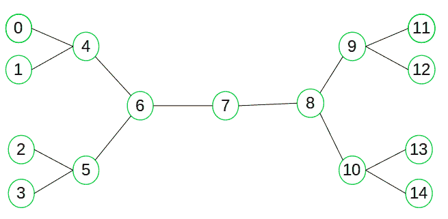

# 双向搜索

> 原文： [https://www.geeksforgeeks.org/bidirectional-search/](https://www.geeksforgeeks.org/bidirectional-search/)

搜索图形是一个非常著名的问题，并且有很多实际用途。 我们已经在这里讨论了 [](https://www.geeksforgeeks.org/find-if-there-is-a-path-between-two-vertices-in-a-given-graph/) ，如何使用 [BFS](https://www.geeksforgeeks.org/breadth-first-traversal-for-a-graph/) 从源顶点开始搜索目标顶点。 在使用 BFS / DFS 的普通图搜索中，我们通常从源顶点到目标顶点**沿一个方向开始搜索，但是如果同时从两个方向开始搜索该怎么办。**
双向搜索是一种图搜索算法，可以找到通往目标顶点的最小路径形式。 它同时运行两个搜索–

1.  将搜索形式的源/初始顶点向目标顶点转发
2.  向后搜索形式将目标/目标顶点向源顶点

双向搜索用两个较小的子图替换了单个搜索图（它可能呈指数增长）–一个子图从初始顶点开始，另一个子图从目标顶点开始。 **当两个图形相交时，搜索终止。**
就像 [A *算法](https://www.geeksforgeeks.org/a-search-algorithm/)一样，双向搜索可以通过[启发式](https://en.wikipedia.org/wiki/Heuristic_(computer_science))估计从源到目标的剩余距离（反之亦然）进行指导，以找到可能的最短路径。
考虑以下简单示例-



假设我们要查找是否存在从顶点 0 到顶点 14 的路径。在这里，我们可以执行两个搜索，一个从顶点 0 开始，另一个从顶点 14 开始。当向前和向后搜索在顶点 7 都遇到时，我们知道 找到了从节点 0 到 14 的路径，现在可以终止搜索。 我们可以清楚地看到，我们已经成功避免了不必要的探索。

**为什么采用双向方法？**

因为在许多情况下它速度更快，所以可以大大减少所需的勘探量。
假设树的分支因子为`b`，目标顶点到源的距离为`d`，则正常的 BFS / DFS 搜索复杂度将为 *O（b [ <sup>d</sup> ）。* 另一方面，如果我们执行两次搜索操作，则每次搜索的复杂度将为 *O（b <sup>d / 2</sup> ）*，总复杂度将为 *O （b <sup>d / 2</sup> + b <sup>d / 2</sup> ）*远小于 *O（b <sup>d</sup> ）*。

**何时使用双向方法？**

在以下情况下，我们可以考虑采用双向方法：

1.  初始状态和目标状态都是唯一的且已完全定义。
2.  两个方向上的分支因子完全相同。

**绩效指标**

*   完整性：如果两个搜索都使用 BFS，则双向搜索完成。
*   最佳性：如果将 BFS 用于搜索并且路径成本统一，则是最佳选择。
*   时空复杂度：时空复杂度为 *O（b <sup>d / 2</sup> ）。*

下面是一个非常简单的实现，表示使用 BFS 进行双向搜索的概念。 此实现考虑没有任何权重的无向路径。

## C ++

```

// C++ program for Bidirectional BFS search
// to check path between two vertices
#include <bits/stdc++.h>
using namespace std;

// class representing undirected graph
// using adjacency list
class Graph
{
    //number of nodes in graph
    int V;

    // Adjacency list
    list<int> *adj;
public:
    Graph(int V);
    int isIntersecting(bool *s_visited, bool *t_visited);
    void addEdge(int u, int v);
    void printPath(int *s_parent, int *t_parent, int s,
                             int t, int intersectNode);
    void BFS(list<int> *queue, bool *visited, int *parent);
    int biDirSearch(int s, int t);
};

Graph::Graph(int V)
{
    this->V = V;
    adj = new list<int>[V];
};

// Method for adding undirected edge
void Graph::addEdge(int u, int v)
{
    this->adj[u].push_back(v);
    this->adj[v].push_back(u);
};

// Method for Breadth First Search
void Graph::BFS(list<int> *queue, bool *visited,
                                    int *parent)
{
    int current = queue->front();
    queue->pop_front();
    list<int>::iterator i;
    for (i=adj[current].begin();i != adj[current].end();i++)
    {
        // If adjacent vertex is not visited earlier
        // mark it visited by assigning true value
        if (!visited[*i])
        {
            // set current as parent of this vertex
            parent[*i] = current;

            // Mark this vertex visited
            visited[*i] = true;

            // Push to the end of queue
            queue->push_back(*i);
        }
    }
};

// check for intersecting vertex
int Graph::isIntersecting(bool *s_visited, bool *t_visited)
{
    int intersectNode = -1;
    for(int i=0;i<V;i++)
    {
        // if a vertex is visited by both front
        // and back BFS search return that node
        // else return -1
        if(s_visited[i] && t_visited[i])
            return i;
    }
    return -1;
};

// Print the path from source to target
void Graph::printPath(int *s_parent, int *t_parent,
                  int s, int t, int intersectNode)
{
    vector<int> path;
    path.push_back(intersectNode);
    int i = intersectNode;
    while (i != s)
    {
        path.push_back(s_parent[i]);
        i = s_parent[i];
    }
    reverse(path.begin(), path.end());
    i = intersectNode;
    while(i != t)
    {
        path.push_back(t_parent[i]);
        i = t_parent[i];
    }

    vector<int>::iterator it;
    cout<<"*****Path*****\n";
    for(it = path.begin();it != path.end();it++)
        cout<<*it<<" ";
    cout<<"\n";
};

// Method for bidirectional searching
int Graph::biDirSearch(int s, int t)
{
    // boolean array for BFS started from
    // source and target(front and backward BFS)
    // for keeping track on visited nodes
    bool s_visited[V], t_visited[V];

    // Keep track on parents of nodes
    // for front and backward search
    int s_parent[V], t_parent[V];

    // queue for front and backward search
    list<int> s_queue, t_queue;

    int intersectNode = -1;

    // necessary initialization
    for(int i=0; i<V; i++)
    {
        s_visited[i] = false;
        t_visited[i] = false;
    }

    s_queue.push_back(s);
    s_visited[s] = true;

    // parent of source is set to -1
    s_parent[s]=-1;

    t_queue.push_back(t);
    t_visited[t] = true;

    // parent of target is set to -1
    t_parent[t] = -1;

    while (!s_queue.empty() && !t_queue.empty())
    {
        // Do BFS from source and target vertices
        BFS(&s_queue, s_visited, s_parent);
        BFS(&t_queue, t_visited, t_parent);

        // check for intersecting vertex
        intersectNode = isIntersecting(s_visited, t_visited);

        // If intersecting vertex is found
        // that means there exist a path
        if(intersectNode != -1)
        {
            cout << "Path exist between " << s << " and "
                 << t << "\n";
            cout << "Intersection at: " << intersectNode << "\n";

            // print the path and exit the program
            printPath(s_parent, t_parent, s, t, intersectNode);
            exit(0);
        }
    }
    return -1;
}

// Driver code
int main()
{
    // no of vertices in graph
    int n=15;

    // source vertex
    int s=0;

    // target vertex
    int t=14;

    // create a graph given in above diagram
    Graph g(n);
    g.addEdge(0, 4);
    g.addEdge(1, 4);
    g.addEdge(2, 5);
    g.addEdge(3, 5);
    g.addEdge(4, 6);
    g.addEdge(5, 6);
    g.addEdge(6, 7);
    g.addEdge(7, 8);
    g.addEdge(8, 9);
    g.addEdge(8, 10);
    g.addEdge(9, 11);
    g.addEdge(9, 12);
    g.addEdge(10, 13);
    g.addEdge(10, 14);
    if (g.biDirSearch(s, t) == -1)
        cout << "Path don't exist between "
             << s << " and " << t << "\n";

    return 0;
}

```

## Python3

```

# Python3 program for Bidirectional BFS 
# Search to check path between two vertices

# Class definition for node to
# be added to graph
class AdjacentNode:

    def __init__(self, vertex):

        self.vertex = vertex
        self.next = None

# BidirectionalSearch implementation
class BidirectionalSearch:

    def __init__(self, vertices):

        # Initialize vertices and
        # graph with vertices
        self.vertices = vertices
        self.graph = [None] * self.vertices

        # Initializing queue for forward 
        # and backward search
        self.src_queue = list()
        self.dest_queue = list()

        # Initializing source and 
        # destination visited nodes as False
        self.src_visited = [False] * self.vertices
        self.dest_visited = [False] * self.vertices

        # Initializing source and destination 
        # parent nodes
        self.src_parent = [None] * self.vertices
        self.dest_parent = [None] * self.vertices

    # Function for adding undirected edge 
    def add_edge(self, src, dest):

        # Add edges to graph

        # Add source to destination
        node = AdjacentNode(dest)
        node.next = self.graph[src]
        self.graph[src] = node

        # Since graph is undirected add
        # destination to source
        node = AdjacentNode(src)
        node.next = self.graph[dest]
        self.graph[dest] = node

    # Function for Breadth First Search 
    def bfs(self, direction = 'forward'):

        if direction == 'forward':

            # BFS in forward direction
            current = self.src_queue.pop(0)
            connected_node = self.graph[current]

            while connected_node:
                vertex = connected_node.vertex

                if not self.src_visited[vertex]:
                    self.src_queue.append(vertex)
                    self.src_visited[vertex] = True
                    self.src_parent[vertex] = current

                connected_node = connected_node.next
        else:

            # BFS in backward direction
            current = self.dest_queue.pop(0)
            connected_node = self.graph[current]

            while connected_node:
                vertex = connected_node.vertex

                if not self.dest_visited[vertex]:
                    self.dest_queue.append(vertex)
                    self.dest_visited[vertex] = True
                    self.dest_parent[vertex] = current

                connected_node = connected_node.next

    # Check for intersecting vertex 
    def is_intersecting(self):

        # Returns intersecting node 
        # if present else -1
        for i in range(self.vertices):
            if (self.src_visited[i] and
                self.dest_visited[i]):
                return i

        return -1

    # Print the path from source to target 
    def print_path(self, intersecting_node, 
                   src, dest):

        # Print final path from 
        # source to destination
        path = list()
        path.append(intersecting_node)
        i = intersecting_node

        while i != src:
            path.append(self.src_parent[i])
            i = self.src_parent[i]

        path = path[::-1]
        i = intersecting_node

        while i != dest:
            path.append(self.dest_parent[i])
            i = self.dest_parent[i]

        print("*****Path*****")
        path = list(map(str, path))

        print(' '.join(path))

    # Function for bidirectional searching 
    def bidirectional_search(self, src, dest):

        # Add source to queue and mark 
        # visited as True and add its
        # parent as -1
        self.src_queue.append(src)
        self.src_visited[src] = True
        self.src_parent[src] = -1

        # Add destination to queue and
        # mark visited as True and add 
        # its parent as -1
        self.dest_queue.append(dest)
        self.dest_visited[dest] = True
        self.dest_parent[dest] = -1

        while self.src_queue and self.dest_queue:

            # BFS in forward direction from
            # Source Vertex
            self.bfs(direction = 'forward')

            # BFS in reverse direction 
            # from Destination Vertex
            self.bfs(direction = 'backward')

            # Check for intersecting vertex
            intersecting_node = self.is_intersecting()

            # If intersecting vertex exists
            # then path from source to 
            # destination exists
            if intersecting_node != -1:
                print(f"Path exists between {src} and {dest}")
                print(f"Intersection at : {intersecting_node}")
                self.print_path(intersecting_node, 
                                src, dest)
                exit(0)
        return -1

# Driver code
if __name__ == '__main__':

    # Number of Vertices in graph
    n = 15

    # Source Vertex
    src = 0

    # Destination Vertex
    dest = 14

    # Create a graph
    graph = BidirectionalSearch(n)
    graph.add_edge(0, 4)
    graph.add_edge(1, 4)
    graph.add_edge(2, 5)
    graph.add_edge(3, 5)
    graph.add_edge(4, 6)
    graph.add_edge(5, 6)
    graph.add_edge(6, 7)
    graph.add_edge(7, 8)
    graph.add_edge(8, 9)
    graph.add_edge(8, 10)
    graph.add_edge(9, 11)
    graph.add_edge(9, 12)
    graph.add_edge(10, 13)
    graph.add_edge(10, 14)

    out = graph.bidirectional_search(src, dest)

    if out == -1:
        print(f"Path does not exist between {src} and {dest}")

# This code is contributed by Nirjhari Jankar

```

**输出**：

```
Path exist between 0 and 14
Intersection at: 7
*****Path*****
0 4 6 7 8 10 14 

```

**参考**

*   [https://zh.wikipedia.org/wiki/Bidirectional_search](https://en.wikipedia.org/wiki/Bidirectional_search)

本文由 [**Atul Kumar**](https://www.facebook.com/atul.kr.007) 提供。 如果您喜欢 GeeksforGeeks 并希望做出贡献，则还可以使用 [tribution.geeksforgeeks.org](http://www.contribute.geeksforgeeks.org) 撰写文章，或将您的文章邮寄至 tribution@geeksforgeeks.org。 查看您的文章出现在 GeeksforGeeks 主页上，并帮助其他 Geeks。
如果发现任何不正确的内容，或者想分享有关上述主题的更多信息，请发表评论。

