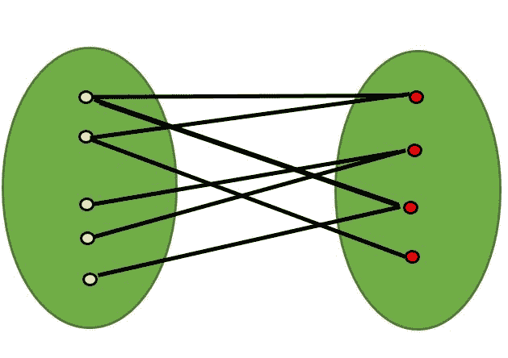

# 检查给定图是否为 Bipartite

> 原文： [https://www.geeksforgeeks.org/bipartite-graph/](https://www.geeksforgeeks.org/bipartite-graph/)

[二分图](http://en.wikipedia.org/wiki/Bipartite_graph)是一个图，其顶点可以分为两个独立的集合 U 和 V，这样每个边（u，v）要么连接从 U 到 V 的顶点，要么连接从 V 到 U 的顶点。 换句话说，对于每个边（u，v），u 属于 U，v 属于 V，或者 u 属于 V，v 属于 U。我们也可以说没有边连接相同集合的顶点。



如果可以使用两种颜色对图形进行着色，从而用一组相同的颜色对一组顶点进行着色，则二部图是可行的。 注意，可以使用两种颜色以均匀的周期为周期图着色。 例如，请参见下图。


不可能使用两种颜色用奇数周期为周期图着色。


*检查图形是否为二分的算法：*
一种方法是使用着色问题中的[回溯算法检查图形是否为 2 色。
以下是使用广度优先搜索（BFS）来查找给定图是否为 Birpartite 的简单算法。
1.将 RED 颜色分配给源顶点（放入 U 集）。
2.用 BLUE 颜色为所有邻居着色（放入组 V）。
3.用红色为所有邻居的邻居上色（放入 U 集）。
4.这样，将颜色分配给所有顶点，使其满足 m = 2 的 m 方向着色问题的所有约束。
5.在分配颜色时，如果我们发现用相同颜色着色的邻居 作为当前顶点，则该图不能用 2 个顶点着色（或图不是 Bipartite）](https://www.geeksforgeeks.org/backttracking-set-5-m-coloring-problem/)

## C ++

```

// C++ program to find out whether a  
// given graph is Bipartite or not 
#include <iostream> 
#include <queue> 
#define V 4 

using namespace std; 

// This function returns true if graph  
// G[V][V] is Bipartite, else false 
bool isBipartite(int G[][V], int src) 
{ 
    // Create a color array to store colors  
    // assigned to all veritces. Vertex  
    // number is used as index in this array.  
    // The value '-1' of colorArr[i]  
    // is used to indicate that no color  
    // is assigned to vertex 'i'. The value 1  
    // is used to indicate first color  
    // is assigned and value 0 indicates  
    // second color is assigned. 
    int colorArr[V]; 
    for (int i = 0; i < V; ++i) 
        colorArr[i] = -1; 

    // Assign first color to source 
    colorArr[src] = 1; 

    // Create a queue (FIFO) of vertex  
    // numbers and enqueue source vertex 
    // for BFS traversal 
    queue <int> q; 
    q.push(src); 

    // Run while there are vertices  
    // in queue (Similar to BFS) 
    while (!q.empty()) 
    { 
        // Dequeue a vertex from queue ( Refer http://goo.gl/35oz8 ) 
        int u = q.front(); 
        q.pop(); 

        // Return false if there is a self-loop  
        if (G[u][u] == 1) 
        return false;  

        // Find all non-colored adjacent vertices 
        for (int v = 0; v < V; ++v) 
        { 
            // An edge from u to v exists and  
            // destination v is not colored 
            if (G[u][v] && colorArr[v] == -1) 
            { 
                // Assign alternate color to this adjacent v of u 
                colorArr[v] = 1 - colorArr[u]; 
                q.push(v); 
            } 

            // An edge from u to v exists and destination  
            // v is colored with same color as u 
            else if (G[u][v] && colorArr[v] == colorArr[u]) 
                return false; 
        } 
    } 

    // If we reach here, then all adjacent   
    // vertices can be colored with alternate color 
    return true; 
} 

// Driver program to test above function 
int main() 
{ 
    int G[][V] = {{0, 1, 0, 1}, 
        {1, 0, 1, 0}, 
        {0, 1, 0, 1}, 
        {1, 0, 1, 0} 
    }; 

    isBipartite(G, 0) ? cout << "Yes" : cout << "No"; 
    return 0; 
} 

```

## 爪哇

```

// Java program to find out whether  
// a given graph is Bipartite or not 
import java.util.*; 
import java.lang.*; 
import java.io.*; 

class Bipartite 
{ 
    final static int V = 4; // No. of Vertices 

    // This function returns true if  
    // graph G[V][V] is Bipartite, else false 
    boolean isBipartite(int G[][],int src) 
    { 
        // Create a color array to store  
        // colors assigned to all veritces. 
        // Vertex number is used as index  
        // in this array. The value '-1' 
        // of colorArr[i] is used to indicate  
        // that no color is assigned 
        // to vertex 'i'. The value 1 is  
        // used to indicate first color 
        // is assigned and value 0 indicates  
        // second color is assigned. 
        int colorArr[] = new int[V]; 
        for (int i=0; i<V; ++i) 
            colorArr[i] = -1; 

        // Assign first color to source 
        colorArr[src] = 1; 

        // Create a queue (FIFO) of vertex numbers  
        // and enqueue source vertex for BFS traversal 
        LinkedList<Integer>q = new LinkedList<Integer>(); 
        q.add(src); 

        // Run while there are vertices in queue (Similar to BFS) 
        while (q.size() != 0) 
        { 
            // Dequeue a vertex from queue 
            int u = q.poll(); 

            // Return false if there is a self-loop  
            if (G[u][u] == 1) 
                return false;  

            // Find all non-colored adjacent vertices 
            for (int v=0; v<V; ++v) 
            { 
                // An edge from u to v exists  
                // and destination v is not colored 
                if (G[u][v]==1 && colorArr[v]==-1) 
                { 
                    // Assign alternate color to this adjacent v of u 
                    colorArr[v] = 1-colorArr[u]; 
                    q.add(v); 
                } 

                // An edge from u to v exists and destination 
                //  v is colored with same color as u 
                else if (G[u][v]==1 && colorArr[v]==colorArr[u]) 
                    return false; 
            } 
        } 
        // If we reach here, then all adjacent vertices can 
        // be colored with alternate color 
        return true; 
    } 

    // Driver program to test above function 
    public static void main (String[] args) 
    { 
        int G[][] = {{0, 1, 0, 1}, 
            {1, 0, 1, 0}, 
            {0, 1, 0, 1}, 
            {1, 0, 1, 0} 
        }; 
        Bipartite b = new Bipartite(); 
        if (b.isBipartite(G, 0)) 
        System.out.println("Yes"); 
        else
        System.out.println("No"); 
    } 
} 

// Contributed by Aakash Hasija 

```

## 蟒蛇

```

# Python program to find out whether a  
# given graph is Bipartite or not 

class Graph(): 

    def __init__(self, V): 
        self.V = V 
        self.graph = [[0 for column in range(V)] \ 
                                for row in range(V)] 

    # This function returns true if graph G[V][V]  
    # is Bipartite, else false 
    def isBipartite(self, src): 

        # Create a color array to store colors  
        # assigned to all veritces. Vertex 
        # number is used as index in this array.  
        # The value '-1' of  colorArr[i] is used to  
        # indicate that no color is assigned to  
        # vertex 'i'. The value 1 is used to indicate  
        # first color is assigned and value 0 
        # indicates second color is assigned. 
        colorArr = [-1] * self.V 

        # Assign first color to source 
        colorArr[src] = 1

        # Create a queue (FIFO) of vertex numbers and  
        # enqueue source vertex for BFS traversal 
        queue = [] 
        queue.append(src) 

        # Run while there are vertices in queue  
        # (Similar to BFS) 
        while queue: 

            u = queue.pop() 

            # Return false if there is a self-loop 
            if self.graph[u][u] == 1: 
                return False; 

            for v in range(self.V): 

                # An edge from u to v exists and destination  
                # v is not colored 
                if self.graph[u][v] == 1 and colorArr[v] == -1: 

                    # Assign alternate color to this  
                    # adjacent v of u 
                    colorArr[v] = 1 - colorArr[u] 
                    queue.append(v) 

                # An edge from u to v exists and destination  
                # v is colored with same color as u 
                elif self.graph[u][v] == 1 and colorArr[v] == colorArr[u]: 
                    return False

        # If we reach here, then all adjacent  
        # vertices can be colored with alternate  
        # color 
        return True

# Driver program to test above function 
g = Graph(4) 
g.graph = [[0, 1, 0, 1], 
            [1, 0, 1, 0], 
            [0, 1, 0, 1], 
            [1, 0, 1, 0] 
            ] 

print "Yes" if g.isBipartite(0) else "No"

# This code is contributed by Divyanshu Mehta 

```

## C＃

```

// C# program to find out whether  
// a given graph is Bipartite or not 
using System; 
using System.Collections.Generic; 

class GFG 
{ 
    readonly static int V = 4; // No. of Vertices 

    // This function returns true if  
    // graph G[V,V] is Bipartite, else false 
    bool isBipartite(int [,]G, int src) 
    { 
        // Create a color array to store  
        // colors assigned to all veritces. 
        // Vertex number is used as index  
        // in this array. The value '-1' 
        // of colorArr[i] is used to indicate  
        // that no color is assigned 
        // to vertex 'i'. The value 1 is  
        // used to indicate first color 
        // is assigned and value 0 indicates  
        // second color is assigned. 
        int []colorArr = new int[V]; 
        for (int i = 0; i < V; ++i) 
            colorArr[i] = -1; 

        // Assign first color to source 
        colorArr[src] = 1; 

        // Create a queue (FIFO) of vertex numbers  
        // and enqueue source vertex for BFS traversal 
        List<int>q = new List<int>(); 
        q.Add(src); 

        // Run while there are vertices 
        // in queue (Similar to BFS) 
        while (q.Count != 0) 
        { 
            // Dequeue a vertex from queue 
            int u = q[0]; 
            q.RemoveAt(0); 

            // Return false if there is a self-loop  
            if (G[u, u] == 1) 
                return false;  

            // Find all non-colored adjacent vertices 
            for (int v = 0; v < V; ++v) 
            { 
                // An edge from u to v exists  
                // and destination v is not colored 
                if (G[u, v] == 1 && colorArr[v] == -1) 
                { 
                    // Assign alternate color  
                    // to this adjacent v of u 
                    colorArr[v] = 1 - colorArr[u]; 
                    q.Add(v); 
                } 

                // An edge from u to v exists and  
                // destination v is colored with 
                // same color as u 
                else if (G[u, v] == 1 &&  
                         colorArr[v] == colorArr[u]) 
                    return false; 
            } 
        } 

        // If we reach here, then all adjacent vertices 
        // can be colored with alternate color 
        return true; 
    } 

    // Driver Code 
    public static void Main(String[] args) 
    { 
        int [,]G = {{0, 1, 0, 1}, 
                    {1, 0, 1, 0}, 
                    {0, 1, 0, 1}, 
                    {1, 0, 1, 0}}; 
        GFG b = new GFG(); 
        if (b.isBipartite(G, 0)) 
            Console.WriteLine("Yes"); 
        else
            Console.WriteLine("No"); 
    } 
} 

// This code is contributed by Rajput-Ji 

```

**输出：**

```
Yes

```

仅在连接图形时上述算法才有效。 在上面的代码中，我们总是从源 0 开始，并假定从源 0 访问顶点。 一个重要的观察结果是没有边缘的图也是 Bipartite。 请注意，“ Bipartite”条件表示所有边缘应从一组到另一组。
我们可以扩展以上代码，以处理未连接图形的情况。 对所有尚未访问的顶点重复调用上述方法的想法。

## C ++

```

// C++ program to find out whether 
// a given graph is Bipartite or not. 
// It works for disconnected graph also. 
#include <bits/stdc++.h> 

using namespace std; 

const int V = 4; 

// This function returns true if 
// graph G[V][V] is Bipartite, else false 
bool isBipartiteUtil(int G[][V], int src, int colorArr[]) 
{ 
    colorArr[src] = 1; 

    // Create a queue (FIFO) of vertex numbers a 
    // nd enqueue source vertex for BFS traversal 
    queue<int> q; 
    q.push(src); 

    // Run while there are vertices in queue (Similar to 
    // BFS) 
    while (!q.empty()) { 
        // Dequeue a vertex from queue ( Refer 
        // http://goo.gl/35oz8 ) 
        int u = q.front(); 
        q.pop(); 

        // Return false if there is a self-loop 
        if (G[u][u] == 1) 
            return false; 

        // Find all non-colored adjacent vertices 
        for (int v = 0; v < V; ++v) { 
            // An edge from u to v exists and 
            // destination v is not colored 
            if (G[u][v] && colorArr[v] == -1) { 
                // Assign alternate color to this 
                // adjacent v of u 
                colorArr[v] = 1 - colorArr[u]; 
                q.push(v); 
            } 

            // An edge from u to v exists and destination 
            // v is colored with same color as u 
            else if (G[u][v] && colorArr[v] == colorArr[u]) 
                return false; 
        } 
    } 

    // If we reach here, then all adjacent vertices can 
    // be colored with alternate color 
    return true; 
} 

// Returns true if G[][] is Bipartite, else false 
bool isBipartite(int G[][V]) 
{ 
    // Create a color array to store colors assigned to all 
    // veritces. Vertex/ number is used as index in this 
    // array. The value '-1' of colorArr[i] is used to 
    // ndicate that no color is assigned to vertex 'i'. 
    // The value 1 is used to indicate first color is 
    // assigned and value 0 indicates second color is 
    // assigned. 
    int colorArr[V]; 
    for (int i = 0; i < V; ++i) 
        colorArr[i] = -1; 

    // This code is to handle disconnected graoh 
    for (int i = 0; i < V; i++) 
        if (colorArr[i] == -1) 
            if (isBipartiteUtil(G, i, colorArr) == false) 
                return false; 

    return true; 
} 

// Driver code 
int main() 
{ 
    int G[][V] = { { 0, 1, 0, 1 }, 
                   { 1, 0, 1, 0 }, 
                   { 0, 1, 0, 1 }, 
                   { 1, 0, 1, 0 } }; 

    isBipartite(G) ? cout << "Yes" : cout << "No"; 
    return 0; 
}

```

## 爪哇

```

// JAVA Code to check whether a given 
// graph is Bipartite or not 
import java.util.*; 

class Bipartite { 

    public static int V = 4; 

    // This function returns true if graph 
    // G[V][V] is Bipartite, else false 
    public static boolean
    isBipartiteUtil(int G[][], int src, int colorArr[]) 
    { 
        colorArr[src] = 1; 

        // Create a queue (FIFO) of vertex numbers and 
        // enqueue source vertex for BFS traversal 
        LinkedList<Integer> q = new LinkedList<Integer>(); 
        q.add(src); 

        // Run while there are vertices in queue 
        // (Similar to BFS) 
        while (!q.isEmpty()) { 
            // Dequeue a vertex from queue 
            // ( Refer http://goo.gl/35oz8 ) 
            int u = q.getFirst(); 
            q.pop(); 

            // Return false if there is a self-loop 
            if (G[u][u] == 1) 
                return false; 

            // Find all non-colored adjacent vertices 
            for (int v = 0; v < V; ++v) { 
                // An edge from u to v exists and 
                // destination v is not colored 
                if (G[u][v] == 1 && colorArr[v] == -1) { 
                    // Assign alternate color to this 
                    // adjacent v of u 
                    colorArr[v] = 1 - colorArr[u]; 
                    q.push(v); 
                } 

                // An edge from u to v exists and 
                // destination v is colored with same 
                // color as u 
                else if (G[u][v] == 1
                         && colorArr[v] == colorArr[u]) 
                    return false; 
            } 
        } 

        // If we reach here, then all adjacent vertices 
        // can be colored with alternate color 
        return true; 
    } 

    // Returns true if G[][] is Bipartite, else false 
    public static boolean isBipartite(int G[][]) 
    { 
        // Create a color array to store colors assigned 
        // to all veritces. Vertex/ number is used as 
        // index in this array. The value '-1' of 
        // colorArr[i] is used to indicate that no color 
        // is assigned to vertex 'i'. The value 1 is used 
        // to indicate first color is assigned and value 
        // 0 indicates second color is assigned. 
        int colorArr[] = new int[V]; 
        for (int i = 0; i < V; ++i) 
            colorArr[i] = -1; 

        // This code is to handle disconnected graoh 
        for (int i = 0; i < V; i++) 
            if (colorArr[i] == -1) 
                if (isBipartiteUtil(G, i, colorArr) 
                    == false) 
                    return false; 

        return true; 
    } 

    /* Driver code*/
    public static void main(String[] args) 
    { 
        int G[][] = { { 0, 1, 0, 1 }, 
                      { 1, 0, 1, 0 }, 
                      { 0, 1, 0, 1 }, 
                      { 1, 0, 1, 0 } }; 

        if (isBipartite(G)) 
            System.out.println("Yes"); 
        else
            System.out.println("No"); 
    } 
} 

// This code is contributed by Arnav Kr. Mandal.

```

## 蟒蛇

```

# Python3 program to find out whether a 
# given graph is Bipartite or not 

class Graph(): 

    def __init__(self, V): 
        self.V = V 
        self.graph = [[0 for column in range(V)] 
                      for row in range(V)] 

        self.colorArr = [-1 for i in range(self.V)] 

    # This function returns true if graph G[V][V] 
    # is Bipartite, else false 
    def isBipartiteUtil(self, src): 

        # Create a color array to store colors 
        # assigned to all veritces. Vertex 
        # number is used as index in this array. 
        # The value '-1' of self.colorArr[i] is used 
        # to indicate that no color is assigned to 
        # vertex 'i'. The value 1 is used to indicate 
        # first color is assigned and value 0 
        # indicates second color is assigned. 

        # Assign first color to source 

        # Create a queue (FIFO) of vertex numbers and 
        # enqueue source vertex for BFS traversal 
        queue = [] 
        queue.append(src) 

        # Run while there are vertices in queue 
        # (Similar to BFS) 
        while queue: 

            u = queue.pop() 

            # Return false if there is a self-loop 
            if self.graph[u][u] == 1: 
                return False

            for v in range(self.V): 

                # An edge from u to v exists and 
                # destination v is not colored 
                if (self.graph[u][v] == 1 and
                        self.colorArr[v] == -1): 

                    # Assign alternate color to 
                    # this adjacent v of u 
                    self.colorArr[v] = 1 - self.colorArr[u] 
                    queue.append(v) 

                # An edge from u to v exists and destination 
                # v is colored with same color as u 
                elif (self.graph[u][v] == 1 and
                      self.colorArr[v] == self.colorArr[u]): 
                    return False

        # If we reach here, then all adjacent 
        # vertices can be colored with alternate 
        # color 
        return True

    def isBipartite(self): 
        self.colorArr = [-1 for i in range(self.V)] 
        for i in range(self.V): 
            if self.colorArr[i] == -1: 
                if not self.isBipartiteUtil(i): 
                    return False
        return True

# Driver Code 
g = Graph(4) 
g.graph = [[0, 1, 0, 1], 
           [1, 0, 1, 0], 
           [0, 1, 0, 1], 
           [1, 0, 1, 0]] 

print "Yes" if g.isBipartite() else "No"

# This code is contributed by Anshuman Sharma 

```

## C＃

```

// C# Code to check whether a given 
// graph is Bipartite or not 
using System; 
using System.Collections.Generic; 

class GFG { 
    public static int V = 4; 

    // This function returns true if graph 
    // G[V,V] is Bipartite, else false 
    public static bool isBipartiteUtil(int[, ] G, int src, 
                                       int[] colorArr) 
    { 
        colorArr[src] = 1; 

        // Create a queue (FIFO) of vertex numbers and 
        // enqueue source vertex for BFS traversal 
        Queue<int> q = new Queue<int>(); 
        q.Enqueue(src); 

        // Run while there are vertices in queue 
        // (Similar to BFS) 
        while (q.Count != 0) { 
            // Dequeue a vertex from queue 
            // ( Refer http://goo.gl/35oz8 ) 
            int u = q.Peek(); 
            q.Dequeue(); 

            // Return false if there is a self-loop 
            if (G[u, u] == 1) 
                return false; 

            // Find all non-colored adjacent vertices 
            for (int v = 0; v < V; ++v) { 

                // An edge from u to v exists and 
                // destination v is not colored 
                if (G[u, v] == 1 && colorArr[v] == -1) { 

                    // Assign alternate color to this 
                    // adjacent v of u 
                    colorArr[v] = 1 - colorArr[u]; 
                    q.Enqueue(v); 
                } 

                // An edge from u to v exists and 
                // destination v is colored with same 
                // color as u 
                else if (G[u, v] == 1 
                         && colorArr[v] == colorArr[u]) 
                    return false; 
            } 
        } 

        // If we reach here, then all 
        // adjacent vertices can be colored 
        // with alternate color 
        return true; 
    } 

    // Returns true if G[,] is Bipartite, 
    // else false 
    public static bool isBipartite(int[, ] G) 
    { 
        // Create a color array to store 
        // colors assigned to all veritces. 
        // Vertex/ number is used as 
        // index in this array. The value '-1' 
        // of colorArr[i] is used to indicate 
        // that no color is assigned to vertex 'i'. 
        // The value 1 is used to indicate 
        // first color is assigned and value 
        // 0 indicates second color is assigned. 
        int[] colorArr = new int[V]; 
        for (int i = 0; i < V; ++i) 
            colorArr[i] = -1; 

        // This code is to handle disconnected graoh 
        for (int i = 0; i < V; i++) 
            if (colorArr[i] == -1) 
                if (isBipartiteUtil(G, i, colorArr) 
                    == false) 
                    return false; 

        return true; 
    } 

    // Driver Code 
    public static void Main(String[] args) 
    { 
        int[, ] G = { { 0, 1, 0, 1 }, 
                      { 1, 0, 1, 0 }, 
                      { 0, 1, 0, 1 }, 
                      { 1, 0, 1, 0 } }; 

        if (isBipartite(G)) 
            Console.WriteLine("Yes"); 
        else
            Console.WriteLine("No"); 
    } 
} 

// This code is contributed by Rajput-Ji

```

**输出：**

```
Yes

```

上述方法的时间复杂度与广度优先搜索相同。 在上面的实现中是 O（V ^ 2），其中 V 是顶点数。 如果使用邻接表表示图，则复杂度变为 O（V + E）。

**另一种观察方法：**

从图的性质可以推断出，包含**个奇数循环**或**自环**的图是**不是二分的。**

因此，如果找到任何具有奇数个边或自环的顶点，则可以说它不是两分的。

下面是上述观察的实现：

## Python3

```

# Python3 program to find out whether a 
# given graph is Bipartite or not 

class Graph(): 
    def __init__(self, V): 
        self.V = V 
        self.graph = [[0 for column in range(V)] 
                      for row in range(V)] 

    def isBipartite(self): 
        for i in range(self.V): 
            numberofedges = 0

             # Return false if there is a self-loop 
            if self.graph[i][i] == 1:  
                return False
            for j in range(self.V): 

                # An edge from i to j  
                # exists and count number of edges 
                if self.graph[i][j] == 1: 
                    numberofedges = numberofedges+1

            # if there are odd number of edges return False 
            if numberofedges % 2:   
                return False
        return True

g = Graph(4) 
g.graph = [[0, 1, 0, 1], 
           [1, 0, 1, 0], 
           [0, 1, 0, 1], 
           [1, 0, 1, 0]] 

print("Yes" if g.isBipartite() else "No") 

# This code is contributed by Aanchal Tiwari. 

```

**Output**

```
Yes

```

**上述方法的时间复杂度**与广度优先搜索相同。 在上面的实现中是 O（V ^ 2），其中 V 是顶点数。

**练习：**，
**1\.** 可以使用 DFS 算法检查图的二部性吗？ 如果是，怎么办？
解决方案：

## C ++

```

// C++ program to find out whether a given graph is Bipartite or not. 
// Using recursion. 
#include <iostream> 

using namespace std; 
#define V 4 

bool colorGraph(int G[][V],int color[],int pos, int c){ 

    if(color[pos] != -1 && color[pos] !=c) 
        return false; 

    // color this pos as c and all its neighbours and 1-c 
    color[pos] = c; 
    bool ans = true; 
    for(int i=0;i<V;i++){ 
        if(G[pos][i]){ 
            if(color[i] == -1) 
                ans &= colorGraph(G,color,i,1-c); 

            if(color[i] !=-1 && color[i] != 1-c) 
                return false; 
        } 
        if (!ans) 
            return false; 
    } 

    return true; 
} 

bool isBipartite(int G[][V]){ 
    int color[V]; 
    for(int i=0;i<V;i++) 
        color[i] = -1; 

    //start is vertex 0; 
    int pos = 0; 
    // two colors 1 and 0 
    return colorGraph(G,color,pos,1); 

} 

int main() 
{ 
    int G[][V] = {{0, 1, 0, 1}, 
        {1, 0, 1, 0}, 
        {0, 1, 0, 1}, 
        {1, 0, 1, 0} 
    }; 

    isBipartite(G) ? cout<< "Yes" : cout << "No"; 
    return 0; 
}  
// This code is contributed By Mudit Verma 

```

## 爪哇

```

// Java program to find out whether 
// a given graph is Bipartite or not. 
// Using recursion. 
class GFG  
{ 
    static final int V = 4; 

    static boolean colorGraph(int G[][],  
                              int color[],  
                              int pos, int c) 
    { 
        if (color[pos] != -1 && 
            color[pos] != c) 
            return false; 

        // color this pos as c and  
        // all its neighbours as 1-c 
        color[pos] = c; 
        boolean ans = true; 
        for (int i = 0; i < V; i++)  
        { 
            if (G[pos][i] == 1)  
            { 
                if (color[i] == -1) 
                    ans &= colorGraph(G, color, i, 1 - c); 

                if (color[i] != -1 && color[i] != 1 - c) 
                    return false; 
            } 
            if (!ans) 
                return false; 
        } 
        return true; 
    } 

    static boolean isBipartite(int G[][])  
    { 
        int[] color = new int[V]; 
        for (int i = 0; i < V; i++) 
            color[i] = -1; 

        // start is vertex 0; 
        int pos = 0; 

        // two colors 1 and 0 
        return colorGraph(G, color, pos, 1); 
    } 

    // Driver Code 
    public static void main(String[] args)  
    { 
        int G[][] = { { 0, 1, 0, 1 }, 
                      { 1, 0, 1, 0 },  
                      { 0, 1, 0, 1 },  
                      { 1, 0, 1, 0 } }; 

        if (isBipartite(G)) 
            System.out.print("Yes"); 
        else
            System.out.print("No"); 
    } 
} 

// This code is contributed by Rajput-Ji 

```

## Python3

```

# Python3 program to find out whether a given  
# graph is Bipartite or not using recursion.  
V = 4 

def colorGraph(G, color, pos, c):  

    if color[pos] != -1 and color[pos] != c:  
        return False 

    # color this pos as c and all its neighbours and 1-c  
    color[pos] = c  
    ans = True 
    for i in range(0, V):  
        if G[pos][i]:  
            if color[i] == -1:  
                ans &= colorGraph(G, color, i, 1-c)  

            if color[i] !=-1 and color[i] != 1-c:  
                return False 

        if not ans:  
            return False 

    return True 

def isBipartite(G):  

    color = [-1] * V  

    #start is vertex 0  
    pos = 0 
    # two colors 1 and 0  
    return colorGraph(G, color, pos, 1)  

if __name__ == "__main__":  

    G = [[0, 1, 0, 1],  
         [1, 0, 1, 0],  
         [0, 1, 0, 1],  
         [1, 0, 1, 0]]  

    if isBipartite(G): print("Yes")  
    else: print("No")  

# This code is contributed by Rituraj Jain 

```

## C＃

```

// C# program to find out whether 
// a given graph is Bipartite or not. 
// Using recursion. 
using System; 

class GFG  
{ 
    static readonly int V = 4; 

    static bool colorGraph(int [,]G,  
                           int []color,  
                           int pos, int c) 
    { 
        if (color[pos] != -1 && 
            color[pos] != c) 
            return false; 

        // color this pos as c and  
        // all its neighbours as 1-c 
        color[pos] = c; 
        bool ans = true; 
        for (int i = 0; i < V; i++)  
        { 
            if (G[pos, i] == 1)  
            { 
                if (color[i] == -1) 
                    ans &= colorGraph(G, color, i, 1 - c); 

                if (color[i] != -1 && color[i] != 1 - c) 
                    return false; 
            } 
            if (!ans) 
                return false; 
        } 
        return true; 
    } 

    static bool isBipartite(int [,]G)  
    { 
        int[] color = new int[V]; 
        for (int i = 0; i < V; i++) 
            color[i] = -1; 

        // start is vertex 0; 
        int pos = 0; 

        // two colors 1 and 0 
        return colorGraph(G, color, pos, 1); 
    } 

    // Driver Code 
    public static void Main(String[] args)  
    { 
        int [,]G = {{ 0, 1, 0, 1 }, 
                    { 1, 0, 1, 0 },  
                    { 0, 1, 0, 1 },  
                    { 1, 0, 1, 0 }}; 

        if (isBipartite(G)) 
            Console.Write("Yes"); 
        else
            Console.Write("No"); 
    } 
} 

// This code is contributed by 29AjayKumar 

```

**Output**

```
Yes
```

**参考：**
[http://en.wikipedia.org/wiki/Graph_coloring](http://en.wikipedia.org/wiki/Graph_coloring)
[http://en.wikipedia.org/wiki/Bipartite_graph [](http://en.wikipedia.org/wiki/Bipartite_graph)
本文由 [Aashish Barnwal](https://www.facebook.com/barnwal.aashish?fref=ts) 编译。 如果发现任何不正确的地方，或者您想分享有关上述主题的更多信息，请写评论

