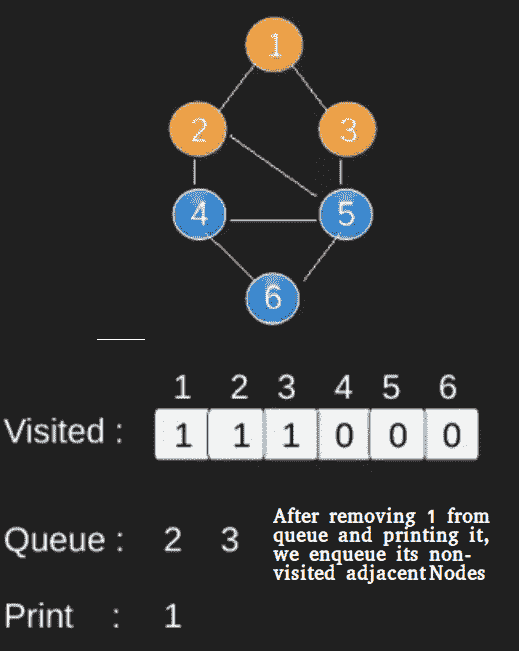
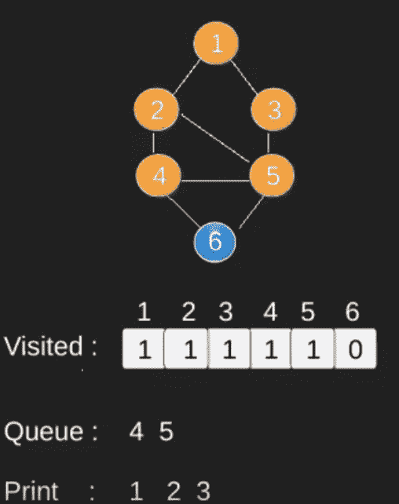
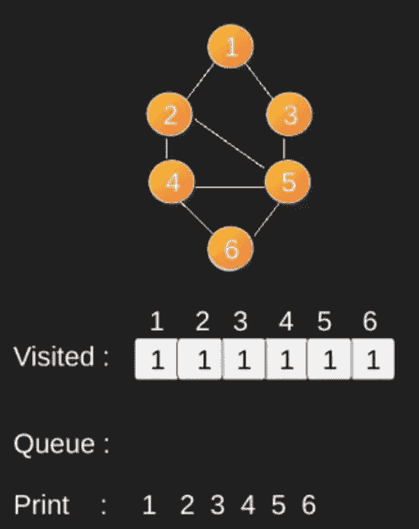

# 图表

的广度优先搜索或 BFS

> 原文： [https://www.geeksforgeeks.org/breadth-first-search-or-bfs-for-a-graph/](https://www.geeksforgeeks.org/breadth-first-search-or-bfs-for-a-graph/)

[图形的广度优先遍历（或搜索）](http://en.wikipedia.org/wiki/Breadth-first_search)类似于树的广度优先遍历（请参阅[的方法 2](https://www.geeksforgeeks.org/level-order-tree-traversal/) ）。 这里唯一要注意的是，与树不同，图可能包含循环，因此我们可能会再次来到同一节点。 为了避免多次处理节点，我们使用布尔访问数组。 为了简单起见，假设所有顶点都可以从起始顶点到达。

例如，在下图中，我们从顶点 2 开始遍历。当到达顶点 0 时，我们将寻找它的所有相邻顶点。 2 也是 0 的相邻顶点。如果我们不标记访问的顶点，那么 2 将再次被处理，它将成为一个非终止过程。 下图的广度优先遍历为 2、0、3、1。


以下是来自给定源的简单“广度优先遍历”的实现。

该实现使用图形的[邻接表表示](http://en.wikipedia.org/wiki/Adjacency_list)。 [STL](http://en.wikipedia.org/wiki/Standard_Template_Library) 的[列表容器](http://www.yolinux.com/TUTORIALS/LinuxTutorialC++STL.html#LIST)用于存储 BFS 遍历所需的相邻节点列表和节点队列。

## C++

```cpp

// Program to print BFS traversal from a given 
// source vertex. BFS(int s) traverses vertices  
// reachable from s. 
#include<iostream> 
#include <list> 

using namespace std; 

// This class represents a directed graph using 
// adjacency list representation 
class Graph 
{ 
    int V;    // No. of vertices 

    // Pointer to an array containing adjacency 
    // lists 
    list<int> *adj;    
public: 
    Graph(int V);  // Constructor 

    // function to add an edge to graph 
    void addEdge(int v, int w);  

    // prints BFS traversal from a given source s 
    void BFS(int s);   
}; 

Graph::Graph(int V) 
{ 
    this->V = V; 
    adj = new list<int>[V]; 
} 

void Graph::addEdge(int v, int w) 
{ 
    adj[v].push_back(w); // Add w to v’s list. 
} 

void Graph::BFS(int s) 
{ 
    // Mark all the vertices as not visited 
    bool *visited = new bool[V]; 
    for(int i = 0; i < V; i++) 
        visited[i] = false; 

    // Create a queue for BFS 
    list<int> queue; 

    // Mark the current node as visited and enqueue it 
    visited[s] = true; 
    queue.push_back(s); 

    // 'i' will be used to get all adjacent 
    // vertices of a vertex 
    list<int>::iterator i; 

    while(!queue.empty()) 
    { 
        // Dequeue a vertex from queue and print it 
        s = queue.front(); 
        cout << s << " "; 
        queue.pop_front(); 

        // Get all adjacent vertices of the dequeued 
        // vertex s. If a adjacent has not been visited,  
        // then mark it visited and enqueue it 
        for (i = adj[s].begin(); i != adj[s].end(); ++i) 
        { 
            if (!visited[*i]) 
            { 
                visited[*i] = true; 
                queue.push_back(*i); 
            } 
        } 
    } 
} 

// Driver program to test methods of graph class 
int main() 
{ 
    // Create a graph given in the above diagram 
    Graph g(4); 
    g.addEdge(0, 1); 
    g.addEdge(0, 2); 
    g.addEdge(1, 2); 
    g.addEdge(2, 0); 
    g.addEdge(2, 3); 
    g.addEdge(3, 3); 

    cout << "Following is Breadth First Traversal "
         << "(starting from vertex 2) \n"; 
    g.BFS(2); 

    return 0; 
} 

```

## Java

```java

// Java program to print BFS traversal from a given source vertex. 
// BFS(int s) traverses vertices reachable from s. 
import java.io.*; 
import java.util.*; 

// This class represents a directed graph using adjacency list 
// representation 
class Graph 
{ 
    private int V;   // No. of vertices 
    private LinkedList<Integer> adj[]; //Adjacency Lists 

    // Constructor 
    Graph(int v) 
    { 
        V = v; 
        adj = new LinkedList[v]; 
        for (int i=0; i<v; ++i) 
            adj[i] = new LinkedList(); 
    } 

    // Function to add an edge into the graph 
    void addEdge(int v,int w) 
    { 
        adj[v].add(w); 
    } 

    // prints BFS traversal from a given source s 
    void BFS(int s) 
    { 
        // Mark all the vertices as not visited(By default 
        // set as false) 
        boolean visited[] = new boolean[V]; 

        // Create a queue for BFS 
        LinkedList<Integer> queue = new LinkedList<Integer>(); 

        // Mark the current node as visited and enqueue it 
        visited[s]=true; 
        queue.add(s); 

        while (queue.size() != 0) 
        { 
            // Dequeue a vertex from queue and print it 
            s = queue.poll(); 
            System.out.print(s+" "); 

            // Get all adjacent vertices of the dequeued vertex s 
            // If a adjacent has not been visited, then mark it 
            // visited and enqueue it 
            Iterator<Integer> i = adj[s].listIterator(); 
            while (i.hasNext()) 
            { 
                int n = i.next(); 
                if (!visited[n]) 
                { 
                    visited[n] = true; 
                    queue.add(n); 
                } 
            } 
        } 
    } 

    // Driver method to 
    public static void main(String args[]) 
    { 
        Graph g = new Graph(4); 

        g.addEdge(0, 1); 
        g.addEdge(0, 2); 
        g.addEdge(1, 2); 
        g.addEdge(2, 0); 
        g.addEdge(2, 3); 
        g.addEdge(3, 3); 

        System.out.println("Following is Breadth First Traversal "+ 
                           "(starting from vertex 2)"); 

        g.BFS(2); 
    } 
} 
// This code is contributed by Aakash Hasija 

```

## Python

```py

# Python3 Program to print BFS traversal 
# from a given source vertex. BFS(int s) 
# traverses vertices reachable from s. 
from collections import defaultdict 

# This class represents a directed graph 
# using adjacency list representation 
class Graph: 

    # Constructor 
    def __init__(self): 

        # default dictionary to store graph 
        self.graph = defaultdict(list) 

    # function to add an edge to graph 
    def addEdge(self,u,v): 
        self.graph[u].append(v) 

    # Function to print a BFS of graph 
    def BFS(self, s): 

        # Mark all the vertices as not visited 
        visited = [False] * (len(self.graph)) 

        # Create a queue for BFS 
        queue = [] 

        # Mark the source node as  
        # visited and enqueue it 
        queue.append(s) 
        visited[s] = True

        while queue: 

            # Dequeue a vertex from  
            # queue and print it 
            s = queue.pop(0) 
            print (s, end = " ") 

            # Get all adjacent vertices of the 
            # dequeued vertex s. If a adjacent 
            # has not been visited, then mark it 
            # visited and enqueue it 
            for i in self.graph[s]: 
                if visited[i] == False: 
                    queue.append(i) 
                    visited[i] = True

# Driver code 

# Create a graph given in 
# the above diagram 
g = Graph() 
g.addEdge(0, 1) 
g.addEdge(0, 2) 
g.addEdge(1, 2) 
g.addEdge(2, 0) 
g.addEdge(2, 3) 
g.addEdge(3, 3) 

print ("Following is Breadth First Traversal"
                  " (starting from vertex 2)") 
g.BFS(2) 

# This code is contributed by Neelam Yadav 

```

## C#

```cs

// C# program to print BFS traversal  
// from a given source vertex.  
// BFS(int s) traverses vertices  
// reachable from s.  
using System; 
using System.Collections.Generic; 
using System.Linq; 
using System.Text; 

// This class represents a directed  
// graph using adjacency list  
// representation  
class Graph{ 

// No. of vertices      
private int _V;  

//Adjacency Lists  
LinkedList<int>[] _adj;  

public Graph(int V) 
{ 
    _adj = new LinkedList<int>[V]; 
    for(int i = 0; i < _adj.Length; i++) 
    { 
        _adj[i] = new LinkedList<int>(); 
    } 
    _V = V; 
} 

// Function to add an edge into the graph  
public void AddEdge(int v, int w) 
{          
    _adj[v].AddLast(w); 

} 

// Prints BFS traversal from a given source s  
public void BFS(int s) 
{ 

    // Mark all the vertices as not 
    // visited(By default set as false)  
    bool[] visited = new bool[_V]; 
    for(int i = 0; i < _V; i++) 
        visited[i] = false; 

    // Create a queue for BFS  
    LinkedList<int> queue = new LinkedList<int>(); 

    // Mark the current node as  
    // visited and enqueue it  
    visited[s] = true; 
    queue.AddLast(s);          

    while(queue.Any()) 
    { 

        // Dequeue a vertex from queue  
        // and print it 
        s = queue.First(); 
        Console.Write(s + " " ); 
        queue.RemoveFirst(); 

        // Get all adjacent vertices of the  
        // dequeued vertex s. If a adjacent 
        // has not been visited, then mark it  
        // visited and enqueue it  
        LinkedList<int> list = _adj[s]; 

        foreach (var val in list)              
        { 
            if (!visited[val]) 
            { 
                visited[val] = true; 
                queue.AddLast(val); 
            } 
        } 
    } 
} 

// Driver code 
static void Main(string[] args) 
{ 
    Graph g = new Graph(4);  

    g.AddEdge(0, 1);  
    g.AddEdge(0, 2);  
    g.AddEdge(1, 2);  
    g.AddEdge(2, 0);  
    g.AddEdge(2, 3);  
    g.AddEdge(3, 3); 

    Console.Write("Following is Breadth First " + 
                  "Traversal(starting from " + 
                  "vertex 2)\n"); 
    g.BFS(2); 
} 
} 

// This code is contibuted by anv89 

```

Output:

```
Following is Breadth First Traversal (starting from vertex 2)
2 0 3 1

```

**插图**：

 

 

 

 

 

请注意，以上代码仅遍历从给定源顶点可到达的顶点。 从给定的顶点可能无法到达所有顶点（例如，“断开连接的图”）。 要打印所有顶点，我们可以修改 BFS 函数以从所有节点开始一遍遍遍（例如 [DFS 修改版本](https://www.geeksforgeeks.org/depth-first-traversal-for-a-graph/)）。

时间复杂度：`O(V + E)`，其中 V 是图形中顶点的数量，E 是图形中边的数量。

**您可能还会喜欢以下内容**：

*   [关于 BFS 的最新文章](https://www.geeksforgeeks.org/tag/bfs/)

*   [深度优先遍历](https://www.geeksforgeeks.org/depth-first-traversal-for-a-graph/)

*   [广度优先遍历的应用](https://www.geeksforgeeks.org/applications-of-breadth-first-traversal/)

*   [深度优先搜索的应用](https://www.geeksforgeeks.org/applications-of-depth-first-search/)

如果发现任何不正确的地方，或者想分享有关上述主题的更多信息，请写评论。

