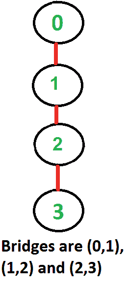

# 图中的桥

> 原文： [https://www.geeksforgeeks.org/bridge-in-a-graph/](https://www.geeksforgeeks.org/bridge-in-a-graph/)

无向连接图中的边是桥，如果移除它会断开图的连接。 对于断开的无向图，定义相似，桥是边移除，从而增加了断开的组件数。

与[铰接点](https://www.geeksforgeeks.org/articulation-points-or-cut-vertices-in-a-graph/)相似，网桥表示连接的网络中的漏洞，对于设计可靠的网络很有用。 例如，在有线计算机网络中，铰接点指示关键计算机，而网桥指示关键电线或连接。

以下是一些示例图，其中的桥用红色突出显示。

 ](https://media.geeksforgeeks.org/wp-content/cdn-uploads/Bridge1.png) [  ](https://media.geeksforgeeks.org/wp-content/cdn-uploads/Bridge2.png) [ 

**如何找到给定图中的所有桥？**

一种简单的方法是一个接一个地删除所有边，并查看是否去除边会导致图形断开。 以下是连接图的简单方法步骤。

1）对于每个边（u，v），执行以下操作

…..a）从图形

中删除（u，v）..…b）查看图形是否保持连接状态（我们可以使用 BFS 或 DFS）

…..c）将（u，v）添加回图形。

对于使用邻接表表示的图，上述方法的时间复杂度为 O（E *（V + E））。 我们可以做得更好吗？

**一种 O（V + E）算法，用于查找所有桥梁**

这个想法类似于 [O（V + E）用于铰接点](https://www.geeksforgeeks.org/articulation-points-or-cut-vertices-in-a-graph/)的算法。 我们对给定的图形进行 DFS 遍历。 在 DFS 树中，如果不存在任何其他选择来从 u 植根于 v 的子树中到达 u 或 u 的祖先，则边（u，v）（u 是 DFS 树中 v 的父级）被桥接。如[先前的文章](https://www.geeksforgeeks.org/articulation-points-or-cut-vertices-in-a-graph/)，值 low [v]表示从以 v 为根的子树可访问的最早访问顶点。*边（u，v）成为桥的条件是“ low [v] > disc [u]”* 。

以下是上述方法的 C++和 Java 实现。

## C++

```cpp

// A C++ program to find bridges in a given undirected graph 
#include<iostream> 
#include <list> 
#define NIL -1 
using namespace std; 

// A class that represents an undirected graph 
class Graph 
{ 
    int V;    // No. of vertices 
    list<int> *adj;    // A dynamic array of adjacency lists 
    void bridgeUtil(int v, bool visited[], int disc[], int low[], 
                    int parent[]); 
public: 
    Graph(int V);   // Constructor 
    void addEdge(int v, int w);   // to add an edge to graph 
    void bridge();    // prints all bridges 
}; 

Graph::Graph(int V) 
{ 
    this->V = V; 
    adj = new list<int>[V]; 
} 

void Graph::addEdge(int v, int w) 
{ 
    adj[v].push_back(w); 
    adj[w].push_back(v);  // Note: the graph is undirected 
} 

// A recursive function that finds and prints bridges using 
// DFS traversal 
// u --> The vertex to be visited next 
// visited[] --> keeps tract of visited vertices 
// disc[] --> Stores discovery times of visited vertices 
// parent[] --> Stores parent vertices in DFS tree 
void Graph::bridgeUtil(int u, bool visited[], int disc[],  
                                  int low[], int parent[]) 
{ 
    // A static variable is used for simplicity, we can  
    // avoid use of static variable by passing a pointer. 
    static int time = 0; 

    // Mark the current node as visited 
    visited[u] = true; 

    // Initialize discovery time and low value 
    disc[u] = low[u] = ++time; 

    // Go through all vertices aadjacent to this 
    list<int>::iterator i; 
    for (i = adj[u].begin(); i != adj[u].end(); ++i) 
    { 
        int v = *i;  // v is current adjacent of u 

        // If v is not visited yet, then recur for it 
        if (!visited[v]) 
        { 
            parent[v] = u; 
            bridgeUtil(v, visited, disc, low, parent); 

            // Check if the subtree rooted with v has a  
            // connection to one of the ancestors of u 
            low[u]  = min(low[u], low[v]); 

            // If the lowest vertex reachable from subtree  
            // under v is  below u in DFS tree, then u-v  
            // is a bridge 
            if (low[v] > disc[u]) 
              cout << u <<" " << v << endl; 
        } 

        // Update low value of u for parent function calls. 
        else if (v != parent[u]) 
            low[u]  = min(low[u], disc[v]); 
    } 
} 

// DFS based function to find all bridges. It uses recursive  
// function bridgeUtil() 
void Graph::bridge() 
{ 
    // Mark all the vertices as not visited 
    bool *visited = new bool[V]; 
    int *disc = new int[V]; 
    int *low = new int[V]; 
    int *parent = new int[V]; 

    // Initialize parent and visited arrays 
    for (int i = 0; i < V; i++) 
    { 
        parent[i] = NIL; 
        visited[i] = false; 
    } 

    // Call the recursive helper function to find Bridges 
    // in DFS tree rooted with vertex 'i' 
    for (int i = 0; i < V; i++) 
        if (visited[i] == false) 
            bridgeUtil(i, visited, disc, low, parent); 
} 

// Driver program to test above function 
int main() 
{ 
    // Create graphs given in above diagrams 
    cout << "\nBridges in first graph \n"; 
    Graph g1(5); 
    g1.addEdge(1, 0); 
    g1.addEdge(0, 2); 
    g1.addEdge(2, 1); 
    g1.addEdge(0, 3); 
    g1.addEdge(3, 4); 
    g1.bridge(); 

    cout << "\nBridges in second graph \n"; 
    Graph g2(4); 
    g2.addEdge(0, 1); 
    g2.addEdge(1, 2); 
    g2.addEdge(2, 3); 
    g2.bridge(); 

    cout << "\nBridges in third graph \n"; 
    Graph g3(7); 
    g3.addEdge(0, 1); 
    g3.addEdge(1, 2); 
    g3.addEdge(2, 0); 
    g3.addEdge(1, 3); 
    g3.addEdge(1, 4); 
    g3.addEdge(1, 6); 
    g3.addEdge(3, 5); 
    g3.addEdge(4, 5); 
    g3.bridge(); 

    return 0; 
} 

```

## Java

```java

// A Java program to find bridges in a given undirected graph 
import java.io.*; 
import java.util.*; 
import java.util.LinkedList; 

// This class represents a undirected graph using adjacency list 
// representation 
class Graph 
{ 
    private int V;   // No. of vertices 

    // Array  of lists for Adjacency List Representation 
    private LinkedList<Integer> adj[]; 
    int time = 0; 
    static final int NIL = -1; 

    // Constructor 
    Graph(int v) 
    { 
        V = v; 
        adj = new LinkedList[v]; 
        for (int i=0; i<v; ++i) 
            adj[i] = new LinkedList(); 
    } 

    // Function to add an edge into the graph 
    void addEdge(int v, int w) 
    { 
        adj[v].add(w);  // Add w to v's list. 
        adj[w].add(v);    //Add v to w's list 
    } 

    // A recursive function that finds and prints bridges 
    // using DFS traversal 
    // u --> The vertex to be visited next 
    // visited[] --> keeps tract of visited vertices 
    // disc[] --> Stores discovery times of visited vertices 
    // parent[] --> Stores parent vertices in DFS tree 
    void bridgeUtil(int u, boolean visited[], int disc[], 
                    int low[], int parent[]) 
    { 

        // Mark the current node as visited 
        visited[u] = true; 

        // Initialize discovery time and low value 
        disc[u] = low[u] = ++time; 

        // Go through all vertices aadjacent to this 
        Iterator<Integer> i = adj[u].iterator(); 
        while (i.hasNext()) 
        { 
            int v = i.next();  // v is current adjacent of u 

            // If v is not visited yet, then make it a child 
            // of u in DFS tree and recur for it. 
            // If v is not visited yet, then recur for it 
            if (!visited[v]) 
            { 
                parent[v] = u; 
                bridgeUtil(v, visited, disc, low, parent); 

                // Check if the subtree rooted with v has a 
                // connection to one of the ancestors of u 
                low[u]  = Math.min(low[u], low[v]); 

                // If the lowest vertex reachable from subtree 
                // under v is below u in DFS tree, then u-v is 
                // a bridge 
                if (low[v] > disc[u]) 
                    System.out.println(u+" "+v); 
            } 

            // Update low value of u for parent function calls. 
            else if (v != parent[u]) 
                low[u]  = Math.min(low[u], disc[v]); 
        } 
    } 

    // DFS based function to find all bridges. It uses recursive 
    // function bridgeUtil() 
    void bridge() 
    { 
        // Mark all the vertices as not visited 
        boolean visited[] = new boolean[V]; 
        int disc[] = new int[V]; 
        int low[] = new int[V]; 
        int parent[] = new int[V]; 

        // Initialize parent and visited, and ap(articulation point) 
        // arrays 
        for (int i = 0; i < V; i++) 
        { 
            parent[i] = NIL; 
            visited[i] = false; 
        } 

        // Call the recursive helper function to find Bridges 
        // in DFS tree rooted with vertex 'i' 
        for (int i = 0; i < V; i++) 
            if (visited[i] == false) 
                bridgeUtil(i, visited, disc, low, parent); 
    } 

    public static void main(String args[]) 
    { 
        // Create graphs given in above diagrams 
        System.out.println("Bridges in first graph "); 
        Graph g1 = new Graph(5); 
        g1.addEdge(1, 0); 
        g1.addEdge(0, 2); 
        g1.addEdge(2, 1); 
        g1.addEdge(0, 3); 
        g1.addEdge(3, 4); 
        g1.bridge(); 
        System.out.println(); 

        System.out.println("Bridges in Second graph"); 
        Graph g2 = new Graph(4); 
        g2.addEdge(0, 1); 
        g2.addEdge(1, 2); 
        g2.addEdge(2, 3); 
        g2.bridge(); 
        System.out.println(); 

        System.out.println("Bridges in Third graph "); 
        Graph g3 = new Graph(7); 
        g3.addEdge(0, 1); 
        g3.addEdge(1, 2); 
        g3.addEdge(2, 0); 
        g3.addEdge(1, 3); 
        g3.addEdge(1, 4); 
        g3.addEdge(1, 6); 
        g3.addEdge(3, 5); 
        g3.addEdge(4, 5); 
        g3.bridge(); 
    } 
} 
// This code is contributed by Aakash Hasija 

```

## Python

```py

# Python program to find bridges in a given undirected graph 
#Complexity : O(V+E) 

from collections import defaultdict 

#This class represents an undirected graph using adjacency list representation 
class Graph: 

    def __init__(self,vertices): 
        self.V= vertices #No. of vertices 
        self.graph = defaultdict(list) # default dictionary to store graph 
        self.Time = 0

    # function to add an edge to graph 
    def addEdge(self,u,v): 
        self.graph[u].append(v) 
        self.graph[v].append(u) 

    '''A recursive function that finds and prints bridges 
    using DFS traversal 
    u --> The vertex to be visited next 
    visited[] --> keeps tract of visited vertices 
    disc[] --> Stores discovery times of visited vertices 
    parent[] --> Stores parent vertices in DFS tree'''
    def bridgeUtil(self,u, visited, parent, low, disc): 

        # Mark the current node as visited and print it 
        visited[u]= True

        # Initialize discovery time and low value 
        disc[u] = self.Time 
        low[u] = self.Time 
        self.Time += 1

        #Recur for all the vertices adjacent to this vertex 
        for v in self.graph[u]: 
            # If v is not visited yet, then make it a child of u 
            # in DFS tree and recur for it 
            if visited[v] == False : 
                parent[v] = u 
                self.bridgeUtil(v, visited, parent, low, disc) 

                # Check if the subtree rooted with v has a connection to 
                # one of the ancestors of u 
                low[u] = min(low[u], low[v]) 

                ''' If the lowest vertex reachable from subtree 
                under v is below u in DFS tree, then u-v is 
                a bridge'''
                if low[v] > disc[u]: 
                    print ("%d %d" %(u,v)) 

            elif v != parent[u]: # Update low value of u for parent function calls. 
                low[u] = min(low[u], disc[v]) 

    # DFS based function to find all bridges. It uses recursive 
    # function bridgeUtil() 
    def bridge(self): 

        # Mark all the vertices as not visited and Initialize parent and visited,  
        # and ap(articulation point) arrays 
        visited = [False] * (self.V) 
        disc = [float("Inf")] * (self.V) 
        low = [float("Inf")] * (self.V) 
        parent = [-1] * (self.V) 

        # Call the recursive helper function to find bridges 
        # in DFS tree rooted with vertex 'i' 
        for i in range(self.V): 
            if visited[i] == False: 
                self.bridgeUtil(i, visited, parent, low, disc) 

# Create a graph given in the above diagram 
g1 = Graph(5) 
g1.addEdge(1, 0) 
g1.addEdge(0, 2) 
g1.addEdge(2, 1) 
g1.addEdge(0, 3) 
g1.addEdge(3, 4) 

print "Bridges in first graph "
g1.bridge() 

g2 = Graph(4) 
g2.addEdge(0, 1) 
g2.addEdge(1, 2) 
g2.addEdge(2, 3) 
print "\nBridges in second graph "
g2.bridge() 

g3 = Graph (7) 
g3.addEdge(0, 1) 
g3.addEdge(1, 2) 
g3.addEdge(2, 0) 
g3.addEdge(1, 3) 
g3.addEdge(1, 4) 
g3.addEdge(1, 6) 
g3.addEdge(3, 5) 
g3.addEdge(4, 5) 
print "\nBridges in third graph "
g3.bridge() 

#This code is contributed by Neelam Yadav 

```

## C#

```cs

// A C# program to find bridges  
// in a given undirected graph  
using System; 
using System.Collections.Generic; 

// This class represents a undirected graph   
// using adjacency list representation  
public class Graph  
{  
    private int V; // No. of vertices  

    // Array of lists for Adjacency List Representation  
    private List<int> []adj;  
    int time = 0;  
    static readonly int NIL = -1;  

    // Constructor  
    Graph(int v)  
    {  
        V = v;  
        adj = new List<int>[v];  
        for (int i = 0; i < v; ++i)  
            adj[i] = new List<int>();  
    }  

    // Function to add an edge into the graph  
    void addEdge(int v, int w)  
    {  
        adj[v].Add(w); // Add w to v's list.  
        adj[w].Add(v); //Add v to w's list  
    }  

    // A recursive function that finds and prints bridges  
    // using DFS traversal  
    // u --> The vertex to be visited next  
    // visited[] --> keeps tract of visited vertices  
    // disc[] --> Stores discovery times of visited vertices  
    // parent[] --> Stores parent vertices in DFS tree  
    void bridgeUtil(int u, bool []visited, int []disc,  
                    int []low, int []parent)  
    {  

        // Mark the current node as visited  
        visited[u] = true;  

        // Initialize discovery time and low value  
        disc[u] = low[u] = ++time;  

        // Go through all vertices aadjacent to this  
        foreach(int i in adj[u])  
        {  
            int v = i; // v is current adjacent of u  

            // If v is not visited yet, then make it a child  
            // of u in DFS tree and recur for it.  
            // If v is not visited yet, then recur for it  
            if (!visited[v])  
            {  
                parent[v] = u;  
                bridgeUtil(v, visited, disc, low, parent);  

                // Check if the subtree rooted with v has a  
                // connection to one of the ancestors of u  
                low[u] = Math.Min(low[u], low[v]);  

                // If the lowest vertex reachable from subtree  
                // under v is below u in DFS tree, then u-v is  
                // a bridge  
                if (low[v] > disc[u])  
                    Console.WriteLine(u + " " + v);  
            }  

            // Update low value of u for parent function calls.  
            else if (v != parent[u])  
                low[u] = Math.Min(low[u], disc[v]);  
        }  
    }  

    // DFS based function to find all bridges. It uses recursive  
    // function bridgeUtil()  
    void bridge()  
    {  
        // Mark all the vertices as not visited  
        bool []visited = new bool[V];  
        int []disc = new int[V];  
        int []low = new int[V];  
        int []parent = new int[V];  

        // Initialize parent and visited,   
        // and ap(articulation point) arrays  
        for (int i = 0; i < V; i++)  
        {  
            parent[i] = NIL;  
            visited[i] = false;  
        }  

        // Call the recursive helper function to find Bridges  
        // in DFS tree rooted with vertex 'i'  
        for (int i = 0; i < V; i++)  
            if (visited[i] == false)  
                bridgeUtil(i, visited, disc, low, parent);  
    }  

    // Driver code 
    public static void Main(String []args)  
    {  
        // Create graphs given in above diagrams  
        Console.WriteLine("Bridges in first graph ");  
        Graph g1 = new Graph(5);  
        g1.addEdge(1, 0);  
        g1.addEdge(0, 2);  
        g1.addEdge(2, 1);  
        g1.addEdge(0, 3);  
        g1.addEdge(3, 4);  
        g1.bridge();  
        Console.WriteLine();  

        Console.WriteLine("Bridges in Second graph");  
        Graph g2 = new Graph(4);  
        g2.addEdge(0, 1);  
        g2.addEdge(1, 2);  
        g2.addEdge(2, 3);  
        g2.bridge();  
        Console.WriteLine();  

        Console.WriteLine("Bridges in Third graph ");  
        Graph g3 = new Graph(7);  
        g3.addEdge(0, 1);  
        g3.addEdge(1, 2);  
        g3.addEdge(2, 0);  
        g3.addEdge(1, 3);  
        g3.addEdge(1, 4);  
        g3.addEdge(1, 6);  
        g3.addEdge(3, 5);  
        g3.addEdge(4, 5);  
        g3.bridge();  
    }  
}  

// This code is contributed by Rajput-Ji 

```

Output:

```
Bridges in first graph
3 4
0 3

Bridges in second graph
2 3
1 2
0 1

Bridges in third graph
1 6
```

**时间复杂度**：上面的功能是带有附加数组的简单 DFS。 因此，时间复杂度与 DFS 相同，对于图的邻接表表示，它的时间复杂度为 O（V + E）。

**参考**：

[https://www.cs.washington.edu/education/courses/421/04su/slides/artic.pdf](https://www.cs.washington.edu/education/courses/421/04su/slides/artic.pdf)

[http： //www.slideshare.net/TraianRebedea/algorithm-design-and-complexity-course-8](http://www.slideshare.net/TraianRebedea/algorithm-design-and-complexity-course-8)

[http://faculty.simpson.edu/lydia.sinapova/www/cmsc250/LN250_Weiss/ L25-Connectivity.htm](http://faculty.simpson.edu/lydia.sinapova/www/cmsc250/LN250_Weiss/L25-Connectivity.htm)

[http://www.youtube.com/watch?v=bmyyxNyZKzI](http://www.youtube.com/watch?v=bmyyxNyZKzI)

如果发现任何不正确的地方，或者想分享有关上述主题的更多信息，请写评论。

