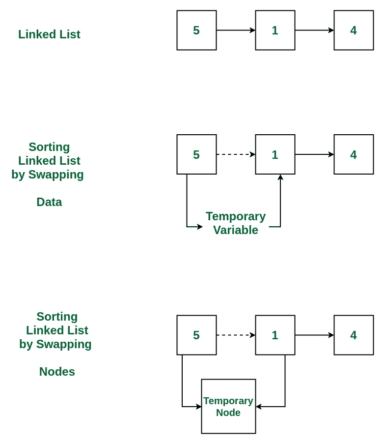

# 通过交换节点对链接列表进行冒泡排序

给定一个单链列表，通过交换节点使用[冒泡排序](http://www.geeksforgeeks.org/bubble-sort/)对它进行排序。


**示例**：

```
Input: 10->30->20->5
Output: 5->10->20->30

Input: 20->4->3
Output: 3->4->20
```

[](https://media.geeksforgeeks.org/wp-content/uploads/20190405123134/Sorting-a-Lisked-List.jpg)

**方法**：

1.  获取要排序的链接列表

2.  将[冒泡排序](http://www.geeksforgeeks.org/bubble-sort/)应用于此[链接列表](http://www.geeksforgeeks.org/data-structures/linked-list/)，其中，在比较两个相邻节点时，将交换实际节点，而不仅仅是交换数据。

3.  打印排序列表

下面是上述方法的实现：

## C++

```cpp

// C++ program to sort Linked List 
// using Bubble Sort 
// by swapping nodes 

#include <iostream> 
using namespace std; 

/* structure for a node */
struct Node  
{ 
    int data; 
    struct Node* next; 
} Node; 

/*Function to swap the nodes */
struct Node* swap(struct Node* ptr1, struct Node* ptr2) 
{ 
    struct Node* tmp = ptr2->next; 
    ptr2->next = ptr1; 
    ptr1->next = tmp; 
    return ptr2; 
} 

/* Function to sort the list */
int bubbleSort(struct Node** head, int count) 
{ 
    struct Node** h; 
    int i, j, swapped; 

    for (i = 0; i <= count; i++) 
    { 

        h = head; 
        swapped = 0; 

        for (j = 0; j < count - i - 1; j++)  
        { 

            struct Node* p1 = *h; 
            struct Node* p2 = p1->next; 

            if (p1->data > p2->data) 
            { 

                /* update the link after swapping */
                *h = swap(p1, p2); 
                swapped = 1; 
            } 

            h = &(*h)->next; 
        } 

        /* break if the loop ended without any swap */
        if (swapped == 0) 
            break; 
    } 
} 

/* Function to print the list */
void printList(struct Node* n) 
{ 
    while (n != NULL) 
    { 
        cout << n->data << " -> "; 
        n = n->next; 
    } 
    cout << endl; 
} 

/* Function to insert a struct Node 
at the beginning of a linked list */
void insertAtTheBegin(struct Node** start_ref, int data) 
{ 
    struct Node* ptr1 
        = (struct Node*)malloc(sizeof(struct Node)); 

    ptr1->data = data; 
    ptr1->next = *start_ref; 
    *start_ref = ptr1; 
} 

// Driver Code 
int main() 
{ 
    int arr[] = { 78, 20, 10, 32, 1, 5 }; 
    int list_size, i; 

    /* start with empty linked list */
    struct Node* start = NULL; 
    list_size = sizeof(arr) / sizeof(arr[0]); 

    /* Create linked list from the array arr[] */
    for (i = 0; i < list_size; i++) 
        insertAtTheBegin(&start, arr[i]); 

    /* print list before sorting */
    cout <<"Linked list before sorting\n"; 
    printList(start); 

    /* sort the linked list */
    bubbleSort(&start, list_size); 

    /* print list after sorting */
    cout <<"Linked list after sorting\n"; 
    printList(start); 

    return 0; 
} 

// This code is contributed by 
// shubhamsingh10 

```

## C

```c

// C program to sort Linked List 
// using Bubble Sort 
// by swapping nodes 

#include <stdio.h> 
#include <stdlib.h> 

/* structure for a node */
struct Node { 
    int data; 
    struct Node* next; 
} Node; 

/*Function to swap the nodes */
struct Node* swap(struct Node* ptr1, struct Node* ptr2) 
{ 
    struct Node* tmp = ptr2->next; 
    ptr2->next = ptr1; 
    ptr1->next = tmp; 
    return ptr2; 
} 

/* Function to sort the list */
int bubbleSort(struct Node** head, int count) 
{ 
    struct Node** h; 
    int i, j, swapped; 

    for (i = 0; i <= count; i++) { 

        h = head; 
        swapped = 0; 

        for (j = 0; j < count - i - 1; j++) { 

            struct Node* p1 = *h; 
            struct Node* p2 = p1->next; 

            if (p1->data > p2->data) { 

                /* update the link after swapping */
                *h = swap(p1, p2); 
                swapped = 1; 
            } 

            h = &(*h)->next; 
        } 

        /* break if the loop ended without any swap */
        if (swapped == 0) 
            break; 
    } 
} 

/* Function to print the list */
void printList(struct Node* n) 
{ 
    while (n != NULL) { 
        printf("%d -> ", n->data); 
        n = n->next; 
    } 
    printf("\n"); 
} 

/* Function to insert a struct Node 
   at the beginning of a linked list */
void insertAtTheBegin(struct Node** start_ref, int data) 
{ 
    struct Node* ptr1 
        = (struct Node*)malloc(sizeof(struct Node)); 

    ptr1->data = data; 
    ptr1->next = *start_ref; 
    *start_ref = ptr1; 
} 

// Driver Code 
int main() 
{ 
    int arr[] = { 78, 20, 10, 32, 1, 5 }; 
    int list_size, i; 

    /* start with empty linked list */
    struct Node* start = NULL; 
    list_size = sizeof(arr) / sizeof(arr[0]); 

    /* Create linked list from the array arr[] */
    for (i = 0; i < list_size; i++) 
        insertAtTheBegin(&start, arr[i]); 

    /* print list before sorting */
    printf("Linked list before sorting\n"); 
    printList(start); 

    /* sort the linked list */
    bubbleSort(&start, list_size); 

    /* print list after sorting */
    printf("Linked list after sorting\n"); 
    printList(start); 

    return 0; 
} 

```

**Output:**

```
Linked list before sorting
5 -> 1 -> 32 -> 10 -> 20 -> 78 -> 
Linked list after sorting
1 -> 5 -> 10 -> 20 -> 32 -> 78 ->

```


* * *

* * *

如果您喜欢 GeeksforGeeks 并希望做出贡献，则还可以使用 [tribution.geeksforgeeks.org](https://contribute.geeksforgeeks.org/) 撰写文章，或将您的文章邮寄至 tribution@geeksforgeeks.org。 查看您的文章出现在 GeeksforGeeks 主页上，并帮助其他 Geeks。

如果您发现任何不正确的地方，请单击下面的“改进文章”按钮，以改进本文。