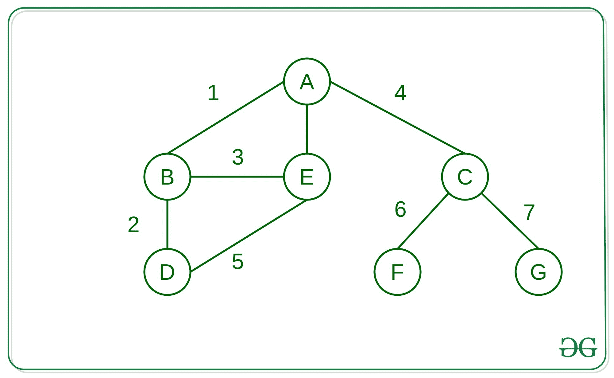

# 使用 Python 中的字典构建无向图并找到最短路径

> 原文： [https://www.geeksforgeeks.org/building-an-undirected-graph-and-finding-shortest-path-using-dictionaries-in-python/](https://www.geeksforgeeks.org/building-an-undirected-graph-and-finding-shortest-path-using-dictionaries-in-python/)

**先决条件：**

*   [图形的 BFS](https://www.geeksforgeeks.org/breadth-first-search-or-bfs-for-a-graph/)
*   [Python 词典](https://www.geeksforgeeks.org/python-dictionary/)

在本文中，我们将研究如何构建无向图，然后使用 Python 语言中的字典轻松地找到该图的两个节点/顶点之间的最短路径。

### 使用字典建立图

[](https://media.geeksforgeeks.org/wp-content/uploads/20200617040109/cool.jpg)

**方法：**的想法是将邻接表存储到字典中，这有助于以任意格式存储图形，而不仅是整数形式。 在这里，我们将字符用作所有自定义对象也可以使用的地方的参考。

下面是上述方法的实现：

## Python3

```

# Python3 implementation to build a  
# graph using Dictonaries 

from collections import defaultdict 

# Function to build the graph 
def build_graph(): 
    edges = [ 
        ["A", "B"], ["A", "E"],  
        ["A", "C"], ["B", "D"], 
        ["B", "E"], ["C", "F"], 
        ["C", "G"], ["D", "E"] 
    ] 
    graph = defaultdict(list) 

    # Loop to iterate over every  
    # edge of the graph 
    for edge in edges: 
        a, b = edge[0], edge[1] 

        # Creating the graph  
        # as adjacency list 
        graph[a].append(b) 
        graph[b].append(a) 
    return graph 

if __name__ == "__main__": 
    graph = build_graph() 

    print(graph) 

```