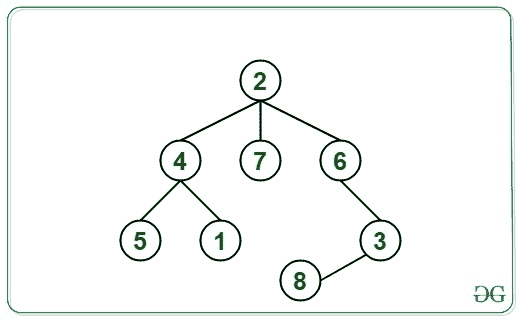

# 通过 DFS 方法计算非循环图中两个顶点之间的节点数

> 原文： [https://www.geeksforgeeks.org/calculate-number-of-nodes-between-two-vertices-in-an-acyclic-graph-by-dfs-method/](https://www.geeksforgeeks.org/calculate-number-of-nodes-between-two-vertices-in-an-acyclic-graph-by-dfs-method/)

给定一个由`V`顶点和`E`边组成的[非循环图](https://en.wikipedia.org/wiki/Directed_acyclic_graph)，源顶点 **src** 和目标顶点 **dest** ，任务是计算图中给定源顶点和目标顶点之间的顶点数。

**范例**：

> **输入**：V = 8，E = 7，src = 7，dest = 8，边[] [] = {{1 4}，{4，5}，{4，2}，{2 ，6}，{6，3}，{2，7}，{3，8}}
> **输出**：3
> **说明**：
> 路径 在 7 和 8 之间的是 7-> 2-> 6-> 3->8。
> 因此，在 7 和 8 之间的节点数是 3。
> 
> 
> 
> **输入**：V = 8，E = 7，src = 5，dest = 2，edge [] [] = {{1 4}，{4，5}，{4，2}，{2 ，6}，{6，3}，{2，7}，{3，8}}
> **输出**：3
> **说明**：
> 路径 5 和 2 之间的节点数是 5-> 4->2。
> 因此，5 和 2 之间的节点数是 1。

**方法**：也可以使用[此](https://www.geeksforgeeks.org/number-nodes-two-vertices-acyclic-graph-disjoint-union-method/)文章中所述的[脱节联合](https://www.geeksforgeeks.org/union-find/)方法解决该问题。 解决此问题的另一种方法是使用[深度优先搜索](https://www.geeksforgeeks.org/depth-first-search-or-dfs-for-a-graph/)方法解决。 请按照以下步骤解决此问题：

*   初始化被访问数组**与[]** ，以标记已经访问过的节点。 将所有节点标记为 0，即未访问。

*   执行 DFS 查找 ***src*** 和 ***dest 之间路径中存在的节点数。***

*   ***src*** 和 ***dest*** 之间的节点数等于它们与 2 之间的路径长度之差，即 ***（pathSrcToDest – 2*** ）。

*   由于图形是非循环的且相互连接，因此 ***src*** 和 ***dest 之间始终只有一条路径。***

下面是上述算法的实现。

## C++

```cpp

// C++ program for the above approach

#include <bits/stdc++.h>
using namespace std;

// Function to return the count of nodes
// in the path from source to destination
int dfs(int src, int dest, int* vis,
        vector<int>* adj)
{

    // Mark the node visited
    vis[src] = 1;

    // If dest is reached
    if (src == dest) {
        return 1;
    }

    // Traverse all adjacent nodes
    for (int u : adj[src]) {

        // If not already visited
        if (!vis[u]) {

            int temp = dfs(u, dest, vis, adj);

            // If there is path, then
            // include the current node
            if (temp != 0) {

                return temp + 1;
            }
        }
    }

    // Return 0 if there is no path
    // between src and dest through
    // the current node
    return 0;
}

// Function to return the
// count of nodes between two
// given vertices of the acyclic Graph
int countNodes(int V, int E, int src, int dest,
               int edges[][2])
{
    // Initialize an adjacency list
    vector<int> adj[V + 1];

    // Populate the edges in the list
    for (int i = 0; i < E; i++) {
        adj[edges[i][0]].push_back(edges[i][1]);
        adj[edges[i][1]].push_back(edges[i][0]);
    }

    // Mark all the nodes as not visited
    int vis[V + 1] = { 0 };

    // Count nodes in the path from src to dest
    int count = dfs(src, dest, vis, adj);

    // Return the nodes between src and dest
    return count - 2;
}

// Driver Code
int main()
{
    // Given number of vertices and edges
    int V = 8, E = 7;

    // Given source and destination vertices
    int src = 5, dest = 2;

    // Given edges
    int edges[][2]
        = { { 1, 4 }, { 4, 5 }, 
            { 4, 2 }, { 2, 6 }, 
            { 6, 3 }, { 2, 7 }, 
            { 3, 8 } };

    cout << countNodes(V, E, src, dest, edges);

    return 0;
}

```

## Java

```java

// Java program for the above approach
import java.util.Vector;
class GFG{

// Function to return the count of nodes
// in the path from source to destination
static int dfs(int src, int dest, int []vis, 
               Vector<Integer> []adj)
{
  // Mark the node visited
  vis[src] = 1;

  // If dest is reached
  if (src == dest) 
  {
    return 1;
  }

  // Traverse all adjacent nodes
  for (int u : adj[src]) 
  {
    // If not already visited
    if (vis[u] == 0) 
    {
      int temp = dfs(u, dest, 
                     vis, adj);

      // If there is path, then
      // include the current node
      if (temp != 0) 
      {
        return temp + 1;
      }
    }
  }

  // Return 0 if there is no path
  // between src and dest through
  // the current node
  return 0;
}

// Function to return the
// count of nodes between two
// given vertices of the acyclic Graph
static int countNodes(int V, int E, 
                      int src, int dest,
                      int edges[][])
{
  // Initialize an adjacency list
  Vector<Integer> []adj = new Vector[V + 1];
  for (int i = 0; i < adj.length; i++)
    adj[i] = new Vector<Integer>();

  // Populate the edges in the list
  for (int i = 0; i < E; i++) 
  {
    adj[edges[i][0]].add(edges[i][1]);
    adj[edges[i][1]].add(edges[i][0]);
  }

  // Mark all the nodes as 
  // not visited
  int vis[] = new int[V + 1];

  // Count nodes in the path 
  // from src to dest
  int count = dfs(src, dest, 
                  vis, adj);

  // Return the nodes
  // between src and dest
  return count - 2;
}

// Driver Code
public static void main(String[] args)
{
  // Given number of vertices and edges
  int V = 8, E = 7;

  // Given source and destination vertices
  int src = 5, dest = 2;

  // Given edges
  int edges[][] = {{1, 4}, {4, 5}, 
                   {4, 2}, {2, 6}, 
                   {6, 3}, {2, 7}, 
                   {3, 8}};

  System.out.print(countNodes(V, E, 
                              src, dest, 
                              edges));
}
}

// This code is contributed by shikhasingrajput

```

## Python

```py

# Python3 program for the above approach

# Function to return the count of nodes
# in the path from source to destination
def dfs(src, dest, vis, adj):

    # Mark the node visited
    vis[src] = 1

    # If dest is reached
    if (src == dest):
        return 1

    # Traverse all adjacent nodes
    for u in adj[src]:

        # If not already visited
        if not vis[u]:
            temp = dfs(u, dest, vis, adj)

            # If there is path, then
            # include the current node
            if (temp != 0):
                return temp + 1

    # Return 0 if there is no path
    # between src and dest through
    # the current node
    return 0

# Function to return the
# count of nodes between two
# given vertices of the acyclic Graph
def countNodes(V, E, src, dest, edges):

    # Initialize an adjacency list
    adj = [[] for i in range(V + 1)]

    # Populate the edges in the list
    for i in range(E):
        adj[edges[i][0]].append(edges[i][1])
        adj[edges[i][1]].append(edges[i][0])

    # Mark all the nodes as not visited
    vis = [0] * (V + 1)

    # Count nodes in the path from src to dest
    count = dfs(src, dest, vis, adj)

    # Return the nodes between src and dest
    return count - 2

# Driver Code
if __name__ == '__main__':

    # Given number of vertices and edges
    V = 8
    E = 7

    # Given source and destination vertices
    src = 5
    dest = 2

    # Given edges
    edges = [ [ 1, 4 ], [ 4, 5 ],
              [ 4, 2 ], [ 2, 6 ],
              [ 6, 3 ], [ 2, 7 ],
              [ 3, 8 ] ]

    print(countNodes(V, E, src, dest, edges))

# This code is contributed by mohit kumar 29    

```

## C#

```cs

// C# program for 
// the above approach
using System;
using System.Collections.Generic;
class GFG{

// Function to return the count of nodes
// in the path from source to destination
static int dfs(int src, int dest, 
               int []vis, List<int> []adj)
{
  // Mark the node visited
  vis[src] = 1;

  // If dest is reached
  if (src == dest) 
  {
    return 1;
  }

  // Traverse all adjacent nodes
  foreach (int u in adj[src]) 
  {
    // If not already visited
    if (vis[u] == 0) 
    {
      int temp = dfs(u, dest, 
                     vis, adj);

      // If there is path, then
      // include the current node
      if (temp != 0) 
      {
        return temp + 1;
      }
    }
  }

  // Return 0 if there is no path
  // between src and dest through
  // the current node
  return 0;
}

// Function to return the
// count of nodes between two
// given vertices of the acyclic Graph
static int countNodes(int V, int E, 
                      int src, int dest,
                      int [,]edges)
{
  // Initialize an adjacency list
  List<int> []adj = new List<int>[V + 1];

  for (int i = 0; i < adj.Length; i++)
    adj[i] = new List<int>();

  // Populate the edges in the list
  for (int i = 0; i < E; i++) 
  {
    adj[edges[i, 0]].Add(edges[i, 1]);
    adj[edges[i, 1]].Add(edges[i, 0]);
  }

  // Mark all the nodes as 
  // not visited
  int []vis = new int[V + 1];

  // Count nodes in the path 
  // from src to dest
  int count = dfs(src, dest, 
                  vis, adj);

  // Return the nodes
  // between src and dest
  return count - 2;
}

// Driver Code
public static void Main(String[] args)
{
  // Given number of vertices and edges
  int V = 8, E = 7;

  // Given source and destination vertices
  int src = 5, dest = 2;

  // Given edges
  int [,]edges = {{1, 4}, {4, 5}, 
                  {4, 2}, {2, 6}, 
                  {6, 3}, {2, 7}, 
                  {3, 8}};

  Console.Write(countNodes(V, E, src, 
                           dest, edges));
}
}

// This code is contributed by 29AjayKumar

```

**Output:** 

```
1

```

***时间复杂度**：O（V + E）*

***辅助空间**：O（V）*


* * *

* * *

如果您喜欢 GeeksforGeeks 并希望做出贡献，则还可以使用 [tribution.geeksforgeeks.org](https://contribute.geeksforgeeks.org/) 撰写文章，或将您的文章邮寄至 tribution@geeksforgeeks.org。 查看您的文章出现在 GeeksforGeeks 主页上，并帮助其他 Geeks。

如果您发现任何不正确的地方，请单击下面的“改进文章”按钮，以改进本文。