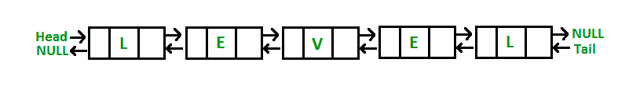

# 检查双向链接的字符列表是否是回文

给定字符双链表，编写一个函数，如果给定的双链表是回文，则返回true，否则返回false。

[](https://media.geeksforgeeks.org/wp-content/uploads/Palindrom-Doubly-Linked-List1.png)

1.  创建一个双向链接列表，其中每个节点仅包含一个字符串字符。
2.  在列表的开头向左初始化两个指针**，在列表的末尾初始化**的两个指针**。**
3.  检查左节点的数据是否等于右节点的数据，如果相等，则向左递增，右递减直到列表的中间，如果在任何阶段不相等，则返回false。

## C++

```cpp

// C++ program to check if doubly 
// linked list is palindrome or not 
#include<bits/stdc++.h> 
using namespace std; 

// Structure of node 
struct Node 
{ 
    char data; 
    struct Node *next; 
    struct Node *prev; 
}; 

/* Given a reference (pointer to pointer) to 
   the head of a list and an int, inserts a 
   new node on the front of the list. */
void push(struct Node** head_ref, char new_data) 
{ 
    struct Node* new_node = new Node; 
    new_node->data  = new_data; 
    new_node->next = (*head_ref); 
    new_node->prev = NULL; 
    if ((*head_ref) !=  NULL) 
      (*head_ref)->prev = new_node ; 
    (*head_ref)    = new_node; 
} 

// Function to check if list is palindrome or not 
bool isPalindrome(struct Node *left) 
{ 
    if (left == NULL) 
       return true; 

    // Find rightmost node 
    struct Node *right = left; 
    while (right->next != NULL) 
        right = right->next; 

    while (left != right) 
    { 
        if (left->data != right->data) 
            return false; 

        left = left->next; 
        right = right->prev; 
    } 

    return true; 
} 

// Driver program 
int main() 
{ 
    struct Node* head = NULL; 
    push(&head, 'l'); 
    push(&head, 'e'); 
    push(&head, 'v'); 
    push(&head, 'e'); 
    push(&head, 'l'); 

    if (isPalindrome(head)) 
        printf("It is Palindrome"); 
    else
        printf("Not Palindrome"); 

    return 0; 
} 

```

## Java

```java

// Java program to check if doubly 
// linked list is palindrome or not 
class GFG 
{ 

// Structure of node 
static class Node 
{ 
    char data; 
    Node next; 
    Node prev; 
}; 

/* Given a reference (pointer to pointer) to 
the head of a list and an int, inserts a 
new node on the front of the list. */
static Node push(Node head_ref, char new_data) 
{ 
    Node new_node = new Node(); 
    new_node.data = new_data; 
    new_node.next = head_ref; 
    new_node.prev = null; 
    if (head_ref != null) 
    head_ref.prev = new_node ; 
    head_ref = new_node; 
    return head_ref; 
} 

// Function to check if list is palindrome or not 
static boolean isPalindrome(Node left) 
{ 
    if (left == null) 
    return true; 

    // Find rightmost node 
    Node right = left; 
    while (right.next != null) 
        right = right.next; 

    while (left != right) 
    { 
        if (left.data != right.data) 
            return false; 

        left = left.next; 
        right = right.prev; 
    } 

    return true; 
} 

// Driver program 
public static void main(String[] args) 
{ 
    Node head = null; 
    head = push(head, 'l'); 
    head = push(head, 'e'); 
    head = push(head, 'v'); 
    head = push(head, 'e'); 
    head = push(head, 'l'); 

    if (isPalindrome(head)) 
        System.out.printf("It is Palindrome"); 
    else
        System.out.printf("Not Palindrome"); 
} 
} 

// This code is contributed by Rajput-Ji 

```

## Python3

```py

# Python3 program to check if doubly  
# linked list is a palindrome or not  

class Node:  

    def __init__(self, data, next, prev): 
        self.data = data 
        self.next = next
        self.prev = prev 

# Given a reference (pointer to pointer) to  
# the head of a list and an int, inserts  
# a new node on the front of the list.  
def push(head_ref, new_data):  

    new_node = Node(new_data, head_ref, None)  

    if head_ref != None: 
        head_ref.prev = new_node 
        head_ref = new_node 

    return head_ref 

# Function to check if list is palindrome or not  
def isPalindrome(left):  

    if left == None:  
        return True 

    # Find rightmost node  
    right = left  
    while right.next != None:  
        right = right.next 

    while left != right: 

        if left.data != right.data:  
            return False 

        left = left.next 
        right = right.prev  

    return True 

# Driver program  
if __name__ == "__main__":  

    head = None 
    head = push(head, 'l')  
    head = push(head, 'e')  
    head = push(head, 'v')  
    head = push(head, 'e')  
    head = push(head, 'l')  

    if isPalindrome(head):  
        print("It is Palindrome")  
    else: 
        print("Not Palindrome")  

# This code is contributed by Rituraj Jain 

```

## C#

```cs

// C# program to check if doubly 
// linked list is palindrome or not 
using System; 

class GFG 
{ 

// Structure of node 
public class Node 
{ 
    public char data; 
    public Node next; 
    public Node prev; 
}; 

/* Given a reference (pointer to pointer) to 
the head of a list and an int, inserts a 
new node on the front of the list. */
static Node push(Node head_ref, char new_data) 
{ 
    Node new_node = new Node(); 
    new_node.data = new_data; 
    new_node.next = head_ref; 
    new_node.prev = null; 
    if (head_ref != null) 
    head_ref.prev = new_node ; 
    head_ref = new_node; 
    return head_ref; 
} 

// Function to check if list is palindrome or not 
static bool isPalindrome(Node left) 
{ 
    if (left == null) 
    return true; 

    // Find rightmost node 
    Node right = left; 
    while (right.next != null) 
        right = right.next; 

    while (left != right) 
    { 
        if (left.data != right.data) 
            return false; 

        left = left.next; 
        right = right.prev; 
    } 

    return true; 
} 

// Driver program 
public static void Main(String[] args) 
{ 
    Node head = null; 
    head = push(head, 'l'); 
    head = push(head, 'e'); 
    head = push(head, 'v'); 
    head = push(head, 'e'); 
    head = push(head, 'l'); 

    if (isPalindrome(head)) 
        Console.Write("It is Palindrome"); 
    else
        Console.Write("Not Palindrome"); 
} 
} 

// This code is contributed by Rajput-Ji 

```

**输出：**

```
It is Palindrome

```

**时间复杂度：** O（n）
**辅助空间：** O（1）

**相关文章：**

*   [用于检查单链表是否是回文](https://www.geeksforgeeks.org/function-to-check-if-a-singly-linked-list-is-palindrome/)的功能
*   [检查字符串的链接列表是否形成回文](https://www.geeksforgeeks.org/check-linked-list-loop-palindrome-not/)

本文由 **Akash Gupta** 提供。 如果您喜欢GeeksforGeeks并希望做出贡献，则还可以使用 [tribution.geeksforgeeks.org](http://www.contribute.geeksforgeeks.org) 撰写文章，或将您的文章邮寄至tribution@geeksforgeeks.org。 查看您的文章出现在GeeksforGeeks主页上，并帮助其他Geeks。

如果发现任何不正确的地方，或者您想分享有关上述主题的更多信息，请发表评论。

