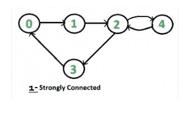
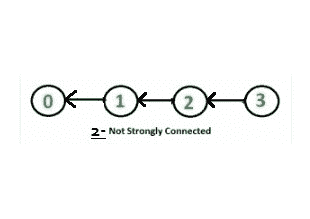

# 检查给定的有向图是否牢固连接 | 系列 2（使用 BFS 的 Kosaraju）

> 原文： [https://www.geeksforgeeks.org/check-given-directed-graph-strongly-connected-set-2-kosaraju-using-bfs/](https://www.geeksforgeeks.org/check-given-directed-graph-strongly-connected-set-2-kosaraju-using-bfs/)

给定一个有向图，请找出该图是否牢固连接。 如果在任意两对顶点之间存在路径，则有向图是牢固连接的。 检查有向图的连通性的方法有很多，但是一种优化的方法是 [Kosaraju 基于 DFS 的简单算法](https://www.geeksforgeeks.org/connectivity-in-a-directed-graph/)。

Kosaraju 基于 BFS 的简单算法的工作原理也与基于 DFS 的算法相同。

```
Following is Kosaraju’s BFS based simple algorithm
that does two BFS traversals of graph:
1) Initialize all vertices as not visited.

2) Do a BFS traversal of graph starting from 
   any arbitrary vertex v. If BFS traversal 
   doesn’t visit all vertices, then return false.

3) Reverse all edges (or find transpose or reverse 
   of graph)

4) Mark all vertices as not visited in reversed graph.

5) Again do a BFS traversal of reversed graph starting
   from same vertex v (Same as step 2). If BFS traversal
   doesn’t visit all vertices, then return false. 
   Otherwise, return true.

```

如果可以从一个顶点 v 到达每个节点，并且每个节点可以到达相同的顶点 v，则该图又很简单，则该图是牢固连接的。 在步骤 2 中，我们检查是否所有顶点都可以从 v 到达。在步骤 5 中，我们检查所有顶点是否都可以到达 v（在反向图中，如果所有顶点都可以从 v 到达，则所有顶点都可以在原始图中到达 v。）

**举例说明**：

<center>**Example 1 :**</center>

Given a directed to check if it is strongly connected or not.



步骤 1：从顶点 2 开始，获得的 BFS 为 2 3 4 0 1

第 2 步：反转给定图后，我们得到了列出的图。


步骤 3：再次从顶点 2 开始，BFS 为 2 1 4 0 3

第 4 步：两种情况下（第 1 步和第 3 步）的顶点均不可见。

步骤 5：因此，给定图是牢固连接的。

<center>**Example 2 :**</center>

Given a directed to check if it is strongly connected or not.


步骤 1：从顶点 2 开始，获得的 BFS 为 2 3 4

第 2 步：反转给定图后，我们得到了列出的图。



步骤 3：再次从顶点 2 开始，BFS 为 2 1 0

步骤 4：原始图形中的顶点 0、1 和反向图形中的 3、4 保持不变。

步骤 5：因此，给定的图没有牢固地连接。

以下是上述算法的实现。

```

// C++ program to check if a given directed graph 
// is strongly connected or not with BFS use 
#include <bits/stdc++.h> 
using namespace std; 

class Graph 
{ 
    int V;    // No. of vertices 
    list<int> *adj;    // An array of adjacency lists 

    // A recursive function to print DFS starting from v 
    void BFSUtil(int v, bool visited[]); 
public: 

    // Constructor and Destructor 
    Graph(int V) { this->V = V;  adj = new list<int>[V];} 
    ~Graph() { delete [] adj; } 

    // Method to add an edge 
    void addEdge(int v, int w); 

    // The main function that returns true if the 
    // graph is strongly connected, otherwise false 
    bool isSC(); 

    // Function that returns reverse (or transpose) 
    // of this graph 
    Graph getTranspose(); 
}; 

// A recursive function to print DFS starting from v 
void Graph::BFSUtil(int v, bool visited[]) 
{ 
    // Create a queue for BFS 
    list<int> queue; 

    // Mark the current node as visited and enqueue it 
    visited[v] = true; 
    queue.push_back(v); 

    // 'i' will be used to get all adjacent vertices 
    // of a vertex 
    list<int>::iterator i; 

    while (!queue.empty()) 
    { 
        // Dequeue a vertex from queue 
        v = queue.front(); 
        queue.pop_front(); 

        // Get all adjacent vertices of the dequeued vertex s 
        // If a adjacent has not been visited, then mark it 
        // visited and enqueue it 
        for (i = adj[v].begin(); i != adj[v].end(); ++i) 
        { 
            if (!visited[*i]) 
            { 
                visited[*i] = true; 
                queue.push_back(*i); 
            } 
        } 
    } 
} 

// Function that returns reverse (or transpose) of this graph 
Graph Graph::getTranspose() 
{ 
    Graph g(V); 
    for (int v = 0; v < V; v++) 
    { 
        // Recur for all the vertices adjacent to this vertex 
        list<int>::iterator i; 
        for (i = adj[v].begin(); i != adj[v].end(); ++i) 
            g.adj[*i].push_back(v); 
    } 
    return g; 
} 

void Graph::addEdge(int v, int w) 
{ 
    adj[v].push_back(w); // Add w to v’s list. 
} 

// The main function that returns true if graph 
// is strongly connected 
bool Graph::isSC() 
{ 
    // St1p 1: Mark all the vertices as not 
    // visited (For first BFS) 
    bool visited[V]; 
    for (int i = 0; i < V; i++) 
        visited[i] = false; 

    // Step 2: Do BFS traversal starting 
    // from first vertex. 
    BFSUtil(0, visited); 

    // If BFS traversal doesn’t visit all 
    // vertices, then return false. 
    for (int i = 0; i < V; i++) 
        if (visited[i] == false) 
             return false; 

    // Step 3: Create a reversed graph 
    Graph gr = getTranspose(); 

    // Step 4: Mark all the vertices as not 
    // visited (For second BFS) 
    for(int i = 0; i < V; i++) 
        visited[i] = false; 

    // Step 5: Do BFS for reversed graph 
    // starting from first vertex. 
    // Staring Vertex must be same starting 
    // point of first DFS 
    gr.BFSUtil(0, visited); 

    // If all vertices are not visited in 
    // second DFS, then return false 
    for (int i = 0; i < V; i++) 
        if (visited[i] == false) 
             return false; 

    return true; 
} 

// Driver program to test above functions 
int main() 
{ 
    // Create graphs given in the above diagrams 
    Graph g1(5); 
    g1.addEdge(0, 1); 
    g1.addEdge(1, 2); 
    g1.addEdge(2, 3); 
    g1.addEdge(3, 0); 
    g1.addEdge(2, 4); 
    g1.addEdge(4, 2); 
    g1.isSC()? cout << "Yes\n" : cout << "No\n"; 

    Graph g2(4); 
    g2.addEdge(0, 1); 
    g2.addEdge(1, 2); 
    g2.addEdge(2, 3); 
    g2.isSC()? cout << "Yes\n" : cout << "No\n"; 

    return 0; 
} 

```

输出：

```
Yes
No

```

**时间复杂度**：如果使用邻接矩阵表示来表示图，则上述实现的时间复杂度与广度优先搜索相同，即为`O(V + E)`。

**我们可以进一步改善吗？**

上述方法需要两次遍历图。 我们可以使用 [Tarjan 的算法来查找图是否是强连通的，并使用](https://www.geeksforgeeks.org/tarjan-algorithm-find-strongly-connected-components/) [Tarjan 算法查找强连通的分量](https://www.geeksforgeeks.org/tarjan-algorithm-find-strongly-connected-components/)。

本文由 [**Shivam Pradhan（anuj_charm）**](https://www.facebook.com/anuj.charm) 提供。 如果您喜欢 GeeksforGeeks 并希望做出贡献，则还可以使用 [tribution.geeksforgeeks.org](http://www.contribute.geeksforgeeks.org) 撰写文章，或将您的文章邮寄至 tribution@geeksforgeeks.org。 查看您的文章出现在 GeeksforGeeks 主页上，并帮助其他 Geeks。

如果发现任何不正确的地方，或者想分享有关上述主题的更多信息，请写评论。

